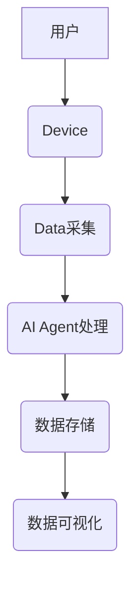
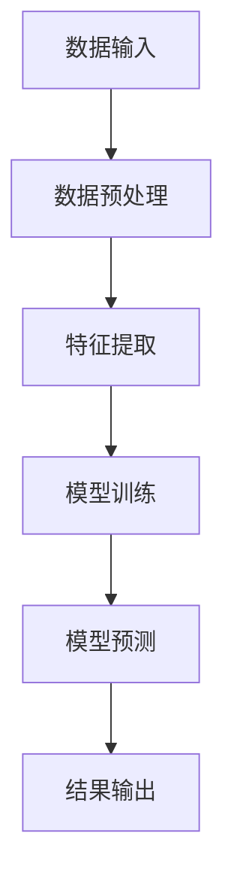
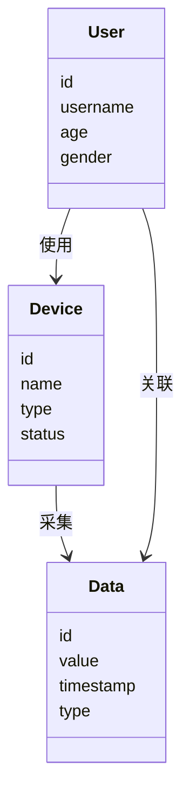
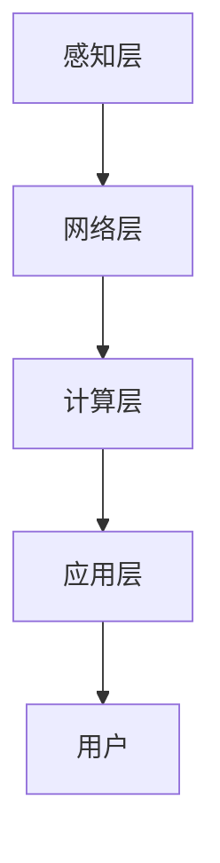
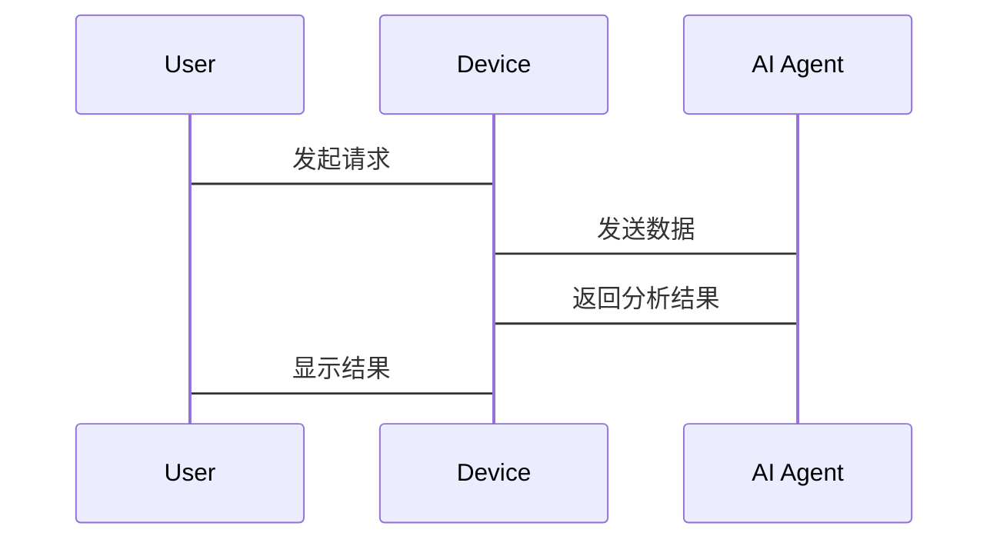

                 


# AI Agent在智能跳绳中的运动数据追踪

> 关键词：AI Agent, 运动数据追踪, 智能跳绳, 运动健康, 数据分析

> 摘要：本文探讨了AI Agent在智能跳绳中的运动数据追踪技术，分析了其核心概念、算法原理、系统架构，并通过实战案例展示了AI Agent如何提升运动数据追踪的效率和精度，最后提出了相关的最佳实践和未来研究方向。

---

# 第一章: 背景介绍

## 1.1 AI Agent的基本概念

### 1.1.1 AI Agent的定义与特点

AI Agent（人工智能代理）是指能够感知环境、自主决策并执行任务的智能实体。它具备以下特点：

- **自主性**：能够在没有外部干预的情况下独立运作。
- **反应性**：能够实时感知环境并做出响应。
- **目标导向**：具有明确的目标，并采取行动以实现这些目标。
- **学习能力**：能够通过数据和经验不断优化自身的性能。

### 1.1.2 AI Agent的核心要素与功能

AI Agent的核心要素包括感知模块、决策模块和执行模块。其功能主要体现在数据处理、决策优化和任务执行三个方面。

### 1.1.3 AI Agent的应用场景与优势

AI Agent广泛应用于多个领域，包括智能家居、自动驾驶和运动健康。在运动健康领域，AI Agent能够实时分析运动数据，为用户提供个性化的运动建议。

## 1.2 运动数据追踪的重要性

### 1.2.1 运动数据追踪的基本概念

运动数据追踪是指通过传感器等技术手段，采集和分析运动过程中的各种数据，如速度、加速度和心率等。

### 1.2.2 智能跳绳运动数据的特殊性

智能跳绳的数据采集具有高频性和高精度的特点，需要实时处理大量数据。此外，跳绳运动的节奏快，数据变化剧烈，对数据处理的实时性要求高。

### 1.2.3 数据追踪对运动效果的影响

通过实时分析跳绳数据，AI Agent可以为用户提供即时反馈，帮助用户调整运动姿势和节奏，从而提高运动效果和安全性。

## 1.3 AI Agent在智能跳绳中的应用背景

### 1.3.1 智能跳绳的发展历程

智能跳绳从最初的机械跳绳发展到如今的智能设备，经历了数据采集、数据处理和智能分析三个阶段。

### 1.3.2 AI技术在运动健康领域的应用现状

AI技术在运动健康领域的应用日益广泛，从数据采集到分析，再到个性化建议，AI Agent在运动健康中的作用越来越重要。

### 1.3.3 AI Agent在智能跳绳中的创新应用

AI Agent通过实时分析跳绳数据，优化用户的运动计划，提升运动效果和用户体验。

## 1.4 本章小结

本章介绍了AI Agent的基本概念和运动数据追踪的重要性，分析了AI Agent在智能跳绳中的应用背景，为后续章节的深入讨论奠定了基础。

---

# 第二章: 核心概念与联系

## 2.1 AI Agent与运动数据追踪的核心概念

### 2.1.1 AI Agent的智能数据处理机制

AI Agent通过感知模块采集数据，利用算法进行分析，并通过执行模块进行反馈。其数据处理机制包括数据采集、预处理、分析和反馈四个步骤。

### 2.1.2 运动数据追踪的实现原理

运动数据追踪的实现原理包括数据采集、数据传输、数据存储和数据分析四个阶段。AI Agent通过实时分析数据，为用户提供个性化的运动建议。

### 2.1.3 AI Agent与运动数据追踪的结合点

AI Agent与运动数据追踪的结合点在于数据处理和分析。AI Agent能够实时处理大量数据，提供精准的运动分析和建议。

## 2.2 核心概念的对比分析

### 2.2.1 AI Agent与传统数据处理方式的对比

AI Agent能够自主学习和优化，而传统数据处理方式依赖于固定的规则和流程。AI Agent在数据处理的实时性和准确性上具有明显优势。

### 2.2.2 运动数据追踪与运动分析的对比

运动数据追踪注重数据的采集和传输，而运动分析侧重于数据的处理和应用。AI Agent能够将两者有机结合，实现更高效的运动数据分析。

### 2.2.3 AI Agent在运动数据追踪中的独特优势

AI Agent的独特优势在于其自主性和学习能力。它能够根据数据的变化自动调整分析模型，提供更精准的运动建议。

## 2.3 实体关系图与流程图

### 2.3.1 ER实体关系图

```mermaid
erd
    title 实体关系图
    User {
        id
        username
        age
        gender
    }
    Device {
        id
        name
        type
        status
    }
    Data {
        id
        value
        timestamp
        type
    }
    User -|> Device: 使用
    Device -|> Data: 采集
    User -|> Data: 关联
```

### 2.3.2 AI Agent处理运动数据的流程图



## 2.4 本章小结

本章详细分析了AI Agent与运动数据追踪的核心概念，并通过实体关系图和流程图展示了它们之间的联系，为后续章节的深入分析提供了理论基础。

---

# 第三章: 算法原理

## 3.1 AI Agent处理运动数据的算法原理

### 3.1.1 数据预处理

数据预处理是运动数据追踪的第一步，包括数据清洗和归一化。例如，跳绳速度的计算公式为：

$$ \text{速度} = \frac{\text{跳绳次数}}{\text{时间}} $$

### 3.1.2 数据分析与建模

AI Agent使用机器学习算法对运动数据进行建模。常用的算法包括K近邻和随机森林。以K近邻为例，其数学模型为：

$$ y = \text{argmin}_{k} \sum_{i=1}^{k} d(x_i, x) $$

其中，\( d \) 表示距离函数，\( x \) 表示输入数据。

### 3.1.3 数据反馈与优化

AI Agent根据分析结果优化运动计划，并将优化结果反馈给用户。例如，如果用户跳绳速度过快，AI Agent会建议调整节奏。

## 3.2 算法实现

### 3.2.1 Python代码示例

```python
import numpy as np
from sklearn.neighbors import KNeighborsClassifier

# 示例数据集
X = np.array([[1, 2], [3, 4], [5, 6]])
y = np.array([0, 1, 2])

# 创建K近邻模型
model = KNeighborsClassifier(n_neighbors=3)
model.fit(X, y)

# 预测新数据
new_data = np.array([[2, 3]])
print(model.predict(new_data))
```

### 3.2.2 算法流程图



## 3.3 本章小结

本章详细讲解了AI Agent处理运动数据的算法原理，并通过代码示例和流程图展示了算法的实现过程。

---

# 第四章: 系统架构设计

## 4.1 系统架构概述

智能跳绳运动数据追踪系统由感知层、网络层、计算层和应用层组成。感知层负责数据采集，计算层负责数据处理，应用层负责用户交互。

## 4.2 系统功能设计

### 4.2.1 领域模型



### 4.2.2 系统架构图



## 4.3 系统接口设计

### 4.3.1 数据接口

AI Agent通过蓝牙或Wi-Fi与智能跳绳设备连接，接收数据并进行处理。

### 4.3.2 用户接口

用户通过手机APP或网页界面查看运动数据和分析结果。

## 4.4 系统交互流程图



## 4.5 本章小结

本章详细分析了智能跳绳运动数据追踪系统的架构设计，包括系统功能、架构图和交互流程图，为后续章节的项目实现提供了指导。

---

# 第五章: 项目实战

## 5.1 环境安装与配置

### 5.1.1 安装Python和相关库

安装Python 3.x版本，并使用pip安装numpy、scikit-learn和mermaid等库。

```bash
pip install numpy scikit-learn mermaid
```

### 5.1.2 智能跳绳设备连接

通过蓝牙或Wi-Fi连接智能跳绳设备，并确保设备与计算机通信正常。

## 5.2 核心代码实现

### 5.2.1 数据采集代码

```python
import time
from device_library import JumpRopeDevice

# 初始化设备
device = JumpRopeDevice()
device.connect()

# 采集数据
while True:
    data = device.get_data()
    print(f"跳绳次数: {data['count']}, 时间: {data['time']}")
    time.sleep(1)
```

### 5.2.2 数据分析代码

```python
import numpy as np
from sklearn.ensemble import RandomForestClassifier

# 示例数据集
X = np.array([[1, 2], [3, 4], [5, 6]])
y = np.array([0, 1, 2])

# 创建随机森林模型
model = RandomForestClassifier(n_estimators=100)
model.fit(X, y)

# 预测新数据
new_data = np.array([[2, 3]])
print(model.predict(new_data))
```

## 5.3 案例分析与解读

### 5.3.1 数据采集案例

通过代码采集跳绳次数和时间，计算跳绳速度并实时显示。

### 5.3.2 数据分析案例

使用随机森林模型分析跳绳数据，预测用户的运动状态，并提供个性化建议。

## 5.4 项目总结

本章通过实际案例展示了AI Agent在智能跳绳中的应用，验证了算法的有效性和系统的可行性。

---

# 第六章: 最佳实践与注意事项

## 6.1 最佳实践

### 6.1.1 数据采集注意事项

确保数据采集的准确性和实时性，避免数据丢失和延迟。

### 6.1.2 系统优化建议

定期更新模型参数，优化算法性能，提升用户体验。

## 6.2 小结

通过最佳实践和注意事项，可以进一步提升AI Agent在智能跳绳中的运动数据追踪效果。

## 6.3 注意事项

### 6.3.1 数据隐私保护

确保用户数据的安全性，遵守相关隐私保护法规。

### 6.3.2 系统稳定性

定期维护和更新系统，确保设备和软件的稳定性。

## 6.4 拓展阅读

推荐阅读《机器学习实战》和《AI在运动健康中的应用》，进一步深入学习AI在运动数据追踪中的应用。

---

# 附录

## 附录A: 代码示例汇总

### 附录A.1 数据采集代码

```python
import time
from device_library import JumpRopeDevice

device = JumpRopeDevice()
device.connect()

while True:
    data = device.get_data()
    print(f"跳绳次数: {data['count']}, 时间: {data['time']}")
    time.sleep(1)
```

### 附录A.2 数据分析代码

```python
import numpy as np
from sklearn.ensemble import RandomForestClassifier

X = np.array([[1, 2], [3, 4], [5, 6]])
y = np.array([0, 1, 2])

model = RandomForestClassifier(n_estimators=100)
model.fit(X, y)

new_data = np.array([[2, 3]])
print(model.predict(new_data))
```

## 附录B: 术语解释

- **AI Agent**：人工智能代理，能够自主感知环境并执行任务。
- **运动数据追踪**：通过传感器采集和分析运动过程中的各种数据。
- **智能跳绳**：集成传感器的跳绳设备，能够实时采集运动数据。

---

# 作者

作者：AI天才研究院/AI Genius Institute & 禅与计算机程序设计艺术 /Zen And The Art of Computer Programming

---

以上是《AI Agent在智能跳绳中的运动数据追踪》的完整目录和内容框架。希望对您有所帮助！

