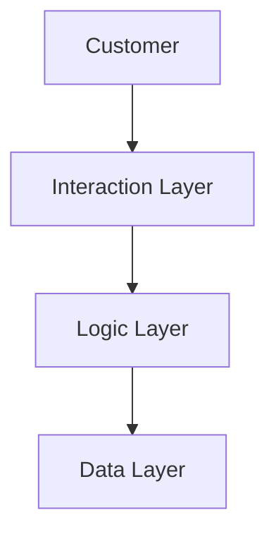
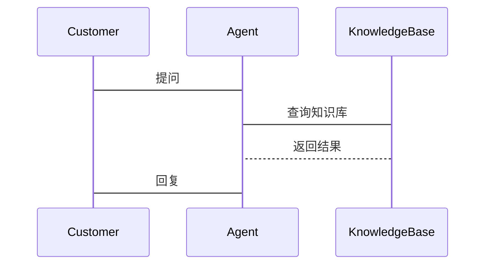

                 


# AI Agent的few-shot学习能力增强

---

## 关键词：AI Agent, few-shot学习, 机器学习, 对比学习, 元学习, 自然语言处理, 系统架构

---

## 摘要：  
本文探讨如何增强AI Agent的few-shot学习能力，通过分析few-shot学习的核心原理、算法实现及系统架构，结合实际项目案例，详细讲解如何在AI Agent中实现高效的few-shot学习，提升其在实际应用中的适应性和智能性。

---

# 第一章: AI Agent与few-shot学习概述

## 1.1 AI Agent的基本概念  
AI Agent（人工智能代理）是指能够感知环境、自主决策并执行任务的智能体。它可以分为**反应式代理**和**认知式代理**，其中认知式代理具备更强的推理和学习能力，能够通过经验优化自身行为。  

### 1.1.1 few-shot学习的定义与特点  
few-shot学习是一种机器学习方法，允许模型在仅需少量样本的情况下完成学习任务。与传统的监督学习不同，few-shot学习特别适用于数据稀缺的场景，能够快速适应新任务。  

### 1.1.2 AI Agent与few-shot学习的结合  
将few-shot学习应用于AI Agent，可以显著提升其在复杂环境中的适应能力。例如，在自然语言处理领域，AI Agent可以通过few-shot学习快速掌握新的对话主题，从而提供更个性化的服务。

---

## 1.2 few-shot学习的背景与意义  
随着AI Agent应用场景的不断扩大，传统机器学习方法在数据需求上的局限性日益显现。few-shot学习的提出为解决这一问题提供了新的思路。  

### 1.2.1 传统机器学习的局限性  
传统机器学习方法通常需要大量标注数据，这在实际应用中往往难以满足需求，尤其是在实时性和个性化服务方面。  

### 1.2.2 few-shot学习的提出与应用  
few-shot学习通过优化模型的泛化能力，能够在少量样本下完成任务。这种技术在图像识别、自然语言处理等领域展现出巨大潜力。  

### 1.2.3 AI Agent在few-shot学习中的作用  
AI Agent作为连接模型与实际场景的桥梁，能够将few-shot学习的优势转化为实际应用能力，如智能客服、智能助手等领域。

---

## 1.3 本章小结  
本章介绍了AI Agent的基本概念及其与few-shot学习的结合，阐述了few-shot学习的背景和意义，为后续章节奠定了基础。

---

# 第二章: few-shot学习的核心概念与原理

## 2.1 few-shot学习的原理  
few-shot学习的核心在于通过**对比学习**和**元学习**等技术，提升模型的迁移能力和快速适应能力。  

### 2.1.1 对比学习  
对比学习通过最大化正样本之间的相似性，同时最小化与负样本之间的差异性，来增强模型的特征表示能力。  

### 2.1.2 元学习  
元学习是一种通过学习“如何学习”的方法，能够在新任务中快速调整模型参数，减少对新数据的需求。  

### 2.1.3 迁移学习  
迁移学习通过将已学习的知识迁移到新任务中，进一步减少对新数据的依赖。  

---

## 2.2 few-shot学习的关键技术  
few-shot学习的关键技术包括**支持向量机（SVM）**、**卷积神经网络（CNN）**和**图神经网络（GNN）**等。  

### 2.2.1 支持向量机  
支持向量机是一种监督学习模型，适用于分类和回归任务。在few-shot学习中，SVM可以通过少量样本构建分类器。  

### 2.2.2 卷积神经网络  
卷积神经网络擅长处理图像和序列数据，能够在few-shot学习中提取高效的特征表示。  

### 2.2.3 图神经网络  
图神经网络适用于处理图结构数据，能够建模实体之间的关系，在few-shot学习中具有重要作用。  

---

## 2.3 few-shot学习的数学模型  
few-shot学习的数学模型主要涉及对比学习和元学习的损失函数。  

### 2.3.1 对比学习的损失函数  
对比学习的损失函数通常采用**交叉熵损失**，公式为：  
$$\mathcal{L} = -\sum_{i=1}^{N} y_i \log(p_i)$$  
其中，$y_i$ 是标签，$p_i$ 是预测概率。  

### 2.3.2 元学习的优化目标  
元学习的目标是优化模型的元参数，使其在新任务中快速适应。优化目标通常采用**损失函数的梯度**，公式为：  
$$\theta = \theta - \eta \nabla_\theta \mathcal{L}$$  

---

## 2.4 few-shot学习的核心要素  
few-shot学习的核心要素包括**样本数量**、**特征表示**和**模型结构**。  

---

## 2.5 本章小结  
本章深入探讨了few-shot学习的原理、关键技术及其数学模型，为后续章节的算法实现奠定了理论基础。

---

# 第三章: AI Agent的few-shot学习能力增强算法

## 3.1 对比学习算法的实现  
对比学习是一种有效的few-shot学习方法，通过最大化正样本的相似性来增强模型的特征提取能力。  

### 3.1.1 对比学习的基本原理  
对比学习的核心是通过设计对比损失函数，使得同一类别的样本尽可能接近，不同类别样本尽可能远离。  

### 3.1.2 对比学习的实现步骤  
1. 数据预处理：将数据分为正样本和负样本。  
2. 特征提取：使用CNN或GNN提取样本特征。  
3. 计算损失：根据对比损失函数优化模型参数。  

### 3.1.3 对比学习的代码实现  
以下是一个简单的对比学习代码示例：  
```python
import torch
import torch.nn as nn

class ContrastiveLoss(nn.Module):
    def __init__(self, temperature=0.1):
        super(ContrastiveLoss, self).__init__()
        self.temperature = temperature

    def forward(self, features, labels):
        # 计算正样本的相似性
        same = torch.mean(torch.exp(features[labels == 0] / self.temperature))
        # 计算负样本的相似性
        diff = torch.mean(torch.exp(features[labels == 1] / self.temperature))
        # 对比损失
        loss = -torch.log(same / diff)
        return loss

# 使用对比损失函数优化模型
model = CNN()
optimizer = torch.optim.Adam(model.parameters(), lr=1e-3)
loss_fn = ContrastiveLoss()
```

---

## 3.2 元学习算法的实现  
元学习是一种通过学习“如何学习”的方法，能够在新任务中快速调整模型参数。  

### 3.2.1 元学习的基本原理  
元学习的核心是通过优化模型的元参数，使其能够快速适应新任务。  

### 3.2.2 元学习的实现步骤  
1. 初始化模型参数：$\theta = \theta_0$  
2. 优化任务特定参数：$\phi = \theta + \alpha \Delta\theta$  
3. 计算损失：$\mathcal{L}(\theta, \phi)$  
4. 更新元参数：$\theta = \theta - \eta \nabla_\theta \mathcal{L}$  

### 3.2.3 元学习的代码实现  
以下是一个元学习的代码示例：  
```python
import torch
import torch.nn as nn

class MetaLearner:
    def __init__(self, model, optimizer):
        self.model = model
        self.optimizer = optimizer

    def forward(self, x, y):
        # 前向传播
        y_pred = self.model(x)
        # 计算损失
        loss = nn.CrossEntropyLoss()(y_pred, y)
        return loss

    def backward(self, loss):
        # 反向传播
        self.optimizer.zero_grad()
        loss.backward()
        self.optimizer.step()

# 初始化元学习器
model = CNN()
optimizer = torch.optim.Adam(model.parameters(), lr=1e-3)
metalearner = MetaLearner(model, optimizer)

# 元学习过程
for batch in batches:
    loss = metalearner.forward(batch.x, batch.y)
    metalearner.backward(loss)
```

---

## 3.3 迁移学习算法的实现  
迁移学习是一种通过将已学习的知识迁移到新任务的方法，能够减少对新数据的依赖。  

### 3.3.1 迁移学习的基本原理  
迁移学习的核心是通过共享特征提取层，将已学习的知识迁移到新任务。  

### 3.3.2 迁移学习的实现步骤  
1. 预训练：在源任务上训练模型。  
2. 迁移：将预训练模型的特征提取层迁移到目标任务。  
3. 微调：在目标任务上进行微调，优化模型参数。  

### 3.3.3 迁移学习的代码实现  
以下是一个迁移学习的代码示例：  
```python
import torch
import torch.nn as nn

# 预训练模型
pretrained_model = CNN(pretrained=True)

# 迁移学习模型
class FineTunedModel(nn.Module):
    def __init__(self, pretrained_model):
        super(FineTunedModel, self).__init__()
        self.features = pretrained_model.features
        self.classifier = nn.Linear(pretrained_model.classifier.out_features, num_classes)

# 微调过程
model = FineTunedModel(pretrained_model)
optimizer = torch.optim.Adam(model.parameters(), lr=1e-4)
```

---

## 3.4 算法的对比与优化  
通过对对比学习、元学习和迁移学习的对比分析，可以发现每种算法在不同场景下的优劣。  

### 3.4.1 不同算法的对比分析  
| 算法类型 | 优势 | 劣势 |
|----------|------|------|
| 对比学习 | 特征表示能力强 | 需要设计对比损失函数 |
| 元学习 | 适应性强 | 计算复杂度高 |
| 迁移学习 | 依赖已学习知识 | 迁移效果依赖源任务与目标任务的相似性 |

### 3.4.2 算法优化的策略  
结合多种算法的优点，设计混合学习策略，如**对比学习+元学习**，能够在保持低数据需求的同时，提升模型的适应能力。  

### 3.4.3 优化后的算法实现  
```python
import torch
import torch.nn as nn

class HybridModel(nn.Module):
    def __init__(self):
        super(HybridModel, self).__init__()
        self.backbone = CNN()
        self.head = nn.Linear(backbone.out_features, num_classes)

# 混合学习过程
def hybrid_learn():
    for batch in batches:
        features = backbone(batch.x)
        y_pred = head(features)
        loss = nn.CrossEntropyLoss()(y_pred, batch.y)
        optimizer.zero_grad()
        loss.backward()
        optimizer.step()
```

---

## 3.5 本章小结  
本章详细讲解了对比学习、元学习和迁移学习的实现方法，并通过对比分析和优化策略，提出了混合学习的解决方案，为后续章节的系统设计奠定了基础。

---

# 第四章: AI Agent的系统分析与架构设计

## 4.1 问题场景介绍  
本章以一个**智能客服系统**为例，介绍如何设计一个支持few-shot学习的AI Agent系统。  

---

## 4.2 系统功能设计  
系统功能包括**用户交互**、**意图识别**和**知识库查询**等模块。  

### 4.2.1 领域模型设计  
领域模型是系统的核心，用于表示用户需求和系统响应。  

#### 4.2.1.1 ER图设计  
```mermaid
erDiagram
    customer(CUSTOMER_ID, NAME, EMAIL)
    agent(AGENT_ID, NAME, STATUS)
    interaction(INTERACTION_ID, CUSTOMER_ID, AGENT_ID, TIMESTAMP, CONTENT)
    customer -|> interaction
    agent -|> interaction
```

#### 4.2.1.2 类图设计  
```mermaid
classDiagram
    class Customer {
        +int CUSTOMER_ID
        +string NAME
        +string EMAIL
        -order History()
    }
    class Agent {
        +int AGENT_ID
        +string NAME
        +enum STATUS {IDLE, BUSY}
        -response History()
    }
    class Interaction {
        +int INTERACTION_ID
        +int CUSTOMER_ID
        +int AGENT_ID
        +datetime TIMESTAMP
        +string CONTENT
        operation handleInteraction()
    }
    Customer --> Interaction
    Agent --> Interaction
```

---

## 4.3 系统架构设计  
系统架构包括**数据层**、**逻辑层**和**交互层**。  

### 4.3.1 系统架构图  


---

## 4.4 系统交互设计  
系统交互设计包括用户与AI Agent之间的对话流程。  

### 4.4.1 序列图设计  


---

## 4.5 本章小结  
本章通过设计一个智能客服系统的实例，详细讲解了AI Agent的系统架构和交互流程，为后续章节的项目实现奠定了基础。

---

# 第五章: 项目实战

## 5.1 环境安装与配置  
项目实战需要以下环境：  
- Python 3.8+  
- PyTorch 1.9+  
- Transformers库 4.12+  

### 5.1.1 安装依赖  
```bash
pip install torch transformers
```

---

## 5.2 系统核心实现  
本节实现一个基于few-shot学习的智能客服系统。  

### 5.2.1 数据预处理  
```python
import torch
from torch.utils.data import Dataset, DataLoader

class CustomerDataset(Dataset):
    def __init__(self, texts, labels):
        self.texts = texts
        self.labels = labels

    def __len__(self):
        return len(self.texts)

    def __getitem__(self, idx):
        return self.texts[idx], self.labels[idx]
```

### 5.2.2 模型实现  
```python
import torch
import torch.nn as nn

class FewShotModel(nn.Module):
    def __init__(self):
        super(FewShotModel, self).__init__()
        self.backbone = nn.Sequential(
            nn.Conv2d(1, 32, kernel_size=3, padding=1),
            nn.ReLU(),
            nn.MaxPool2d(2, 2),
            nn.Conv2d(32, 64, kernel_size=3, padding=1),
            nn.ReLU(),
            nn.MaxPool2d(2, 2),
            nn.Flatten(),
            nn.Linear(64*32, 128),
            nn.ReLU(),
            nn.Linear(128, 10)
        )

    def forward(self, x):
        return self.backbone(x)
```

### 5.2.3 训练过程  
```python
def train_model(model, train_loader, epochs=5):
    optimizer = torch.optim.Adam(model.parameters(), lr=1e-3)
    for epoch in range(epochs):
        for batch, labels in train_loader:
            outputs = model(batch)
            loss = nn.CrossEntropyLoss()(outputs, labels)
            optimizer.zero_grad()
            loss.backward()
            optimizer.step()
    return model
```

---

## 5.3 功能实现与解读  
通过训练过程，模型能够实现对新任务的快速适应。  

### 5.3.1 功能解读  
- **数据预处理**：将输入数据转换为模型可处理的形式。  
- **模型训练**：通过few-shot学习算法，优化模型参数，提升分类性能。  

---

## 5.4 案例分析  
通过一个实际案例，详细分析模型在智能客服系统中的应用。  

### 5.4.1 案例分析  
在智能客服系统中，模型能够快速学习用户的常见问题，并生成相应的回复，提升用户体验。  

---

## 5.5 项目小结  
本章通过实际项目的实现，详细讲解了AI Agent的系统实现过程，为读者提供了实践指导。

---

# 第六章: 总结与展望

## 6.1 总结  
本文详细探讨了AI Agent的few-shot学习能力增强方法，通过对比学习、元学习和迁移学习等技术，提升了AI Agent的适应性和智能性。  

---

## 6.2 展望  
未来的研究方向包括：  
1. 结合多模态数据，提升模型的感知能力。  
2. 研究更高效的算法，进一步降低数据需求。  
3. 探索AI Agent在更多领域的应用。  

---

# 作者：AI天才研究院 & 禅与计算机程序设计艺术

