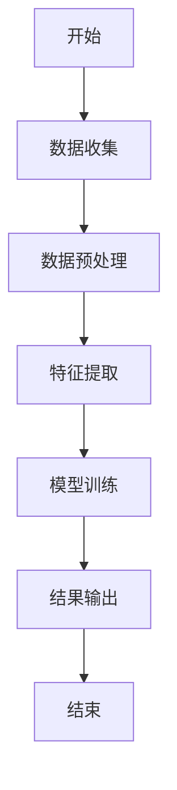
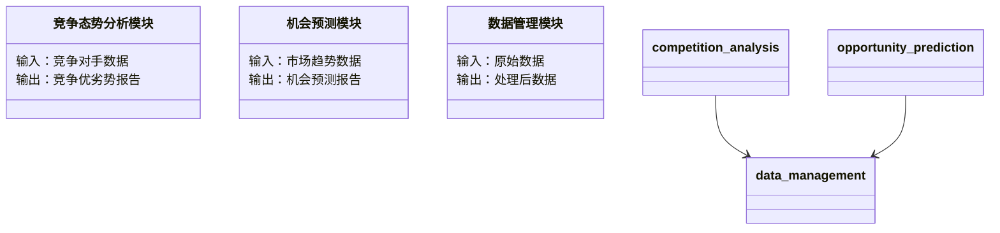

                 


# AI辅助企业战略制定：竞争态势分析与机会预测模型

> 关键词：AI，企业战略，竞争态势分析，机会预测模型，机器学习，商业智能

> 摘要：本文深入探讨了如何利用人工智能技术辅助企业制定战略决策，特别是在竞争态势分析和机会预测模型方面的应用。通过分析AI在企业战略中的潜在价值，提出了一种结合竞争态势分析与机会预测模型的新方法，为企业在复杂多变的市场环境中制定更具前瞻性和科学性的战略提供了新的思路。本文从理论基础到算法实现，再到系统架构设计，全面阐述了AI辅助企业战略制定的技术细节和实际应用。

---

## 第一部分：AI辅助企业战略制定的背景与核心概念

### 第1章：AI辅助企业战略制定的背景与问题描述

#### 1.1 问题背景

- **传统企业战略制定的挑战**
  - 市场环境日益复杂，竞争加剧。
  - 数据量庞大，难以快速提取关键信息。
  - 战略决策依赖经验，缺乏数据支持和预测能力。
  - 企业内外部因素变化快，战略调整成本高。

- **AI技术对企业战略制定的潜在价值**
  - 利用AI处理海量数据，提取关键信息。
  - 建立预测模型，提前识别市场机会和风险。
  - 提供数据驱动的决策支持，提高战略的科学性和准确性。
  - 实现动态调整，降低战略执行的成本。

- **当前市场竞争环境的变化对企业战略的影响**
  - 数字化转型加速，数据成为核心资源。
  - 顾客需求多样化，企业需要快速响应市场变化。
  - 全球化和区域化并存，企业面临多维度竞争压力。

#### 1.2 问题描述

- **企业战略制定中的关键问题**
  - 如何高效分析竞争环境？
  - 如何准确预测市场机会？
  - 如何将AI技术与企业战略制定相结合？
  - 如何构建动态调整的战略制定机制？

- **竞争态势分析的复杂性**
  - 竞争对手分析难度大，涉及多个维度。
  - 市场动态变化快，传统分析方法效率低。
  - 数据来源多样，整合和分析困难。

- **机会预测模型的必要性**
  - 企业需要提前识别市场机会。
  - 预测模型可以量化机会的可能性和潜在价值。
  - 帮助企业在不确定性中制定更具前瞻性的战略。

#### 1.3 问题解决思路

- **AI技术在战略制定中的应用潜力**
  - 数据挖掘技术可以提取竞争环境中的关键信息。
  - 机器学习算法可以建立竞争态势分析模型。
  - 自然语言处理技术可以分析非结构化数据，如新闻、社交媒体等。

- **竞争态势分析与机会预测的结合**
  - 通过分析竞争态势，识别市场机会。
  - 结合机会预测模型，评估机会的可行性和潜在价值。
  - 构建动态反馈机制，实时调整战略。

- **企业战略制定的新范式**
  - 从经验驱动向数据驱动转变。
  - 从静态规划向动态调整转变。
  - 从单一分析向多维度综合分析转变。

#### 1.4 本章小结

本章从背景出发，分析了传统企业战略制定的挑战，探讨了AI技术在其中的潜在价值，提出了结合竞争态势分析与机会预测模型的新思路，为后续章节的展开奠定了基础。

---

## 第2章：竞争态势分析与机会预测的核心概念

### 2.1 核心概念与定义

- **竞争态势分析的定义**
  - 竞争态势分析是通过对市场、竞争对手、行业趋势等多方面因素的分析，评估企业在市场中的竞争地位和优势。
  - 它帮助企业在制定战略时，明确自身的优势和劣势，识别潜在威胁和机会。

- **机会预测模型的定义**
  - 机会预测模型是一种基于数据分析和机器学习的模型，用于预测特定市场机会的出现概率和潜在价值。
  - 该模型可以帮助企业在复杂多变的市场环境中，提前识别和抓住潜在的机会。

- **AI辅助战略制定的定义**
  - AI辅助战略制定是利用人工智能技术，通过数据挖掘、机器学习等方法，辅助企业制定更加科学、动态的战略决策。
  - 它结合了竞争态势分析和机会预测模型，提供全面的市场洞察和战略建议。

### 2.2 核心概念的属性特征对比

| 特性                | 竞争态势分析          | 机会预测模型          |
|---------------------|----------------------|----------------------|
| 数据来源            | 竞争对手信息、市场数据 | 市场趋势、历史数据     |
| 分析目标            | 竞争优势、威胁        | 市场机会              |
| 分析方法            | SWOT分析、波特五力模型 | 时间序列分析、机器学习 |
| 输出结果            | 竞争地位评估          | 机会概率、潜在价值    |

### 2.3 竞争态势分析与机会预测的ER实体关系图

```mermaid
er
  actor: 企业战略制定者
  action: 竞争态势分析
  outcome: 机会预测
  actor --> action: 进行
  action --> outcome: 生成
```

### 2.4 本章小结

本章通过定义和对比分析，明确了竞争态势分析与机会预测模型的核心概念及其属性特征，为后续章节的算法实现和系统设计奠定了理论基础。

---

## 第3章：AI辅助企业战略制定的算法原理

### 3.1 竞争态势分析的算法流程



#### 3.1.1 数据收集

- 竞争对手信息：包括市场份额、产品特点、定价策略等。
- 市场数据：包括市场规模、增长趋势、行业报告等。

#### 3.1.2 数据预处理

- 数据清洗：处理缺失值、异常值等。
- 数据转换：将非结构化数据转换为结构化数据。

#### 3.1.3 特征提取

- 选择关键特征：如市场份额、增长率、竞争对手的产品差异化程度等。
- 使用特征工程：如主成分分析（PCA）进行降维。

#### 3.1.4 模型训练

- 使用监督学习算法：如随机森林、支持向量机（SVM）等。
- 模型评估：通过交叉验证评估模型性能。

#### 3.1.5 结果输出

- 输出竞争态势分析报告：包括竞争优劣势分析、潜在威胁等。

### 3.2 机会预测模型的算法流程


#### 3.2.1 数据收集

- 市场趋势：包括行业增长率、消费者行为数据等。
- 历史数据：包括过去的机会出现频率、成功案例等。

#### 3.2.2 数据预处理

- 数据清洗：处理缺失值、异常值等。
- 数据转换：将非结构化数据转换为结构化数据。

#### 3.2.3 特征提取

- 选择关键特征：如市场增长率、消费者需求变化等。
- 使用特征工程：如主成分分析（PCA）进行降维。

#### 3.2.4 模型训练

- 使用监督学习算法：如随机森林、逻辑回归等。
- 模型评估：通过交叉验证评估模型性能。

#### 3.2.5 结果输出

- 输出机会预测报告：包括机会概率、潜在价值等。

### 3.3 算法实现代码示例

#### 3.3.1 竞争态势分析模型

```python
import pandas as pd
from sklearn.ensemble import RandomForestClassifier
from sklearn.metrics import accuracy_score

# 数据加载
data = pd.read_csv('competition_data.csv')

# 数据分割
X = data.drop('target', axis=1)
y = data['target']

X_train, X_test, y_train, y_test = train_test_split(X, y, test_size=0.2, random_state=42)

# 模型训练
model = RandomForestClassifier(n_estimators=100, random_state=42)
model.fit(X_train, y_train)

# 模型预测
y_pred = model.predict(X_test)

# 模型评估
print("Accuracy:", accuracy_score(y_test, y_pred))
```

#### 3.3.2 机会预测模型

```python
import pandas as pd
from sklearn.ensemble import RandomForestClassifier
from sklearn.metrics import accuracy_score

# 数据加载
data = pd.read_csv('opportunity_data.csv')

# 数据分割
X = data.drop('target', axis=1)
y = data['target']

X_train, X_test, y_train, y_test = train_test_split(X, y, test_size=0.2, random_state=42)

# 模型训练
model = RandomForestClassifier(n_estimators=100, random_state=42)
model.fit(X_train, y_train)

# 模型预测
y_pred = model.predict(X_test)

# 模型评估
print("Accuracy:", accuracy_score(y_test, y_pred))
```

### 3.4 数学模型与公式

#### 3.4.1 竞争态势分析中的贝叶斯定理

$$ P(A|B) = \frac{P(B|A) \cdot P(A)}{P(B)} $$

其中，$A$ 表示某个竞争态势，$B$ 表示观察到的数据。

#### 3.4.2 机会预测中的线性回归模型

$$ y = \beta_0 + \beta_1 x_1 + \beta_2 x_2 + \dots + \beta_n x_n + \epsilon $$

其中，$y$ 表示机会的出现概率，$x_i$ 表示各个特征变量。

---

## 第4章：系统分析与架构设计方案

### 4.1 项目介绍

- **项目目标**：构建一个基于AI的竞争态势分析与机会预测模型，辅助企业制定战略决策。
- **项目范围**：涵盖数据收集、模型训练、结果输出等环节。
- **项目利益相关者**：企业战略制定者、数据科学家、IT部门等。

### 4.2 系统功能设计

#### 4.2.1 领域模型设计



#### 4.2.2 系统架构设计


### 4.3 系统接口设计

- **API接口**：提供RESTful API，供前端调用。
  - `/api/competition_analysis`
  - `/api/opportunity_prediction`

### 4.4 系统交互设计

```mermaid
sequenceDiagram
    participant 用户
    participant 系统
    用户 -> 系统: 提交数据
    系统 -> 数据管理模块: 处理数据
    数据管理模块 -> 竞争态势分析模块: 分析数据
    竞争态势分析模块 -> 系统: 返回报告
    用户 <- 系统: 显示报告
```

---

## 第5章：项目实战

### 5.1 环境安装

- **安装Python**：确保安装了Python 3.8及以上版本。
- **安装依赖库**：`pandas`, `scikit-learn`, `mermaid`, `matplotlib`。

```bash
pip install pandas scikit-learn mermaid matplotlib
```

### 5.2 系统核心实现源代码

#### 5.2.1 竞争态势分析模块

```python
import pandas as pd
from sklearn.ensemble import RandomForestClassifier
from sklearn.metrics import accuracy_score

def competition_analysis():
    # 数据加载
    data = pd.read_csv('competition_data.csv')
    
    # 数据分割
    X = data.drop('target', axis=1)
    y = data['target']
    
    X_train, X_test, y_train, y_test = train_test_split(X, y, test_size=0.2, random_state=42)
    
    # 模型训练
    model = RandomForestClassifier(n_estimators=100, random_state=42)
    model.fit(X_train, y_train)
    
    # 模型预测
    y_pred = model.predict(X_test)
    
    # 模型评估
    print("Accuracy:", accuracy_score(y_test, y_pred))
    
    return y_pred

competition_analysis()
```

#### 5.2.2 机会预测模块

```python
import pandas as pd
from sklearn.ensemble import RandomForestClassifier
from sklearn.metrics import accuracy_score

def opportunity_prediction():
    # 数据加载
    data = pd.read_csv('opportunity_data.csv')
    
    # 数据分割
    X = data.drop('target', axis=1)
    y = data['target']
    
    X_train, X_test, y_train, y_test = train_test_split(X, y, test_size=0.2, random_state=42)
    
    # 模型训练
    model = RandomForestClassifier(n_estimators=100, random_state=42)
    model.fit(X_train, y_train)
    
    # 模型预测
    y_pred = model.predict(X_test)
    
    # 模型评估
    print("Accuracy:", accuracy_score(y_test, y_pred))
    
    return y_pred

opportunity_prediction()
```

### 5.3 案例分析

- **案例背景**：假设某企业面临市场竞争加剧的情况，希望通过AI技术分析竞争态势并预测市场机会。
- **数据准备**：收集竞争对手数据、市场趋势数据等。
- **模型训练**：分别训练竞争态势分析模型和机会预测模型。
- **结果分析**：根据模型输出，调整企业战略。

### 5.4 项目总结

- **项目成果**：构建了一个基于AI的竞争态势分析与机会预测模型。
- **经验总结**：AI技术能够显著提高企业战略制定的效率和准确性。
- **未来展望**：进一步优化模型，探索更多AI在企业战略中的应用。

---

## 第6章：最佳实践、小结、注意事项和拓展阅读

### 6.1 最佳实践

- **数据质量管理**：确保数据的准确性和完整性。
- **模型解释性**：选择具有高解释性的模型，便于业务人员理解。
- **动态调整**：根据市场变化实时更新模型。

### 6.2 小结

本文详细探讨了AI辅助企业战略制定的技术实现，从理论到实践，全面阐述了竞争态势分析与机会预测模型的构建过程。通过实际案例分析，验证了模型的有效性。

### 6.3 注意事项

- **数据隐私**：注意保护企业的数据隐私，遵守相关法律法规。
- **模型维护**：定期更新模型，确保其适应市场变化。
- **团队协作**：AI项目需要数据科学家、IT人员和业务人员的协作。

### 6.4 拓展阅读

- **《机器学习实战》**：了解机器学习的基本概念和实现方法。
- **《商业智能分析》**：学习商业智能的基本理论和应用。
- **《企业战略管理》**：掌握企业战略管理的核心理论和方法。

---

## 作者：AI天才研究院 & 禅与计算机程序设计艺术

本文由AI天才研究院与禅与计算机程序设计艺术联合撰写，致力于探索AI技术在商业领域的深度应用，为企业提供科学的决策支持。

