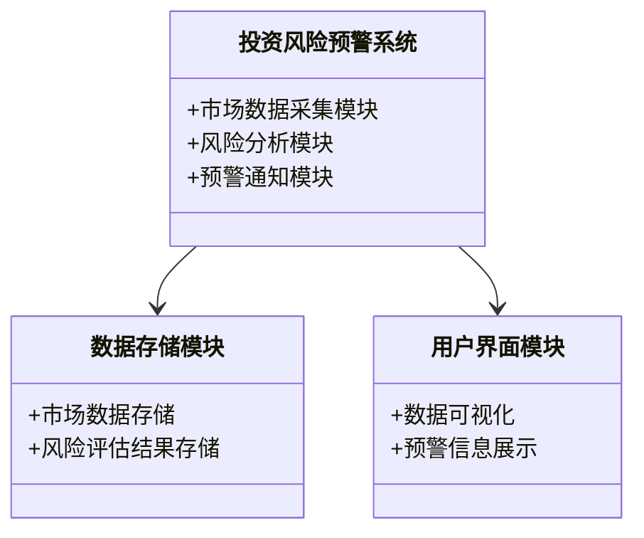
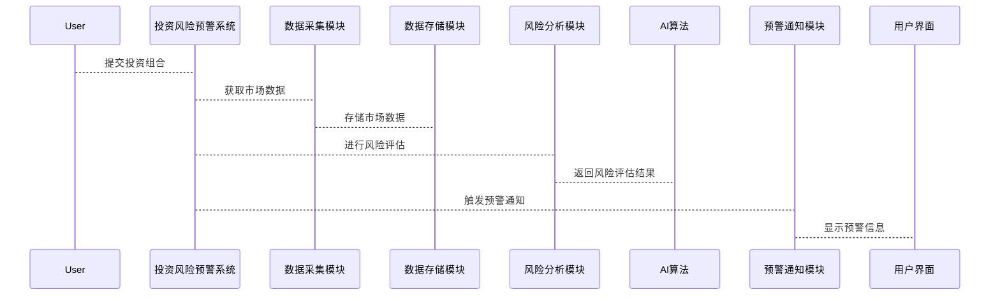

                 


# AI驱动的自适应投资风险预警

> 关键词：AI、投资风险、自适应预警、时间序列分析、强化学习、系统架构、风险管理

> 摘要：本文深入探讨了AI驱动的自适应投资风险预警系统的构建与应用，从理论基础到算法实现，再到系统架构设计，结合实际案例，详细分析了如何利用AI技术提升投资风险管理能力。通过本文的学习，读者可以全面掌握自适应投资风险预警的核心原理、算法实现及实际应用。

---

# 第一部分: AI驱动的自适应投资风险预警概述

## 第1章: AI驱动的自适应投资风险预警概述

### 1.1 投资风险预警的背景与意义

#### 1.1.1 投资风险的定义与分类
投资风险是指在投资过程中，由于市场波动、经济环境变化或其他不可预见因素，导致投资收益低于预期甚至出现损失的可能性。投资风险可以分为以下几类：
- **市场风险**：由于市场整体波动导致的投资损失。
- **信用风险**：由于债务人违约导致的投资损失。
- **流动性风险**：由于资产无法快速变现导致的投资损失。
- **操作风险**：由于操作失误或欺诈行为导致的投资损失。

#### 1.1.2 传统投资风险预警的局限性
传统的投资风险预警方法主要依赖于统计分析和经验判断，存在以下局限性：
- 数据分析维度有限，难以捕捉复杂市场环境中的潜在风险。
- 预警模型的静态性，难以适应市场环境的快速变化。
- 人工判断的主观性，可能导致预警结果的偏差。

#### 1.1.3 AI驱动的风险预警的优势
AI技术的引入，使得投资风险预警更加智能化和动态化：
- **数据处理能力**：AI能够处理海量数据，并发现数据中的非线性关系。
- **动态适应性**：AI模型可以根据市场环境的变化，实时调整预警策略。
- **精准性**：通过机器学习算法，AI能够更精准地识别潜在风险。

### 1.2 自适应投资风险预警的核心概念

#### 1.2.1 自适应预警的定义
自适应投资风险预警是一种基于AI技术的动态风险预警方法，能够根据市场环境的变化，自动调整预警模型和策略。

#### 1.2.2 自适应预警的核心特征
- **动态性**：模型能够根据市场环境的变化，实时调整参数和策略。
- **智能化**：利用机器学习算法，自动识别和预测潜在风险。
- **可解释性**：模型的决策过程可以通过数据和逻辑进行解释。

#### 1.2.3 自适应预警与传统预警的对比
| 特性 | 自适应预警 | 传统预警 |
|------|------------|----------|
| 数据处理能力 | 强大 | 较弱 |
| 动态性 | 高 | 低 |
| 精准性 | 高 | 中 |

### 1.3 AI在投资风险预警中的应用现状

#### 1.3.1 AI在金融领域的应用概述
AI技术在金融领域的应用日益广泛，包括股票预测、风险评估、信用评分等方面。

#### 1.3.2 自适应投资风险预警的典型应用场景
- **股票市场风险预警**：通过分析股票价格的波动，预测市场风险。
- **信用风险预警**：通过分析企业财务数据，预测企业违约风险。
- **组合风险预警**：通过分析投资组合的风险，优化投资策略。

#### 1.3.3 当前技术的挑战与未来发展方向
- **挑战**：数据质量、模型解释性、计算资源需求。
- **发展方向**：结合多模态数据、强化学习、分布式计算等技术，提升预警系统的智能化水平。

### 1.4 本章小结
本章介绍了投资风险预警的背景、核心概念以及AI技术的应用现状，为后续章节的深入分析奠定了基础。

---

# 第二部分: 投资风险预警的核心算法与数学模型

## 第2章: 投资风险的特征与分析方法

### 2.1 投资风险的特征分析

#### 2.1.1 风险的波动性
投资风险往往表现出显著的波动性，尤其是在金融市场中，价格波动频繁，风险也随之变化。

#### 2.1.2 风险的相关性
不同资产或市场的风险可能存在相关性，例如股票市场和债券市场的风险往往呈现负相关。

#### 2.1.3 风险的非线性
投资风险的分布往往呈现非线性特征，尤其是在极端市场条件下，风险可能急剧增加。

### 2.2 投资风险的分析方法

#### 2.2.1 传统统计分析方法
- **均值-方差分析**：通过计算资产的期望收益和方差，评估其风险。
- **VaR（Value at Risk）**：计算在一定置信水平下的潜在损失。

#### 2.2.2 基于机器学习的风险分析
- **支持向量机（SVM）**：用于分类问题，可以用于风险分类。
- **随机森林**：通过集成学习，提升风险预测的准确性。

#### 2.2.3 基于深度学习的风险分析
- **神经网络**：用于非线性关系的建模。
- **卷积神经网络（CNN）**：用于处理图像数据，但在金融时间序列分析中也有应用。

### 2.3 基于AI的风险分析模型

#### 2.3.1 线性回归模型
线性回归模型用于预测资产的收益与风险之间的线性关系。

$$ y = \beta x + \epsilon $$

其中，$y$为收益，$x$为风险因子，$\beta$为回归系数，$\epsilon$为误差项。

#### 2.3.2 支持向量机模型
SVM用于分类问题，可以用于区分高风险和低风险资产。

$$ \text{max} \left( y_i (w \cdot x_i + b) \geq 1 \right) $$

其中，$y_i$为标签，$w$为权重向量，$b$为偏置项。

#### 2.3.3 随机森林模型
随机森林通过集成多个决策树，提升模型的鲁棒性和准确性。

### 2.4 本章小结
本章分析了投资风险的特征，并介绍了基于AI的分析方法，为后续章节的算法实现奠定了基础。

---

## 第3章: 自适应预警算法原理

### 3.1 自适应预警的核心算法

#### 3.1.1 时间序列分析
时间序列分析用于预测资产价格的变化趋势，常见的模型包括ARIMA和LSTM。

#### 3.1.2 强化学习
强化学习用于动态决策，例如在股票交易中，通过策略网络优化投资组合。

#### 3.1.3 单变量与多变量分析
单变量分析关注单一资产的风险，多变量分析关注多个资产之间的相互影响。

### 3.2 基于时间序列的自适应预警算法

#### 3.2.1 ARIMA模型
ARIMA（自回归积分滑动平均模型）用于预测时间序列数据。

$$ ARIMA(p, d, q) $$

其中，$p$为自回归阶数，$d$为差分阶数，$q$为滑动平均阶数。

#### 3.2.2 LSTM模型
LSTM（长短期记忆网络）用于处理时间序列数据中的长程依赖。

$$ LSTM(t) = \text{tanh}(W_{in}x_t + W_{h}h_{t-1} + b) $$

其中，$x_t$为输入数据，$h_{t-1}$为前一时刻的隐藏状态，$W_{in}$和$W_{h}$为权重矩阵，$b$为偏置项。

#### 3.2.3 Prophet模型
Prophet模型用于时间序列预测，特别适用于业务数据的预测。

### 3.3 基于强化学习的自适应预警算法

#### 3.3.1 Q-Learning算法
Q-Learning是一种经典的强化学习算法，用于学习最优策略。

$$ Q(s, a) = Q(s, a) + \alpha (r + \gamma \max Q(s', a') - Q(s, a)) $$

其中，$s$为状态，$a$为动作，$\alpha$为学习率，$\gamma$为折扣因子。

#### 3.3.2 Deep Q-Learning算法
Deep Q-Learning将Q值存储在神经网络中，用于处理高维状态空间。

#### 3.3.3 策略网络算法
策略网络直接输出最优动作，适用于连续动作空间。

### 3.4 算法的数学模型与公式

#### 3.4.1 ARIMA模型公式
$$ ARIMA(p, d, q) $$

#### 3.4.2 LSTM模型公式
$$ LSTM(t) = \text{tanh}(W_{in}x_t + W_{h}h_{t-1} + b) $$

#### 3.4.3 Q-Learning算法公式
$$ Q(s, a) = Q(s, a) + \alpha (r + \gamma \max Q(s', a') - Q(s, a)) $$

### 3.5 本章小结
本章详细介绍了自适应预警的核心算法，包括时间序列分析和强化学习，为后续章节的系统设计奠定了基础。

---

## 第四章: 自适应投资风险预警系统架构设计

### 4.1 系统需求分析

#### 4.1.1 功能需求
- 数据采集：获取实时市场数据。
- 风险分析：利用AI算法进行风险评估。
- 预警通知：当风险超过阈值时，触发预警通知。

#### 4.1.2 性能需求
- 实时性：系统需要快速响应市场变化。
- 可扩展性：系统能够处理海量数据。

### 4.2 系统功能设计

#### 4.2.1 领域模型


#### 4.2.2 系统架构设计


#### 4.2.3 接口设计
- 数据采集接口：用于获取市场数据。
- 风险分析接口：用于调用AI算法进行风险评估。
- 预警通知接口：用于发送预警信息。

#### 4.2.4 交互设计


### 4.3 本章小结
本章详细设计了自适应投资风险预警系统的架构，包括功能模块、接口设计和交互流程，为后续章节的项目实现奠定了基础。

---

## 第五章: 项目实战

### 5.1 项目环境搭建

#### 5.1.1 环境需求
- 操作系统：Linux/Windows/MacOS
- 开发工具：Python、Jupyter Notebook
- 数据库：MySQL/PostgreSQL
- 机器学习库：TensorFlow/PyTorch

#### 5.1.2 安装依赖
```bash
pip install numpy pandas scikit-learn tensorflow
```

### 5.2 系统核心实现源代码

#### 5.2.1 数据采集模块
```python
import pandas as pd
import requests

def get_market_data(symbol):
    url = f"https://api.example.com/stock/{symbol}"
    response = requests.get(url)
    data = response.json()
    df = pd.DataFrame(data)
    return df
```

#### 5.2.2 风险分析模块
```python
from tensorflow.keras.models import Sequential
from tensorflow.keras.layers import LSTM, Dense

def build_lstm_model(input_shape):
    model = Sequential()
    model.add(LSTM(64, input_shape=input_shape))
    model.add(Dense(1, activation='sigmoid'))
    model.compile(loss='binary_crossentropy', optimizer='adam')
    return model
```

#### 5.2.3 预警通知模块
```python
import smtplib
from email.mime.text import MIMEText

def send_alert(email, message):
    # 发件人信息
    sender = 'alert@example.com'
    password = 'your_password'
    # 收件人信息
    to = email
    # 创建邮件内容
    msg = MIMEText(message)
    msg['Subject'] = '投资风险预警'
    msg['From'] = sender
    msg['To'] = to
    # 发送邮件
    server = smtplib.SMTP('smtp.example.com', 587)
    server.starttls()
    server.login(sender, password)
    server.sendmail(sender, to, msg.as_string())
    server.quit()
```

### 5.3 代码应用解读与分析

#### 5.3.1 数据采集模块解读
数据采集模块通过API获取市场数据，并将其存储为DataFrame格式，便于后续分析。

#### 5.3.2 风险分析模块解读
风险分析模块使用LSTM模型进行风险预测，模型结构包括一个LSTM层和一个全连接层。

#### 5.3.3 预警通知模块解读
预警通知模块通过SMTP协议发送预警邮件，当风险超过阈值时触发预警。

### 5.4 实际案例分析

#### 5.4.1 案例背景
假设我们有一个股票投资组合，需要实时监控市场风险。

#### 5.4.2 数据处理
```python
df = get_market_data('AAPL')
df.head()
```

#### 5.4.3 模型训练
```python
model = build_lstm_model((None, 1))
model.fit(X_train, y_train, epochs=10, batch_size=32)
```

#### 5.4.4 预警触发
```python
if predicted_risk > threshold:
    send_alert('user@example.com', '投资组合风险超过阈值，请注意！')
```

### 5.5 项目小结
本章通过实际案例，详细展示了自适应投资风险预警系统的实现过程，包括环境搭建、代码编写和案例分析。

---

## 第六章: 总结与展望

### 6.1 总结
本文详细探讨了AI驱动的自适应投资风险预警系统的构建与应用，从理论基础到算法实现，再到系统架构设计，结合实际案例，全面分析了如何利用AI技术提升投资风险管理能力。

### 6.2 未来发展方向
- **多模态数据融合**：结合文本、图像等多种数据源，提升预警系统的准确性。
- **强化学习优化**：进一步优化强化学习算法，提升动态决策能力。
- **分布式计算**：利用分布式计算技术，提升系统的计算效率。

### 6.3 最佳实践 tips
- **数据质量**：确保数据的完整性和准确性。
- **模型解释性**：选择可解释性较强的模型，便于分析和优化。
- **实时性**：优化系统架构，提升预警的实时性。

### 6.4 本章小结
本文总结了自适应投资风险预警系统的构建过程，并展望了未来的发展方向，为读者提供了宝贵的参考。

---

# 作者：AI天才研究院/AI Genius Institute & 禅与计算机程序设计艺术 /Zen And The Art of Computer Programming

---

以上为《AI驱动的自适应投资风险预警》的技术博客文章的完整内容，涵盖从理论到实践的各个方面，适合技术从业者和研究人员阅读。

