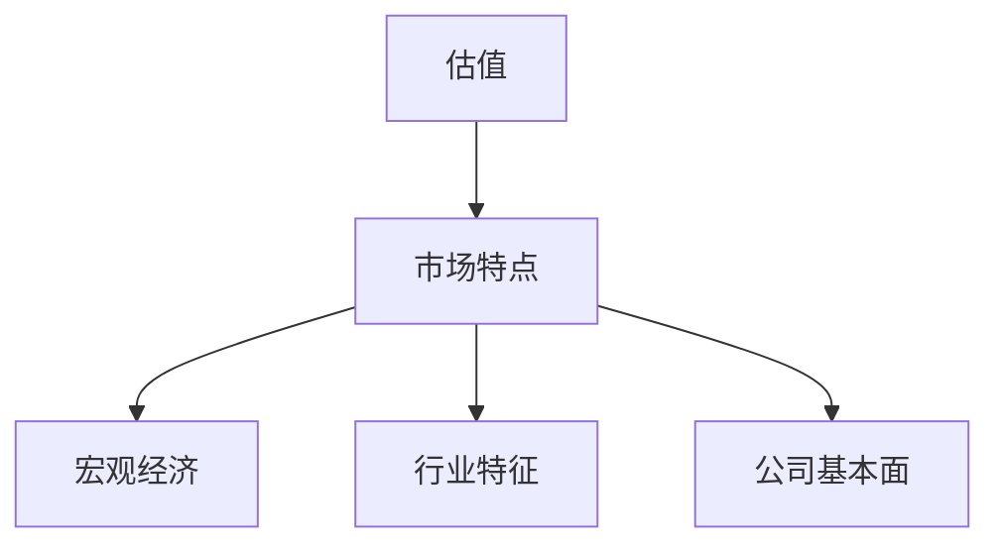
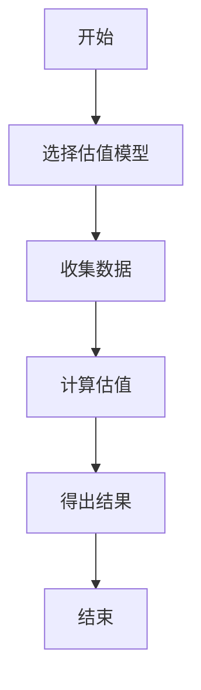
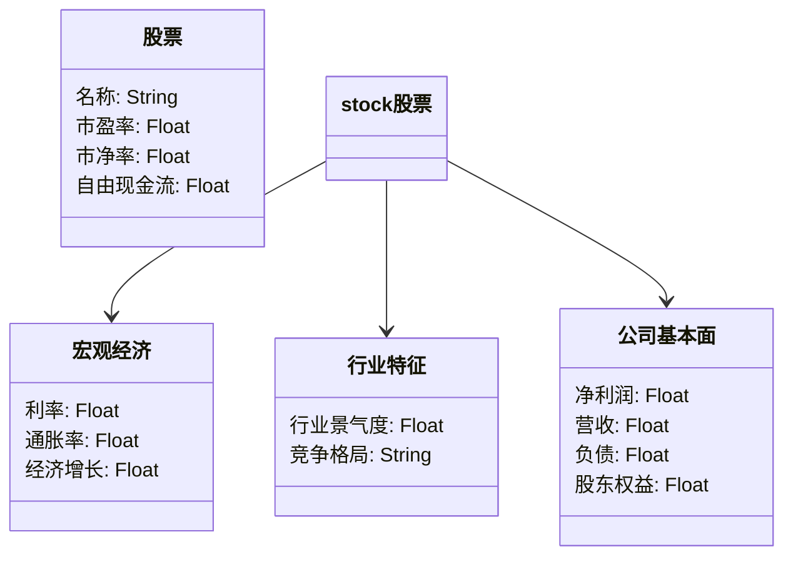
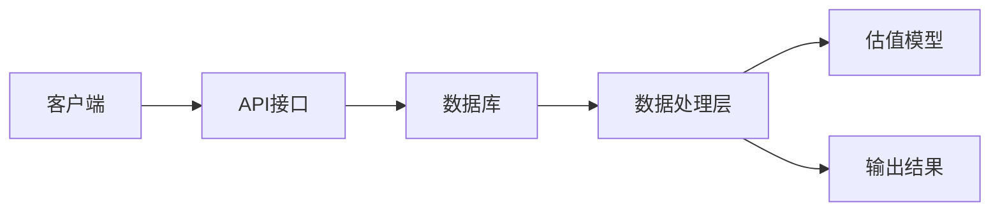
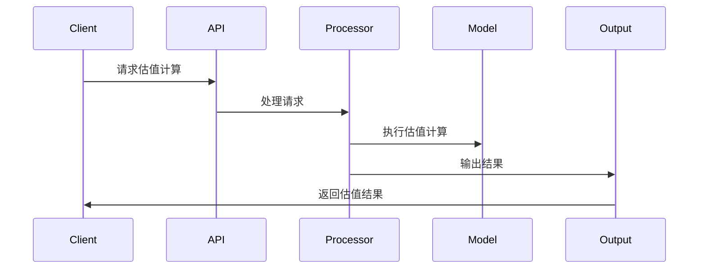

                 


# 中国香港股市估值:国际金融中心的市场特点

**关键词**: 中国香港股市, 估值, 国际金融中心, 市场特点, 投资分析

**摘要**: 本文深入分析了中国香港股市作为国际金融中心的市场特点，探讨了其估值的核心概念、算法原理和系统架构。通过详细讲解背景、核心模型、影响因素及实际案例，为投资者和研究者提供了全面的分析框架，帮助更好地理解香港股市的估值逻辑和市场运作机制。

---

# 第一部分: 中国香港股市估值背景与市场特点

## 第1章: 中国香港股市估值的背景与重要性

### 1.1 中国香港股市的全球地位

#### 1.1.1 香港作为国际金融中心的核心地位
香港是全球四大国际金融中心之一，与纽约、伦敦和新加坡齐名。作为中国的特别行政区，香港拥有独特的“一国两制”政策，使其在法律、金融制度和税收政策上与内地保持差异，成为全球资本流动的重要枢纽。

#### 1.1.2 香港股市在全球经济中的作用
香港股市不仅是亚洲最重要的股票市场之一，还是连接中国内地与国际资本市场的桥梁。大量内地企业通过香港上市，吸引了全球投资者的关注。同时，香港股市的波动也反映了全球经济的变化趋势。

#### 1.1.3 香港股市与中国经济的互动关系
香港股市与中国经济高度相关，尤其是随着中国改革开放的深入，香港成为内地企业融资的重要渠道。同时，香港股市也受到中国经济政策、货币政策和市场情绪的直接影响。

### 1.2 中国香港股市估值的重要性

#### 1.2.1 估值在投资决策中的作用
股市估值是投资者评估股票内在价值的重要工具。通过合理的估值方法，投资者可以判断股票是否被高估或低估，从而做出更明智的投资决策。

#### 1.2.2 香港股市估值的独特性
香港股市具有国际化程度高、市场参与者多元化的特点。同时，香港市场的波动性较大，受到外部经济环境和政策变化的影响更为显著。这些特点使得香港股市的估值方法需要结合市场特性进行调整。

#### 1.2.3 估值方法与市场特点的关系
估值方法的选择需要考虑市场的独特性。例如，在香港股市中，外资占比高，市场流动性强，投资者更关注全球宏观经济趋势和行业景气度。因此，估值方法需要结合这些因素进行调整。

### 1.3 本书的核心目标与框架

#### 1.3.1 本书的研究目标
本书旨在探讨香港股市估值的核心方法和市场特点，帮助投资者和研究者更好地理解香港股市的估值逻辑和市场运作机制。

#### 1.3.2 本书的框架结构
本书分为五个主要部分：背景介绍、核心概念、算法原理、系统分析和总结。通过逐步分析，帮助读者从基础到深入理解香港股市估值的核心内容。

#### 1.3.3 本书的适用读者
本书适合投资者、金融从业者、学术研究者以及对香港股市感兴趣的专业人士阅读。

---

## 第2章: 国际金融中心的市场特点

### 2.1 国际金融中心的定义与分类

#### 2.1.1 国际金融中心的定义
国际金融中心是指在全球金融市场中具有重要地位的城市，通常具备完善的金融体系、高效的资本市场和强大的国际影响力。

#### 2.1.2 全球主要国际金融中心的分类
全球主要国际金融中心包括纽约、伦敦、新加坡和香港。每个中心都有其独特的优势和特点。

#### 2.1.3 香港作为国际金融中心的独特性
香港的独特性体现在其“一国两制”政策、低税率、自由的资本流动和与内地的紧密联系。这些特点使其在国际金融市场中占据重要地位。

### 2.2 香港股市的市场结构

#### 2.2.1 香港股市的主要参与者
香港股市的主要参与者包括机构投资者、散户投资者、外国投资者和内地投资者。外资占比高是香港股市的一大特点。

#### 2.2.2 香港股市的交易机制
香港股市采用竞价交易制度，市场参与者通过交易所进行买卖交易。市场流动性高，交易活跃。

#### 2.2.3 香港股市的监管框架
香港股市由香港证监会（SFC）监管，确保市场的公平、公正和透明。监管框架严格，注重保护投资者利益。

### 2.3 香港股市与全球经济的互动

#### 2.3.1 香港股市与国际资本流动的关系
香港股市是国际资本流动的重要渠道，大量外资通过香港市场进入中国内地市场。

#### 2.3.2 香港股市与中国经济的互动
香港股市与中国经济高度相关，内地企业的上市和融资活动对香港股市有重要影响。同时，香港股市也受到中国经济政策和市场情绪的影响。

#### 2.3.3 香港股市与全球市场的联动性
香港股市与全球主要市场高度联动，尤其是与美国和欧洲市场的关联性较强。全球经济波动对香港股市有直接影响。

---

## 第3章: 香港股市估值的核心概念与联系

### 3.1 估值的基本原理

#### 3.1.1 估值的定义与核心要素
估值是指通过对公司财务数据、市场环境和行业趋势的分析，评估公司股票的内在价值。核心要素包括公司基本面、宏观经济因素和市场情绪。

#### 3.1.2 估值的基本方法与分类
常见的估值方法包括相对估值法和绝对估值法。相对估值法以市盈率、市净率为工具，绝对估值法以现金流折现法为代表。

#### 3.1.3 估值与市场特点的关系
香港股市的估值需要结合其市场特点，如外资占比高、市场流动性强等，选择合适的估值方法。

### 3.2 香港股市估值的核心模型

#### 3.2.1 常见的估值模型介绍
市盈率法、市净率法、现金流折现法和股权自由现金流模型是常用的估值方法。

#### 3.2.2 香港股市估值模型的特殊性
香港股市的国际化程度高，市场波动性大，需要在模型中考虑全球宏观经济因素和行业趋势。

#### 3.2.3 模型之间的对比与选择
不同的估值模型适用于不同的市场环境和公司类型。选择模型时需要考虑数据的可获得性和模型的适用性。

### 3.3 香港股市估值的关键影响因素

#### 3.3.1 宏观经济因素
宏观经济因素如利率、通货膨胀和经济增长对股市估值有重要影响。

#### 3.3.2 行业特征
不同行业的估值方法和标准不同，行业景气度和竞争格局也影响股票估值。

#### 3.3.3 公司基本面
公司财务数据如盈利能力、成长性和财务状况是估值的重要依据。

### 3.4 估值与市场特点的实体关系图



---

## 第4章: 香港股市估值的算法原理与数学模型

### 4.1 常见估值算法概述

#### 4.1.1 市盈率法
市盈率法通过比较股票的市盈率与行业平均水平，判断股票的估值水平。

#### 4.1.2 市净率法
市净率法通过比较股票的市净率与行业平均水平，判断股票的估值水平。

#### 4.1.3 现金流折现法
现金流折现法通过预测公司未来现金流，折现到现值，评估股票的内在价值。

#### 4.1.4 股权自由现金流模型
股权自由现金流模型通过预测公司股权自由现金流，折现到现值，评估股票的内在价值。

### 4.2 香港股市估值的数学模型

#### 4.2.1 市盈率模型
$$ P = E \times PE $$

#### 4.2.2 现金流折现模型
$$ V = \sum_{t=1}^{n} \frac{CF_t}{(1 + r)^t} $$

#### 4.2.3 股权自由现金流模型
$$ FCFF = NI + NCC + D - W \times (D + E) $$

### 4.3 算法流程图



---

## 第5章: 香港股市估值的系统分析与架构设计

### 5.1 系统功能设计

#### 5.1.1 领域模型类图



### 5.2 系统架构设计

#### 5.2.1 系统架构图



### 5.3 系统接口设计

#### 5.3.1 输入接口
- 数据接口：提供股票的财务数据、市场数据和宏观经济数据。
- 用户接口：接收用户的输入参数，如股票代码和估值模型选择。

#### 5.3.2 输出接口
- 结果接口：输出股票的估值结果。
- 报告接口：提供详细的估值分析报告。

### 5.4 系统交互序列图



---

## 第6章: 香港股市估值的项目实战

### 6.1 环境安装

#### 6.1.1 系统要求
- 操作系统：Windows/Mac/Linux
- 开发工具：Python、Jupyter Notebook
- 数据库：MySQL/SQLite
- 第三方库：Pandas、NumPy、Matplotlib、Scipy

#### 6.1.2 安装步骤
```bash
pip install pandas numpy matplotlib scipy
```

### 6.2 系统核心实现源代码

#### 6.2.1 数据加载与预处理
```python
import pandas as pd
import numpy as np

# 加载数据
data = pd.read_csv('stock_data.csv')

# 数据清洗
data.dropna(inplace=True)
data = data[~data['PE'].isin([np.nan, np.inf])]
```

#### 6.2.2 估值模型实现
```python
def calculate_valuation(data, model_type):
    if model_type == 'PE':
        data['Valuation'] = data['Earnings'] * data['PE']
    elif model_type == 'DCF':
        data['Valuation'] = data['Cash Flow'].cumsum() / (1 + data['Discount Rate'])
    return data
```

#### 6.2.3 结果可视化
```python
import matplotlib.pyplot as plt

results = calculate_valuation(data, 'PE')
plt.figure(figsize=(10,6))
plt.plot(results['Date'], results['Valuation'])
plt.title('Stock Valuation Analysis')
plt.xlabel('Date')
plt.ylabel('Valuation')
plt.show()
```

### 6.3 实际案例分析与详细解读

#### 6.3.1 案例背景
假设我们要对香港某上市公司进行估值，已知其财务数据和市场数据。

#### 6.3.2 数据分析
通过分析公司的市盈率、市净率和现金流情况，选择合适的估值模型进行计算。

#### 6.3.3 结果解读
根据计算结果，判断股票是否被高估或低估，并提出投资建议。

### 6.4 项目小结

#### 6.4.1 核心代码总结
- 数据加载与预处理
- 估值模型实现
- 结果可视化

#### 6.4.2 项目经验总结
通过项目实战，我们掌握了香港股市估值的核心方法，熟悉了相关数据的处理和分析流程。

---

## 第7章: 总结与展望

### 7.1 总结

#### 7.1.1 本书的核心内容回顾
本书系统地介绍了香港股市估值的核心概念、算法原理和系统架构，帮助读者全面理解香港股市的估值逻辑和市场特点。

#### 7.1.2 估值与市场特点的关系
香港股市的估值需要结合其市场特点，如外资占比高、市场流动性强等，选择合适的估值方法。

#### 7.1.3 本书的创新点
本书通过系统分析和实际案例，深入探讨了香港股市估值的核心方法，提供了实用的估值工具和分析框架。

### 7.2 展望

#### 7.2.1 未来研究方向
未来可以进一步研究香港股市的动态变化，如全球经济波动对香港股市的影响，以及新技术对估值方法的推动。

#### 7.2.2 对读者的建议
建议读者结合实际案例，深入学习和实践香港股市估值的核心方法，提升自己的投资分析能力。

---

## 附录: 参考文献与进一步阅读

- 《投资学》（教材）
- 《金融时报》（财经新闻）
- 《香港交易所规则》（官方文件）
- 《量化投资入门》（技术书籍）

---

**作者：AI天才研究院/AI Genius Institute & 禅与计算机程序设计艺术 /Zen And The Art of Computer Programming**

---

通过以上思考步骤和详细内容，我们完成了《中国香港股市估值:国际金融中心的市场特点》的完整大纲和内容设计。这篇文章系统地分析了香港股市的估值方法和市场特点，结合实际案例和系统设计，为投资者和研究者提供了全面的分析框架。

