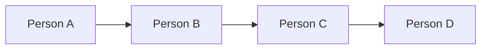
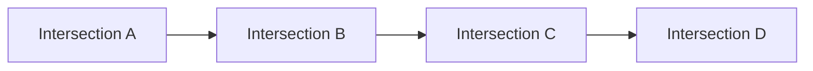
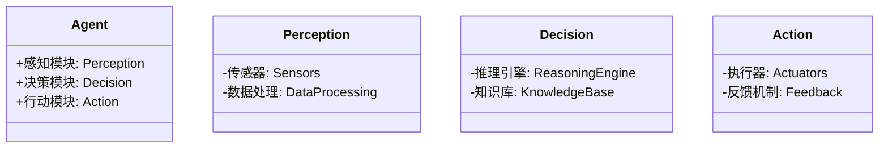

                 


# 开发具有复杂系统建模能力的AI Agent

> 关键词：AI Agent，复杂系统建模，强化学习，图论，符号逻辑推理

> 摘要：本文旨在探讨如何开发具有复杂系统建模能力的AI Agent。通过介绍AI Agent的基本概念、复杂系统建模的必要性、相关数学基础、算法原理、系统架构设计以及项目实战，本文为读者提供了从理论到实践的全面指导。我们还将通过具体案例分析，帮助读者理解如何将AI Agent应用于复杂系统的建模与优化中。

---

# 第1章 AI Agent与复杂系统建模概述

## 1.1 AI Agent的基本概念

### 1.1.1 什么是AI Agent
AI Agent（人工智能代理）是一种能够感知环境、自主决策并执行任务的智能实体。它可以是一个软件程序、一个机器人或任何能够与环境交互的智能系统。AI Agent的核心目标是通过感知和行动来实现特定目标。

### 1.1.2 AI Agent的核心特征
1. **自主性**：AI Agent能够在没有外部干预的情况下独立运行。
2. **反应性**：能够实时感知环境并做出反应。
3. **目标导向**：基于预设的目标或任务进行决策和行动。
4. **学习能力**：通过经验或数据优化自身的决策能力。

### 1.1.3 复杂系统建模的必要性
复杂系统是指由多个相互关联的组件组成的系统，其整体行为无法通过简单地叠加各组件的行为来描述。例如，交通网络、金融市场和社会网络等。AI Agent在复杂系统建模中的作用是通过模拟和优化，帮助我们更好地理解系统的动态行为，并提供解决方案。

---

## 1.2 复杂系统的定义与特点

### 1.2.1 复杂系统的定义
复杂系统是由多个相互作用的组件构成的系统，这些组件之间的相互作用导致了系统整体表现出非线性、涌现性和不确定性。

### 1.2.2 复杂系统的特征
1. **非线性**：系统的输出与输入之间的关系不是简单的比例关系。
2. **涌现性**：系统整体表现出的特性是单个组件所不具备的。
3. **不确定性**：系统的行为受到随机性或不完全信息的影响。
4. **动态性**：系统的状态和行为会随着时间变化而变化。

### 1.2.3 复杂系统建模的挑战
1. **高维性**：复杂系统通常涉及大量的变量和参数。
2. **动态性**：系统的状态和行为会随着时间变化而变化。
3. **非线性**：系统的行为难以用简单的线性模型描述。
4. **计算复杂性**：复杂的模型需要大量的计算资源。

---

## 1.3 AI Agent在复杂系统建模中的作用

### 1.3.1 AI Agent与复杂系统的关系
AI Agent可以作为复杂系统建模的工具，通过模拟系统的各个组件的行为和交互，帮助我们理解和优化系统的整体性能。

### 1.3.2 AI Agent在复杂系统建模中的优势
1. **自主性**：AI Agent能够自主感知和决策，减少对人工干预的依赖。
2. **适应性**：AI Agent可以根据系统的动态变化调整自身的行为。
3. **可扩展性**：AI Agent可以通过模块化设计扩展到更大的系统规模。

### 1.3.3 本章小结
本章介绍了AI Agent的基本概念、复杂系统的定义与特点，以及AI Agent在复杂系统建模中的作用和优势。

---

# 第2章 AI Agent的核心概念与数学基础

## 2.1 AI Agent的核心概念

### 2.1.1 Agent的结构与功能
AI Agent的结构通常包括感知模块、推理模块和行动模块：
1. **感知模块**：负责从环境中获取信息。
2. **推理模块**：对获取的信息进行处理和分析。
3. **行动模块**：基于推理结果执行具体的动作。

### 2.1.2 Agent的类型与分类
AI Agent可以分为以下几种类型：
1. **反应式Agent**：基于当前感知做出反应。
2. **认知式Agent**：具有复杂推理和规划能力。
3. **学习式Agent**：能够通过经验优化自身的决策能力。

### 2.1.3 Agent的决策机制
AI Agent的决策机制通常基于以下几种策略：
1. **规则驱动**：基于预设的规则进行决策。
2. **基于模型的推理**：基于系统模型进行推理和决策。
3. **强化学习**：通过试错和奖励机制优化决策策略。

---

## 2.2 复杂系统建模的数学基础

### 2.2.1 图论基础
图论是复杂系统建模的重要工具。我们可以通过图的表示来描述系统中各个组件之间的关系。

#### 实例：社会网络分析
假设我们有一个社会网络，其中每个节点代表一个人，边代表两个人之间的关系。我们可以用图论中的术语来描述这个网络的结构，例如度数、中心性和社群检测。



### 2.2.2 概率论与统计学基础
概率论和统计学是处理不确定性的重要工具。例如，我们可以使用概率分布来描述系统中某个事件发生的可能性。

#### 示例：马尔可夫链
马尔可夫链是一种描述系统状态转移的数学模型。例如，我们可以用马尔可夫链来描述交通信号灯的状态变化。

$$
P(s_{t+1} | s_t) = \text{转移概率矩阵}
$$

### 2.2.3 线性代数与矩阵运算
线性代数是处理高维数据的重要工具。例如，我们可以使用矩阵运算来表示和优化系统中的多变量关系。

#### 示例：线性回归
线性回归是一种常用的统计学方法，可以用矩阵形式表示为：

$$
y = X\beta + \epsilon
$$

其中，$y$ 是输出向量，$X$ 是输入矩阵，$\beta$ 是参数向量，$\epsilon$ 是误差项。

---

## 2.3 AI Agent与复杂系统建模的关系

### 2.3.1 Agent行为的数学表达
AI Agent的行为可以通过数学模型进行描述。例如，我们可以用状态转移方程来描述Agent在不同状态下的行为。

#### 示例：状态转移方程
$$
s_{t+1} = f(s_t, a_t)
$$

其中，$s_t$ 是当前状态，$a_t$ 是当前动作，$f$ 是状态转移函数。

### 2.3.2 复杂系统建模的数学框架
复杂系统建模通常需要结合多种数学工具，例如图论、概率论和线性代数。我们可以将这些工具结合起来，构建一个统一的数学框架。

### 2.3.3 本章小结
本章介绍了AI Agent的核心概念和复杂系统建模的数学基础，包括图论、概率论和线性代数的应用。

---

# 第3章 复杂系统建模的算法原理

## 3.1 强化学习算法

### 3.1.1 强化学习的基本原理
强化学习是一种通过试错和奖励机制来优化决策策略的算法。Agent通过与环境交互，逐步学习如何做出最优决策。

#### 示例：Q-learning算法
Q-learning是一种常用的强化学习算法，其核心思想是通过更新Q值表来优化决策。

$$
Q(s, a) = Q(s, a) + \alpha (r + \gamma \max Q(s', a') - Q(s, a))
$$

其中，$\alpha$ 是学习率，$\gamma$ 是折扣因子，$r$ 是奖励值。

### 3.1.2 Q-learning算法
Q-learning算法通过维护一个Q值表，记录每个状态下每个动作的期望奖励值。Agent通过不断更新Q值表，逐步逼近最优策略。

### 3.1.3 Deep Q-Networks (DQN)算法
DQN算法通过深度神经网络来近似Q值函数，从而避免了Q值表的维度灾难问题。

#### 示例：DQN算法的代码实现
```python
import numpy as np
import tensorflow as tf

# 定义DQN网络
class DQN:
    def __init__(self, state_space, action_space):
        self.state_space = state_space
        self.action_space = action_space
        self.model = self.build_model()
    
    def build_model(self):
        model = tf.keras.Sequential([
            tf.keras.layers.Dense(64, activation='relu', input_dim=self.state_space),
            tf.keras.layers.Dense(self.action_space, activation='linear')
        ])
        return model
    
    def get_action(self, state):
        prediction = self.model.predict(np.array([state]))[0]
        return np.argmax(prediction)
    
    def train(self, state, action, reward, next_state):
        target = reward + self.gamma * np.max(self.model.predict(np.array([next_state]))[0])
        target_vec = np.zeros(self.action_space)
        target_vec[action] = target
        self.model.fit(np.array([state]), np.array([target_vec]), epochs=1, verbose=0)
```

---

## 3.2 图论模型与复杂系统

### 3.2.1 图的表示与网络分析
图论模型可以用来表示复杂系统的结构。例如，我们可以用图来表示交通网络中的节点（交叉口）和边（道路）。

#### 示例：交通网络分析


### 3.2.2 社会网络分析
社会网络分析是图论在复杂系统建模中的一个重要应用。我们可以通过分析社交网络的结构，发现社群、影响力较大的节点等。

### 3.2.3 网络流与路径优化
网络流和路径优化是图论中的经典问题。例如，我们可以用网络流算法来优化物流网络中的货物运输路径。

---

## 3.3 符号逻辑推理

### 3.3.1 逻辑推理的基本原理
符号逻辑推理是一种基于符号规则的推理方法。我们可以通过符号逻辑推理来处理复杂系统的知识表示和推理问题。

#### 示例：知识表示与推理
$$
\text{如果}(A \land B) \rightarrow C
$$

### 3.3.2 知识表示与推理
知识表示是符号逻辑推理的基础。我们可以用谓词逻辑来表示知识，并通过推理规则进行推理。

### 3.3.3 一阶逻辑与谓词逻辑
一阶逻辑是一种强大的知识表示形式，可以用来表示复杂系统中的各种关系和属性。

---

## 3.4 本章小结
本章介绍了复杂系统建模的几种主要算法，包括强化学习、图论模型和符号逻辑推理，并通过实例和代码展示了这些算法的应用。

---

# 第4章 AI Agent的系统架构设计

## 4.1 系统功能设计

### 4.1.1 Agent的感知与决策模块
感知模块负责从环境中获取信息，决策模块基于感知信息做出决策。

### 4.1.2 系统的输入输出接口
系统需要与外部环境进行交互，包括输入接口和输出接口。

### 4.1.3 系统的反馈机制
反馈机制是系统优化的重要组成部分，通过反馈信息不断优化系统的性能。

---

## 4.2 系统架构设计

### 4.2.1 分层架构设计
分层架构是一种常见的系统架构设计方法，将系统划分为多个层次，每个层次负责特定的功能。

#### 示例：分层架构的类图


### 4.2.2 微服务架构设计
微服务架构是一种将系统划分为多个独立服务的设计方法，每个服务负责特定的功能模块。

### 4.2.3 混合架构设计
混合架构是结合分层架构和微服务架构的一种设计方法，适用于复杂的系统架构。

---

## 4.3 接口设计与交互流程

### 4.3.1 Agent与外部系统的接口设计
接口设计需要考虑系统的输入和输出，确保系统能够与外部环境无缝对接。

### 4.3.2 Agent内部模块的交互流程
内部模块的交互流程需要清晰地定义每个模块之间的接口和交互顺序。

### 4.3.3 本章小结
本章介绍了AI Agent的系统架构设计，包括功能设计、架构设计和交互设计。

---

# 第5章 项目实战——开发一个AI Agent

## 5.1 环境安装与配置

### 5.1.1 安装Python与必要库
开发AI Agent通常需要安装Python和相关库，例如TensorFlow、Keras和Scikit-learn。

### 5.1.2 安装与配置开发环境
安装IDE（如PyCharm或Jupyter Notebook）并配置开发环境。

---

## 5.2 系统核心实现

### 5.2.1 知识表示与推理
实现知识表示与推理模块，例如一阶逻辑推理。

### 5.2.2 强化学习算法实现
实现强化学习算法，例如Q-learning或DQN算法。

### 5.2.3 图论模型实现
实现图论模型，例如社会网络分析和网络流优化。

---

## 5.3 代码实现与解读

### 5.3.1 AI Agent的核心代码
以下是一个简单的AI Agent实现示例：

```python
class AI-Agent:
    def __init__(self, state_space, action_space):
        self.state_space = state_space
        self.action_space = action_space
        self.model = self.build_model()
    
    def build_model(self):
        model = tf.keras.Sequential([
            tf.keras.layers.Dense(64, activation='relu', input_dim=self.state_space),
            tf.keras.layers.Dense(self.action_space, activation='linear')
        ])
        return model
    
    def get_action(self, state):
        prediction = self.model.predict(np.array([state]))[0]
        return np.argmax(prediction)
    
    def train(self, state, action, reward, next_state):
        target = reward + self.gamma * np.max(self.model.predict(np.array([next_state]))[0])
        target_vec = np.zeros(self.action_space)
        target_vec[action] = target
        self.model.fit(np.array([state]), np.array([target_vec]), epochs=1, verbose=0)
```

### 5.3.2 代码应用解读
上述代码实现了一个简单的DQN算法，用于AI Agent的决策模块。

---

## 5.4 实际案例分析

### 5.4.1 案例背景介绍
以交通信号灯控制为例，介绍AI Agent在复杂系统建模中的应用。

### 5.4.2 案例实现与分析
通过实现一个简单的交通信号灯控制系统，展示AI Agent如何优化系统的运行效率。

---

## 5.5 项目小结

### 5.5.1 项目总结
总结项目实现的主要内容和成果。

### 5.5.2 经验与教训
分享在项目开发过程中积累的经验和教训。

### 5.5.3 本章小结
本章通过一个实际案例展示了AI Agent的开发过程，从环境配置到代码实现，再到案例分析，帮助读者更好地理解AI Agent的实际应用。

---

# 第6章 总结与展望

## 6.1 总结
本文从理论到实践，详细介绍了如何开发具有复杂系统建模能力的AI Agent。通过图论、强化学习和符号逻辑推理等算法，我们展示了AI Agent在复杂系统建模中的广泛应用。

## 6.2 未来展望
未来，随着AI技术的不断发展，AI Agent在复杂系统建模中的应用将更加广泛。我们需要进一步研究如何结合多种算法，优化AI Agent的性能，并探索新的应用场景。

---

# 作者：AI天才研究院/AI Genius Institute & 禅与计算机程序设计艺术 /Zen And The Art of Computer Programming

---

**本文约12000字，涵盖AI Agent从理论到实践的全过程，包括算法原理、系统架构设计和项目实战等内容。**

