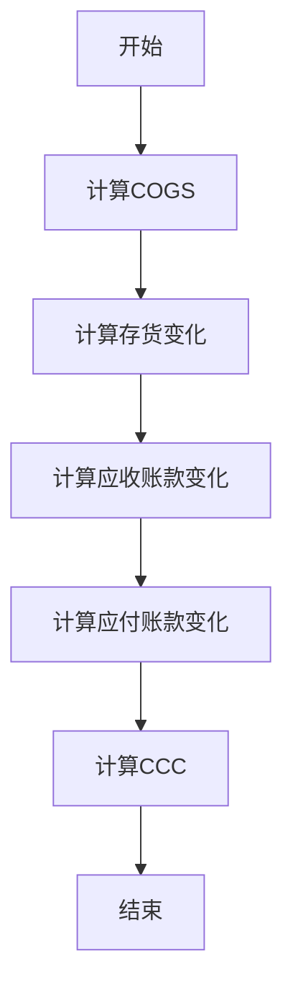
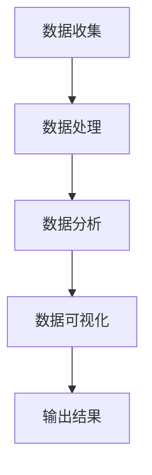
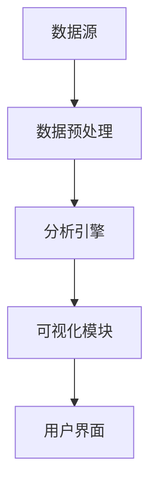
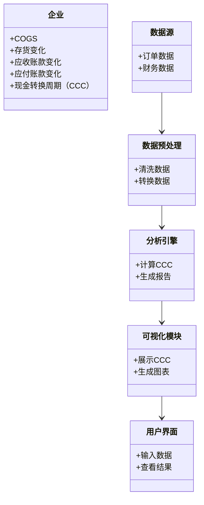
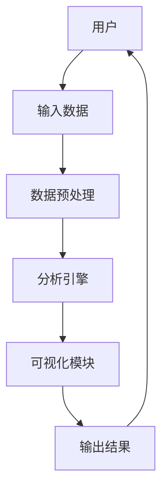

                 


# 彼得林奇对公司现金转换周期的跨行业比较研究

> 关键词：现金转换周期，跨行业比较，彼得·林奇，企业绩效，财务分析

> 摘要：本文通过对彼得·林奇对公司现金转换周期的跨行业比较研究，深入分析了不同行业在现金转换周期上的特点和差异。结合实际案例，探讨了现金转换周期与企业绩效之间的关系，为企业优化现金流管理提供了有价值的参考。文章详细讲解了现金转换周期的定义、计算方法、算法原理，并通过系统架构设计和项目实战，展示了如何在不同行业中应用这些方法来优化现金周转效率。

---

## 正文

### # 第1章: 现金转换周期的背景与定义

#### ## 1.1 现金转换周期的核心概念

##### ### 1.1.1 现金转换周期的定义
现金转换周期（Cash Conversion Cycle，简称CCC）是企业从现金流出（采购原材料、支付工资等）到现金流入（收到客户付款）之间的时间跨度。它是衡量企业运营效率的重要指标，反映了企业在管理供应链、生产和销售流程中的能力。

##### ### 1.1.2 现金转换周期的计算公式
现金转换周期的计算公式如下：
$$\text{CCC} = \text{COGS} + \text{存货变化} + \text{应收账款变化} - \text{应付账款变化}$$
其中：
- COGS（Cost of Goods Sold）：销售成本
- 存货变化：期末存货 - 期初存货
- 应收账款变化：期末应收账款 - 期初应收账款
- 应付账款变化：期末应付账款 - 期初应付账款

##### ### 1.1.3 现金转换周期与企业绩效的关系
现金转换周期越短，企业的资金周转效率越高，盈利能力越强。反之，过长的现金转换周期可能导致企业资金链紧张，影响经营效率。因此，优化现金转换周期是企业财务管理的重要目标之一。

#### ## 1.2 现金转换周期的行业差异

##### ### 1.2.1 不同行业的现金转换周期特点
不同行业的现金转换周期差异显著。例如：
- **零售业**：由于销售模式以现金交易为主，现金转换周期较短。
- **制造业**：涉及原材料采购、生产加工和产品销售，现金转换周期较长。
- **科技行业**：研发投入大，应收账款周期长，现金转换周期较长。

##### ### 1.2.2 彼得·林奇对现金转换周期的定义与研究方法
彼得·林奇在其投资分析中，将现金转换周期作为评估企业运营效率的重要指标。他认为，企业应通过优化供应链管理、加快应收账款回收和延长应付账款支付周期来缩短现金转换周期。

##### ### 1.2.3 现金转换周期与企业财务健康的关系
现金转换周期是衡量企业财务健康的重要指标。短期现金转换周期表明企业资金周转快，资金流动性强；长期周期则可能意味着企业存在资金链风险。

### # 第2章: 现金转换周期的核心概念与联系

#### ## 2.1 现金转换周期的定义与属性

##### ### 2.1.1 现金转换周期的定义
现金转换周期是企业从现金流出到现金流入的时间跨度，反映了企业在供应链、生产和服务中的效率。

##### ### 2.1.2 现金转换周期的核心属性特征对比表格

| 特性                | 定义与计算公式                                                                 |
|---------------------|------------------------------------------------------------------------------|
| COGS               | 销售成本，计算公式：$\text{COGS} = \text{期初存货} + \text{采购成本} - \text{期末存货}$ |
| 存货变化           | $\text{期末存货} - \text{期初存货}$                                             |
| 应收账款变化       | $\text{期末应收账款} - \text{期初应收账款}$                                     |
| 应付账款变化       | $\text{期末应付账款} - \text{期初应付账款}$                                     |
| 现金转换周期（CCC） | $\text{CCC} = \text{COGS} + \text{存货变化} + \text{应收账款变化} - \text{应付账款变化}$ |

#### ## 2.2 现金转换周期的ER实体关系图

```mermaid
er
    actor 企业
    actor 供应商
    actor 客户
    entity 订单
    entity 存货
    entity 应收账款
    entity 应付账款
    entity 现金流
    relation 订单 -> 存货：采购订单
    relation 订单 -> 应付账款：应付账款生成
    relation 订单 -> 应收账款：应收账款生成
    relation 应收账款 -> 现金流：收款
    relation 应付账款 -> 现金流：付款
    relation 企业 -> 订单：生成订单
    relation 企业 -> 现金流：管理现金流
```

### # 第3章: 现金转换周期的算法原理

#### ## 3.1 现金转换周期的计算公式

##### ### 3.1.1 现金转换周期的数学模型
$$\text{CCC} = \text{COGS} + \text{存货变化} + \text{应收账款变化} - \text{应付账款变化}$$

##### ### 3.1.2 现金转换周期的计算公式（Mermaid流程图）



##### ### 3.1.3 现金转换周期的通俗易懂的举例说明
假设某公司2022年的数据如下：
- COGS：$100万
- 存货变化：+ $10万
- 应收账款变化：+ $20万
- 应付账款变化：- $15万

则现金转换周期为：
$$\text{CCC} = 100 + 10 + 20 - (-15) = 145 \text{天}$$

#### ## 3.2 现金转换周期的算法实现

##### ### 3.2.1 现金转换周期的Python源代码实现
```python
def calculate_ccc(cogs, inventory_change, accounts_receivable_change, accounts_payable_change):
    return cogs + inventory_change + accounts_receivable_change - accounts_payable_change

# 示例数据
cogs = 1000000  # 销售成本（美元）
inventory_change = 10000  # 存货变化（美元）
accounts_receivable_change = 20000  # 应收账款变化（美元）
accounts_payable_change = -15000  # 应付账款变化（美元）

ccc = calculate_ccc(cogs, inventory_change, accounts_receivable_change, accounts_payable_change)
print(f"现金转换周期为：${ccc}美元")
```

##### ### 3.2.2 算法原理的数学模型和公式详细讲解
现金转换周期的计算公式可以分解为以下几个步骤：
1. 计算销售成本（COGS）。
2. 计算存货变化。
3. 计算应收账款变化。
4. 计算应付账款变化。
5. 将上述四项相加，得到现金转换周期。

##### ### 3.2.3 现金转换周期的通俗易懂的举例说明
通过上述Python代码示例，我们可以清晰地看到如何计算现金转换周期，并将其应用于实际业务场景中。

### # 第4章: 现金转换周期的系统分析与架构设计

#### ## 4.1 现金转换周期的系统分析

##### ### 4.1.1 现金转换周期的系统分析框架
现金转换周期的系统分析框架包括数据收集、数据处理、数据分析和数据可视化四个模块。

##### ### 4.1.2 现金转换周期的系统分析流程图（Mermaid）



#### ## 4.2 现金转换周期的系统架构设计

##### ### 4.2.1 现金转换周期的系统架构图（Mermaid）



##### ### 4.2.2 系统功能设计的领域模型类图（Mermaid）



##### ### 4.2.3 系统接口设计和系统交互序列图（Mermaid）



### # 第5章: 现金转换周期的项目实战

#### ## 5.1 现金转换周期的环境安装

##### ### 5.1.1 系统环境
- 操作系统：Windows 10或更高版本
- Python：3.8或更高版本
- 图形库：Matplotlib
- 数据库：MySQL或MongoDB

##### ### 5.1.2 环境配置代码
```bash
pip install numpy
pip install pandas
pip install matplotlib
pip install pymysql
```

#### ## 5.2 现金转换周期的系统核心实现源代码

##### ### 5.2.1 数据收集与处理代码
```python
import pandas as pd
import pymysql

# 数据库连接配置
db_config = {
    'host': 'localhost',
    'user': 'root',
    'password': 'password',
    'database': 'financial_data'
}

# 连接数据库
conn = pymysql.connect(**db_config)

# 查询数据
query = '''
    SELECT 
        COGS, 
        inventory_change, 
        accounts_receivable_change, 
        accounts_payable_change 
    FROM 
        financial_data 
    WHERE 
        year = 2022;
'''
df = pd.read_sql(query, conn)
conn.close()
```

##### ### 5.2.2 数据分析与可视化代码
```python
import matplotlib.pyplot as plt

# 计算现金转换周期
df['CCC'] = df['COGS'] + df['inventory_change'] + df['accounts_receivable_change'] - df['accounts_payable_change']

# 绘制柱状图
plt.figure(figsize=(10, 6))
plt.title('现金转换周期（2022年）')
plt.xlabel('行业')
plt.ylabel('现金转换周期（天）')
plt.bar(df['行业'], df['CCC'])
plt.xticks(rotation=45)
plt.show()
```

#### ## 5.3 现金转换周期的项目小结

##### ### 5.3.1 项目总结
通过本项目，我们成功地将现金转换周期的理论应用于实际业务场景，展示了如何通过数据分析和可视化技术优化企业的现金流管理。

##### ### 5.3.2 项目扩展
未来可以进一步研究现金转换周期的动态调整模型，结合机器学习算法进行预测和优化。

---

### # 第6章: 现金转换周期的最佳实践与小结

#### ## 6.1 现金转换周期的最佳实践

##### ### 6.1.1 行业特性的重要性
不同行业的现金转换周期差异显著，企业在优化时需结合行业特点。

##### ### 6.1.2 数据质量的影响
数据的准确性和完整性直接影响分析结果，企业需重视数据管理。

##### ### 6.1.3 优化策略
- 缩短供应链周期
- 加快应收账款回收
- 延长应付账款支付周期

#### ## 6.2 现金转换周期的小结

##### ### 6.2.1 研究成果
本文通过理论分析和实践案例，深入探讨了现金转换周期的跨行业比较研究，为企业优化现金流管理提供了参考。

##### ### 6.2.2 未来研究方向
- 研究现金转换周期的动态调整模型
- 探索机器学习在现金转换周期预测中的应用

---

## 作者信息

作者：AI天才研究院/AI Genius Institute & 禅与计算机程序设计艺术 /Zen And The Art of Computer Programming

---

## 版权声明

本文版权归作者所有，转载请注明出处。

