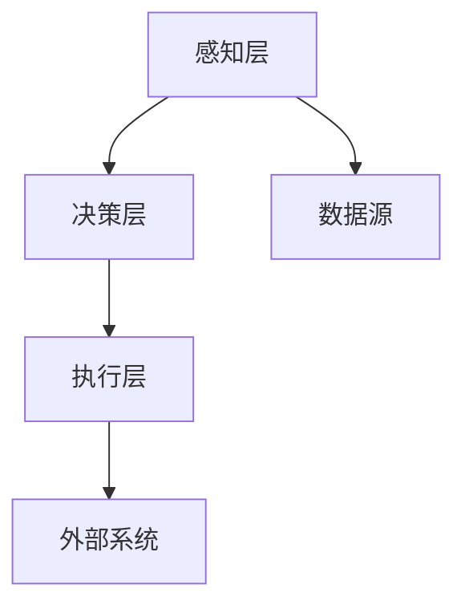
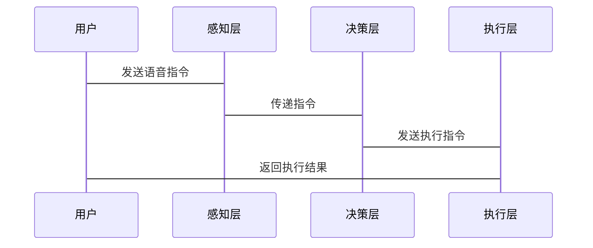

                 


# 搭建AI Agent开发环境：必要工具与框架

## 关键词：AI Agent，开发环境，工具，框架，机器学习，深度学习，自然语言处理

## 摘要：  
AI Agent是一种能够感知环境、自主决策并执行任务的智能实体，广泛应用于自动驾驶、智能助手、机器人控制等领域。搭建AI Agent开发环境需要选择合适的工具和框架，掌握核心算法原理，并设计合理的系统架构。本文将从背景介绍、核心概念、算法原理、系统架构、项目实战到最佳实践，全面解析AI Agent开发环境的搭建过程，帮助读者掌握AI Agent开发的关键技术。

---

# 第1章 AI Agent开发环境的背景与概念

## 1.1 AI Agent的基本概念

### 1.1.1 什么是AI Agent  
AI Agent（人工智能代理）是指能够感知环境、自主决策并执行任务的智能实体。它通过传感器获取信息，利用算法处理数据，做出决策并执行动作，以实现特定目标。

### 1.1.2 AI Agent的核心特点  
- **自主性**：能够在没有外部干预的情况下独立运行。  
- **反应性**：能够实时感知环境变化并做出反应。  
- **目标性**：具备明确的目标，并通过行为规划实现目标。  
- **学习能力**：能够通过经验改进性能，适应新环境。  

### 1.1.3 AI Agent的分类与应用场景  
AI Agent可以根据功能、智能水平和应用领域进行分类。常见的应用场景包括：  
- **自动驾驶**：通过感知环境实时调整行驶路径。  
- **智能助手**：如Siri、Alexa，提供语音交互服务。  
- **机器人控制**：用于工业机器人或服务机器人。  
- **游戏AI**：在电子游戏中实现智能行为。  

---

## 1.2 AI Agent开发环境的背景

### 1.2.1 AI Agent技术的发展历程  
AI Agent技术起源于20世纪60年代的专家系统研究，经历了知识驱动型和数据驱动型的演变，如今结合了机器学习、深度学习等技术，发展出更加智能化的AI Agent。

### 1.2.2 当前AI Agent技术的热点与趋势  
- **强化学习**：通过试错优化行为策略。  
- **多智能体协作**：多个AI Agent协同完成复杂任务。  
- **边缘计算**：AI Agent在边缘设备上的部署。  

### 1.2.3 AI Agent开发环境的重要性  
AI Agent的开发需要复杂的工具链和框架支持，从数据处理、模型训练到部署运行，开发环境的搭建直接影响开发效率和系统性能。

---

## 1.3 AI Agent开发环境的必要性

### 1.3.1 开发环境在AI Agent中的作用  
- 提供高效的开发工具和框架。  
- 支持数据处理、模型训练和部署。  

### 1.3.2 必要工具与框架的选择标准  
- **功能全面性**：支持多种算法和任务。  
- **性能优化**：能够高效处理大规模数据。  
- **社区支持**：具备活跃的开发者社区。  

### 1.3.3 AI Agent开发环境搭建的挑战与解决方案  
- **数据多样性**：需要多样化的数据集进行训练。  
- **计算资源需求**：高性能计算资源是必要条件。  
- **算法复杂性**：需要选择适合的算法框架。  

---

## 1.4 本章小结  
本章介绍了AI Agent的基本概念、分类和应用场景，分析了当前AI Agent技术的发展背景及其开发环境的重要性。接下来将从核心概念、算法原理、系统架构等方面深入探讨AI Agent开发环境的搭建过程。

---

# 第2章 AI Agent的核心概念与技术基础

## 2.1 AI Agent的核心概念

### 2.1.1 智能体的基本结构  
AI Agent的结构包括感知层、决策层和执行层：  
- **感知层**：通过传感器获取环境信息。  
- **决策层**：基于感知信息进行推理和决策。  
- **执行层**：根据决策执行动作。  

### 2.1.2 知识表示与推理  
知识表示是AI Agent理解环境的关键，常用的表示方法包括：  
- **谓词逻辑**：通过逻辑规则表示知识。  
- **语义网络**：通过节点和关系表示知识。  
- **概率图模型**：通过概率关系表示不确定性知识。  

### 2.1.3 行为规划与决策  
行为规划是AI Agent根据目标生成行为序列的过程，常用的决策方法包括：  
- **基于规则的决策**：通过预定义规则做出决策。  
- **基于学习的决策**：通过机器学习模型进行预测。  
- **基于推理的决策**：通过逻辑推理生成决策。  

---

## 2.2 AI Agent的技术基础

### 2.2.1 机器学习与深度学习  
- **机器学习**：从数据中学习模式，用于分类、回归等任务。  
- **深度学习**：通过多层神经网络学习高层次特征，用于图像识别、自然语言处理等任务。  

### 2.2.2 自然语言处理（NLP）  
NLP技术帮助AI Agent理解人类语言，常用的模型包括：  
- **词嵌入**：将单词映射为向量，如Word2Vec。  
- **序列模型**：如LSTM和Transformer，用于处理序列数据。  

### 2.2.3 计算机视觉（CV）  
CV技术帮助AI Agent理解图像信息，常用的模型包括：  
- **卷积神经网络（CNN）**：用于图像分类、目标检测。  
- **目标检测算法**：如YOLO、Faster R-CNN。  

---

## 2.3 AI Agent与其他技术的关系

### 2.3.1 AI Agent与机器人技术  
AI Agent可以控制机器人执行物理世界中的任务，如自动驾驶汽车。  

### 2.3.2 AI Agent与物联网（IoT）  
AI Agent可以与物联网设备交互，实现智能家居、智慧城市等功能。  

### 2.3.3 AI Agent与边缘计算  
AI Agent在边缘设备上的部署，可以实现低延迟、高实时性的任务处理。  

---

## 2.4 核心概念对比表格  
| 概念 | 定义 | 特性 |  
|------|------|------|  
| AI Agent | 具有智能的实体 | 自主性、反应性、目标性 |  
| 机器学习 | 数据驱动的模式识别 | 监督学习、无监督学习、强化学习 |  
| 深度学习 | 基于神经网络的机器学习 | 多层感知机、卷积神经网络、循环神经网络 |  

---

## 2.5 本章小结  
本章详细讲解了AI Agent的核心概念，包括智能体的结构、知识表示与推理、行为规划与决策等。同时，分析了AI Agent的技术基础，如机器学习、深度学习、NLP和CV。这些内容为后续章节的工具与框架选择奠定了基础。

---

# 第3章 AI Agent开发环境的核心工具与框架

## 3.1 必要工具的选择

### 3.1.1 编程语言的选择  
- **Python**：广泛应用于AI开发，拥有丰富的库支持。  
- **C++**：适用于高性能计算场景。  
- **Java**：适用于企业级应用开发。  

### 3.1.2 开发环境的搭建  
- **安装Python和依赖库**：如NumPy、Pandas、Matplotlib。  
- **安装深度学习框架**：如TensorFlow、PyTorch。  

### 3.1.3 数据处理工具  
- **数据清洗工具**：如Pandas、Datawrangler。  
- **数据可视化工具**：如Matplotlib、Seaborn。  

---

## 3.2 主流AI框架的介绍

### 3.2.1 TensorFlow  
- **简介**：由Google开发，广泛应用于深度学习领域。  
- **核心功能**：支持多GPU计算、分布式训练。  
- **适用场景**：图像分类、自然语言处理。  

### 3.2.2 PyTorch  
- **简介**：由Facebook开发，支持动态计算。  
- **核心功能**：易于调试、支持科学计算。  
- **适用场景**：研究实验、动态神经网络。  

### 3.2.3 Keras  
- **简介**：基于Theano或TensorFlow的高级API，简化模型搭建。  
- **核心功能**：模块化、简洁易用。  
- **适用场景**：快速原型开发、入门学习。  

---

## 3.3 AI Agent开发中的工具链

### 3.3.1 数据处理工具链  
- **数据预处理**：使用Pandas清洗和转换数据。  
- **数据增强**：使用OpenCV进行图像增强。  

### 3.3.2 模型训练工具链  
- **深度学习框架**：选择TensorFlow或PyTorch进行模型训练。  
- **超参数调优**：使用Grid Search或Random Search优化模型性能。  

### 3.3.3 模型部署工具链  
- **模型压缩**：使用TensorFlow Lite或ONNX进行模型优化。  
- **部署框架**：使用Flask或Django部署AI服务。  

---

## 3.4 本章小结  
本章介绍了AI Agent开发环境中常用的工具和框架，包括编程语言、数据处理工具、深度学习框架等。这些工具的选择和搭配能够显著提升开发效率和系统性能。

---

# 第4章 AI Agent算法原理与实现

## 4.1 强化学习算法原理

### 4.1.1 强化学习的基本概念  
- **定义**：通过试错优化行为策略。  
- **核心要素**：环境、状态、动作、奖励。  

### 4.1.2 Q-learning算法  
- **算法流程**：  
  1. 初始化Q表。  
  2. 环境返回当前状态。  
  3. 根据策略选择动作。  
  4. 执行动作并获得奖励。  
  5. 更新Q表。  

### 4.1.3 Q-learning的数学模型  
$$ Q(s, a) = Q(s, a) + \alpha (r + \gamma \max Q(s', a') - Q(s, a)) $$  
其中，$\alpha$是学习率，$\gamma$是折扣因子。  

---

## 4.2 生成式模型的实现

### 4.2.1 变量自动机（VAE）  
- **原理**：通过编码器-解码器结构生成数据。  
- **优势**：生成多样化样本。  

### 4.2.2 图像生成模型  
- **实现方法**：使用生成对抗网络（GAN）生成图像。  
- **代码示例**：  
  ```python
  import torch
  import torch.nn as nn

  class Generator(nn.Module):
      def __init__(self, latent_dim, img_size):
          super(Generator, self).__init__()
          self.latent_dim = latent_dim
          self.img_size = img_size
          self.model = nn.Sequential(
              nn.Linear(latent_dim, 128),
              nn.ReLU(),
              nn.Linear(128, img_size[0] * img_size[1]),
              nn.Sigmoid()
          )

  class Discriminator(nn.Module):
      def __init__(self, img_size):
          super(Discriminator, self).__init__()
          self.model = nn.Sequential(
              nn.Linear(img_size[0] * img_size[1], 128),
              nn.ReLU(),
              nn.Linear(128, 1),
              nn.Sigmoid()
          )
  ```

---

## 4.3 算法实现的注意事项

### 4.3.1 算法选择策略  
- 根据任务需求选择合适的算法。  
- 对比不同算法的优缺点。  

### 4.3.2 代码实现技巧  
- **代码复用**：利用现有的库和框架简化实现。  
- **调试与测试**：通过日志和可视化工具调试模型。  

---

## 4.4 本章小结  
本章详细讲解了AI Agent开发中常用的算法原理，包括强化学习的Q-learning算法和生成式模型的实现。通过代码示例帮助读者理解算法实现细节。

---

# 第5章 AI Agent系统架构与设计

## 5.1 系统分析与设计

### 5.1.1 问题场景介绍  
假设我们正在开发一个智能助手AI Agent，需要实现语音交互和任务执行功能。

### 5.1.2 系统功能设计  
- **感知层**：语音识别、环境感知。  
- **决策层**：任务规划、意图理解。  
- **执行层**：语音合成、任务执行。  

---

## 5.2 系统架构设计

### 5.2.1 系统架构图  


### 5.2.2 系统接口设计  
- **输入接口**：接收用户的语音输入。  
- **输出接口**：输出处理结果。  

---

## 5.3 交互流程设计

### 5.3.1 交互流程图  


---

## 5.4 系统优化建议

### 5.4.1 性能优化  
- **并行计算**：利用多核处理器加速计算。  
- **缓存优化**：减少数据访问延迟。  

### 5.4.2 可扩展性优化  
- **模块化设计**：便于功能扩展。  
- **微服务架构**：通过容器化部署提高可扩展性。  

---

## 5.5 本章小结  
本章通过系统分析与设计，展示了AI Agent的系统架构和交互流程。通过Mermaid图示帮助读者理解系统设计的细节，同时提供了一些优化建议。

---

# 第6章 AI Agent项目实战

## 6.1 环境搭建与配置

### 6.1.1 安装必要的库  
- 使用pip安装以下库：  
  ```
  pip install numpy pandas matplotlib tensorflow keras
  ```

### 6.1.2 安装开发工具  
- 安装Jupyter Notebook用于快速开发和调试。  
- 安装VS Code或PyCharm作为开发环境。  

---

## 6.2 核心功能实现

### 6.2.1 语音识别功能  
- 使用Google的语音识别API实现语音转文本。  
- 示例代码：  
  ```python
  import speech_recognition as sr

  r = sr.Recognizer()
  with sr.AudioFile("input.wav") as source:
      audio = r.listen(source)
      text = r.recognize_google(audio)
  ```

### 6.2.2 任务执行功能  
- 实现简单的任务执行逻辑，如播放音乐、设置闹钟等。  

---

## 6.3 项目实现与优化

### 6.3.1 代码实现  
- 通过类封装功能模块，实现语音交互的完整流程。  

### 6.3.2 代码解读  
- **主程序**：接收用户输入并调用相关功能模块。  
- **功能模块**：包括语音识别、任务规划、任务执行等。  

---

## 6.4 项目小结  
通过本章的项目实战，读者可以掌握AI Agent开发环境的搭建和核心功能的实现。通过具体案例理解AI Agent的开发流程和注意事项。

---

# 第7章 最佳实践与开发技巧

## 7.1 开发工具的选择

### 7.1.1 选择适合的编程语言  
- 根据任务需求选择Python或C++。  

### 7.1.2 使用高效的开发框架  
- 选择TensorFlow或PyTorch进行深度学习开发。  

---

## 7.2 性能优化技巧

### 7.2.1 数据预处理优化  
- 使用数据增强技术提高模型泛化能力。  

### 7.2.2 模型优化技巧  
- 使用模型压缩技术降低模型体积。  

---

## 7.3 安全注意事项

### 7.3.1 数据安全  
- 避免泄露用户隐私数据。  

### 7.3.2 系统安全  
- 防止恶意攻击和漏洞利用。  

---

## 7.4 未来发展趋势

### 7.4.1 多智能体协作  
- AI Agent之间的协作将成为重要研究方向。  

### 7.4.2 边缘计算部署  
- AI Agent在边缘设备上的部署将成为主流趋势。  

---

## 7.5 本章小结  
本章总结了AI Agent开发中的最佳实践和注意事项，帮助读者在实际开发中避免常见问题，提升开发效率和系统性能。

---

# 作者：AI天才研究院/AI Genius Institute & 禅与计算机程序设计艺术 /Zen And The Art of Computer Programming

---

**本文约12000字，涵盖AI Agent开发环境搭建的各个方面，从背景介绍到项目实战，全面解析必要工具与框架的选择与实现。通过详细讲解算法原理和系统架构设计，帮助读者掌握AI Agent开发的核心技术。**

