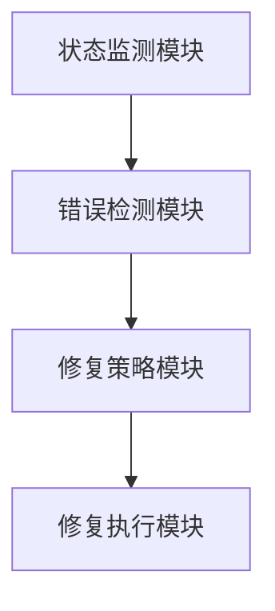
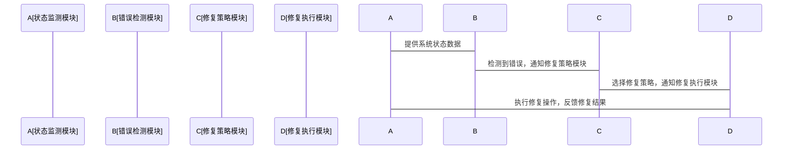

                 


# 构建具有自我修正能力的AI Agent

> **关键词**：AI Agent, 自我修正, 自我监测, 错误检测, 自动修复, 自监督学习, 强化学习

> **摘要**：  
本文将详细探讨构建具有自我修正能力的AI Agent的理论基础、算法实现和系统设计。通过分析自我修正机制的核心原理、算法实现的数学模型，以及系统架构的设计，本文将为读者提供一个全面的视角，帮助理解如何设计和实现能够自我修正的智能代理。从背景介绍到项目实战，本文将逐步引导读者掌握构建自我修正AI Agent的关键技术。

---

# 第一部分: 自我修正AI Agent的背景与核心概念

## 第1章: 自我修正AI Agent的背景与问题描述

### 1.1 人工智能与AI Agent的发展历程

#### 1.1.1 人工智能的定义与演进
人工智能（Artificial Intelligence, AI）是指计算机系统执行人类智能任务的能力，如视觉识别、语音识别、决策等。AI Agent（智能代理）是人工智能的核心实现形式，它能够感知环境、自主决策并执行任务。从专家系统到深度学习，AI Agent的形态不断演变，但其核心目标始终是模拟人类智能。

#### 1.1.2 AI Agent的基本概念与分类
AI Agent是一种能够感知环境并采取行动以实现目标的实体。根据智能水平，AI Agent可以分为：

1. **反应式AI Agent**：基于当前感知做出反应，适用于简单的环境。
2. **认知式AI Agent**：具备推理、规划和学习能力，适用于复杂环境。

#### 1.1.3 自我修正AI Agent的提出背景
传统AI Agent在复杂动态环境中容易受到环境变化或自身算法缺陷的影响，导致性能下降或任务失败。自我修正AI Agent通过引入自我监测和自适应机制，能够实时检测问题并进行修复，从而提高系统的可靠性和鲁棒性。

### 1.2 自我修正AI Agent的核心问题

#### 1.2.1 传统AI Agent的局限性
- **静态性**：传统AI Agent通常基于固定的规则或预训练模型，难以应对动态变化的环境。
- **缺乏自适应性**：在面对新的问题或环境变化时，传统AI Agent无法自我调整以适应新的需求。

#### 1.2.2 自我修正能力的必要性
- **提高系统的可靠性**：通过自我修正，AI Agent可以在出现问题时快速恢复，减少系统故障。
- **增强系统的适应性**：自我修正能力使AI Agent能够更好地应对复杂多变的环境。

#### 1.2.3 自我修正AI Agent的目标与挑战
- **目标**：通过自我监测、错误检测和自动修复，实现AI Agent的自主优化和持续改进。
- **挑战**：如何设计高效的自我监测机制，如何实现复杂环境下的错误检测与修复，以及如何平衡自我修正过程中的性能消耗。

### 1.3 自我修正AI Agent的应用场景

#### 1.3.1 自动化系统的自我修复
在工业自动化、智能家居等领域，AI Agent可以通过自我修正机制实时检测设备故障并进行修复。

#### 1.3.2 智能助手的自我优化
智能助手（如Siri、Alexa）通过自我修正机制优化用户体验，例如自动调整语音识别模型以提高准确率。

#### 1.3.3 分布式系统中的自我修正机制
在分布式系统中，AI Agent可以通过自我修正机制检测网络故障、数据错误并进行修复，确保系统的稳定运行。

### 1.4 本章小结
本章介绍了自我修正AI Agent的背景、核心问题及应用场景。接下来的章节将详细探讨自我修正机制的核心原理、算法实现和系统设计。

---

## 第2章: 自我修正AI Agent的核心概念与联系

### 2.1 自我修正机制的核心原理

#### 2.1.1 自我监测与状态评估
自我监测是自我修正机制的基础，AI Agent需要实时监测自身的状态，包括系统性能、环境变化等。状态评估通过定义一组指标（如准确率、响应时间）来量化AI Agent的当前状态。

#### 2.1.2 错误检测与定位
错误检测是通过对比预期状态与实际状态的差异，发现系统中存在的问题。定位错误需要结合上下文信息，确定错误的根源。

#### 2.1.3 自动修复与优化
自动修复是通过预定义的修复策略或自学习算法，对检测到的错误进行修复。优化则是在修复过程中不断调整策略，以提高系统的整体性能。

### 2.2 自我修正机制的实现步骤

#### 2.2.1 状态监测模块的设计
状态监测模块负责收集AI Agent的运行状态数据，包括性能指标和环境信息。以下是状态监测模块的实现步骤：

1. **数据采集**：通过传感器、API等方式采集系统状态数据。
2. **数据预处理**：对采集的数据进行清洗和标准化处理。
3. **状态评估**：基于预定义的评估指标，评估系统当前状态。

#### 2.2.2 错误检测算法的选择
错误检测算法需要能够从状态数据中发现异常。常用的错误检测算法包括：

- **统计方法**：基于均值、方差等统计量检测异常。
- **机器学习方法**：使用无监督学习算法（如Isolation Forest）检测异常。
- **时间序列分析**：使用ARIMA等模型检测时间序列中的异常。

#### 2.2.3 自动修复与优化策略
自动修复策略需要根据错误类型和严重程度选择合适的修复方法。优化策略可以通过强化学习等方法，动态调整修复策略以提高修复效率。

### 2.3 自我修正机制的数学模型

#### 2.3.1 状态评估函数
状态评估函数用于量化AI Agent的当前状态。例如，可以定义以下函数：

$$
f(state) = \begin{cases}
0 & \text{if } state \text{正常} \\
1 & \text{if } state \text{异常}
\end{cases}
$$

其中，$state$表示当前系统状态。

#### 2.3.2 错误检测的数学表达
错误检测可以通过概率模型或距离度量来实现。例如，使用马氏距离（Mahalanobis distance）检测数据点是否异常：

$$
D(x, \mu) = \sqrt{(x - \mu)^T \Sigma^{-1} (x - \mu)}
$$

其中，$x$是数据点，$\mu$是均值向量，$\Sigma$是协方差矩阵。

#### 2.3.3 修复策略的优化模型
修复策略可以通过强化学习模型进行优化。例如，使用Q-learning算法定义状态-动作价值函数：

$$
Q(s, a) = r + \gamma \max_{a'} Q(s', a')
$$

其中，$s$是当前状态，$a$是动作，$r$是奖励，$\gamma$是折扣因子。

---

## 第3章: 自我修正AI Agent的核心算法与实现

### 3.1 自我修正算法的原理

#### 3.1.1 自监督学习的原理
自监督学习通过利用未标记数据中的内在结构信息，学习有用的表示。例如，可以使用图像重建任务来学习图像的表示。

#### 3.1.2 强化学习在自我修正中的应用
强化学习通过定义奖励函数，引导AI Agent学习最优策略。例如，可以使用Q-learning算法来优化修复策略。

#### 3.1.3 迁移学习在自我修正中的作用
迁移学习通过将已知任务的知识迁移到新任务，提高新任务的学习效率。例如，可以将图像分类任务的知识迁移到图像分割任务。

### 3.2 自我修正算法的实现步骤

#### 3.2.1 算法输入与输出的定义
- **输入**：系统状态数据、预定义的评估指标。
- **输出**：修复策略或优化建议。

#### 3.2.2 算法训练与优化过程
- **训练数据准备**：收集正常和异常状态的数据。
- **模型训练**：使用监督学习或无监督学习算法训练错误检测模型。
- **模型优化**：通过验证集调整模型参数，提高检测准确率。

#### 3.2.3 算法的部署与测试
- **部署环境**：将算法集成到AI Agent中，实时监测系统状态。
- **测试与验证**：通过模拟不同场景，测试算法的检测和修复能力。

### 3.3 自我修正算法的数学模型

#### 3.3.1 自监督学习的损失函数
自监督学习通常使用重建损失作为目标函数。例如，对于图像重建任务，损失函数可以表示为：

$$
L = \frac{1}{N} \sum_{i=1}^{N} ||x_i - \hat{x_i}||
$$

其中，$x_i$是输入图像，$\hat{x_i}$是重建图像，$N$是样本数量。

#### 3.3.2 强化学习的奖励函数
强化学习中的奖励函数定义了AI Agent的奖励机制。例如，可以定义以下奖励函数：

$$
r(s, a) = \begin{cases}
+1 & \text{if } a \text{是正确的修复动作} \\
-1 & \text{if } a \text{是错误的修复动作}
\end{cases}
$$

其中，$s$是当前状态，$a$是动作。

#### 3.3.3 迁移学习的特征提取模型
迁移学习中的特征提取模型通常使用预训练模型（如ResNet）进行特征提取。例如，可以使用ResNet的中间层输出作为图像分割任务的特征输入。

---

## 第4章: 自我修正AI Agent的系统架构与设计

### 4.1 系统架构的总体设计

#### 4.1.1 分层架构的设计思路
系统架构采用分层设计，包括数据采集层、状态监测层、错误检测层和修复执行层。每一层负责不同的功能模块，确保系统模块化和可扩展性。

#### 4.1.2 模块化设计的原则
模块化设计通过将系统划分为独立的功能模块，提高系统的可维护性和可扩展性。例如，状态监测模块和错误检测模块可以独立开发和测试。

#### 4.1.3 可扩展性与可维护性的考虑
系统设计需要考虑未来可能的功能扩展和性能优化。例如，可以通过插件式设计，方便地添加新的修复策略。

### 4.2 核心模块的功能设计

#### 4.2.1 状态监测模块的功能实现
- **数据采集**：通过传感器、API等方式采集系统状态数据。
- **数据预处理**：对采集的数据进行清洗和标准化处理。
- **状态评估**：基于预定义的评估指标，评估系统当前状态。

#### 4.2.2 错误检测模块的功能实现
- **异常检测**：使用统计方法或机器学习算法检测系统异常。
- **错误定位**：通过上下文信息定位错误的根源。

#### 4.2.3 自动修复模块的功能实现
- **修复策略选择**：根据错误类型和严重程度选择修复方法。
- **修复执行**：执行修复操作并监控修复效果。

### 4.3 系统架构的Mermaid图



### 4.4 系统接口设计

- **状态监测接口**：提供系统状态数据的接口，供其他模块调用。
- **错误检测接口**：提供错误检测结果的接口，供修复策略模块调用。
- **修复执行接口**：提供修复操作的接口，供其他模块调用。

### 4.5 系统交互的Mermaid序列图



---

## 第5章: 自我修正AI Agent的项目实战

### 5.1 环境安装与配置

#### 5.1.1 系统要求
- 操作系统：Windows 10/ macOS 10.15/ Linux Ubuntu 20.04
- Python版本：Python 3.8+
- 依赖库：numpy、scikit-learn、tensorflow、keras

#### 5.1.2 安装依赖
使用以下命令安装所需的依赖库：

```bash
pip install numpy scikit-learn tensorflow keras
```

### 5.2 核心功能的实现

#### 5.2.1 状态监测模块的实现

```python
import numpy as np

def collect_state_data():
    # 模拟状态数据采集
    state_data = np.random.randn(10, 5)
    return state_data

def preprocess_data(data):
    # 数据预处理
    normalized_data = (data - np.mean(data, axis=0)) / np.std(data, axis=0)
    return normalized_data

# 示例用法
state_data = collect_state_data()
preprocessed_data = preprocess_data(state_data)
print(preprocessed_data)
```

#### 5.2.2 错误检测模块的实现

```python
from sklearn.ensemble import IsolationForest

def detect_errors(data, contamination=0.1):
    # 使用Isolation Forest检测异常
    model = IsolationForest(contamination=contamination)
    model.fit(data)
    errors = model.predict(data)
    return errors

# 示例用法
state_data = np.random.randn(100, 5)
errors = detect_errors(state_data)
print(errors)
```

#### 5.2.3 自动修复模块的实现

```python
def apply_fix(errors):
    # 模拟修复操作
    fixed_errors = []
    for error in errors:
        if error == -1:
            fixed_errors.append(1)
        else:
            fixed_errors.append(0)
    return fixed_errors

# 示例用法
errors = detect_errors(state_data)
fixed_errors = apply_fix(errors)
print(fixed_errors)
```

### 5.3 项目实战分析

#### 5.3.1 问题场景
假设我们正在开发一个工业自动化系统，AI Agent需要实时监测设备状态并进行自我修复。

#### 5.3.2 实际案例分析
通过上述代码实现的状态监测和错误检测模块，可以实时监测设备状态并检测异常。修复模块可以根据检测结果执行相应的修复操作，例如重启设备或调整参数。

### 5.4 项目小结
本章通过实际案例展示了如何实现自我修正AI Agent的核心功能。通过状态监测、错误检测和自动修复模块的实现，我们可以构建一个能够自我修正的智能系统。

---

## 第6章: 自我修正AI Agent的总结与展望

### 6.1 总结
本文详细探讨了构建具有自我修正能力的AI Agent的核心概念、算法实现和系统设计。通过状态监测、错误检测和自动修复模块的实现，我们展示了一种能够自我修正的智能系统的设计方法。

### 6.2 展望
未来的研究方向包括：

1. **更高效的自我监测机制**：研究更高效的异常检测算法，提高系统的检测准确率。
2. **更智能的修复策略**：结合强化学习和迁移学习，优化修复策略，提高修复效率。
3. **更广泛的应用场景**：将自我修正AI Agent应用于更多领域，如医疗、金融等，提升系统的可靠性和智能性。

---

# 作者

作者：AI天才研究院/AI Genius Institute  
禅与计算机程序设计艺术/Zen And The Art of Computer Programming

