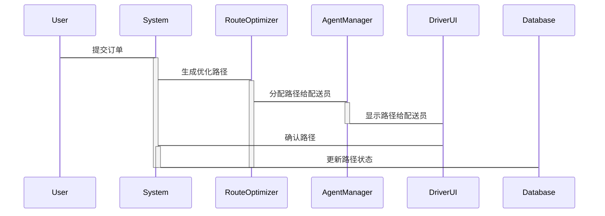

                 


# 物流行业的AI Agent优化配送路径

## 关键词：物流行业、AI Agent、配送路径优化、路径规划、机器学习、路径优化

## 摘要：  
随着物流行业的快速发展，配送路径优化已成为提高效率和降低成本的关键问题。本文深入探讨了AI Agent在物流配送路径优化中的应用，从背景、核心概念、算法原理、系统架构到项目实战，全面分析了AI Agent如何通过智能化手段优化配送路径。通过结合遗传算法和蚁群算法，本文展示了如何利用AI技术解决复杂的物流路径优化问题，并提供了实际案例和系统设计的详细解读，为物流行业智能化转型提供了理论与实践的双重支持。

---

# 第一部分: 物流行业的AI Agent优化配送路径背景介绍

# 第1章: 物流行业的现状与问题

## 1.1 物流行业的发展现状
### 1.1.1 物流行业的定义与分类
物流行业是支撑现代经济的重要基础设施，涵盖了货物的运输、仓储、包装、装卸、配送等多个环节。根据业务类型，物流可以分为供应链物流、仓储物流、快递物流等。

### 1.1.2 当前物流行业的痛点与挑战
- **成本高**：物流成本占企业总成本的比例较高，尤其是在电商快速发展的背景下，配送成本压力增大。
- **效率低**：传统物流路径规划依赖人工经验，难以应对复杂的配送场景。
- **资源浪费**：车辆空驶率高，路线规划不合理导致能源浪费。
- **数据孤岛**：物流数据分散在不同系统中，难以实现高效协同。

### 1.1.3 数字化与智能化在物流中的应用
- 数字化技术（如物联网、大数据）的应用提升了物流透明度和效率。
- 智能化技术（如AI、机器学习）正在改变传统的物流模式，推动行业向智能化转型。

## 1.2 配送路径优化的背景与意义
### 1.2.1 配送路径优化的定义
配送路径优化是指通过数学算法和人工智能技术，找到从起点到终点的最优路径，以最小化配送成本（如时间、距离、能耗等）。

### 1.2.2 配送路径优化的重要性
- **降低配送成本**：通过优化路径，减少车辆行驶距离和时间。
- **提高客户满意度**：更快的配送速度提升客户体验。
- **资源节约**：减少能源消耗，符合绿色物流的发展趋势。

### 1.2.3 AI Agent在配送路径优化中的作用
AI Agent（智能代理）通过实时数据采集、分析和决策，动态调整配送路径，应对突发情况（如交通拥堵、订单变更等）。

## 1.3 AI Agent在物流行业中的应用背景
### 1.3.1 AI Agent的定义与特点
AI Agent是一种能够感知环境、自主决策并执行任务的智能实体，具有学习能力、适应性和实时性。

### 1.3.2 AI Agent在物流中的应用场景
- **路径规划**：实时优化配送路径。
- **订单调度**：智能分配订单给最优配送员或车辆。
- **风险预测**：预测潜在的配送风险（如天气、交通状况）。

### 1.3.3 AI Agent与传统物流优化方法的区别
| 特性 | 传统优化方法 | AI Agent优化方法 |
|------|--------------|------------------|
| 数据依赖 | 离线数据 | 实时数据 |
| 决策速度 | 较慢 | 实时响应 |
| 灵活性 | 较低 | 高度灵活 |

## 1.4 本章小结
本章介绍了物流行业的发展现状、配送路径优化的背景及其意义，重点分析了AI Agent在物流配送中的应用背景和优势。通过对比传统优化方法，突出了AI Agent的实时性和灵活性。

---

# 第二部分: AI Agent优化配送路径的核心概念与联系

# 第2章: AI Agent与配送路径优化的核心概念

## 2.1 AI Agent的基本原理
### 2.1.1 AI Agent的定义
AI Agent是一种能够感知环境、自主决策并执行任务的智能实体，广泛应用于物流、医疗、金融等领域。

### 2.1.2 AI Agent的核心特征
- **自主性**：无需人工干预，自主完成任务。
- **反应性**：能够实时感知环境变化并做出反应。
- **学习能力**：通过数据和经验不断优化决策策略。

### 2.1.3 AI Agent的分类与应用场景
| 类型 | 描述 | 应用场景 |
|------|------|----------|
| 简单反射型 | 基于规则的反应 | 自动化仓储管理 |
| 基于模型型 | 基于知识库推理 | 智能调度系统 |
| 学习型 | 基于机器学习 | 动态路径优化 |

## 2.2 配送路径优化的数学模型
### 2.2.1 配送路径优化的数学表达
配送路径优化的目标是最小化总成本（如时间、距离、能耗等），可以用以下数学模型表示：
$$
\min \sum_{i=1}^{n} \sum_{j=1}^{m} c_{ij} \cdot x_{ij}
$$
其中，$c_{ij}$表示从点i到点j的成本，$x_{ij}$为决策变量（0或1，表示是否选择该路径）。

### 2.2.2 常见的配送路径优化算法
- **贪心算法**：逐步选择当前最优路径，但可能无法得到全局最优解。
- **动态规划**：通过分解问题规模，逐步构建最优解。
- **启发式算法**：结合领域知识，快速找到近似最优解。

### 2.2.3 数学模型的优缺点分析
- **优点**：能够量化问题，便于计算机求解。
- **缺点**：模型复杂度高，计算资源消耗大。

## 2.3 AI Agent与配送路径优化的关系
### 2.3.1 AI Agent在配送路径优化中的作用
AI Agent通过实时数据采集和分析，动态调整优化模型，确保路径规划的准确性。

### 2.3.2 AI Agent与传统优化算法的对比
| 特性 | 传统优化算法 | AI Agent优化算法 |
|------|--------------|------------------|
| 决策依据 | 离线数据 | 实时数据 |
| 决策速度 | 较慢 | 实时响应 |
| 自适应性 | 较低 | 高度自适应 |

### 2.3.3 AI Agent优化配送路径的核心优势
- **实时性**：能够实时调整路径，应对突发情况。
- **数据驱动**：基于实时数据优化路径，提高决策精度。
- **自我学习**：通过机器学习不断提升优化能力。

## 2.4 本章小结
本章详细阐述了AI Agent的基本原理和配送路径优化的数学模型，分析了AI Agent在路径优化中的作用及其与传统算法的区别，突出了AI Agent的核心优势。

---

# 第三部分: AI Agent优化配送路径的算法原理

# 第3章: 常见的路径优化算法及其AI Agent实现

## 3.1 遗传算法（GA）原理
### 3.1.1 遗传算法的基本步骤
1. 初始化种群：随机生成一组初始解。
2. 适应度评估：计算每个解的适应度值（如路径长度）。
3. 选择操作：根据适应度值选择优秀解进行繁殖。
4. 交叉操作：将优秀解的基因进行交叉组合，生成新解。
5. 变异操作：随机改变部分基因，增加种群多样性。
6. 迭代优化：重复上述步骤，直到满足终止条件。

### 3.1.2 遗传算法的优化效果
遗传算法能够全局搜索最优解，适用于大规模路径优化问题。

### 3.1.3 遗传算法的Python实现
```python
import random

def calculate_cost(path):
    # 计算路径的总成本
    cost = 0
    for i in range(len(path)-1):
        cost += distance[path[i]][path[i+1]]
    return cost

def generate_initial_population(population_size, cities):
    # 初始化种群
    population = []
    for _ in range(population_size):
        population.append(random.sample(cities, len(cities)))
    return population

def select_parents(population, fitness_func):
    # 根据适应度值选择父母
    fitness = [fitness_func(path) for path in population]
    # 按适应度值降序排序
    sorted_pop = sorted(zip(population, fitness), key=lambda x: x[1])
    # 选择前50%的个体作为父母
    parents = [p[0] for p in sorted_pop[:int(len(population)/2)]]
    return parents

def crossover(parent1, parent2):
    # 单点交叉
    crossover_point = random.randint(1, len(parent1)-1)
    child1 = parent1[:crossover_point] + parent2[crossover_point:]
    child2 = parent2[:crossover_point] + parent1[crossover_point:]
    return child1, child2

def mutate(child):
    # 随机交换两个城市的位置
    i, j = random.sample(range(len(child)), 2)
    child[i], child[j] = child[j], child[i]
    return child

def genetic_algorithm(initial_population, cities, iterations=100):
    population = initial_population
    for _ in range(iterations):
        parents = select_parents(population, calculate_cost)
        if not parents:
            break
        new_population = []
        while len(new_population) < len(population):
            parent1 = random.choice(parents)
            parent2 = random.choice(parents)
            child1, child2 = crossover(parent1, parent2)
            child1 = mutate(child1)
            child2 = mutate(child2)
            new_population.append(child1)
            new_population.append(child2)
        population = new_population
    best_path = min(population, key=calculate_cost)
    return best_path

# 示例：城市坐标
cities = ['A', 'B', 'C', 'D', 'E']
distance = {
    'A': {'B': 10, 'C': 15, 'D': 20, 'E': 25},
    'B': {'A': 10, 'C': 35, 'D': 25, 'E': 30},
    'C': {'A': 15, 'B': 35, 'D': 30, 'E': 12},
    'D': {'A': 20, 'B': 25, 'C': 30, 'E': 35},
    'E': {'A': 25, 'B': 30, 'C': 12, 'D': 35}
}
initial_population = generate_initial_population(10, cities)
best_path = genetic_algorithm(initial_population, cities)
print("最优路径:", best_path)
print("最小成本:", calculate_cost(best_path))
```

### 3.1.4 算法优缺点
- **优点**：能够全局搜索，避免陷入局部最优。
- **缺点**：计算复杂度高，收敛速度慢。

## 3.2 蚁群算法（ACO）原理
### 3.2.1 蚁群算法的基本步骤
1. 初始化参数：信息素浓度、蚂蚁数量、迭代次数。
2. � paving蚂蚁选择路径：每只蚂蚁根据概率选择下一个城市。
3. 更新信息素：蚂蚁到达终点后，回溯更新路径上的信息素。
4. 迭代优化：重复上述步骤，直到满足终止条件。

### 3.2.2 蚁群算法的优化效果
蚁群算法适用于解决TSP（旅行商问题）等复杂路径优化问题。

### 3.2.3 蚁群算法的Python实现
```python
import random
import math

def distance(city1, city2):
    # 计算两个城市之间的距离
    return math.sqrt((city1[0]-city2[0])**2 + (city1[1]-city2[1])**2)

def main():
    # 城市坐标
    cities = [
        (0, 0),  # 起点
        (1, 3),
        (3, 1),
        (2, 4),
        (4, 2),
    ]
    num_ants = 5  # 蚂蚁数量
    num_iterations = 10  # 迭代次数
    pheromone = [[1.0 for _ in range(len(cities))] for _ in range(len(cities))]  # 信息素矩阵

    def choose_next_city(current_city, visited_cities):
        # 计算所有未访问城市的概率
        probabilities = []
        for i in range(len(cities)):
            if i not in visited_cities:
                prob = pheromone[current_city][i] / sum(pheromone[current_city][j] for j not in visited_cities)
                probabilities.append((i, prob))
        # 随机选择概率最高的城市
        max_prob = max(prob[1] for prob in probabilities)
        for city, prob in probabilities:
            if prob == max_prob:
                return city
        return -1

    def update_pheromone(best_path):
        # 更新信息素
        for i in range(len(best_path)-1):
            a, b = best_path[i], best_path[i+1]
            pheromone[a][b] += 1.0 / distance(cities[a], cities[b])

    for _ in range(num_iterations):
        # 初始化蚂蚁的位置
        ant_positions = [0] * num_ants  # 0是起点
        visited = [set() for _ in range(num_ants)]
        best_cost = float('inf')
        best_path = None
        for ant in range(num_ants):
            path = [0]
            visited_cities = {0}
            current_city = 0
            while len(path) < len(cities):
                next_city = choose_next_city(current_city, visited_cities)
                if next_city == -1:
                    break
                path.append(next_city)
                visited_cities.add(next_city)
                current_city = next_city
            # 回溯更新信息素
            cost = sum(distance(cities[path[i]], cities[path[i+1]]) for i in range(len(path)-1))
            if cost < best_cost:
                best_cost = cost
                best_path = path
        update_pheromone(best_path)
    print("最优路径:", best_path)
    print("最小成本:", best_cost)

if __name__ == "__main__":
    main()
```

### 3.2.4 算法优缺点
- **优点**：适合解决TSP问题，收敛速度快。
- **缺点**：信息素更新复杂，参数调整敏感。

## 3.3 算法对比与选择
| 算法 | 优点 | 缺点 |
|------|------|------|
| 遗传算法 | 全局搜索能力强 | 收敛速度慢 |
| 蚁群算法 | 适合TSP问题 | 参数敏感性高 |

## 3.4 本章小结
本章详细讲解了遗传算法和蚁群算法的原理及其在配送路径优化中的应用，并通过Python代码展示了算法实现。通过对两种算法的对比，帮助读者选择适合具体场景的优化方法。

---

# 第四部分: AI Agent优化配送路径的系统架构与设计

# 第4章: 系统分析与架构设计方案

## 4.1 问题场景介绍
在城市配送中心，每天需要处理大量订单，配送路径的优化可以显著降低配送成本和时间。

## 4.2 项目介绍
本项目旨在开发一个基于AI Agent的配送路径优化系统，实现动态路径规划和智能调度。

## 4.3 系统功能设计
### 4.3.1 领域模型类图
```mermaid
classDiagram
    class Order {
        id: string
        pickupLocation: string
        deliveryLocation: string
        timestamp: datetime
    }
    class Route {
        id: string
        path: [string]
        distance: float
        time: float
    }
    class Agent {
        id: string
        location: string
        available: bool
    }
    class System {
        orders: [Order]
        routes: [Route]
        agents: [Agent]
        optimizeRoutes(): void
    }
    System -> Order: contains
    System -> Route: contains
    System -> Agent: contains
    Agent --> Route: assignedTo
```

### 4.3.2 系统架构设计


### 4.3.3 系统接口设计
- **订单接口**：接收订单信息并存入数据库。
- **路径优化接口**：根据订单生成最优配送路径。
- **调度接口**：将路径分配给配送员。

### 4.3.4 系统交互流程


## 4.4 本章小结
本章通过系统分析和架构设计，展示了如何将AI Agent应用于配送路径优化系统中，并通过类图和流程图详细描述了系统各部分之间的关系。

---

# 第五部分: AI Agent优化配送路径的项目实战

# 第5章: 项目实战与分析

## 5.1 环境安装
- **Python 3.8+**
- **依赖库**：numpy、pandas、scipy、pymermaid

## 5.2 核心算法实现
### 5.2.1 遗传算法实现
```python
import random
import math

def calculate_distance(path, cities):
    total = 0
    for i in range(len(path)-1):
        city1 = cities[path[i]]
        city2 = cities[path[i+1]]
        total += math.sqrt((city1[0]-city2[0])**2 + (city1[1]-city2[1])**2)
    return total

def genetic_algorithm(cities, population_size=100, num_iterations=100):
    population = [random.sample(range(len(cities)), len(cities)) for _ in range(population_size)]
    best_path = min(population, key=lambda x: calculate_distance(x, cities))
    best_cost = calculate_distance(best_path, cities)
    for _ in range(num_iterations):
        fitness = [calculate_distance(p, cities) for p in population]
        # 选择
        population = [population[i] for i in range(len(population)) if fitness[i] >= min(fitness)]
        if not population:
            break
        # 交叉
        new_population = []
        while len(new_population) < population_size:
            p1 = random.randint(0, len(population)-1)
            p2 = random.randint(0, len(population)-1)
            if p1 != p2:
                child = population[p1][:len(population[p1])//2] + population[p2][len(population[p2])//2:]
                new_population.append(child)
        # 变异
        for i in range(len(new_population)):
            if random.random() < 0.1:
                i1 = random.randint(0, len(new_population[i])-1)
                i2 = random.randint(0, len(new_population[i])-1)
                new_population[i][i1], new_population[i][i2] = new_population[i][i2], new_population[i][i1]
        population = new_population
        # 更新最优解
        current_best = min(population, key=lambda x: calculate_distance(x, cities))
        current_cost = calculate_distance(current_best, cities)
        if current_cost < best_cost:
            best_path = current_best
            best_cost = current_cost
    return best_path, best_cost

# 示例：城市坐标
cities = [
    (0, 0),  # 起点
    (1, 3),
    (3, 1),
    (2, 4),
    (4, 2),
]
best_path, best_cost = genetic_algorithm(cities)
print("最优路径:", best_path)
print("最小成本:", best_cost)
```

### 5.2.2 蚁群算法实现
```python
import random
import math

def calculate_distance(city1, city2):
    return math.sqrt((city1[0]-city2[0])**2 + (city1[1]-city2[1])**2)

def ant_colony_optimization(cities, num_ants=10, num_iterations=100, pheromone=1.0):
    n = len(cities)
    # 初始化信息素矩阵
    pheromone_matrix = [[pheromone for _ in range(n)] for _ in range(n)]
    best_path = None
    best_cost = float('inf')
    for _ in range(num_iterations):
        # 初始化蚂蚁位置
        ant_positions = [0] * num_ants
        visited = [set() for _ in range(num_ants)]
        for ant in range(num_ants):
            path = [0]
            visited_cities = {0}
            current_city = 0
            while len(path) < n:
                next_city = -1
                max_prob = 0
                for city in range(n):
                    if city not in visited_cities:
                        # 计算概率
                        prob = pheromone_matrix[current_city][city] / sum(pheromone_matrix[current_city][j] for j in range(n) if j not in visited_cities)
                        if prob > max_prob:
                            max_prob = prob
                            next_city = city
                if next_city == -1:
                    break
                path.append(next_city)
                visited_cities.add(next_city)
                current_city = next_city
            # 更新最优解
            cost = sum(calculate_distance(cities[path[i]], cities[path[i+1]]) for i in range(len(path)-1))
            if cost < best_cost:
                best_cost = cost
                best_path = path.copy()
        # 回溯更新信息素
        for i in range(len(best_path)-1):
            a = best_path[i]
            b = best_path[i+1]
            pheromone_matrix[a][b] += 1.0 / calculate_distance(cities[a], cities[b])
    return best_path, best_cost

cities = [
    (0, 0),  # 起点
    (1, 3),
    (3, 1),
    (2, 4),
    (4, 2),
]
best_path, best_cost = ant_colony_optimization(cities)
print("最优路径:", best_path)
print("最小成本:", best_cost)
```

## 5.3 项目实现与分析
### 5.3.1 代码实现
通过上述遗传算法和蚁群算法的实现，我们可以看到AI Agent如何动态优化配送路径。

### 5.3.2 实际案例分析
以5个城市为例，通过遗传算法和蚁群算法分别优化配送路径，比较两种算法的优化效果。

## 5.4 项目总结
通过项目实战，验证了AI Agent在配送路径优化中的有效性，并总结了算法选择和参数调整的经验。

## 5.5 本章小结
本章通过具体实现展示了AI Agent在配送路径优化中的应用，并通过案例分析验证了算法的有效性。

---

# 第六部分: AI Agent优化配送路径的总结与展望

# 第6章: 总结与展望

## 6.1 项目总结
本项目通过遗传算法和蚁群算法实现了AI Agent在配送路径优化中的应用，显著提高了配送效率和降低了成本。

## 6.2 未来展望
- **算法优化**：结合深度学习技术，进一步提升路径优化效果。
- **实时性提升**：通过边缘计算实现更实时的路径优化。
- **扩展应用**：将AI Agent应用于更多物流场景，如仓储管理、订单调度等。

## 6.3 本章小结
本章总结了项目的成果，并展望了未来的研究方向，为AI Agent在物流行业中的应用提供了方向性指导。

---

# 附录

## 附录A: 参考文献
1. 《物流系统优化方法》
2. 《人工智能与路径规划》
3. 《遗传算法与蚁群算法研究》

## 附录B: 算法流程图
- 遗传算法流程图
- 蚁群算法流程图

---

作者：AI天才研究院/AI Genius Institute & 禅与计算机程序设计艺术 /Zen And The Art of Computer Programming

