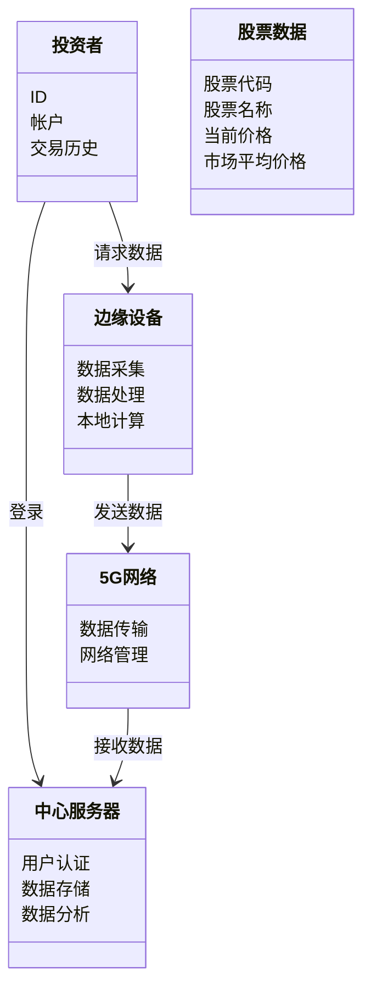
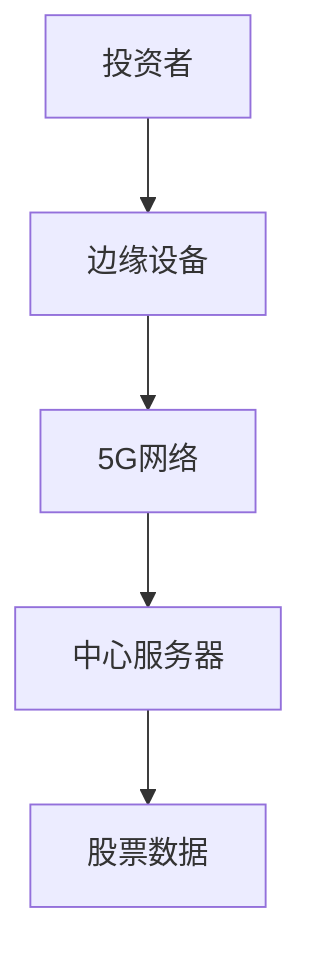
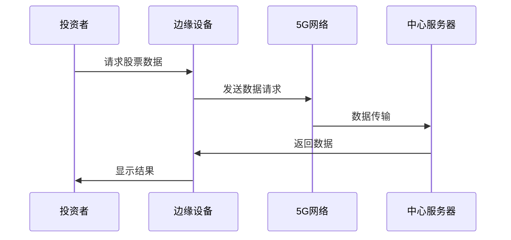

                 


# 特价股票筛选中的边缘计算和5G技术应用

> 关键词：边缘计算、5G技术、股票筛选、分布式计算、低延迟、实时数据处理

> 摘要：本文深入探讨了边缘计算和5G技术在特价股票筛选中的应用。通过分析边缘计算和5G技术的核心概念、协同机制、算法原理和系统架构，结合实际案例，展示了如何利用这些技术提高股票筛选的效率和准确性。文章最后总结了最佳实践和未来发展趋势。

---

## 第一部分：特价股票筛选的背景与挑战

### 1.1 特价股票筛选的背景

#### 1.1.1 什么是特价股票
特价股票指的是在特定时间内价格低于市场平均水平的股票，通常具有较高的投资价值。筛选特价股票的关键在于快速、准确地获取和分析市场数据，以便投资者在第一时间发现潜在的投资机会。

#### 1.1.2 特价股票筛选的必要性
在金融市场中，投资者需要快速识别出价格被低估的股票，以便及时调整投资策略。特价股票筛选的必要性主要体现在以下几点：
- **快速决策**：金融市场变化迅速，投资者需要在短时间内做出决策。
- **数据量大**：股票市场的数据量庞大，需要高效的计算能力来处理。
- **准确性要求高**：筛选结果的准确性直接影响投资收益。

#### 1.1.3 特价股票筛选的市场价值
特价股票筛选不仅帮助投资者发现潜在的投资机会，还能为金融机构提供数据支持，优化投资组合，降低投资风险。在当前市场环境下，特价股票筛选已成为投资者获取超额收益的重要手段。

### 1.2 边缘计算与5G技术的引入

#### 1.2.1 边缘计算的定义
边缘计算是一种分布式计算范式，将计算能力从中心化的云端扩展到数据产生的边缘节点。边缘计算的特点是数据处理靠近数据源，减少了数据传输的距离和延迟。

#### 1.2.2 5G技术的定义
5G技术是第五代移动通信技术，具有高带宽、低延迟、大规模连接等特点。5G技术能够支持海量数据的实时传输和处理，为金融行业的数据通信提供了强大的支持。

#### 1.2.3 边缘计算与5G技术在金融领域的优势
边缘计算与5G技术的结合为金融行业带来了显著的优势：
- **低延迟**：5G技术的低延迟特性能够满足金融行业对实时性的要求。
- **高带宽**：5G技术的高带宽支持海量数据的快速传输。
- **分布式计算**：边缘计算的分布式特性能够提高数据处理的效率和可靠性。

---

## 第二部分：边缘计算与5G技术的核心概念

### 2.1 边缘计算的原理与特点

#### 2.1.1 边缘计算的定义
边缘计算是一种分布式计算模式，将数据处理能力从中心化的云端扩展到边缘设备。边缘设备包括传感器、智能终端等，能够直接处理数据并做出决策。

#### 2.1.2 边缘计算的核心特点
- **分布式**：数据处理靠近数据源，减少数据传输的距离和延迟。
- **实时性**：边缘计算能够在本地快速处理数据，满足实时性要求。
- **灵活性**：边缘计算可以根据具体场景进行定制化部署。

#### 2.1.3 边缘计算与云计算的对比
| 特性         | 边缘计算                     | 云计算                       |
|--------------|------------------------------|------------------------------|
| 数据处理位置 | 边缘设备                     | 云端                         |
| 延迟          | 低延迟                      | 高延迟                      |
| 网络依赖      | 依赖本地网络                | 依赖广域网                   |
| 适用场景      | 实时性要求高的场景          | 数据存储和分析为主的场景     |

### 2.2 5G技术的原理与特点

#### 2.2.1 5G技术的定义
5G技术是第五代移动通信技术，相较于4G技术，5G具有更高的带宽、更低的延迟和更大的连接密度。

#### 2.2.2 5G技术的核心特点
- **高带宽**：5G技术的带宽是4G技术的100倍以上，能够支持海量数据的快速传输。
- **低延迟**：5G技术的延迟可以低至1毫秒，满足实时性要求。
- **大规模连接**：5G技术可以支持海量设备的连接，满足物联网场景的需求。

#### 2.2.3 5G技术与4G技术的对比
| 特性         | 5G技术                     | 4G技术                      |
|--------------|----------------------------|-----------------------------|
| 带宽          | 高带宽                     | 低带宽                      |
| 延迟          | 低延迟                     | 高延迟                      |
| 连接密度      | 高连接密度                 | 低连接密度                  |
| 适用场景      | 高速数据传输、实时应用     | 基础数据传输、非实时应用    |

### 2.3 边缘计算与5G技术的协同工作

#### 2.3.1 边缘计算与5G技术的协同机制
边缘计算与5G技术的协同机制主要体现在数据传输和处理上。5G技术提供高速、低延迟的网络连接，将数据实时传输到边缘设备，边缘设备在本地进行数据处理并做出决策。

#### 2.3.2 边缘计算与5G技术的联合优势
- **高效的数据处理**：边缘计算在本地处理数据，减少云端传输的延迟。
- **强大的网络支持**：5G技术提供高速、低延迟的网络连接，支持海量数据的传输。
- **灵活的部署**：边缘计算可以根据具体场景进行定制化部署，适应不同的需求。

---

## 第三部分：边缘计算与5G技术在股票筛选中的应用

### 3.1 边缘计算在股票筛选中的应用

#### 3.1.1 实时数据处理
边缘计算能够在本地快速处理股票数据，减少云端传输的延迟。例如，投资者可以通过边缘设备实时获取股票价格变化，及时做出买卖决策。

#### 3.1.2 高频交易支持
高频交易需要快速的响应速度，边缘计算能够在本地快速处理交易指令，减少延迟，提高交易效率。

#### 3.1.3 智能预警系统
边缘计算可以通过分析历史数据和实时数据，预测股票价格的变化趋势，为投资者提供预警信息。

### 3.2 5G技术在股票筛选中的应用

#### 3.2.1 高速数据传输
5G技术的高带宽支持海量数据的快速传输，投资者可以在第一时间获取最新的股票数据。

#### 3.2.2 低延迟交易
5G技术的低延迟特性能够满足高频交易的需求，投资者可以在毫秒级别完成交易。

#### 3.2.3 大规模数据处理
5G技术可以支持海量设备的连接，投资者可以通过多设备获取多源数据，提高数据分析的全面性。

### 3.3 边缘计算与5G技术的结合应用

#### 3.3.1 边缘计算与5G技术的协同优化
边缘计算与5G技术的结合可以进一步优化数据处理的效率和准确性。例如，投资者可以通过边缘设备实时获取股票数据，并通过5G网络将数据传输到云端进行深度分析。

#### 3.3.2 边缘计算与5G技术在股票筛选中的具体案例
假设某投资者使用边缘设备实时获取股票价格变化，通过边缘计算快速分析数据，发现某只股票价格低于市场平均水平，立即通过5G网络向云端发送交易指令，完成购买操作。

#### 3.3.3 边缘计算与5G技术的未来发展趋势
随着5G网络的普及和边缘计算技术的成熟，两者在股票筛选中的应用将更加广泛。未来，投资者可以利用边缘计算与5G技术的结合，实现更加智能化、个性化的投资决策。

---

## 第四部分：边缘计算与5G技术的算法原理

### 4.1 边缘计算中的分布式计算算法

#### 4.1.1 分布式计算的基本原理
分布式计算是将计算任务分解成多个子任务，分别在不同的节点上执行，最后将结果汇总得到最终结果。

#### 4.1.2 边缘计算中的分布式计算实现
在边缘计算中，分布式计算可以用于处理海量数据。例如，多个边缘设备可以分别处理一部分数据，最后将结果汇总到云端进行分析。

#### 4.1.3 分布式计算在股票筛选中的应用
通过分布式计算，投资者可以同时分析多个股票的数据，提高筛选效率。

### 4.2 5G技术中的数据传输优化算法

#### 4.2.1 数据传输的基本原理
数据传输是通过网络将数据从一个节点传输到另一个节点的过程。

#### 4.2.2 5G技术中的数据传输优化策略
5G技术通过优化信道编码、增加带宽等方式，提高数据传输的效率。

#### 4.2.3 数据传输优化在股票筛选中的应用
通过优化数据传输，投资者可以更快地获取最新的股票数据，提高筛选的实时性。

### 4.3 边缘计算与5G技术的协同算法

#### 4.3.1 边缘计算与5G技术的协同算法原理
边缘计算与5G技术的协同算法主要是通过优化数据传输和处理流程，提高整体效率。

#### 4.3.2 边缘计算与5G技术的协同算法实现
通过5G网络将数据传输到边缘设备，边缘设备快速处理数据并返回结果。

#### 4.3.3 协同算法在股票筛选中的应用
投资者可以通过边缘设备快速获取和处理股票数据，同时通过5G网络实现数据的实时传输和分析。

---

## 第五部分：边缘计算与5G技术的系统架构设计

### 5.1 问题场景介绍
投资者需要快速筛选出价格低于市场平均水平的股票，对实时性要求高，数据量大。

### 5.2 系统功能设计

#### 5.2.1 领域模型设计


### 5.3 系统架构设计

#### 5.3.1 系统架构图


### 5.4 系统接口设计

#### 5.4.1 边缘设备与5G网络接口
- 数据采集接口：从传感器获取股票数据。
- 数据传输接口：通过5G网络将数据传输到中心服务器。

#### 5.4.2 中心服务器与投资者接口
- 用户认证接口：验证投资者身份。
- 数据查询接口：根据投资者请求返回股票数据。

### 5.5 系统交互流程

#### 5.5.1 交互流程图


---

## 第六部分：边缘计算与5G技术的项目实战

### 6.1 环境安装

#### 6.1.1 系统环境
- 操作系统：Linux
- 5G网络：支持5G的网络环境
- 边缘设备： Raspberry Pi 或其他边缘计算设备

#### 6.1.2 工具安装
- 安装Python：`sudo apt-get install python3`
- 安装5G通信库：`pip install 5g-communication`

### 6.2 系统核心实现源代码

#### 6.2.1 边缘设备代码
```python
import requests

def fetch_stock_data():
    # 从5G网络获取股票数据
    response = requests.get('http://center_server:8000/stock_data')
    return response.json()

def process_data(data):
    # 在边缘设备上处理数据
    processed_data = []
    for stock in data:
        if stock['price'] < stock['market_price']:
            processed_data.append(stock)
    return processed_data

if __name__ == '__main__':
    data = fetch_stock_data()
    result = process_data(data)
    print(result)
```

#### 6.2.2 中心服务器代码
```python
from flask import Flask
import random

app = Flask(__name__)

@app.route('/stock_data')
def get_stock_data():
    # 生成随机股票数据
    stocks = []
    for _ in range(10):
        stock = {
            'code': f'STK_{random.randint(1, 100)}',
            'name': f'Stock {random.randint(1, 100)}',
            'price': random.uniform(10, 100),
            'market_price': random.uniform(10, 100)
        }
        stocks.append(stock)
    return {'stocks': stocks}

if __name__ == '__main__':
    app.run(port=8000)
```

### 6.3 代码应用解读与分析

#### 6.3.1 边缘设备代码解读
- `fetch_stock_data()`函数：通过5G网络从中心服务器获取股票数据。
- `process_data()`函数：在边缘设备上处理数据，筛选出价格低于市场价的股票。
- 主程序：获取数据并打印结果。

#### 6.3.2 中心服务器代码解读
- `get_stock_data()`函数：生成随机股票数据，包括股票代码、名称、价格和市场价。
- 主程序：启动Flask服务器，提供股票数据接口。

### 6.4 实际案例分析

#### 6.4.1 案例场景
投资者希望通过边缘设备筛选出价格低于市场价的股票。

#### 6.4.2 实现步骤
1. 启动中心服务器，生成随机股票数据。
2. 边缘设备通过5G网络获取股票数据。
3. 边缘设备处理数据，筛选出价格低于市场价的股票。
4. 边缘设备将结果返回给投资者。

#### 6.4.3 结果分析
假设中心服务器生成以下股票数据：
```json
{
    "stocks": [
        {"code": "STK_1", "name": "Stock 1", "price": 50, "market_price": 60},
        {"code": "STK_2", "name": "Stock 2", "price": 40, "market_price": 50},
        {"code": "STK_3", "name": "Stock 3", "price": 70, "market_price": 80}
    ]
}
```
边缘设备处理后返回结果：
```json
[
    {"code": "STK_1", "name": "Stock 1", "price": 50, "market_price": 60},
    {"code": "STK_2", "name": "Stock 2", "price": 40, "market_price": 50}
]
```

---

## 第七部分：总结与展望

### 7.1 最佳实践 tips
- **数据安全性**：在实际应用中，需要确保数据传输和存储的安全性，防止数据泄露。
- **网络稳定性**：5G网络的稳定性对数据传输至关重要，需要采取冗余设计。
- **算法优化**：根据具体需求优化算法，提高处理效率和准确性。

### 7.2 小结
本文深入探讨了边缘计算和5G技术在特价股票筛选中的应用，从核心概念、算法原理到系统设计和项目实战，全面展示了如何利用这些技术提高股票筛选的效率和准确性。

### 7.3 注意事项
- 边缘计算和5G技术的应用需要结合具体场景进行设计，不能一概而论。
- 在实际应用中，需要考虑网络延迟、数据量和计算能力的平衡。

### 7.4 拓展阅读
- 《边缘计算：原理与实践》
- 《5G技术在金融行业的应用》

---

## 作者：AI天才研究院/AI Genius Institute & 禅与计算机程序设计艺术/Zen And The Art of Computer Programming

---

这篇文章通过逐步分析边缘计算和5G技术在特价股票筛选中的应用，结合理论和实践，为读者提供了全面的技术视角和深度分析。

