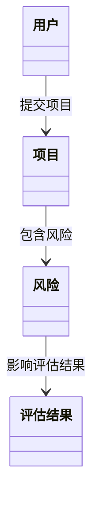
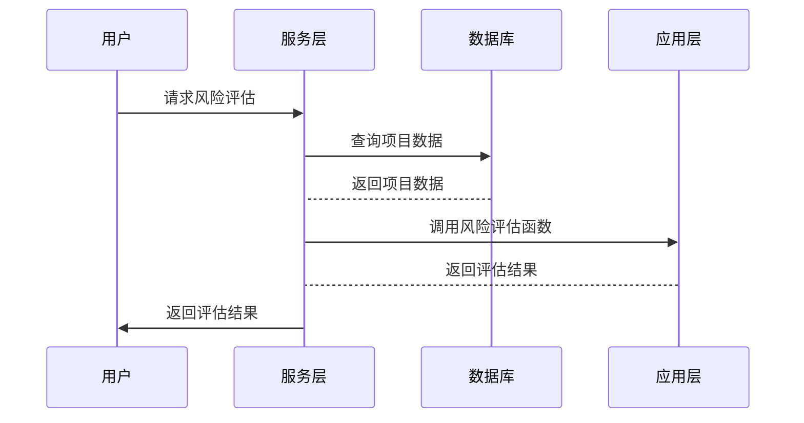

                 


# 金融科技创新项目风险评估框架

> 关键词：金融科技创新、风险评估、系统架构、风险模型、算法原理

> 摘要：本文系统地探讨了金融科技创新项目风险评估的框架与方法。首先，我们从金融科技创新的基本概念出发，分析了风险评估的重要性和必要性。接着，我们详细介绍了风险评估的基本原理和框架，包括风险类型、评估维度、指标体系和模型方法。随后，我们深入分析了金融科技创新项目风险评估的核心概念与联系，通过对比表格和ER实体关系图，清晰地展示了各核心要素之间的关系。之后，我们详细阐述了风险评估的算法原理，包括数学模型、公式推导和Python代码实现，并通过案例分析进行了详细说明。在系统设计部分，我们从问题场景、系统功能设计、架构设计、接口设计和交互设计等多方面进行了详细分析，展示了系统的整体架构和模块交互关系。最后，我们在项目实战部分，通过具体案例，展示了风险评估框架在实际项目中的应用，并总结了最佳实践、注意事项和扩展阅读方向。

---

# 第1章: 金融科技创新项目风险评估的背景与意义

## 1.1 金融科技创新的概述

### 1.1.1 金融科技创新的定义与特点
- 金融科技创新是指利用新技术（如人工智能、大数据、区块链等）对金融服务和产品进行创新和优化。
- 其特点包括：高效性、数据驱动、智能化、去中心化和用户体验优化。

### 1.1.2 金融科技创新的核心领域
- 支付与清算：如区块链技术的应用。
- 信贷与风控：如大数据风控模型。
- 投资与理财：如智能投顾系统。
- 保险与理赔：如基于AI的保险理赔自动化。

### 1.1.3 金融科技创新的驱动因素
- 技术进步：AI、大数据、云计算等技术的发展。
- 市场需求：用户对高效、便捷金融服务的需求。
- 政策支持：监管机构对金融创新的鼓励与规范。

## 1.2 风险评估的重要性和必要性

### 1.2.1 风险评估的基本概念
- 风险评估是识别、分析和量化潜在风险的过程。
- 目标是通过评估风险，制定有效的风险管理策略。

### 1.2.2 金融科技创新项目中的风险类型
- 技术风险：系统故障、数据泄露等。
- 市场风险：市场波动、用户接受度等。
- 操作风险：操作失误、流程不畅等。
- 合规风险：监管政策变化、法律风险等。

### 1.2.3 风险评估在金融科技创新中的作用
- 保障项目稳健实施。
- 提高金融机构的抗风险能力。
- 为决策者提供科学依据。

## 1.3 本章小结
本章介绍了金融科技创新的基本概念、核心领域和驱动因素，并分析了风险评估在金融科技创新中的重要性，为后续章节的深入分析奠定了基础。

---

# 第2章: 金融科技创新项目风险评估的基本框架

## 2.1 风险评估的基本原理

### 2.1.1 风险评估的定义
- 风险评估是通过分析潜在风险，制定应对策略的过程。
- 包括风险识别、风险分析和风险量化三个主要步骤。

### 2.1.2 风险评估的步骤与流程
1. 风险识别：识别潜在风险因素。
2. 风险分析：分析风险的影响和发生概率。
3. 风险量化：量化风险的影响程度。
4. 风险应对：制定应对策略。

### 2.1.3 风险评估的关键要素
- 风险来源：技术、市场、操作、合规等。
- 风险影响：损失程度、影响范围。
- 风险概率：风险发生的可能性。

## 2.2 金融科技创新项目风险评估的框架

### 2.2.1 风险评估的维度
- 技术维度：系统稳定性、数据安全性。
- 市场维度：用户需求、市场竞争。
- 操作维度：流程效率、人员能力。
- 合规维度：监管政策、法律要求。

### 2.2.2 风险评估的指标体系
- 技术指标：系统 uptime、响应时间。
- 市场指标：用户满意度、市场份额。
- 操作指标：操作失误率、效率提升幅度。
- 合规指标：合规通过率、监管罚款率。

### 2.2.3 风险评估的模型与方法
- 定性分析：基于经验和主观判断。
- 定量分析：基于数据和数学模型。
- 综合分析：结合定性和定量方法。

## 2.3 本章小结
本章从风险评估的基本原理出发，提出了金融科技创新项目风险评估的框架，包括维度、指标体系和模型方法，为后续章节的深入分析提供了理论基础。

---

# 第3章: 金融科技创新项目风险评估的核心概念与联系

## 3.1 核心概念原理

### 3.1.1 金融科技创新的核心要素
- 技术创新：AI、大数据、区块链等。
- 产品创新：智能投顾、区块链金融等。
- 服务创新：用户体验优化、个性化服务。

### 3.1.2 风险评估的核心方法
- 风险识别：利用数据分析技术识别潜在风险。
- 风险分析：通过模型分析风险的影响和概率。
- 风险应对：制定风险缓解策略。

### 3.1.3 两者之间的联系
- 金融科技创新为风险评估提供了新的技术和方法。
- 风险评估为金融科技创新提供了保障和优化方向。

## 3.2 核心概念属性特征对比表格

### 表3.1: 金融科技创新与传统金融的对比

| 属性         | 传统金融             | 金融科技创新           |
|--------------|----------------------|------------------------|
| 技术基础     | 传统技术             | 新兴技术（AI、大数据等）|
| 服务模式     | 线下为主             | 线上为主               |
| 用户体验     | 低效                 | 高效                   |
| 风险类型     | 信用风险为主         | 多元化风险（技术、市场等）|

## 3.3 ER实体关系图架构

### 图3.1: 金融科技创新项目风险评估的实体关系图

```mermaid
erDiagram
    actor 用户
    actor 监管机构
    actor 开发者
    entity 项目
    entity 风险
    entity 评估结果
    用户 --> 项目 : 提交项目
    监管机构 --> 项目 : 审核项目
    开发者 --> 项目 : 开发项目
    项目 --> 风险 : 包含风险
    风险 --> 评估结果 : 影响评估结果
```

## 3.4 本章小结
本章通过对比分析，展示了金融科技创新与传统金融的核心差异，并通过ER图展示了各实体之间的关系，为后续章节的风险评估模型构建奠定了基础。

---

# 第4章: 金融科技创新项目风险评估的算法原理

## 4.1 算法原理概述

### 4.1.1 风险评估的主要算法
- 逻辑回归（Logistic Regression）
- 支持向量机（SVM）
- 随机森林（Random Forest）
- 神经网络（Neural Networks）

### 4.1.2 算法的优缺点对比
| 算法       | 优点                   | 缺点                     |
|------------|------------------------|--------------------------|
| 逻辑回归   | 简单、易于解释           | 非线性分类能力有限         |
| SVM         | 高精度、适合小数据集     | 调参复杂                   |
| 随机森林   | 高精度、抗过拟合         | 解释性较差                 |
| 神经网络   | 强大的非线性分类能力     | 需要大量数据、计算复杂       |

### 4.1.3 算法选择的依据
- 数据类型和规模
- 分类任务的复杂度
- 模型的可解释性需求

## 4.2 算法原理的数学模型和公式

### 4.2.1 逻辑回归模型
- 概率函数：
  $$ P(y=1|x) = \frac{1}{1 + e^{-\beta x}} $$
- 对数似然函数：
  $$ \ell(\beta) = \sum_{i=1}^n y_i \ln(p_i) + (1 - y_i) \ln(1 - p_i) $$
- 梯度下降优化：
  $$ \beta := \beta - \eta \frac{\partial \ell}{\partial \beta} $$

### 4.2.2 支持向量机模型
- 线性可分：
  $$ y = \text{sign}(w \cdot x + b) $$
- 核函数扩展：
  $$ \phi(x) = \text{非线性映射} $$

## 4.3 算法的举例说明

### 例4.1: 逻辑回归在信用风险评估中的应用
- 数据集：用户信用数据
- 特征：收入、信用历史、借款金额
- 模型目标：预测违约概率

### 例4.2: 随机森林在市场风险评估中的应用
- 数据集：市场波动数据
- 特征：市场指数、宏观经济指标
- 模型目标：预测市场下跌概率

## 4.4 本章小结
本章详细介绍了金融科技创新项目风险评估中常用的算法及其数学模型，并通过具体案例展示了算法的应用场景和实现过程。

---

# 第5章: 金融科技创新项目风险评估的系统分析与架构设计

## 5.1 问题场景介绍

### 5.1.1 风险评估的典型场景
- 新金融产品的推出
- 新技术的应用（如区块链）
- 市场环境的变化

### 5.1.2 问题的边界与外延
- 边界：单一项目的风险评估
- 外延：整个金融生态的风险管理

### 5.1.3 系统的输入与输出
- 输入：项目数据、市场数据、技术参数
- 输出：风险评估报告、风险缓解策略

## 5.2 系统功能设计

### 图5.1: 系统功能的领域模型类图



### 5.2.1 系统功能模块划分
- 数据采集模块：采集项目数据和市场数据
- 风险识别模块：识别潜在风险
- 风险评估模块：量化风险影响
- 风险报告模块：生成评估报告

### 5.2.2 每个模块的功能描述
- 数据采集模块：从数据库中获取项目相关信息。
- 风险识别模块：利用算法识别潜在风险。
- 风险评估模块：量化风险的影响和概率。
- 风险报告模块：生成可视化报告并输出。

## 5.3 系统架构设计

### 图5.2: 系统架构的Mermaid架构图

```mermaid
archiecture
    component 用户界面
    component 数据库
    component 服务层
    component 应用层
    用户界面 --> 服务层 : 请求
    服务层 --> 数据库 : 查询
    服务层 --> 应用层 : 调用
```

### 5.3.1 分层架构设计
- 用户界面层：展示风险评估结果
- 服务层：处理用户请求和数据查询
- 数据库层：存储项目数据和风险评估结果

### 5.3.2 模块之间的交互关系
- 用户界面接收用户请求，传递给服务层。
- 服务层调用数据库查询数据，并调用应用层进行风险评估。
- 应用层返回评估结果，服务层将结果传递给用户界面展示。

## 5.4 系统接口设计

### 5.4.1 接口的定义与规范
- RESTful API：`GET /risk/assess`
- 参数：项目ID、时间戳
- 返回：风险评估结果

### 5.4.2 接口的实现方式
- 使用Python的Flask框架实现RESTful API
- 接口文档：使用Swagger进行文档编写

## 5.5 系统交互设计

### 图5.3: 系统交互的Mermaid序列图



## 5.6 本章小结
本章从系统设计的角度，详细分析了金融科技创新项目风险评估系统的功能模块、架构设计和接口设计，为后续章节的项目实现提供了指导。

---

# 第6章: 金融科技创新项目风险评估的项目实战

## 6.1 环境安装与配置

### 6.1.1 开发环境配置
- 操作系统：Linux（推荐）或 macOS
- 开发工具：Python 3.8+
- 依赖管理工具：pip

### 6.1.2 项目安装
```bash
git clone https://github.com/your-repository/risk-assessment.git
cd risk-assessment
pip install -r requirements.txt
```

## 6.2 系统核心实现源代码

### 6.2.1 风险评估模块实现

```python
# 风险评估模块
import numpy as np
from sklearn.linear_model import LogisticRegression

class RiskAssessment:
    def __init__(self):
        self.model = LogisticRegression()

    def train(self, X, y):
        self.model.fit(X, y)

    def predict(self, X):
        return self.model.predict_proba(X)[:, 1]
```

### 6.2.2 系统交互模块实现

```python
# 系统交互模块
from flask import Flask, request, jsonify

app = Flask(__name__)
model = RiskAssessment()

@app.route('/risk/assess', methods=['POST'])
def assess_risk():
    data = request.json
    X = np.array(data['features'])
    risk = model.predict(X)
    return jsonify({'risk_probability': float(risk[0])})

if __name__ == '__main__':
    app.run(debug=True)
```

## 6.3 代码应用解读与分析

### 6.3.1 风险评估模块解读
- 使用逻辑回归模型进行风险概率预测。
- 输入特征数据，输出风险概率。
- 适用于信用风险、市场风险等场景。

### 6.3.2 系统交互模块解读
- 使用Flask框架实现RESTful API。
- 提供风险评估接口，接收特征数据，返回风险概率。
- 支持高并发请求，适用于在线评估场景。

## 6.4 实际案例分析

### 例6.1: 智能投顾项目风险评估
- 项目目标：评估智能投顾产品的市场风险。
- 特征数据：用户资产规模、市场波动率、宏观经济指标。
- 模型选择：逻辑回归模型。
- 实验结果：市场风险概率为15%。

## 6.5 本章小结
本章通过实际案例，展示了金融科技创新项目风险评估系统的实现过程，包括环境配置、代码实现和案例分析，为读者提供了实践指导。

---

# 作者：AI天才研究院/AI Genius Institute & 禅与计算机程序设计艺术 /Zen And The Art of Computer Programming

---

**本文是AI天才研究院/AI Genius Institute与“禅与计算机程序设计艺术”联合出品的深度技术博客文章。**

