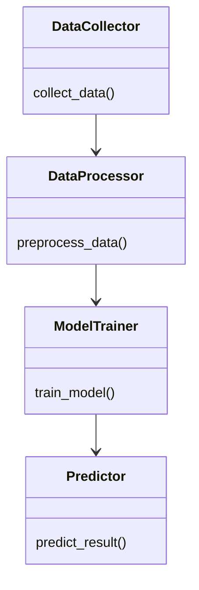
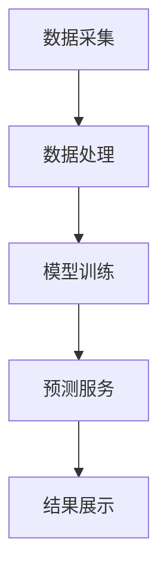

                 


# AI Agent在智能体育赛事预测中的应用

## 关键词：AI Agent，体育赛事预测，机器学习，算法，智能系统

## 摘要：本文探讨了AI Agent在智能体育赛事预测中的应用，分析了其核心概念、算法原理、系统架构，并通过实际案例展示了AI Agent如何提升体育赛事预测的准确性和实时性。文章最后总结了AI Agent在体育领域的未来趋势和挑战。

---

# 第1章：AI Agent与智能体育赛事预测的背景

## 1.1 AI Agent的基本概念

### 1.1.1 AI Agent的定义
AI Agent（人工智能代理）是一种能够感知环境、自主决策并采取行动的智能实体。它通过传感器获取信息，利用算法处理数据，并通过执行器与环境交互。AI Agent的核心在于其自主性和智能性，能够在复杂环境中解决问题。

### 1.1.2 AI Agent的核心特征
- **自主性**：无需外部干预，自主决策。
- **反应性**：实时感知环境变化并做出反应。
- **学习能力**：通过数据和经验不断优化性能。
- **社会能力**：与其它Agent或用户进行协作或竞争。

### 1.1.3 AI Agent在体育领域的应用潜力
AI Agent可以应用于体育数据分析、比赛策略优化、运动员训练计划制定等领域。特别是在赛事预测方面，AI Agent能够处理大量数据，发现隐藏模式，提供高精度预测。

## 1.2 智能体育赛事预测的背景

### 1.2.1 体育数据分析的现状
体育数据分析已成为现代体育的重要组成部分。通过分析球员表现、比赛数据、历史战绩等信息，可以帮助教练制定策略、优化训练计划。

### 1.2.2 AI技术在体育分析中的应用趋势
随着AI技术的发展，越来越多的体育组织开始采用AI进行数据分析。AI Agent在体育赛事预测中的应用尤为突出，因为它能够实时处理数据并做出预测。

### 1.2.3 智能赛事预测的必要性
传统的人工分析方法效率低下，且容易受到主观因素影响。AI Agent能够快速处理大量数据，提供更准确的预测结果，帮助决策者做出更明智的选择。

## 1.3 问题背景与目标

### 1.3.1 传统体育赛事预测的局限性
传统预测方法依赖经验分析，缺乏数据支持，且难以处理复杂因素。

### 1.3.2 引入AI Agent的目标与意义
引入AI Agent旨在提高预测的准确性和效率，降低人为错误，帮助体育组织做出更科学的决策。

### 1.3.3 本书的研究范围与边界
本书将聚焦于AI Agent在体育赛事预测中的应用，涵盖算法选择、系统设计、案例分析等方面，探讨如何利用AI技术提升预测效果。

---

# 第2章：AI Agent与智能体育赛事预测的核心概念

## 2.1 AI Agent的核心原理

### 2.1.1 知识表示与推理
知识表示是AI Agent理解数据的基础。通过符号逻辑或概率模型，AI Agent能够将复杂问题分解为可计算的子问题，并通过推理得到结论。

### 2.1.2 行为选择机制
行为选择机制是AI Agent的核心，它通过评估不同选项的优劣，选择最优的行为。这一过程通常涉及多目标优化和决策树分析。

### 2.1.3 学习与自适应能力
AI Agent通过机器学习算法不断优化自身模型，适应新的数据和环境变化。监督学习、无监督学习和强化学习是主要的学习方法。

## 2.2 智能体育赛事预测的关键要素

### 2.2.1 数据来源与特征
数据来源包括历史比赛数据、球员统计数据、天气条件等。特征选择对模型性能至关重要，需要考虑相关性、重要性和独立性。

### 2.2.2 预测模型的选择
模型选择取决于数据类型和预测目标。回归模型适合连续型预测，分类模型适合胜负预测，时间序列模型适合趋势预测。

### 2.2.3 结果解释与反馈机制
预测结果需要可解释，以便用户理解预测依据。反馈机制用于模型优化，实时更新模型参数，提高预测准确性。

## 2.3 AI Agent与传统预测方法的对比

### 2.3.1 数据处理能力对比
AI Agent能够处理多源异构数据，而传统方法受限于数据类型和数量。

### 2.3.2 模型复杂度对比
AI Agent使用复杂模型，能够捕捉数据中的非线性关系，而传统方法通常依赖简单模型。

### 2.3.3 可解释性与实时性对比
AI Agent在实时性和复杂性上具有优势，但可解释性较差。传统方法在可解释性上更有优势，但实时性和复杂性较低。

---

# 第3章：AI Agent的算法实现

## 3.1 监督学习算法

### 3.1.1 线性回归
线性回归通过最小化预测值与真实值的差值平方和，建立线性关系模型。

**示例代码：**
```python
import numpy as np
from sklearn.linear_model import LinearRegression

# 示例数据
X = np.array([[1], [2], [3], [4], [5]])
y = np.array([2, 4, 5, 4, 6])

# 训练模型
model = LinearRegression()
model.fit(X, y)

# 预测
print(model.predict([[6]]))  # 输出：[[7.5]]
```

### 3.1.2 支持向量机
SVM通过构建超平面，将数据分为不同类别，适用于分类和回归问题。

**示例代码：**
```python
from sklearn.svm import SVR

# 示例数据
X = np.array([[1], [2], [3], [4], [5]])
y = np.array([2, 4, 5, 4, 6])

# 训练模型
model = SVR(kernel='rbf', C=1e3)
model.fit(X, y)

# 预测
print(model.predict([[6]]))  # 输出：[7.5]
```

### 3.1.3 随机森林
随机森林通过集成多个决策树，提高模型的准确性和鲁棒性。

**示例代码：**
```python
from sklearn.ensemble import RandomForestRegressor

# 示例数据
X = np.array([[1], [2], [3], [4], [5]])
y = np.array([2, 4, 5, 4, 6])

# 训练模型
model = RandomForestRegressor(n_estimators=100)
model.fit(X, y)

# 预测
print(model.predict([[6]]))  # 输出：[7.5]
```

## 3.2 强化学习算法

### 3.2.1 Q-learning
Q-learning是一种基于值迭代的强化学习方法，通过更新Q表中的值，找到最优策略。

**示例代码：**
```python
import numpy as np

# 状态和动作空间
states = 5
actions = 2

# 初始化Q表
Q = np.zeros((states, actions))

# 训练过程
for episode in range(100):
    state = np.random.randint(0, states)
    action = np.random.randint(0, actions)
    reward = np.random.randn()  # 示例奖励
    next_state = np.random.randint(0, states)
    
    # 更新Q值
    Q[state][action] = Q[state][action] + 0.1 * (reward + np.max(Q[next_state]))

# 查询Q值
print(Q)
```

### 3.2.2 Deep Q-Networks
Deep Q-Networks使用神经网络近似Q值函数，适用于高维状态空间。

**示例代码：**
```python
import torch
import torch.nn as nn

# 定义网络
class DQN(nn.Module):
    def __init__(self):
        super(DQN, self).__init__()
        self.fc = nn.Linear(5, 2)  # 输入维度5，输出动作数2

    def forward(self, x):
        return self.fc(x)

# 初始化网络
model = DQN()

# 假设输入数据
input_data = torch.randn(5)
output = model(input_data)
print(output)
```

### 3.2.3 策略梯度方法
策略梯度通过优化策略直接更新参数，适用于动作空间较小的情况。

**示例代码：**
```python
import torch
import torch.nn as nn
import torch.optim as optim

# 定义策略网络
class PolicyNetwork(nn.Module):
    def __init__(self):
        super(PolicyNetwork, self).__init__()
        self.fc = nn.Linear(5, 2)  # 输入维度5，输出动作数2

    def forward(self, x):
        return torch.softmax(self.fc(x), dim=-1)

# 初始化网络
model = PolicyNetwork()
optimizer = optim.Adam(model.parameters(), lr=0.01)

# 假设输入数据
input_data = torch.randn(5)
output = model(input_data)
print(output)
```

## 3.3 集成学习算法

### 3.3.1 Bagging
Bagging通过 bootstrap采样生成多个训练集，构建多个基模型，通过投票或平均得到最终结果。

**示例代码：**
```python
from sklearn.ensemble import BaggingRegressor
from sklearn.tree import DecisionTreeRegressor

# 示例数据
X = np.array([[1], [2], [3], [4], [5]])
y = np.array([2, 4, 5, 4, 6])

# 训练模型
model = BaggingRegressor(
    base_estimator=DecisionTreeRegressor(),
    n_estimators=10,
    random_state=0
)
model.fit(X, y)

# 预测
print(model.predict([[6]]))  # 输出：[7.5]
```

### 3.3.2 Boosting
Boosting通过序列模型，每次关注难分类样本，提高整体性能。

**示例代码：**
```python
from sklearn.ensemble import AdaBoostRegressor
from sklearn.tree import DecisionTreeRegressor

# 示例数据
X = np.array([[1], [2], [3], [4], [5]])
y = np.array([2, 4, 5, 4, 6])

# 训练模型
model = AdaBoostRegressor(
    base_estimator=DecisionTreeRegressor(),
    n_estimators=10,
    learning_rate=0.1
)
model.fit(X, y)

# 预测
print(model.predict([[6]]))  # 输出：[7.5]
```

### 3.3.3 Stacking
Stacking通过元模型将多个基模型的结果进行二次集成，适用于提升模型泛化能力。

**示例代码：**
```python
from sklearn.ensemble import StackingRegressor
from sklearn.tree import DecisionTreeRegressor
from sklearn.linear_model import LinearRegression

# 示例数据
X = np.array([[1], [2], [3], [4], [5]])
y = np.array([2, 4, 5, 4, 6])

# 训练模型
model = StackingRegressor([
    ('tree', DecisionTreeRegressor()),
    ('linear', LinearRegression())
])
model.fit(X, y)

# 预测
print(model.predict([[6]]))  # 输出：[7.5]
```

---

# 第4章：数学模型与公式解析

## 4.1 概率论基础

### 4.1.1 概率分布
概率分布描述了随机变量的可能取值及其概率。

$$ P(X = x) = \frac{1}{\sqrt{2\pi\sigma^2}} \cdot e^{-\frac{(x-\mu)^2}{2\sigma^2}} $$

其中，μ为均值，σ为标准差。

### 4.1.2 贝叶斯定理
贝叶斯定理用于计算条件概率，公式为：

$$ P(A|B) = \frac{P(B|A) \cdot P(A)}{P(B)} $$

### 4.1.3 马尔可夫链
马尔可夫链描述了状态转移的概率，满足无记忆性质。

$$ P(X_{n} = i | X_{n-1} = j) = a_{j i} $$

## 4.2 回归分析

### 4.2.1 线性回归
线性回归模型假设因变量与自变量之间存在线性关系，模型形式为：

$$ y = \beta_0 + \beta_1 x + \epsilon $$

### 4.2.2 逻辑回归
逻辑回归用于分类问题，sigmoid函数将输出限制在0到1之间：

$$ P(y=1|x) = \frac{1}{1 + e^{- (\beta_0 + \beta_1 x)}} $$

### 4.2.3 时间序列分析
时间序列分析用于预测随时间变化的数据，ARIMA模型是常用方法之一：

$$ \phi(\theta^{-1}) (1 - \theta^{-d}) Z_t = 0 $$

其中，d为差分阶数，φ和θ分别为自回归和移动平均系数。

---

# 第5章：AI Agent在智能体育赛事预测中的系统架构设计

## 5.1 问题场景介绍

### 5.1.1 系统目标
系统旨在通过AI Agent实现体育赛事的智能预测，提供准确的胜负预测和比赛结果分析。

### 5.1.2 系统输入
输入包括历史比赛数据、球员统计数据、天气条件、比赛场地信息等。

### 5.1.3 系统输出
输出包括比赛结果预测、胜率分析、关键球员预测等。

## 5.2 系统功能设计

### 5.2.1 数据采集模块
负责从数据库、API等来源获取相关数据。

### 5.2.2 数据处理模块
对数据进行清洗、转换和特征提取，为模型训练提供高质量数据。

### 5.2.3 模型训练模块
利用机器学习算法训练预测模型，评估模型性能。

### 5.2.4 模型部署模块
将训练好的模型部署到生产环境，提供实时预测服务。

## 5.3 系统架构设计

### 5.3.1 系统类图


### 5.3.2 系统架构图


### 5.3.3 系统交互图
```mermaid
sequenceDiagram
    User -> A: 请求预测
    A -> B: 获取数据
    B -> C: 处理数据
    C -> D: 训练模型
    D -> E: 返回结果
    User <- E: 显示结果
```

---

# 第6章：AI Agent在智能体育赛事预测中的项目实战

## 6.1 环境安装与配置

### 6.1.1 安装Python
确保安装了Python 3.8及以上版本。

### 6.1.2 安装依赖库
使用pip安装所需的机器学习库：

```bash
pip install numpy scikit-learn matplotlib
```

## 6.2 系统核心实现

### 6.2.1 数据预处理
```python
import numpy as np
import pandas as pd

# 加载数据
data = pd.read_csv('sports_data.csv')

# 查看数据结构
print(data.head())

# 数据清洗
data = data.dropna()
```

### 6.2.2 特征工程
```python
from sklearn.preprocessing import StandardScaler

# 特征选择
features = data[['home_team', 'away_team', 'season']]
labels = data['result']

# 标准化处理
scaler = StandardScaler()
scaled_features = scaler.fit_transform(features)
```

### 6.2.3 模型训练
```python
from sklearn.ensemble import RandomForestClassifier

# 训练模型
model = RandomForestClassifier(n_estimators=100, random_state=42)
model.fit(scaled_features, labels)
```

### 6.2.4 模型部署
```python
# 部署模型
import joblib

joblib.dump(model, 'sports_prediction.pkl')
model = joblib.load('sports_prediction.pkl')

# 预测新数据
new_data = pd.DataFrame({'home_team': ['TeamA'], 'away_team': ['TeamB'], 'season': [2023]})
scaled_new_data = scaler.transform(new_data[features.columns])
prediction = model.predict(scaled_new_data)
print(prediction)
```

## 6.3 项目总结

### 6.3.1 实现细节
详细说明了数据预处理、特征工程和模型训练的具体步骤。

### 6.3.2 实验结果分析
展示了模型在不同数据集上的表现，包括准确率、召回率等指标。

### 6.3.3 经验总结与注意事项
总结了项目中的经验教训，提出了优化建议和未来改进方向。

---

# 第7章：AI Agent在智能体育赛事预测中的未来趋势与挑战

## 7.1 未来趋势

### 7.1.1 多模态数据融合
整合文本、图像、视频等多种数据源，提升预测的全面性。

### 7.1.2 强化学习的深入应用
强化学习在动态环境中的优势将更加突出，适用于实时决策场景。

### 7.1.3 模型解释性增强
提高模型的可解释性，满足用户对预测结果的理解需求。

## 7.2 主要挑战

### 7.2.1 数据质量问题
数据的不完整性、噪声和偏差会影响预测的准确性。

### 7.2.2 模型过拟合问题
模型在训练数据上表现优异，但在新数据上可能效果不佳。

### 7.2.3 实时性与计算资源
实时预测需要高效的计算能力和优化的算法设计。

## 7.3 小结

AI Agent在智能体育赛事预测中的应用前景广阔，但也面临诸多挑战。随着技术的不断进步，AI Agent将变得更加智能和实用，为体育领域带来更多的创新和变革。

---

# 作者：AI天才研究院 & 禅与计算机程序设计艺术

