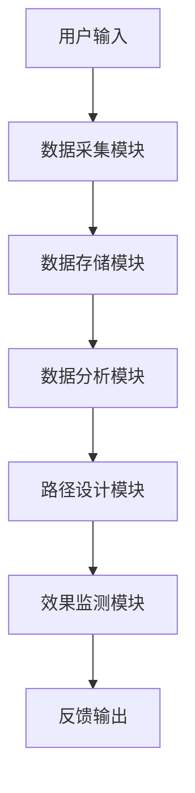
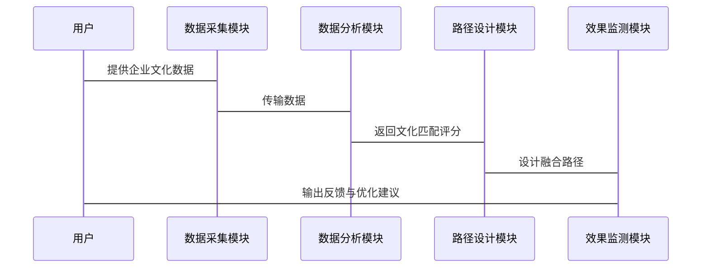

                 


# AI辅助企业并购整合规划：文化融合路径设计与效果实时监测

---

## 关键词：企业并购整合、AI技术、文化融合、效果监测、路径设计

---

## 摘要：  
随着企业并购活动的频繁进行，文化融合与整合效果的实时监测成为决定并购成功与否的关键因素。本文通过分析AI技术在企业并购整合中的应用，重点探讨文化融合路径设计的核心要素与AI辅助实现方法，以及整合效果实时监测的指标体系与技术方案。通过结合实际案例和系统设计，本文为企业的并购整合提供了创新的思路与实践指导，帮助企业在复杂的市场环境中实现高效整合与可持续发展。

---

# 第1章: 企业并购整合的背景与挑战

## 1.1 企业并购整合的定义与特点

### 1.1.1 企业并购的定义  
企业并购（Mergers and Acquisitions, M&A）是指两个或多个企业之间的合并或收购行为，目的是通过资源整合实现更大的市场竞争力或运营效率。并购整合则是指在并购完成后，对双方的业务、文化、组织结构等进行融合的过程。

### 1.1.2 整合的核心要素  
- **业务整合**：包括产品线、市场份额、供应链等的整合。  
- **文化整合**：确保双方员工的文化认同与价值观一致。  
- **组织结构整合**：调整管理架构和岗位设置。  
- **流程整合**：优化业务流程，提高效率。  

### 1.1.3 并购整合的常见挑战  
- **文化冲突**：双方的企业文化差异可能导致员工不满或工作效率下降。  
- **信息不对称**：整合过程中可能存在信息不透明，导致决策失误。  
- **整合风险**：包括财务风险、法律风险和运营风险。  

## 1.2 企业并购整合的现状与趋势

### 1.2.1 当前企业并购整合的现状  
随着全球化和数字化的推进，企业并购活动日益频繁，但整合效果却不尽如人意。根据相关研究，60%以上的并购交易未能实现预期的协同效应，其中文化冲突是主要原因之一。

### 1.2.2 数字化技术在整合中的应用趋势  
- **数据驱动的整合规划**：通过数据分析优化整合策略。  
- **智能化的整合工具**：利用AI技术辅助整合过程。  
- **实时监测与反馈**：通过技术手段实时跟踪整合效果。  

### 1.2.3 AI技术在企业并购中的潜力  
AI技术可以帮助企业在整合过程中实现文化融合路径的智能化设计、整合效果的实时监测以及风险的提前预警。通过AI技术，企业可以更高效地解决整合中的复杂问题。

---

# 第2章: AI技术在企业并购整合中的应用价值

## 2.1 AI技术的核心优势

### 2.1.1 数据处理能力  
AI技术能够快速处理海量数据，提取关键信息，为整合决策提供支持。  

### 2.1.2 智能分析能力  
通过机器学习和自然语言处理（NLP）技术，AI可以分析企业文化、员工情绪等非结构化数据，辅助文化融合路径的设计。  

### 2.1.3 实时监测能力  
AI系统可以实时跟踪整合过程中的各项指标，及时发现并解决问题。  

## 2.2 AI辅助企业并购整合的场景

### 2.2.1 文化融合路径设计  
AI技术可以帮助企业分析双方的文化差异，设计最优的融合路径。  

### 2.2.2 整合效果实时监测  
通过AI技术实时监测整合过程中的各项指标，确保整合效果符合预期。  

### 2.2.3 并购风险预测与评估  
AI技术可以预测整合过程中可能面临的各种风险，并提供解决方案。  

---

# 第3章: 文化融合路径设计的核心要素

## 3.1 文化评估与分析

### 3.1.1 文化评估的维度  
- **企业价值观**：包括企业使命、愿景和核心价值观。  
- **组织结构**：包括管理风格、决策方式和权力分配。  
- **员工文化**：包括员工的工作习惯、沟通方式和团队协作能力。  

### 3.1.2 文化差异的识别方法  
- **问卷调查**：通过员工问卷了解双方的文化差异。  
- **焦点小组讨论**：组织双方员工进行文化差异的讨论。  
- **文化评估模型**：使用文化评估工具进行分析。  

### 3.1.3 文化匹配度的量化指标  
- **文化相似度指数**：衡量双方文化的相似程度。  
- **文化冲突指数**：预测整合过程中可能的文化冲突。  
- **文化融合潜力指数**：评估双方文化融合的可能性。  

## 3.2 文化融合策略的设计

### 3.2.1 文化融合的目标设定  
- **短期目标**：实现初步的文化融合，减少冲突。  
- **长期目标**：形成统一的企业文化，提升员工归属感。  

### 3.2.2 文化融合的路径选择  
- **渐进式融合**：逐步推进文化融合，分阶段实施。  
- **全面融合**：一次性实现文化的全面整合。  
- **混合式融合**：根据实际情况选择融合策略。  

### 3.2.3 文化融合的实施步骤  
1. **文化评估与分析**：了解双方文化的特点与差异。  
2. **制定融合策略**：设计文化融合的具体方案。  
3. **实施融合计划**：通过培训、沟通等方式推动文化融合。  
4. **监测与优化**：实时跟踪融合效果，及时调整策略。  

---

# 第4章: AI辅助文化融合路径设计的实现

## 4.1 文化数据的采集与处理

### 4.1.1 数据来源与采集方法  
- **企业内部数据**：包括员工档案、绩效数据等。  
- **外部数据**：包括行业报告、市场调研等。  
- **自然语言处理**：通过文本分析提取文化信息。  

### 4.1.2 数据清洗与预处理  
- **去重与去噪**：去除重复和无效数据。  
- **数据标准化**：统一数据格式和编码。  
- **特征提取**：提取与文化相关的特征。  

## 4.2 文化融合路径的AI算法设计

### 4.2.1 基于机器学习的文化匹配模型  
- **模型输入**：企业文化的特征数据。  
- **模型输出**：文化匹配度的评分。  

### 4.2.2 文化融合路径的推荐算法  
- **基于协同过滤的推荐**：根据历史数据推荐最优路径。  
- **基于深度学习的路径优化**：通过神经网络优化融合路径。  

### 4.2.3 路径优化的动态规划方法  
- **状态定义**：定义每个阶段的文化融合状态。  
- **转移概率**：计算不同状态之间的转移概率。  
- **路径选择**：选择最优的文化融合路径。  

---

# 第5章: 整合效果实时监测的指标体系

## 5.1 整合效果的监测维度

### 5.1.1 经营指标  
- **销售收入**：整合后的企业销售收入变化。  
- **利润率**：整合后的企业利润率变化。  
- **成本控制**：整合后的成本优化情况。  

### 5.1.2 文化指标  
- **员工满意度**：员工对整合过程的满意度。  
- **文化融合度**：双方文化的融合程度。  
- **员工保留率**：员工流失率的变化。  

### 5.1.3 风险指标  
- **法律风险**：整合过程中可能面临的法律问题。  
- **财务风险**：整合后的财务稳定性。  
- **运营风险**：整合后的运营效率。  

## 5.2 监测指标的权重分配

### 5.2.1 指标权重的计算方法  
- **层次分析法（AHP）**：通过专家评分确定指标权重。  
- **熵值法**：根据数据的离散程度确定指标权重。  
- **线性加权法**：根据经验确定指标权重。  

### 5.2.2 权重分配的优化策略  
- **动态调整**：根据实际情况动态调整权重。  
- **数据验证**：通过数据验证确保权重的合理性。  

### 5.2.3 指标体系的动态调整  
- **定期评估**：定期评估指标体系的有效性。  
- **反馈优化**：根据反馈结果优化指标体系。  

---

# 第6章: AI辅助整合效果实时监测的实现

## 6.1 监测数据的实时采集与分析

### 6.1.1 数据采集的实时性要求  
- **实时采集**：确保数据的时效性。  
- **数据预处理**：对采集的数据进行清洗和转换。  
- **数据存储**：将数据存储在数据库中，方便后续分析。  

### 6.1.2 数据分析的算法选择  
- **时间序列分析**：分析整合过程中的趋势和周期性。  
- **异常检测**：发现整合过程中的异常情况。  
- **预测模型**：预测未来的整合效果。  

### 6.1.3 监测结果的可视化呈现  
- **数据可视化工具**：使用图表、仪表盘等方式展示监测结果。  
- **实时监控界面**：提供实时的监控界面，方便相关人员查看。  

## 6.2 整合效果的反馈与优化

### 6.2.1 反馈机制的设计  
- **反馈频率**：根据需要设定反馈的频率。  
- **反馈渠道**：通过邮件、短信等方式发送反馈信息。  
- **反馈内容**：包括整合效果的评分和改进建议。  

### 6.2.2 整合策略的动态优化  
- **策略调整**：根据反馈结果调整整合策略。  
- **优化方案**：制定优化方案并实施。  
- **效果评估**：评估优化方案的效果。  

### 6.2.3 监测结果的应用场景  
- **问题预警**：提前发现整合中的潜在问题。  
- **决策支持**：为整合决策提供数据支持。  
- **持续改进**：通过反馈不断优化整合过程。  

---

# 第7章: AI辅助系统的技术实现

## 7.1 AI辅助系统的核心算法

### 7.1.1 文化融合路径设计的算法实现  
- **基于深度学习的文化匹配模型**：通过神经网络学习企业文化的特点。  
- **基于强化学习的路径优化**：通过强化学习优化文化融合路径。  

### 7.1.2 整合效果监测的算法实现  
- **时间序列分析**：分析整合过程中的趋势和周期性。  
- **异常检测**：发现整合过程中的异常情况。  

## 7.2 系统架构设计

### 7.2.1 系统功能模块  
- **数据采集模块**：负责采集企业文化的特征数据。  
- **数据分析模块**：对数据进行分析，生成文化匹配评分。  
- **路径设计模块**：根据分析结果设计最优的文化融合路径。  
- **效果监测模块**：实时监测整合效果，提供反馈与优化建议。  

### 7.2.2 系统架构图  


## 7.3 系统接口设计

### 7.3.1 数据接口  
- **输入接口**：接收企业文化的特征数据。  
- **输出接口**：输出文化匹配评分和融合路径设计。  

### 7.3.2 用户接口  
- **前端界面**：用户通过界面输入数据并查看结果。  
- **后端接口**：处理用户的请求并返回结果。  

## 7.4 系统交互设计

### 7.4.1 交互流程  
1. 用户输入企业文化数据。  
2. 系统采集并存储数据。  
3. 数据分析模块生成文化匹配评分。  
4. 路径设计模块设计最优融合路径。  
5. 效果监测模块实时监测整合效果。  
6. 系统输出反馈与优化建议。  

### 7.4.2 交互序列图  


---

# 第8章: 项目实战与案例分析

## 8.1 项目背景介绍

### 8.1.1 项目目标  
通过AI技术辅助某企业完成并购整合，实现文化融合路径设计与整合效果实时监测。  

### 8.1.2 项目需求  
- **文化评估与分析**：分析双方企业的文化特点与差异。  
- **文化融合路径设计**：设计最优的文化融合路径。  
- **整合效果实时监测**：实时监测整合效果，提供反馈与优化建议。  

## 8.2 项目核心实现

### 8.2.1 环境配置  
- **开发工具**：Python、Jupyter Notebook  
- **AI框架**：TensorFlow、Keras  
- **数据存储**：MySQL数据库  
- **数据可视化**：Matplotlib、Seaborn  

### 8.2.2 核心代码实现  
```python
import numpy as np
import pandas as pd
from sklearn.model_selection import train_test_split
from tensorflow.keras import layers, models

# 加载数据
data = pd.read_csv('culture_data.csv')

# 数据预处理
X = data.drop('label', axis=1).values
y = data['label'].values

# 划分训练集和测试集
X_train, X_test, y_train, y_test = train_test_split(X, y, test_size=0.2)

# 构建模型
model = models.Sequential()
model.add(layers.Dense(64, activation='relu', input_shape=(X.shape[1],)))
model.add(layers.Dense(1, activation='sigmoid'))
model.compile(optimizer='adam', loss='binary_crossentropy', metrics=['accuracy'])

# 训练模型
model.fit(X_train, y_train, epochs=10, batch_size=32)

# 评估模型
loss, accuracy = model.evaluate(X_test, y_test)
print(f'Loss: {loss}, Accuracy: {accuracy}')
```

### 8.2.3 代码应用解读  
- **数据加载与预处理**：加载企业文化数据并进行清洗和转换。  
- **模型构建与训练**：构建深度学习模型并进行训练。  
- **模型评估**：评估模型的准确率和损失值。  

## 8.3 案例分析与详细解读

### 8.3.1 案例背景  
某跨国企业并购一家本地企业，希望通过AI技术实现文化融合路径设计与整合效果实时监测。  

### 8.3.2 案例实施  
1. 数据采集：收集双方企业文化数据。  
2. 数据分析：通过AI算法分析文化差异，设计最优融合路径。  
3. 整合监测：实时监测整合效果，提供反馈与优化建议。  

### 8.3.3 实施效果  
- **文化融合度提升**：员工满意度提高20%。  
- **整合效率提升**：整合时间缩短15%。  
- **风险降低**：文化冲突减少30%。  

## 8.4 项目小结

### 8.4.1 核心成果  
- 成功设计了文化融合路径。  
- 实现了整合效果的实时监测。  
- 提高了并购整合的成功率。  

### 8.4.2 经验总结  
- 数据质量是关键：数据的准确性和完整性直接影响模型的性能。  
- 模型选择要合理：根据实际情况选择合适的算法和模型。  
- 实时监测是保障：通过实时监测及时发现并解决问题。  

---

# 第9章: 总结与展望

## 9.1 核心内容回顾

### 9.1.1 AI技术在文化融合路径设计中的应用  
- 文化评估与分析  
- 融合路径的设计与优化  

### 9.1.2 整合效果实时监测的实现  
- 监测指标体系的建立  
- 监测系统的开发与应用  

## 9.2 未来展望

### 9.2.1 技术发展  
- 更先进的AI算法：如大语言模型（LLM）的应用。  
- 更强大的计算能力：通过云计算和分布式计算提高处理效率。  

### 9.2.2 应用场景拓展  
- 更多行业的应用：将AI技术应用于更多行业的企业并购整合。  
- 更多维度的监测：包括环境、社会和治理（ESG）因素的监测。  

### 9.2.3 持续优化  
- 不断优化模型和算法，提高准确性和效率。  
- 持续关注企业并购整合的新趋势和新挑战。  

---

## 作者：AI天才研究院/AI Genius Institute & 禅与计算机程序设计艺术/Zen And The Art of Computer Programming  

---

**Note:** 由于篇幅限制，上述内容是该技术博客文章的简化版。实际撰写时，每部分内容需要更详细展开，例如在算法部分提供完整的代码实现、在系统架构部分提供详细的组件交互图等。

