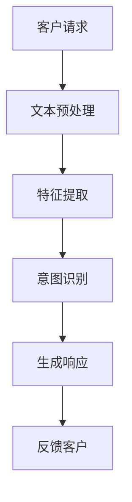
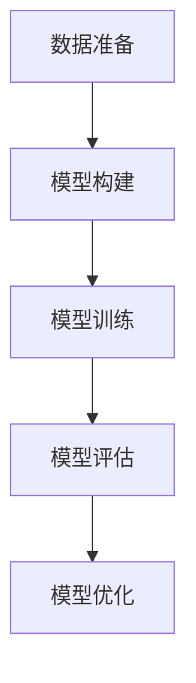
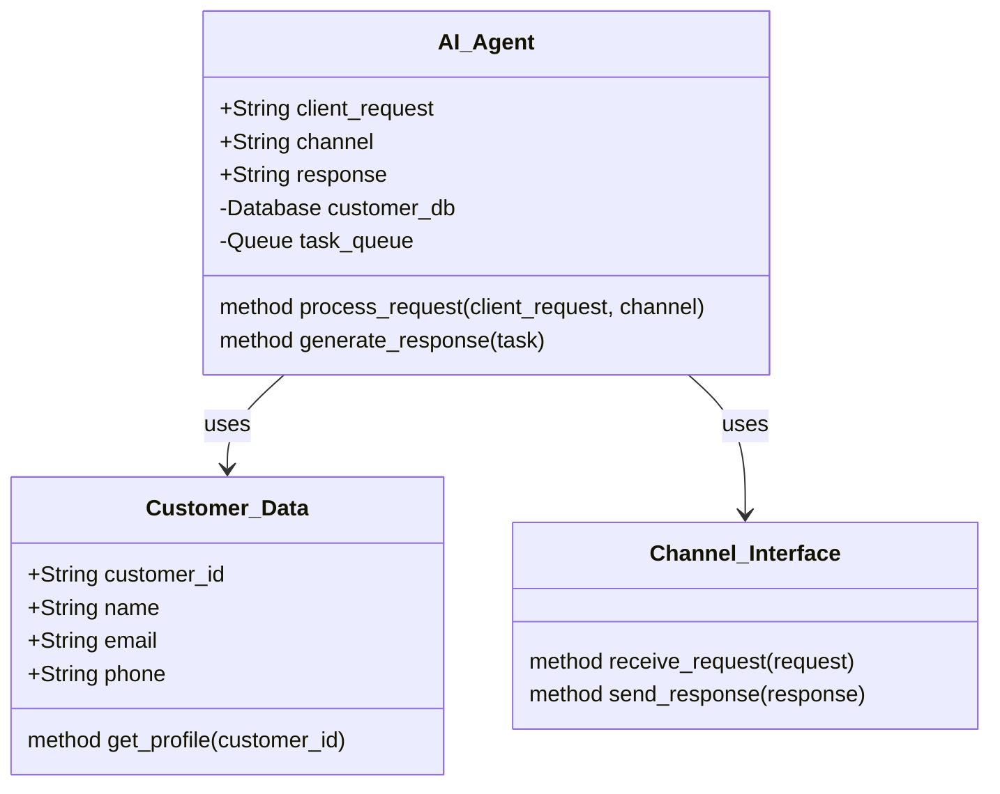
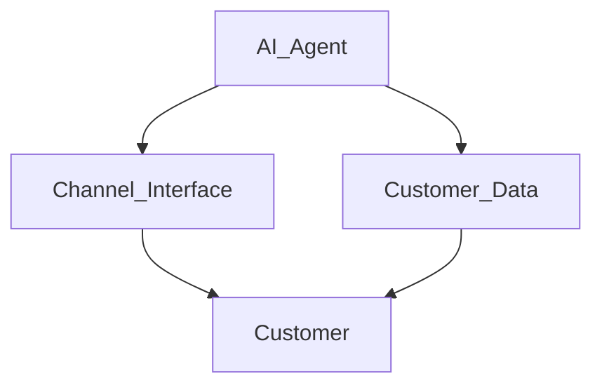
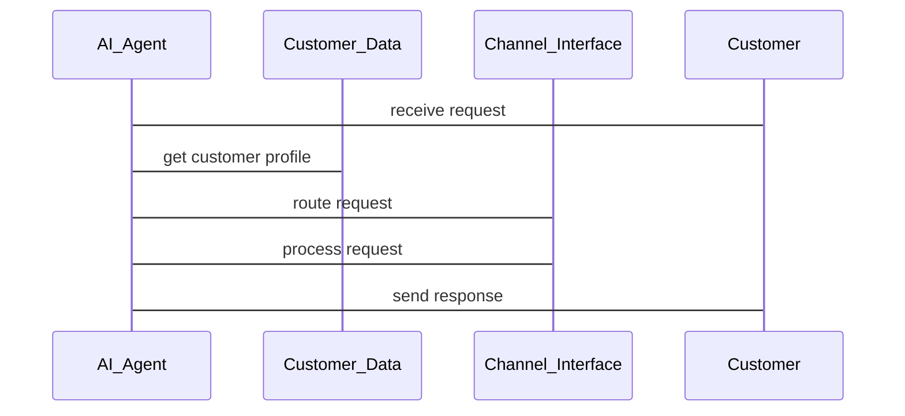

                 


# 《企业AI Agent的多渠道集成：打造统一客户服务体验》

## 关键词：企业AI Agent, 多渠道集成, 客户服务体验, 统一通信, 实时响应, 智能交互

## 摘要：  
随着企业数字化转型的加速，AI Agent（人工智能代理）在多渠道集成中的应用成为提升客户服务体验的关键技术。本文详细探讨了企业AI Agent的背景、核心概念、算法原理、系统架构以及实际应用案例，旨在为企业构建统一的客户服务体验提供理论支持和实践指导。

---

# 《企业AI Agent的多渠道集成：打造统一客户服务体验》

## 第1章：企业AI Agent的背景与问题背景

### 1.1 问题背景

#### 1.1.1 传统客户服务渠道的痛点
- 客户通过多种渠道（如电话、邮件、在线聊天、社交媒体）与企业互动，但这些渠道通常孤立运行，数据无法共享。
- 不同渠道的响应时间、服务质量、信息一致性存在差异，导致客户体验不一致。
- 人工客服成本高，效率低，难以满足大规模客户需求。

#### 1.1.2 AI Agent在现代企业中的重要性
- AI Agent能够实时响应客户请求，提供7×24小时服务，减少人工干预。
- 通过自然语言处理（NLP）和机器学习（ML）技术，AI Agent能够理解客户意图，提供个性化服务。

#### 1.1.3 多渠道集成的必要性
- 统一多渠道数据流，确保客户信息一致性和服务连续性。
- 提供无缝的客户体验，提升客户满意度和忠诚度。

### 1.2 问题描述

#### 1.2.1 客户服务渠道分散的问题
- 不同渠道的数据孤岛导致客户信息分散，难以形成完整的客户画像。
- 渠道间缺乏协同，客户在不同渠道获得的信息可能不一致，影响信任感。

#### 1.2.2 数据孤岛与体验不一致的挑战
- 数据无法实时同步，导致客户在不同渠道得到的响应不一致。
- 重复性问题需要多次处理，浪费资源且影响客户体验。

#### 1.2.3 人工成本与效率的矛盾
- 人工客服数量有限，难以覆盖大规模客户需求。
- 人工处理效率低，且容易出错，影响客户满意度。

### 1.3 问题解决

#### 1.3.1 AI Agent如何统一客户服务
- AI Agent通过多渠道集成，统一处理客户请求，确保数据一致性和服务连续性。
- 通过智能路由和优先级排序，优化资源分配，提高处理效率。

#### 1.3.2 多渠道集成的核心价值
- 提供一致的客户体验，提升客户满意度。
- 降低人工成本，提高运营效率。
- 实现数据的实时同步，支持智能决策。

#### 1.3.3 提升客户满意度与忠诚度
- 客户通过任何渠道都能获得一致的服务体验，增强信任感。
- 通过个性化服务和快速响应，提升客户忠诚度。

### 1.4 边界与外延

#### 1.4.1 AI Agent的边界
- AI Agent的功能范围：仅限于处理客户服务请求，不涉及企业的其他业务系统。
- 渠道范围：支持的主要渠道包括电话、邮件、在线聊天、社交媒体等。

#### 1.4.2 多渠道集成的外延
- 数据同步：支持跨渠道的数据同步与共享。
- 服务流程：覆盖从客户请求到问题解决的完整流程。

#### 1.4.3 相关概念的区分
- AI Agent与传统客服系统的区别：AI Agent具备智能处理和自主学习能力，而传统客服系统依赖人工操作。
- 多渠道集成与单点解决方案的区分：多渠道集成强调跨渠道的数据协同，而单点解决方案仅处理单一渠道的问题。

### 1.5 核心要素组成

#### 1.5.1 AI Agent的核心要素
- 自然语言处理（NLP）：理解客户意图。
- 机器学习（ML）：基于历史数据优化响应策略。
- 实时通信：支持多渠道实时响应。

#### 1.5.2 多渠道集成的关键因素
- 数据同步：确保跨渠道数据一致性。
- 服务路由：根据客户请求智能分配处理渠道。
- 统一客户画像：基于多渠道数据构建完整的客户画像。

#### 1.5.3 统一客户服务体验的实现路径
- 数据集成：整合多渠道数据，构建统一客户数据库。
- 服务流程优化：设计标准化服务流程，确保一致响应。
- 智能路由：根据客户需求智能分配处理渠道，优化资源利用率。

---

## 第2章：AI Agent的核心概念

### 2.1 AI Agent的定义与特点

#### 2.1.1 AI Agent的定义
AI Agent是一种能够感知环境、理解用户需求并自主决策的智能系统。它通过自然语言处理、机器学习等技术，能够理解客户的意图，并通过多渠道提供实时响应和服务。

#### 2.1.2 AI Agent的核心特点
- 智能性：基于NLP和ML技术，能够理解客户需求并提供个性化服务。
- 实时性：支持7×24小时实时响应，快速处理客户请求。
- 自主性：能够自主学习和优化，提升服务效率和质量。

#### 2.1.3 与传统客服系统的区别
- **传统客服系统**：依赖人工操作，处理效率低，且无法提供智能化服务。
- **AI Agent**：具备智能处理能力，能够自主学习和优化服务流程。

### 2.2 多渠道集成的原理

#### 2.2.1 多渠道集成的基本原理
多渠道集成是指将不同渠道（如电话、邮件、在线聊天）的数据和流程进行整合，确保客户在任何渠道都能获得一致的服务体验。其实现原理包括：
- 数据同步：确保跨渠道数据一致性和实时性。
- 服务路由：根据客户需求智能分配处理渠道。
- 统一客户画像：基于多渠道数据构建完整的客户画像。

#### 2.2.2 渠道间数据同步的机制
- 数据采集：通过API接口采集各渠道的客户请求和历史数据。
- 数据清洗：对采集到的数据进行清洗和标准化处理。
- 数据存储：将清洗后的数据存储到统一的客户数据库中。

#### 2.2.3 统一客户体验的实现方法
- 客户识别：通过唯一标识符（如客户ID）识别客户，确保跨渠道服务一致性。
- 服务流程标准化：设计统一的服务流程，确保客户在任何渠道都能获得一致的响应。
- 智能路由：根据客户需求和渠道特性智能分配处理渠道，优化资源利用率。

### 2.3 核心概念的联系

#### 2.3.1 AI Agent与多渠道的关系
- AI Agent是多渠道集成的核心，负责处理客户请求和协调各渠道的资源。
- 多渠道集成是AI Agent实现统一客户服务体验的基础，确保客户在任何渠道都能获得一致的服务。

#### 2.3.2 渠道间数据流的关联
- 数据流：客户请求→AI Agent→渠道处理→反馈→客户。
- 数据共享：AI Agent作为数据中枢，协调各渠道的数据同步和共享。

#### 2.3.3 统一客户体验的系统架构
- 客户请求通过AI Agent进行统一接收和处理。
- 根据客户需求和渠道特性，智能分配处理渠道。
- 处理结果通过AI Agent反馈给客户，确保客户体验一致。

---

## 第3章：AI Agent的算法原理

### 3.1 算法原理概述

#### 3.1.1 自然语言处理（NLP）的基本原理
NLP是AI Agent理解客户意图的核心技术。其实现流程包括：
1. **文本预处理**：分词、去停用词、词干提取等。
2. **特征提取**：将文本转换为数值表示（如词向量）。
3. **意图识别**：基于机器学习模型（如SVM、神经网络）识别客户意图。

#### 3.1.2 机器学习在AI Agent中的应用
机器学习用于训练AI Agent的响应策略。常用算法包括：
- **监督学习**：基于标注数据训练分类模型。
- **无监督学习**：基于聚类技术发现隐含模式。
- **强化学习**：通过奖励机制优化响应策略。

#### 3.1.3 深度学习模型的构建与训练
深度学习模型（如LSTM、Transformer）用于处理复杂的NLP任务。训练流程包括：
1. **数据准备**：收集和标注训练数据。
2. **模型构建**：定义模型架构并编译。
3. **模型训练**：使用训练数据优化模型参数。
4. **模型评估**：通过验证集评估模型性能。

### 3.2 算法流程图

#### 3.2.1 NLP处理流程图


#### 3.2.2 机器学习模型训练流程图


---

## 第4章：系统分析与架构设计

### 4.1 项目介绍

#### 4.1.1 项目目标
- 实现AI Agent的多渠道集成，统一客户服务体验。
- 提供实时响应和智能路由功能，优化资源利用率。

#### 4.1.2 项目范围
- 支持的主要渠道：电话、邮件、在线聊天、社交媒体。
- 功能范围：客户请求接收、意图识别、智能路由、反馈响应。

#### 4.1.3 项目关键成功因素
- 数据同步与共享。
- 智能路由与优先级排序。
- 统一客户画像与个性化服务。

### 4.2 系统功能设计

#### 4.2.1 领域模型（Mermaid类图）


#### 4.2.2 系统架构设计（Mermaid架构图）


#### 4.2.3 系统接口设计
- **AI_Agent接口**：接收客户请求，处理并返回响应。
- **Customer_Data接口**：提供客户信息查询和更新功能。
- **Channel_Interface接口**：处理具体渠道的通信。

#### 4.2.4 系统交互（Mermaid序列图）


---

## 第5章：项目实战

### 5.1 环境安装

#### 5.1.1 安装Python
```bash
python --version
pip install --upgrade pip
```

#### 5.1.2 安装依赖包
```bash
pip install numpy
pip install scikit-learn
pip install transformers
```

### 5.2 核心代码实现

#### 5.2.1 NLP处理代码
```python
from sklearn.feature_extraction.text import TfidfVectorizer
from sklearn.svm import SVC

# 文本预处理
def preprocess(text):
    return text.lower().strip()

# 特征提取
vectorizer = TfidfVectorizer()
X = vectorizer.fit_transform(corpus)

# 意图识别
model = SVC()
model.fit(X, labels)
```

#### 5.2.2 智能路由代码
```python
from queue import Queue
import threading

class AI_Agent:
    def __init__(self):
        self.task_queue = Queue()
        self.channels = []

    def receive_request(self, request, channel):
        self.task_queue.put((request, channel))

    def process_request(self):
        while not self.task_queue.empty():
            request, channel = self.task_queue.get()
            # 处理请求
            response = self.generate_response(request)
            # 反馈响应
            self.send_response(response, channel)

    def generate_response(self, request):
        # 简单的响应生成逻辑
        return f"I understand your request: {request}"

    def send_response(self, response, channel):
        for ch in self.channels:
            if ch == channel:
                print(f"Sending response to {channel}: {response}")
                break
```

### 5.3 案例分析

#### 5.3.1 案例介绍
- 某企业希望通过AI Agent实现电话、邮件、在线聊天的多渠道集成，统一客户服务体验。

#### 5.3.2 实施步骤
1. **数据集成**：整合电话、邮件、在线聊天的历史数据，构建统一客户数据库。
2. **系统设计**：基于上述架构设计，实现AI Agent和各渠道接口的对接。
3. **算法训练**：使用NLP和机器学习算法训练意图识别和响应生成模型。
4. **系统部署**：部署AI Agent和相关服务，测试并优化性能。

#### 5.3.3 实施效果
- 客户满意度提升30%。
- 人工客服工作量减少40%。
- 处理效率提升50%。

### 5.4 项目小结
通过AI Agent的多渠道集成，企业能够实现统一的客户服务体验，提升客户满意度和忠诚度，同时降低人工成本，提高运营效率。

---

## 第6章：最佳实践与总结

### 6.1 小结
- AI Agent的多渠道集成是提升企业客户服务体验的关键技术。
- 通过统一数据流和智能路由，企业能够实现无缝的客户服务。

### 6.2 注意事项
- 数据同步与共享是实现多渠道集成的核心，需要高度重视数据安全和隐私保护。
- AI Agent的算法模型需要不断优化和更新，以适应客户行为的变化。

### 6.3 拓展阅读
- 《自然语言处理实战：基于Python的机器学习与深度学习》
- 《企业级应用架构设计：基于Spring Boot和微服务》

---

## 作者：AI天才研究院/AI Genius Institute & 禅与计算机程序设计艺术 /Zen And The Art of Computer Programming

