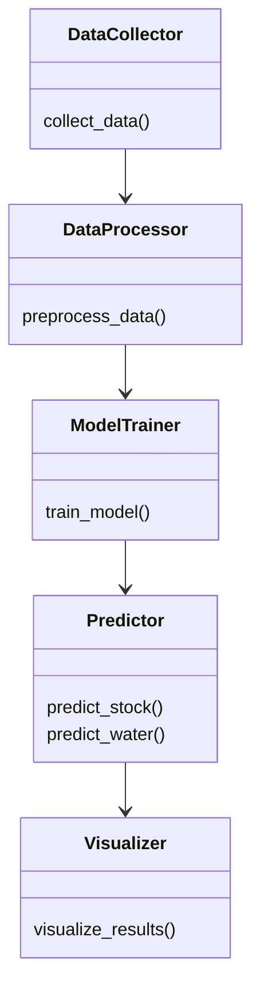
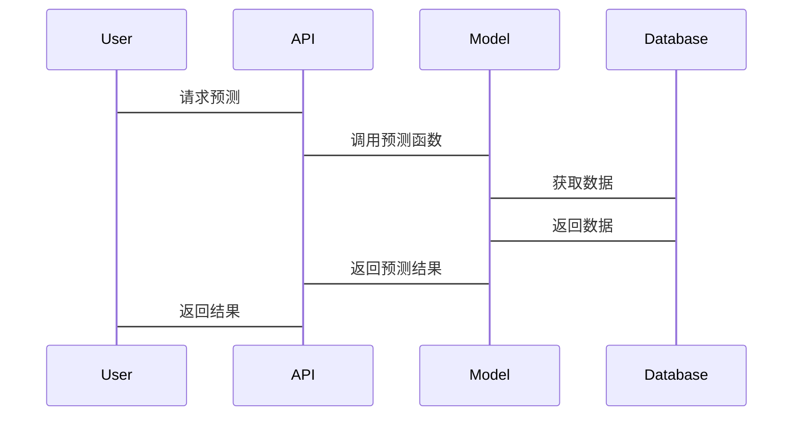

                 


# 全球股市估值与可持续水资源管理AI技术的关联

> 关键词：全球股市估值、可持续水资源管理、AI技术、机器学习、深度学习、系统架构设计

> 摘要：本文探讨了AI技术在全球股市估值与可持续水资源管理中的应用及其关联。通过分析AI在金融和环境领域的潜力，结合实际案例，展示了如何利用AI技术优化股市估值和水资源管理，并提出了一种跨领域关联的系统架构设计方案。

---

# 第一部分: 全球股市估值与可持续水资源管理的背景介绍

## 第1章: 全球股市估值与可持续水资源管理的背景介绍

### 1.1 问题背景与问题描述

#### 1.1.1 全球股市估值的重要性
股票市场作为经济的晴雨表，其估值直接反映了企业的财务健康状况和市场信心。然而，传统估值方法依赖历史数据和经验判断，难以应对市场波动和复杂经济环境。AI技术的应用为股市估值提供了新的可能性。

#### 1.1.2 可持续水资源管理的紧迫性
水资源是人类生存和经济发展的重要基础，但水资源短缺和污染问题日益严重。可持续水资源管理需要高效的技术手段来优化配置和监控水质，AI技术在其中扮演着关键角色。

#### 1.1.3 AI技术在金融与环境领域的应用潜力
AI技术的快速发展为解决复杂问题提供了新的工具。在金融领域，AI可以用于股票预测和风险评估；在环境领域，AI可以用于水质监测和水资源优化配置。

### 1.2 核心概念与定义

#### 1.2.1 全球股市估值的定义与核心要素
股票估值是指通过对公司财务数据和市场环境的分析，预测其股票的内在价值。核心要素包括市盈率、市净率、股息率等。

#### 1.2.2 可持续水资源管理的定义与核心要素
可持续水资源管理是指在满足当前需求的同时，确保未来水资源的可持续利用。核心要素包括水资源监测、配置优化和污染控制。

#### 1.2.3 AI技术在关联中的作用
AI技术通过数据挖掘和机器学习，能够发现股市和水资源管理中的潜在关联，为决策提供支持。

### 1.3 问题解决与边界

#### 1.3.1 问题解决的路径与方法
利用AI技术分别分析股市和水资源管理中的问题，再探索两者之间的关联。

#### 1.3.2 问题的边界与外延
限定在AI技术的应用范围内，不涉及传统金融和环境管理方法。

#### 1.3.3 核心概念的结构与组成
股市估值和水资源管理分别涉及数据采集、模型构建和决策支持三个部分。

### 1.4 本章小结
本章介绍了全球股市估值和可持续水资源管理的背景，明确了AI技术在其中的作用，为后续分析奠定了基础。

---

# 第二部分: AI技术在全球股市估值中的应用

## 第2章: AI技术在全球股市估值中的应用

### 2.1 AI技术的基本原理与算法概述

#### 2.1.1 机器学习的基本原理
机器学习通过数据训练模型，识别数据中的模式和特征。

#### 2.1.2 深度学习的基本原理
深度学习利用多层神经网络，从数据中自动提取特征。

#### 2.1.3 其他AI技术的应用
自然语言处理用于分析市场情绪，强化学习用于动态调整投资策略。

### 2.2 AI技术在股市估值中的具体应用

#### 2.2.1 基于AI的股票价格预测模型
通过历史数据训练LSTM模型，预测股票价格走势。

#### 2.2.2 基于AI的风险评估与投资组合优化
利用机器学习算法评估投资风险，优化资产配置。

#### 2.2.3 基于AI的市场情绪分析
使用NLP技术分析新闻和社交媒体，预测市场情绪对股价的影响。

### 2.3 算法原理与数学模型

#### 2.3.1 线性回归模型
$$ y = \beta_0 + \beta_1x + \epsilon $$
用于简单线性关系的预测。

#### 2.3.2 支持向量机模型
通过最大化-margin分类，适用于非线性数据。

#### 2.3.3 长短期记忆网络（LSTM）模型
$$ f_t = \sigma(W_{f}x_t + U_{f}h_{t-1} + b_f) $$
用于时间序列数据的预测。

### 2.4 实际案例分析与算法实现

#### 2.4.1 股票价格预测的Python代码实现
```python
import numpy as np
import pandas as pd
from sklearn.preprocessing import MinMaxScaler
from keras.layers import LSTM, Dense
from keras.models import Sequential

# 数据预处理
data = pd.read_csv('stock_data.csv')
scaler = MinMaxScaler()
data_scaled = scaler.fit_transform(data)

# 模型构建
model = Sequential()
model.add(LSTM(50, return_sequences=True, input_shape=(1, 1)))
model.add(Dense(1))
model.compile(loss='mean_squared_error', optimizer='adam')

# 训练模型
model.fit(X_train, y_train, epochs=100, batch_size=32)
```

#### 2.4.2 投资组合优化的算法实现
使用遗传算法优化投资组合的收益和风险。

#### 2.4.3 市场情绪分析的NLP技术实现
利用情感分析模型分析新闻标题，预测市场情绪。

### 2.5 本章小结
本章详细介绍了AI技术在股市估值中的应用，展示了多种算法和模型的实际应用。

---

# 第三部分: AI技术在可持续水资源管理中的应用

## 第3章: AI技术在可持续水资源管理中的应用

### 3.1 AI技术的基本原理与算法概述

#### 3.1.1 机器学习在水资源管理中的应用
用于水质预测和需求预测。

#### 3.1.2 深度学习在水资源管理中的应用
用于水文预测和污染源识别。

### 3.2 AI技术在水资源管理中的具体应用

#### 3.2.1 基于AI的水质监测系统
通过传感器数据训练模型，实时监测水质。

#### 3.2.2 基于AI的水资源优化配置
利用优化算法，合理分配水资源。

#### 3.2.3 基于AI的水文预测模型
预测降雨量和洪水风险，指导水资源管理。

### 3.3 算法原理与数学模型

#### 3.3.1 支持向量回归模型
$$ y = \sum_{i=1}^{n} \alpha_i y_i K(x, x_i) + b $$
用于回归分析。

#### 3.3.2 卷积神经网络（CNN）模型
用于图像识别，识别水体污染区域。

#### 3.3.3 时间序列模型
$$ ARIMA(p, d, q) $$
用于水文数据的时间序列预测。

### 3.4 实际案例分析与算法实现

#### 3.4.1 水质监测系统的Python代码实现
```python
import tensorflow as tf
from tensorflow.keras import layers

# 构建模型
model = tf.keras.Sequential([
    layers.Conv1D(64, 4, activation='relu', input_shape=(10, 1)),
    layers.MaxPooling1D(2),
    layers.Flatten(),
    layers.Dense(128, activation='relu'),
    layers.Dense(1, activation='sigmoid')
])

# 编译模型
model.compile(optimizer='adam', loss='binary_crossentropy', metrics=['accuracy'])
```

#### 3.4.2 水资源优化配置的算法实现
使用强化学习算法优化水资源分配。

#### 3.4.3 水文预测的数学模型实现
利用ARIMA模型预测降雨量。

### 3.5 本章小结
本章详细介绍了AI技术在水资源管理中的应用，展示了如何利用AI技术解决实际问题。

---

# 第四部分: 全球股市估值与可持续水资源管理的关联分析

## 第4章: 全球股市估值与可持续水资源管理的关联分析

### 4.1 股市估值与水资源管理的经济关联

#### 4.1.1 水资源短缺对股市的影响
水资源短缺可能导致企业成本上升，影响股价。

#### 4.1.2 环保政策对股市的影响
严格的环保政策可能影响企业的盈利能力和市场估值。

### 4.2 股市估值与水资源管理的环境关联

#### 4.2.1 水资源污染对股市的影响
污染事件可能导致企业声誉受损，股价下跌。

#### 4.2.2 环境技术进步对股市的影响
环保技术创新可能提升企业竞争力，提高股价。

### 4.3 股市估值与水资源管理的政策关联

#### 4.3.1 政府政策对水资源管理的影响
政府政策直接影响水资源的分配和利用。

#### 4.3.2 政策对股市的影响
政策变化可能影响企业的盈利能力和市场估值。

### 4.4 股市估值与水资源管理的AI关联模型

#### 4.4.1 关联模型的构建
通过AI技术分析股市和水资源管理中的数据，发现潜在关联。

#### 4.4.2 关联模型的数学表达
$$ y = f(x) $$
其中，x是水资源管理相关指标，y是股市估值。

#### 4.4.3 关联模型的验证与优化
通过历史数据验证模型准确性，并不断优化模型参数。

### 4.5 本章小结
本章分析了全球股市估值与可持续水资源管理之间的关联，展示了如何利用AI技术进行跨领域分析。

---

# 第五部分: 系统架构设计

## 第5章: 全球股市估值与可持续水资源管理AI技术的系统架构设计

### 5.1 问题场景介绍

#### 5.1.1 系统目标
构建一个能够同时分析股市和水资源管理的AI系统。

#### 5.1.2 系统范围
涵盖数据采集、处理、分析和可视化模块。

#### 5.1.3 用户需求
为投资者和水资源管理者提供决策支持。

### 5.2 系统功能设计

#### 5.2.1 领域模型类图


#### 5.2.2 系统架构设计
```mermaid
client --> Server: 请求
Server --> Database: 查询数据
Database --> DataCollector: 获取新数据
Server --> Model: 训练模型
Model --> Predictor: 预测结果
Predictor --> Visualizer: 可视化
Visualizer --> Client: 返回结果
```

### 5.3 系统接口设计

#### 5.3.1 API接口设计
提供RESTful API，支持数据查询和预测结果获取。

#### 5.3.2 数据格式设计
使用JSON格式传输数据，确保数据的结构化和易处理性。

### 5.4 系统交互流程

#### 5.4.1 交互流程图


### 5.5 本章小结
本章设计了一个跨领域AI系统的架构，展示了如何整合股市和水资源管理的数据与模型。

---

# 第六部分: 项目实战

## 第6章: 全球股市估值与可持续水资源管理AI技术的项目实战

### 6.1 环境安装

#### 6.1.1 安装Python
```bash
python --version
pip install numpy pandas scikit-learn tensorflow
```

#### 6.1.2 安装Jupyter Notebook
```bash
pip install jupyter-notebook
jupyter notebook
```

### 6.2 系统核心实现源代码

#### 6.2.1 数据采集与预处理
```python
import pandas as pd
import numpy as np

# 数据采集
data = pd.read_csv('stock_data.csv')

# 数据预处理
from sklearn.preprocessing import MinMaxScaler
scaler = MinMaxScaler()
data_scaled = scaler.fit_transform(data)
```

#### 6.2.2 模型训练与预测
```python
from tensorflow.keras.models import Sequential
from tensorflow.keras.layers import LSTM, Dense

# 构建模型
model = Sequential()
model.add(LSTM(50, return_sequences=True, input_shape=(1, 1)))
model.add(Dense(1))
model.compile(loss='mean_squared_error', optimizer='adam')

# 训练模型
model.fit(X_train, y_train, epochs=100, batch_size=32)
```

#### 6.2.3 结果可视化
```python
import matplotlib.pyplot as plt

# 可视化预测结果
plt.plot(y_true, label='True')
plt.plot(y_pred, label='Predicted')
plt.legend()
plt.show()
```

### 6.3 代码应用解读与分析

#### 6.3.1 代码功能解读
详细解读每个代码段的功能和作用。

#### 6.3.2 代码实现细节
分析代码实现中的关键点，如数据预处理和模型训练。

#### 6.3.3 代码优化建议
提出优化建议，如选择合适的模型参数和数据增强方法。

### 6.4 实际案例分析与详细讲解

#### 6.4.1 案例背景
分析一个具体的股市和水资源管理案例。

#### 6.4.2 案例实现
详细讲解如何利用AI技术解决实际问题。

#### 6.4.3 案例结果与分析
展示案例结果，并分析其对股市和水资源管理的影响。

### 6.5 本章小结
本章通过实际案例展示了如何利用AI技术优化股市估值和水资源管理。

---

# 第七部分: 结论与展望

## 第7章: 结论与展望

### 7.1 全文总结

#### 7.1.1 核心内容回顾
总结全文的核心内容和主要观点。

#### 7.1.2 研究的意义与价值
阐述研究的重要性和实际应用价值。

### 7.2 研究的局限性

#### 7.2.1 数据限制
分析数据质量和数量对模型准确性的影响。

#### 7.2.2 技术限制
探讨当前技术在跨领域应用中的局限性。

### 7.3 未来的发展方向

#### 7.3.1 技术优化方向
提出优化AI算法和模型的建议。

#### 7.3.2 应用拓展方向
探讨AI技术在更多领域的应用潜力。

### 7.4 本章小结
本章总结了全文的主要内容，并展望了未来的研究方向。

---

# 作者

作者：AI天才研究院/AI Genius Institute & 禅与计算机程序设计艺术 /Zen And The Art of Computer Programming

---

本文通过系统化的分析和实践，展示了AI技术在全球股市估值与可持续水资源管理中的应用，为未来的跨领域研究提供了理论和实践基础。

