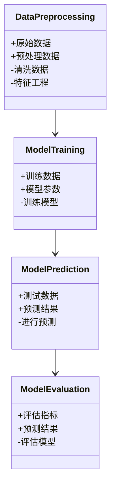
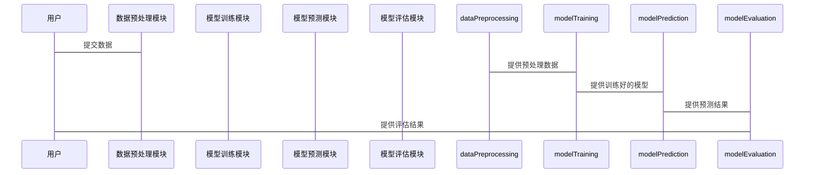

                 


# 历史数据不足对预测未来收益的影响

> 关键词：历史数据不足，收益预测，数据驱动决策，因果推断，机器学习

> 摘要：在数据科学和金融领域，历史数据是预测未来收益的核心基础。然而，当历史数据不足时，预测的难度显著增加。本文从数据不足的特征出发，分析其对收益预测的影响，并探讨在数据稀缺条件下的预测方法和最佳实践。通过结合因果推断、时间序列分析和机器学习算法，本文为数据科学家和金融从业者提供了实用的解决方案。

---

# 第一部分：背景介绍与问题背景

## 第1章：历史数据不足的背景与问题描述

### 1.1 问题背景

#### 1.1.1 数据驱动决策的现状
在当今的数据驱动时代，企业越来越依赖历史数据来支持决策。无论是金融、医疗还是电子商务，数据都成为了最重要的资产之一。通过分析历史数据，企业可以识别趋势、优化运营、预测未来表现。

#### 1.1.2 历史数据不足的挑战
然而，在某些情况下，企业可能面临历史数据不足的问题。这可能是因为数据收集成本高昂、数据隐私限制、或者数据生成周期长等原因。例如，在新兴市场中，企业可能没有足够的历史数据来支持初步的预测模型。

#### 1.1.3 预测未来收益的核心问题
预测未来收益的核心问题在于如何在数据稀缺的情况下，构建可靠的预测模型。传统的方法通常依赖于大量的历史数据，而数据不足的情况下，模型的泛化能力和预测精度都可能受到严重影响。

---

### 1.2 问题描述

#### 1.2.1 数据不足的定义与特征
数据不足可以定义为：可用的历史数据量不足以支持传统的统计或机器学习模型的训练，导致模型的性能受到限制。其主要特征包括数据稀疏性、数据不均衡性和数据噪声。

#### 1.2.2 收益预测的基本概念
收益预测是指通过历史数据和相关因素，预测未来某一时间段内的收益情况。收益预测的核心在于建立一个能够反映市场动态、消费者行为和经济趋势的模型。

#### 1.2.3 数据不足对预测的影响
数据不足对预测的影响主要体现在以下几个方面：
1. **模型过拟合**：在数据不足的情况下，模型可能过度拟合训练数据，导致泛化能力差。
2. **预测误差增大**：由于缺乏足够的数据支持，预测的准确性可能显著降低。
3. **因果关系难以建立**：数据不足使得因果推断变得困难，难以确定变量之间的因果关系。

---

### 1.3 问题解决与边界

#### 1.3.1 数据不足的边界条件
数据不足的边界条件包括：
- 数据量的下限：模型训练所需的最小数据量。
- 数据质量的下限：数据的准确性和完整性要求。
- 数据更新的频率：数据更新的速度是否能够支持实时预测。

#### 1.3.2 收益预测的边界条件
收益预测的边界条件包括：
- 预测时间窗口的长度。
- 预测模型的复杂度。
- 预测结果的置信区间。

#### 1.3.3 数据与预测的关系
数据与预测的关系可以分为以下几个层次：
1. 数据是预测的基础。
2. 数据的质量直接影响预测的精度。
3. 数据的特征决定预测模型的选择。

---

### 1.4 概念结构与核心要素

#### 1.4.1 数据不足的核心要素
数据不足的核心要素包括：
- 数据量：可用数据的多少。
- 数据分布：数据的分布是否均匀。
- 数据特征：数据的特征是否能够反映未来收益的关键因素。

#### 1.4.2 收益预测的关键因素
收益预测的关键因素包括：
- 市场趋势：行业趋势、经济周期等。
- 消费者行为：消费者的购买习惯、偏好等。
- 企业内部因素：成本、供应链、产品创新等。

#### 1.4.3 数据与预测的关联性
数据与预测的关联性体现在以下几个方面：
- 数据的完整性影响预测的全面性。
- 数据的时序性影响预测的动态性。
- 数据的多样性影响预测的准确性。

---

## 第2章：数据不足与收益预测的核心概念

### 2.1 数据不足的特征分析

#### 2.1.1 数据稀疏性
数据稀疏性指的是某些特征或时间段上的数据缺失或非常少。例如，在某些新兴市场中，某些产品的销售数据可能非常稀缺。

#### 2.1.2 数据不均衡性
数据不均衡性指的是不同类别或时间点上的数据分布不均。例如，在某些情况下，历史数据可能主要集中在某些时间段，而其他时间段的数据非常少。

#### 2.1.3 数据噪声
数据噪声指的是数据中的随机波动或误差。在数据不足的情况下，噪声可能对预测结果的影响更加显著。

---

### 2.2 收益预测的基本原理

#### 2.2.1 收益预测的数学模型
收益预测的数学模型可以分为两类：
1. **统计模型**：如线性回归、时间序列分析等。
2. **机器学习模型**：如随机森林、神经网络等。

#### 2.2.2 数据驱动与知识驱动的结合
在数据不足的情况下，知识驱动的方法（如领域知识、专家经验）可以弥补数据的不足。例如，在某些领域，专家经验可以帮助建立先验模型或调整模型参数。

#### 2.2.3 数据不足下的预测方法
在数据不足的情况下，可以采用以下预测方法：
1. **降维方法**：减少模型的复杂度。
2. **迁移学习**：利用其他领域的数据进行模型训练。
3. **生成式方法**：通过生成模型补充数据。

---

### 2.3 核心概念的联系

#### 2.3.1 数据不足与预测误差的关系
数据不足会导致预测误差增大。具体来说：
- 数据稀疏性会导致预测结果的不确定性增加。
- 数据不均衡性会导致预测模型的偏差增大。
- 数据噪声会影响预测模型的稳定性。

#### 2.3.2 数据特征与预测精度的关系
数据特征与预测精度的关系可以分为以下几个方面：
- 数据的时序性越强，预测精度越高。
- 数据的多样性越丰富，预测精度越高。
- 数据的关联性越强，预测精度越高。

#### 2.3.3 数据质量与预测可靠性的关系
数据质量与预测可靠性之间的关系可以分为以下几个方面：
- 数据的准确性越高，预测可靠性越高。
- 数据的完整性越高，预测可靠性越高。
- 数据的及时性越高，预测可靠性越高。

---

## 第3章：数据不足与收益预测的核心原理

### 3.1 数据不足下的因果关系

#### 3.1.1 因果推断的基本概念
因果推断是指通过观察数据，确定变量之间的因果关系。在数据不足的情况下，因果推断的难度显著增加。

#### 3.1.2 数据不足对因果关系的影响
数据不足对因果关系的影响主要体现在以下几个方面：
- 难以确定因果方向。
- 难以排除混杂变量的影响。
- 难以验证因果关系的稳定性。

#### 3.1.3 数据驱动与因果推断的结合
在数据驱动与因果推断的结合中，可以通过以下方法提高因果推断的准确性：
- 利用领域知识建立因果图。
- 使用实验数据验证因果关系。
- 通过倾向得分匹配减少混杂变量的影响。

---

### 3.2 数据特征与预测模型的关联

#### 3.2.1 数据分布与模型选择
数据分布与模型选择密切相关。例如，如果数据服从泊松分布，可以采用泊松回归模型。

#### 3.2.2 数据特征与模型性能的关系
数据特征与模型性能的关系可以分为以下几个方面：
- 数据的线性关系影响线性模型的性能。
- 数据的非线性关系影响非线性模型的性能。
- 数据的时序性影响时间序列模型的性能。

#### 3.2.3 数据不足下的特征工程
在数据不足的情况下，特征工程尤为重要。可以通过以下方法进行特征工程：
- 数据增强：通过插值、合成数据等方法增加数据量。
- 特征选择：选择对预测最重要的特征。
- 特征变换：通过标准化、归一化等方法改善数据分布。

---

### 3.3 模型假设与数据不足的关系

#### 3.3.1 数据不足下的假设检验
在数据不足的情况下，假设检验的难度显著增加。可以通过以下方法进行假设检验：
- 贝叶斯假设检验：在数据不足的情况下，贝叶斯方法可以通过先验分布进行假设检验。
- 非参数假设检验：在数据不足的情况下，可以采用非参数检验方法。

#### 3.3.2 数据不足下的模型选择
在数据不足的情况下，模型选择需要考虑以下几个方面：
- 模型的复杂度：选择复杂度较低的模型。
- 模型的泛化能力：选择泛化能力较强的模型。
- 模型的解释性：选择解释性较强的模型。

#### 3.3.3 数据不足下的模型评估
在数据不足的情况下，模型评估需要考虑以下几个方面：
- 交叉验证：采用交叉验证方法评估模型性能。
- 留出法：将数据分为训练集和测试集，评估模型的泛化能力。
- 罗吉判别分析：评估模型的分类性能。

---

## 第4章：数据不足下的收益预测模型

### 4.1 贝叶斯推断与收益预测

#### 4.1.1 贝叶斯推断的基本原理
贝叶斯推断是一种基于概率的统计推断方法。其核心思想是通过先验概率和似然函数计算后验概率。

#### 4.1.2 数据不足下的贝叶斯模型
在数据不足的情况下，贝叶斯模型可以通过先验分布进行建模。例如，可以使用共轭先验分布，简化计算过程。

#### 4.1.3 贝叶斯推断的实现步骤
1. 确定先验分布。
2. 计算似然函数。
3. 计算后验分布。
4. 进行预测。

---

### 4.2 时间序列分析与收益预测

#### 4.2.1 时间序列分析的基本原理
时间序列分析是一种通过分析数据的时间特性，预测未来趋势的方法。其核心在于识别数据的周期性、趋势性和随机性。

#### 4.2.2 数据不足下的时间序列模型
在数据不足的情况下，可以采用以下时间序列模型：
1. **ARIMA模型**：适用于数据量较小的情况。
2. **指数平滑模型**：适用于数据变化较大的情况。

#### 4.2.3 时间序列分析的实现步骤
1. 数据预处理：检查数据的平稳性。
2. 模型选择：选择适合的数据生成过程。
3. 模型训练：估计模型参数。
4. 模型验证：检验模型的预测能力。

---

### 4.3 机器学习模型与收益预测

#### 4.3.1 机器学习模型的基本原理
机器学习模型是一种通过数据训练，自动学习数据特征的预测方法。其核心在于特征提取和模型训练。

#### 4.3.2 数据不足下的机器学习模型
在数据不足的情况下，机器学习模型需要采用以下策略：
1. **降维方法**：如主成分分析（PCA）。
2. **过采样与欠采样**：如SMOTE算法。
3. **集成学习**：如随机森林、梯度提升树（GBDT）。

#### 4.3.3 机器学习模型的实现步骤
1. 数据预处理：清洗数据、特征工程。
2. 模型选择：选择适合的数据生成过程。
3. 模型训练：估计模型参数。
4. 模型验证：检验模型的预测能力。

---

## 第5章：系统分析与架构设计

### 5.1 问题场景介绍

#### 5.1.1 数据不足的场景
在实际应用中，数据不足的场景可以是：
- 新产品上市初期，缺乏销售数据。
- 新市场进入者，缺乏市场数据。
- 数据收集成本高昂，导致数据量有限。

#### 5.1.2 收益预测的场景
收益预测的场景可以是：
- 企业内部的财务规划。
- 投资决策。
- 市场预测。

---

### 5.2 系统功能设计

#### 5.2.1 领域模型设计
领域模型是系统设计的核心，需要明确系统的功能模块和数据流。可以通过Mermaid类图进行设计。



#### 5.2.2 系统架构设计
系统架构设计需要考虑系统的可扩展性、可维护性和可伸缩性。可以通过Mermaid架构图进行设计。

```mermaid
container 数据源 {
    数据源1
    数据源2
}
container 数据处理 {
    数据预处理模块
    数据清洗模块
}
container 模型训练 {
    模型训练模块
}
container 模型预测 {
    模型预测模块
}
container 模型评估 {
    模型评估模块
}
```

#### 5.2.3 系统交互设计
系统交互设计需要考虑系统的用户界面和操作流程。可以通过Mermaid序列图进行设计。



---

## 第6章：项目实战

### 6.1 环境安装

#### 6.1.1 Python环境配置
需要安装以下Python库：
- `pandas`：数据处理
- `numpy`：数值计算
- `scikit-learn`：机器学习模型
- `statsmodels`：时间序列分析
- `matplotlib`：数据可视化

安装命令：
```bash
pip install pandas numpy scikit-learn statsmodels matplotlib
```

#### 6.1.2 数据集获取
可以通过以下方式获取数据集：
- 数据生成：使用Python生成模拟数据。
- 数据爬取：从公开数据源爬取数据。
- 数据导入：从CSV文件导入数据。

---

### 6.2 系统核心实现

#### 6.2.1 数据预处理实现

```python
import pandas as pd
import numpy as np

# 数据生成
data = {
    'date': pd.date_range(start='2020-01-01', periods=30, freq='D'),
    'sales': np.random.randint(100, 1000, 30)
}
df = pd.DataFrame(data)

# 数据清洗
df.dropna()  # 假设数据中没有缺失值

# 特征工程
df['day_of_week'] = df['date'].dt.day_name()
df = df.drop('date', axis=1)
```

#### 6.2.2 模型训练实现

```python
from sklearn.ensemble import RandomForestRegressor
from sklearn.model_selection import train_test_split

# 数据分割
X_train, X_test, y_train, y_test = train_test_split(df.drop('sales', axis=1), df['sales'], test_size=0.2, random_state=42)

# 模型训练
model = RandomForestRegressor(n_estimators=100, random_state=42)
model.fit(X_train, y_train)
```

#### 6.2.3 模型预测实现

```python
# 模型预测
y_pred = model.predict(X_test)

# 模型评估
from sklearn.metrics import mean_absolute_error, mean_squared_error, r2_score

print(f"MAE: {mean_absolute_error(y_test, y_pred)}")
print(f"RMSE: {np.sqrt(mean_squared_error(y_test, y_pred))}")
print(f"R2: {r2_score(y_test, y_pred)}")
```

---

## 第7章：总结与展望

### 7.1 总结

#### 7.1.1 核心观点回顾
- 数据不足是收益预测中的一个关键挑战。
- 数据驱动与知识驱动的结合是解决数据不足的重要方法。
- 贝叶斯推断、时间序列分析和机器学习模型是数据不足条件下的主要预测方法。

#### 7.1.2 方法总结
- 数据预处理：清洗数据、特征工程。
- 模型选择：选择适合数据量的模型。
- 模型评估：交叉验证、留出法。

---

### 7.2 展望

#### 7.2.1 未来研究方向
- **生成式AI**：利用生成模型补充数据。
- **因果推断**：在数据不足条件下，因果推断的应用。
- **强化学习**：在数据不足条件下，强化学习的应用。

#### 7.2.2 技术进步的潜力
- 数据生成技术的进步将为数据不足条件下的预测提供新的解决方案。
- 新型机器学习算法的发展将为数据不足条件下的预测提供新的思路。

---

# 作者：AI天才研究院/AI Genius Institute & 禅与计算机程序设计艺术 /Zen And The Art of Computer Programming

