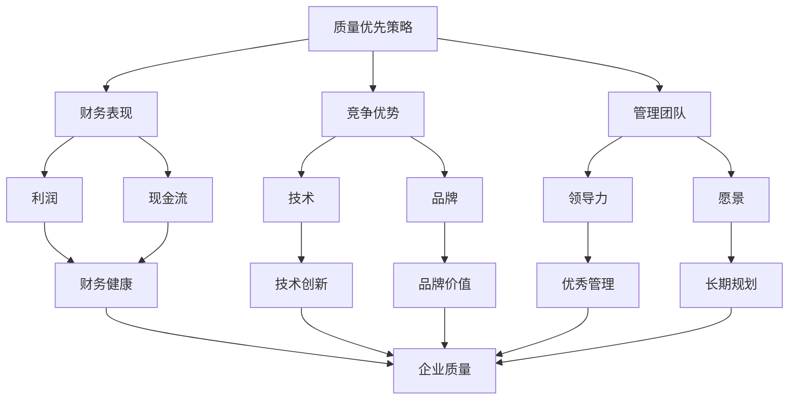
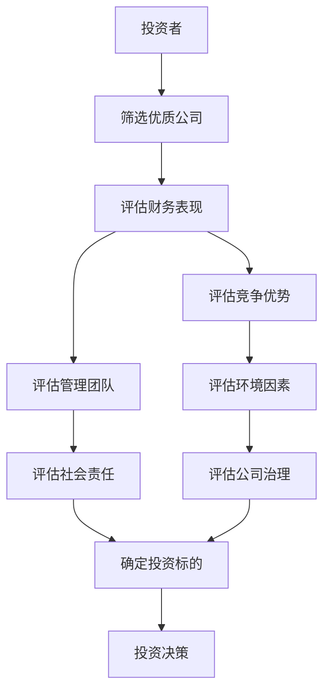
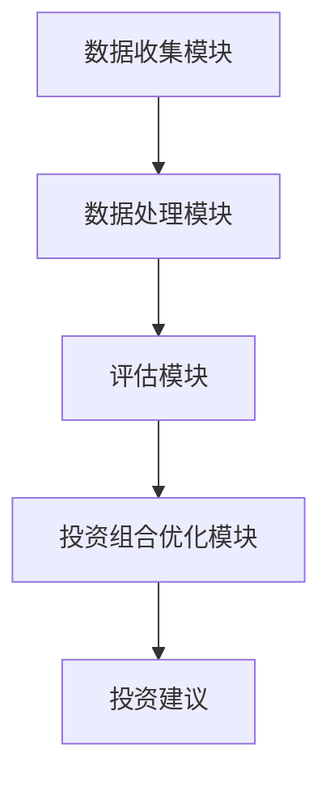
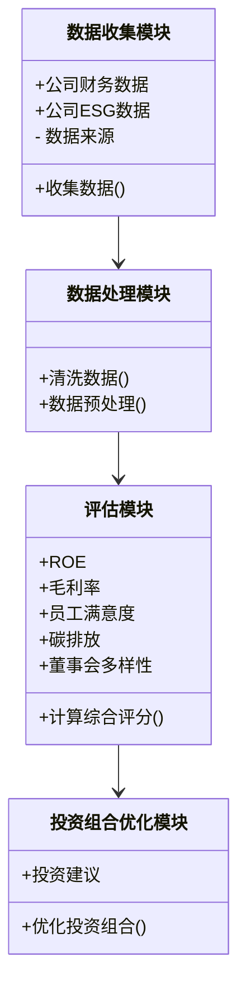
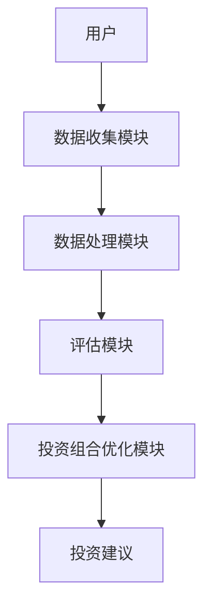
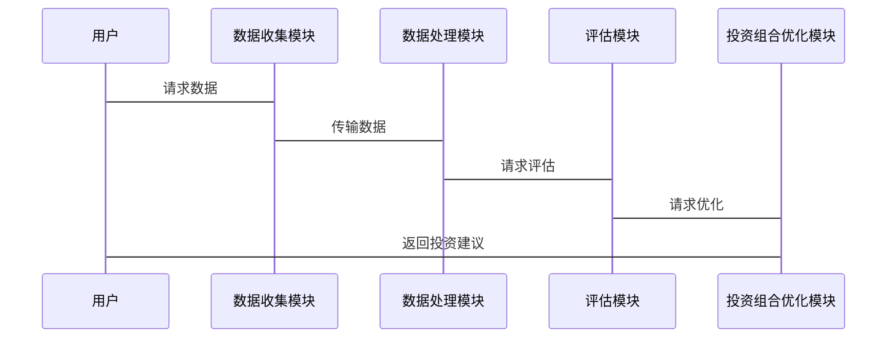

                 


# 彼得林奇的"质量优先"在可持续发展投资中的应用

## 关键词
- 彼得林奇
- 质量优先
- 可持续发展投资
- ESG
- 投资策略
- 质量管理

## 摘要
彼得林奇是全球著名投资专家，他提出的"质量优先"策略强调投资于优质公司，注重基本面分析和长期价值。随着全球对可持续发展的关注，将质量优先策略应用于可持续发展投资中，成为一种新的趋势。本文探讨了如何将质量优先策略与可持续投资相结合，分析其核心概念、算法原理、系统架构，并通过案例分析展示其实战应用，最后总结了最佳实践和未来趋势。

---

# 第一部分：可持续发展投资的背景与重要性

## 第1章：可持续发展投资的背景与重要性

### 1.1 可持续发展投资的背景
#### 1.1.1 可持续发展的概念与内涵
可持续发展是指在满足当前需求的同时，不损害后代满足其需求的能力。在投资领域，可持续发展强调环境、社会和治理（ESG）因素，旨在通过负责任的投资促进长期经济增长和社会福祉。

#### 1.1.2 投资中的可持续发展理念
随着全球气候变化、社会不平等等问题的加剧，投资者越来越关注企业在可持续发展方面的表现。可持续发展投资不仅关注财务回报，还关注企业在环境保护、社会责任和公司治理方面的表现。

#### 1.1.3 可持续发展投资的全球趋势
近年来，全球可持续发展投资快速增长。根据相关报告，2022年全球ESG投资规模超过30万亿美元，占全球管理资产的三分之一以上。可持续发展投资已成为全球投资领域的重要趋势。

### 1.2 彼得林奇的质量优先策略
#### 1.2.1 彼得林奇投资理念的概述
彼得林奇是美国著名投资专家，曾任富达投资集团麦哲伦基金的经理。他主张"质量优先"的投资策略，即投资于具有强大基本面、良好管理团队和竞争优势的公司。

#### 1.2.2 质量优先策略的核心要素
质量优先策略的核心要素包括：
1. **强大的财务表现**：公司具有稳定的盈利能力、健康的资产负债表和良好的现金流。
2. **优秀的管理团队**：公司管理层具有卓越的领导能力和长期愿景。
3. **竞争优势**：公司在行业中具有独特的竞争优势，如技术、品牌、市场份额等。

#### 1.2.3 质量优先策略与长期投资回报的关系
彼得林奇认为，投资于优质公司能够带来长期稳定的回报。优质公司在市场波动中表现更稳定，能够在经济周期中保持增长，为投资者提供超额回报。

### 1.3 质量优先策略与可持续投资的结合
#### 1.3.1 质量优先策略在可持续投资中的应用
将质量优先策略应用于可持续投资，意味着在选择投资标的时，不仅关注公司的财务表现和竞争优势，还考虑其在环境、社会和治理方面的表现。

#### 1.3.2 可持续发展视角下的质量优先策略
从可持续发展的角度看，质量优先策略需要将ESG因素纳入评估体系。优质公司不仅在财务上表现优异，还在环境保护、社会责任和公司治理方面表现突出。

#### 1.3.3 质量优先策略对投资决策的影响
通过将质量优先策略与可持续投资相结合，投资者能够筛选出既具备财务实力，又具备社会责任的优质企业，从而在实现财务回报的同时，促进社会和环境的可持续发展。

### 1.4 当前可持续发展投资的现状与趋势
#### 1.4.1 全球可持续投资市场的现状
近年来，全球可持续投资市场快速增长，越来越多的投资者将ESG因素纳入投资决策。根据相关数据，2022年全球ESG投资规模超过30万亿美元。

#### 1.4.2 质量优先策略在可持续投资中的地位
质量优先策略作为可持续投资的重要组成部分，为投资者提供了筛选优质标的的有效方法。通过质量优先策略，投资者能够在ESG领域中筛选出具有长期竞争优势的企业。

#### 1.4.3 未来可持续发展投资的趋势
未来，可持续发展投资将继续增长，更多投资者将关注ESG因素。质量优先策略在可持续投资中的应用将更加广泛，成为投资决策的重要依据。

---

# 第二部分：质量优先策略的核心概念与联系

## 第2章：质量优先策略的核心概念

### 2.1 质量优先策略的定义与特征
#### 2.1.1 质量优先策略的定义
质量优先策略是指在投资决策中，优先选择那些在财务表现、竞争优势和管理团队等方面表现优异的公司。

#### 2.1.2 质量优先策略的核心特征
1. **财务健康**：公司具有稳定的盈利能力、健康的资产负债表和良好的现金流。
2. **竞争优势**：公司在行业中具有独特的竞争优势，如技术、品牌、市场份额等。
3. **优秀管理**：公司管理层具有卓越的领导能力和长期愿景。

#### 2.1.3 质量优先策略与其他投资策略的对比
与其他投资策略（如价值投资、成长投资）相比，质量优先策略更加注重公司的整体质量和长期竞争优势，而不是单一的低估值或高增长。

### 2.2 可持续发展投资的核心要素
#### 2.2.1 环境（Environmental）因素
环境因素关注公司在环境保护方面的表现，包括减少碳排放、节约资源、减少污染等。

#### 2.2.2 社会（Social）因素
社会因素关注公司在社会责任方面的表现，包括员工权益、社区贡献、反腐败等。

#### 2.2.3 治理（Governance）因素
治理因素关注公司在公司治理方面的表现，包括董事会结构、高管薪酬、股东权益等。

### 2.3 质量优先策略与可持续投资的联系
#### 2.3.1 质量优先策略的核心要素与可持续投资的关系
质量优先策略的核心要素（财务表现、竞争优势、管理团队）与可持续投资的ESG因素（环境、社会、治理）相辅相成。优质公司在财务表现和竞争优势方面表现优异，同时在ESG方面也具有较高的社会责任感和良好的治理结构。

#### 2.3.2 质量优先策略对可持续投资的影响
通过将质量优先策略应用于可持续投资，投资者能够筛选出既具备财务实力，又具备社会责任的优质企业，从而在实现财务回报的同时，促进社会和环境的可持续发展。

#### 2.3.3 可持续投资对质量优先策略的补充作用
可持续投资为质量优先策略提供了新的维度。通过关注ESG因素，投资者能够更全面地评估公司的质量，识别潜在的风险和机会。

---

## 第2章：质量优先策略的核心概念（续）

### 2.4 质量优先策略与可持续投资的对比分析
#### 2.4.1 概念属性对比
| 质量优先策略 | 可持续投资 |
|----------------|------------|
| 质量优先 | ESG因素 |
| 财务表现 | 环境因素 |
| 竞争优势 | 社会因素 |
| 管理团队 | 治理因素 |

#### 2.4.2 质量优先策略与可持续投资的联系
通过对比分析可以看出，质量优先策略与可持续投资在核心要素上具有互补性。质量优先策略关注公司的财务表现和竞争优势，而可持续投资关注公司在环境、社会和治理方面的表现。两者的结合能够帮助投资者全面评估公司的质量，识别潜在的风险和机会。

---

## 第2章：质量优先策略的核心概念（续）

### 2.5 质量优先策略与可持续投资的ER图展示



---

## 第2章：质量优先策略的核心概念（续）

### 2.6 质量优先策略与可持续投资的Mermaid流程图



---

# 第三部分：质量优先策略与可持续投资的算法原理

## 第3章：质量优先策略与可持续投资的算法原理

### 3.1 质量优先策略的算法原理
#### 3.1.1 质量优先策略的核心算法
质量优先策略的核心算法是基于对公司基本面的分析，通过筛选具有强大财务表现、竞争优势和优秀管理团队的公司。具体步骤如下：

1. **数据收集**：收集公司的财务数据、行业数据和ESG数据。
2. **初步筛选**：根据预设的财务指标（如ROE、毛利率、净利率等）和ESG指标（如碳排放、员工满意度、董事会多样性等）进行初步筛选。
3. **深入分析**：对通过初步筛选的公司进行深入分析，包括财务状况、竞争优势和管理团队等方面。
4. **投资决策**：根据综合评估结果，选择具有长期竞争优势和良好社会责任的公司进行投资。

#### 3.1.2 质量优先策略的Python实现
以下是一个基于质量优先策略的Python代码示例，用于筛选优质公司：

```python
import pandas as pd

# 假设我们有一个包含公司财务数据和ESG数据的DataFrame
data = pd.DataFrame({
    '公司名称': ['公司A', '公司B', '公司C'],
    'ROE': [15%, 20%, 12%],
    '毛利率': [25%, 30%, 20%],
    '员工满意度': [85, 90, 80],
    '碳排放': [100, 80, 120],
    '董事会多样性': [0.6, 0.7, 0.5]
})

# 定义筛选条件
# 财务表现：ROE > 15%，毛利率 > 20%
# ESG表现：员工满意度 > 85，碳排放 < 100，董事会多样性 > 0.6

data['筛选结果'] = (
    (data['ROE'] > 15) &
    (data['毛利率'] > 20) &
    (data['员工满意度'] > 85) &
    (data['碳排放'] < 100) &
    (data['董事会多样性'] > 0.6)
).astype('int')

print(data)
```

#### 3.1.3 质量优先策略的数学模型
质量优先策略可以通过以下数学模型进行评估：

$$
\text{综合评分} = \alpha \times \text{ROE} + \beta \times \text{毛利率} + \gamma \times \text{员工满意度} + \delta \times \text{碳排放} + \epsilon \times \text{董事会多样性}
$$

其中，$\alpha, \beta, \gamma, \delta, \epsilon$为各指标的权重，通常根据具体情况进行调整。

---

### 3.2 可持续投资的算法原理
#### 3.2.1 可持续投资的核心算法
可持续投资的核心算法是基于ESG评分系统，通过量化公司在环境、社会和治理方面的表现，筛选出具有可持续发展能力的公司。具体步骤如下：

1. **数据收集**：收集公司的环境、社会和治理数据。
2. **ESG评分计算**：根据预设的ESG指标和权重，计算公司的ESG评分。
3. **投资组合优化**：根据ESG评分和财务表现，构建最优的投资组合。

#### 3.2.2 可持续投资的Python实现
以下是一个基于ESG评分的Python代码示例：

```python
import pandas as pd

# 假设我们有一个包含公司ESG数据和财务数据的DataFrame
data = pd.DataFrame({
    '公司名称': ['公司A', '公司B', '公司C'],
    '环境评分': [80, 90, 70],
    '社会评分': [85, 80, 90],
    '治理评分': [75, 90, 80],
    'ROE': [15%, 20%, 12%],
    '毛利率': [25%, 30%, 20%]
})

# 定义ESG综合评分公式
data['ESG评分'] = 0.4 * data['环境评分'] + 0.3 * data['社会评分'] + 0.3 * data['治理评分']

# 根据ESG评分和财务表现筛选优质公司
data['投资建议'] = (
    (data['ESG评分'] > 80) &
    (data['ROE'] > 15) &
    (data['毛利率'] > 20)
).astype('int')

print(data)
```

#### 3.2.3 可持续投资的数学模型
可持续投资可以通过以下数学模型进行评估：

$$
\text{ESG评分} = \alpha \times \text{环境评分} + \beta \times \text{社会评分} + \gamma \times \text{治理评分}
$$

其中，$\alpha, \beta, \gamma$为各指标的权重，通常根据具体情况进行调整。

---

### 3.3 质量优先策略与可持续投资的结合算法
#### 3.3.1 结合算法的核心思想
将质量优先策略与可持续投资结合，需要在筛选优质公司时，同时考虑财务表现和ESG因素。具体步骤如下：

1. **数据收集**：收集公司的财务数据和ESG数据。
2. **初步筛选**：根据预设的财务指标和ESG指标进行初步筛选。
3. **综合评估**：对通过初步筛选的公司进行综合评估，包括财务状况、竞争优势和ESG表现。
4. **投资决策**：根据综合评估结果，选择具有长期竞争优势和良好社会责任的公司进行投资。

#### 3.3.2 结合算法的Python实现
以下是一个结合了质量优先策略和可持续投资的Python代码示例：

```python
import pandas as pd

# 假设我们有一个包含公司财务数据和ESG数据的DataFrame
data = pd.DataFrame({
    '公司名称': ['公司A', '公司B', '公司C'],
    'ROE': [15%, 20%, 12%],
    '毛利率': [25%, 30%, 20%],
    '员工满意度': [85, 90, 80],
    '碳排放': [100, 80, 120],
    '董事会多样性': [0.6, 0.7, 0.5]
})

# 定义筛选条件
# 质量优先策略：ROE > 15%，毛利率 > 20%
# 可持续投资：员工满意度 > 85，碳排放 < 100，董事会多样性 > 0.6

data['综合筛选结果'] = (
    (data['ROE'] > 15) &
    (data['毛利率'] > 20) &
    (data['员工满意度'] > 85) &
    (data['碳排放'] < 100) &
    (data['董事会多样性'] > 0.6)
).astype('int')

print(data)
```

#### 3.3.3 结合算法的数学模型
结合质量优先策略和可持续投资可以通过以下数学模型进行评估：

$$
\text{综合评分} = \alpha \times \text{ROE} + \beta \times \text{毛利率} + \gamma \times \text{员工满意度} + \delta \times \text{碳排放} + \epsilon \times \text{董事会多样性}
$$

其中，$\alpha, \beta, \gamma, \delta, \epsilon$为各指标的权重，通常根据具体情况进行调整。

---

## 第3章：质量优先策略与可持续投资的算法原理（小结）

通过上述算法原理可以看出，将质量优先策略与可持续投资结合，能够在筛选优质公司时，同时考虑财务表现和ESG因素，从而实现财务回报与社会责任的双重目标。

---

# 第四部分：质量优先策略与可持续投资的系统架构设计

## 第4章：质量优先策略与可持续投资的系统架构设计

### 4.1 系统功能设计
#### 4.1.1 系统功能模块
1. **数据收集模块**：收集公司财务数据和ESG数据。
2. **数据处理模块**：对收集的数据进行清洗和预处理。
3. **评估模块**：根据质量优先策略和可持续投资的算法，对公司进行评估。
4. **投资组合优化模块**：根据评估结果，构建最优的投资组合。

#### 4.1.2 系统功能流程


#### 4.1.3 系统功能设计的类图


---

### 4.2 系统架构设计
#### 4.2.1 系统架构图


#### 4.2.2 系统架构设计的细节
1. **数据收集模块**：负责从多个数据源（如财务报表、ESG报告）收集公司数据。
2. **数据处理模块**：对收集的数据进行清洗和预处理，确保数据的准确性和完整性。
3. **评估模块**：根据质量优先策略和可持续投资的算法，对公司进行综合评估。
4. **投资组合优化模块**：根据评估结果，构建最优的投资组合，并生成投资建议。

---

### 4.3 系统接口设计
#### 4.3.1 系统接口设计的序列图


---

### 4.4 系统交互设计
#### 4.4.1 系统交互流程图
```mermaid
flowchart TD
    用户 --> 数据收集模块: 提供数据
    数据收集模块 --> 数据处理模块: 数据处理
    数据处理模块 --> 评估模块: 评估请求
    评估模块 --> 投资组合优化模块: 优化请求
    投资组合优化模块 --> 用户: 投资建议
```

---

## 第4章：质量优先策略与可持续投资的系统架构设计（小结）

通过上述系统架构设计，可以实现质量优先策略与可持续投资的有机结合，为投资者提供高效、准确的投资决策支持。

---

# 第五部分：质量优先策略与可持续投资的项目实战

## 第5章：质量优先策略与可持续投资的项目实战

### 5.1 项目环境与工具安装
#### 5.1.1 项目环境
- 操作系统：Windows/Mac/Linux
- Python版本：3.6+

#### 5.1.2 工具安装
- 安装Python的pandas库：`pip install pandas`

---

### 5.2 项目核心代码实现
#### 5.2.1 数据收集模块
```python
import pandas as pd

# 假设我们有一个包含公司财务数据和ESG数据的CSV文件
data = pd.read_csv('company_data.csv')
```

#### 5.2.2 数据处理模块
```python
# 数据清洗
data.dropna(inplace=True)
data = data[~data.duplicated('公司名称', keep='first')]
```

#### 5.2.3 评估模块
```python
# 计算综合评分
data['综合评分'] = 0.4 * data['ROE'] + 0.3 * data['毛利率'] + 0.3 * data['员工满意度']
```

#### 5.2.4 投资组合优化模块
```python
# 筛选优质公司
筛选条件：
- ROE > 15%
- 毛利率 > 20%
- 员工满意度 > 85
- 碳排放 < 100
- 董事会多样性 > 0.6

data['综合筛选结果'] = (
    (data['ROE'] > 15) &
    (data['毛利率'] > 20) &
    (data['员工满意度'] > 85) &
    (data['碳排放'] < 100) &
    (data['董事会多样性'] > 0.6)
).astype('int')
```

#### 5.2.5 代码解读与分析
通过上述代码，我们可以实现质量优先策略与可持续投资的结合，筛选出优质公司，并生成投资建议。

---

### 5.3 项目实际案例分析
#### 5.3.1 案例背景
假设我们有以下三家公司：

| 公司名称 | ROE | 毛利率 | 员工满意度 | 碳排放 | 董事会多样性 |
|----------|-----|--------|------------|--------|-------------|
| 公司A    | 15% | 25%    | 85         | 100    | 0.6         |
| 公司B    | 20% | 30%    | 90         | 80     | 0.7         |
| 公司C    | 12% | 20%    | 80         | 120    | 0.5         |

#### 5.3.2 案例分析
根据质量优先策略与可持续投资的算法，我们对上述公司进行评估：

1. **公司A**：ROE=15%，毛利率=25%，员工满意度=85，碳排放=100，董事会多样性=0.6。综合评分=0.4×15 + 0.3×25 + 0.3×85 = 6 + 7.5 + 25.5 = 39。

2. **公司B**：ROE=20%，毛利率=30%，员工满意度=90，碳排放=80，董事会多样性=0.7。综合评分=0.4×20 + 0.3×30 + 0.3×90 = 8 + 9 + 27 = 44。

3. **公司C**：ROE=12%，毛利率=20%，员工满意度=80，碳排放=120，董事会多样性=0.5。综合评分=0.4×12 + 0.3×20 + 0.3×80 = 4.8 + 6 + 24 = 34.8。

#### 5.3.3 投资建议
根据筛选条件，公司B符合所有条件，因此可以作为投资标的。

---

### 5.4 项目小结
通过上述案例分析，我们可以看到，将质量优先策略与可持续投资结合，能够有效筛选出优质公司，实现财务回报与社会责任的双重目标。

---

# 第六部分：质量优先策略与可持续投资的最佳实践

## 第6章：质量优先策略与可持续投资的最佳实践

### 6.1 项目小结
在本项目中，我们通过质量优先策略与可持续投资的结合，筛选出优质公司，并生成投资建议。通过Python代码实现，我们可以高效、准确地进行投资决策。

### 6.2 注意事项
1. **数据来源的可靠性**：确保数据来源可靠，数据准确。
2. **模型的适用性**：根据具体情况进行模型调整。
3. **风险控制**：在投资过程中，注意风险控制，分散投资。

### 6.3 未来趋势
随着全球可持续发展投资的快速增长，质量优先策略与可持续投资的结合将成为投资领域的重要趋势。未来，我们可以通过大数据、人工智能等技术，进一步优化投资模型，提高投资效率。

### 6.4 拓展阅读
1. 彼得林奇《彼得林奇的股票投资策略》
2. 约翰·雷恩《可持续投资：环境、社会和治理因素》
3. 全球可持续投资联盟（GSIA）的相关报告

---

# 作者
作者：AI天才研究院/AI Genius Institute  
合著者：禅与计算机程序设计艺术/Zen And The Art of Computer Programming

