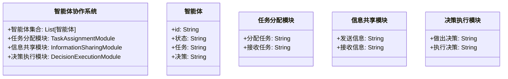
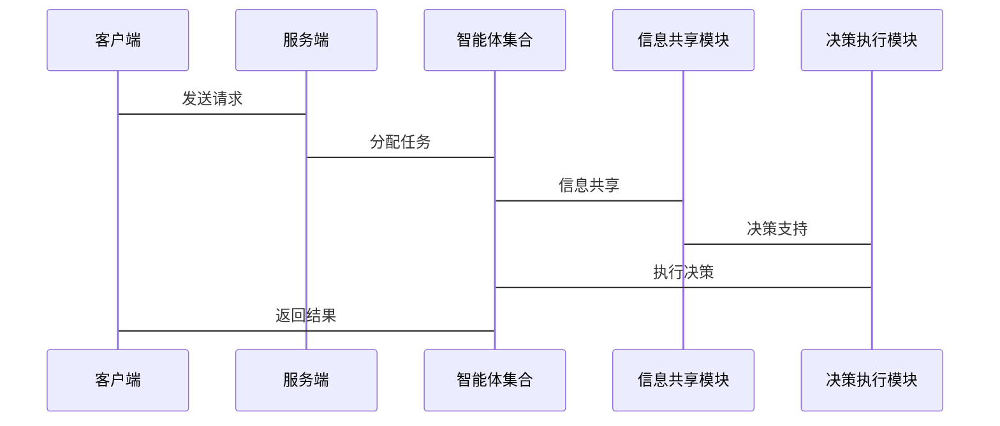

                 


# 智能体协作实现全面的市场流动性分析

> 关键词：智能体协作，市场流动性分析，分布式计算，协同过滤，强化学习，金融数据分析

> 摘要：本文探讨了智能体协作在市场流动性分析中的应用，详细分析了智能体协作的基本概念、算法原理以及在金融市场的实际应用。通过理论与实践相结合的方式，本文展示了如何利用智能体协作实现全面的市场流动性分析，为金融从业者和研究人员提供了新的视角和方法。

---

# 第一部分: 智能体协作与市场流动性分析基础

## 第1章: 智能体协作概述

### 1.1 智能体的基本概念

#### 1.1.1 智能体的定义与特点
智能体（Agent）是指具有感知环境、自主决策和执行任务能力的实体。智能体可以是软件程序、机器人或其他具备智能特性的系统。智能体的特点包括：
- **自主性**：能够自主决策和行动。
- **反应性**：能够感知环境并实时响应。
- **协作性**：能够与其他智能体或系统协同工作。
- **学习能力**：能够通过经验改进自身性能。

#### 1.1.2 智能体协作的内涵与外延
智能体协作是指多个智能体通过协同工作来完成复杂任务的过程。其内涵包括：
- **任务分解**：将复杂任务分解为多个子任务，分别由不同的智能体完成。
- **信息共享**：智能体之间共享信息，以提高整体决策的准确性。
- **协调机制**：通过协调机制确保智能体之间的行动一致。

智能体协作的外延包括：
- **分布式协作**：智能体分布在不同的节点上，通过网络进行通信和协作。
- **集中式协作**：所有智能体集中在一个中心节点上进行协作。
- **混合式协作**：结合分布式和集中式协作的特点。

#### 1.1.3 智能体协作与市场流动性分析的关系
市场流动性分析是指对市场中资产的买卖活跃程度进行分析。智能体协作可以通过以下方式提升市场流动性分析的效率和准确性：
- **数据采集**：智能体可以实时采集市场数据，如交易量、价格波动等。
- **数据处理**：通过协作，智能体可以共同处理海量数据，提高分析效率。
- **决策支持**：智能体可以根据分析结果为投资者提供决策支持。

---

### 1.2 市场流动性分析的基本概念

#### 1.2.1 市场流动性的定义
市场流动性是指资产在市场中快速买卖而不影响价格的能力。流动性高的资产可以迅速变现，而流动性低的资产则需要较长时间才能完成交易。

#### 1.2.2 市场流动性的主要影响因素
市场流动性受多种因素影响，包括：
- **交易量**：市场中资产的交易量越大，流动性越高。
- **价格波动**：价格波动越小，流动性越高。
- **市场深度**：市场中有足够的买方和卖方，可以支持大量交易。
- **市场参与者**：市场的参与者数量和类型也会影响流动性。

#### 1.2.3 市场流动性分析的意义与应用场景
市场流动性分析在金融领域具有重要意义，其应用场景包括：
- **交易策略优化**：帮助投资者制定更有效的交易策略。
- **风险管理**：识别市场中的流动性风险，避免因流动性不足导致的损失。
- **市场结构分析**：分析市场结构，优化市场设计。

---

### 1.3 智能体协作在市场流动性分析中的作用

#### 1.3.1 智能体协作的优势
智能体协作在市场流动性分析中的优势包括：
- **高效性**：通过分布式协作，智能体可以快速处理海量数据。
- **准确性**：智能体之间共享信息，可以提高分析结果的准确性。
- **适应性**：智能体可以根据市场变化动态调整分析策略。

#### 1.3.2 智能体协作在流动性分析中的具体应用
智能体协作在市场流动性分析中的具体应用包括：
- **数据采集与处理**：智能体实时采集市场数据，并通过协作进行数据清洗和预处理。
- **流动性预测**：通过智能体协作，利用机器学习算法对市场流动性进行预测。
- **风险预警**：智能体可以根据流动性分析结果，提前预警市场风险。

#### 1.3.3 智能体协作与传统流动性分析方法的对比
与传统流动性分析方法相比，智能体协作具有以下优势：
- **效率更高**：通过分布式协作，智能体可以快速处理数据。
- **准确性更强**：智能体之间共享信息，可以提高分析结果的准确性。
- **适应性更强**：智能体可以根据市场变化动态调整分析策略。

---

## 第2章: 智能体协作的核心概念与联系

### 2.1 智能体协作的核心原理

#### 2.1.1 智能体协作的基本原理
智能体协作的基本原理包括：
- **任务分解**：将复杂任务分解为多个子任务，分别由不同的智能体完成。
- **信息共享**：智能体之间共享信息，以提高整体决策的准确性。
- **协调机制**：通过协调机制确保智能体之间的行动一致。

#### 2.1.2 智能体协作的数学模型
智能体协作的数学模型可以通过以下公式表示：
$$Q(s, a) = r + \gamma \max_{a'} Q(s', a')$$
其中，$Q(s, a)$ 表示在状态 $s$ 下采取动作 $a$ 的期望奖励，$r$ 是即时奖励，$\gamma$ 是折扣因子，$\max_{a'} Q(s', a')$ 是下一步状态下的最大期望奖励。

#### 2.1.3 智能体协作的实现机制
智能体协作的实现机制包括：
- **通信机制**：智能体之间通过通信机制共享信息。
- **协调机制**：通过协调机制确保智能体之间的行动一致。
- **决策机制**：智能体根据共享的信息和环境反馈做出决策。

---

### 2.2 智能体协作的概念属性特征对比

#### 2.2.1 智能体协作的属性特征
智能体协作的属性特征包括：
- **分布式性**：智能体分布在不同的节点上，通过网络进行通信。
- **协作性**：智能体之间通过协作完成复杂任务。
- **动态性**：智能体可以根据环境变化动态调整协作策略。

#### 2.2.2 智能体协作与其他协作方式的对比
智能体协作与其他协作方式的对比如下：

| 对比维度       | 智能体协作               | 传统协作方式         |
|----------------|--------------------------|----------------------|
| 分布式         | 是                       | 否                   |
| 自主性         | 是                       | 否                   |
| 适应性         | 是                       | 否                   |
| 信息共享       | 是                       | 否                   |

#### 2.2.3 智能体协作的优缺点分析
智能体协作的优点包括：
- **高效性**：通过分布式协作，智能体可以快速处理海量数据。
- **准确性**：智能体之间共享信息，可以提高分析结果的准确性。
- **适应性**：智能体可以根据市场变化动态调整分析策略。

智能体协作的缺点包括：
- **复杂性**：智能体协作的实现较为复杂，需要考虑通信、协调等问题。
- **安全性**：智能体之间的通信可能存在安全隐患。

---

### 2.3 智能体协作的ER实体关系图

```mermaid
er
actor: 智能体
actor --> association: 协作关系
association --> entity: 市场流动性数据
```

---

## 第3章: 智能体协作的核心算法

### 3.1 分布式智能体协作算法

#### 3.1.1 分布式智能体协作的基本原理
分布式智能体协作是指多个智能体分布在不同的节点上，通过网络进行通信和协作。其基本原理包括：
- **任务分解**：将复杂任务分解为多个子任务，分别由不同的智能体完成。
- **信息共享**：智能体之间通过网络共享信息。
- **协调机制**：通过协调机制确保智能体之间的行动一致。

#### 3.1.2 分布式算法的实现流程
分布式智能体协作算法的实现流程如下：
1. **任务分解**：将复杂任务分解为多个子任务。
2. **信息共享**：智能体之间通过网络共享信息。
3. **协调机制**：通过协调机制确保智能体之间的行动一致。
4. **决策执行**：智能体根据共享的信息和环境反馈做出决策并执行。

#### 3.1.3 分布式算法的优缺点分析
分布式智能体协作算法的优点包括：
- **高效性**：通过分布式协作，智能体可以快速处理海量数据。
- **可靠性**：分布式协作可以提高系统的容错性。

分布式智能体协作算法的缺点包括：
- **复杂性**：分布式协作的实现较为复杂，需要考虑通信、协调等问题。
- **安全性**：智能体之间的通信可能存在安全隐患。

---

### 3.2 协同过滤算法

#### 3.2.1 协同过滤的定义与原理
协同过滤是一种基于用户行为或物品特征的推荐算法。其原理包括：
- **用户行为分析**：通过分析用户的行为，找到相似的用户或物品。
- **相似性计算**：通过计算用户或物品之间的相似性，推荐相似的物品。

#### 3.2.2 协同过滤的实现步骤
协同过滤的实现步骤如下：
1. **数据采集**：采集用户行为数据。
2. **相似性计算**：通过计算用户或物品之间的相似性。
3. **推荐生成**：根据相似性推荐相关物品。

#### 3.2.3 协同过滤的数学模型
协同过滤的数学模型可以通过以下公式表示：
$$\text{相似度} = \frac{\sum (x_i - \mu)(y_i - \mu)}{\sqrt{\sum (x_i - \mu)^2} \sqrt{\sum (y_i - \mu)^2}}$$
其中，$x_i$ 和 $y_i$ 分别表示两个用户的评分，$\mu$ 表示平均评分。

---

### 3.3 强化学习算法

#### 3.3.1 强化学习的基本原理
强化学习是一种基于奖励机制的机器学习算法。其基本原理包括：
- **状态空间**：智能体所处的环境状态。
- **动作空间**：智能体可以采取的动作。
- **奖励机制**：智能体通过采取动作获得奖励。

#### 3.3.2 强化学习在智能体协作中的应用
强化学习在智能体协作中的应用包括：
- **任务分配**：通过强化学习算法，智能体可以自动分配任务。
- **策略优化**：通过强化学习算法，智能体可以优化协作策略。

#### 3.3.3 强化学习的数学模型
强化学习的数学模型可以通过以下公式表示：
$$Q(s, a) = r + \gamma \max_{a'} Q(s', a')$$
其中，$Q(s, a)$ 表示在状态 $s$ 下采取动作 $a$ 的期望奖励，$r$ 是即时奖励，$\gamma$ 是折扣因子，$\max_{a'} Q(s', a')$ 是下一步状态下的最大期望奖励。

---

## 第4章: 智能体协作的系统架构设计

### 4.1 系统功能设计

#### 4.1.1 领域模型
领域模型可以通过以下类图表示：



#### 4.1.2 系统架构
系统架构可以通过以下架构图表示：

```mermaid
archi
    客户端 ---(请求)--> 服务端
    服务端 ---(任务分配)--> 智能体集合
    智能体集合 ---(信息共享)--> 信息共享模块
    信息共享模块 ---(决策支持)--> 决策执行模块
    决策执行模块 ---(反馈)--> 智能体集合
```

#### 4.1.3 系统交互
系统交互可以通过以下序列图表示：



---

## 第5章: 智能体协作的项目实战

### 5.1 项目环境配置

#### 5.1.1 环境要求
项目环境配置要求如下：
- **操作系统**：Linux/Windows/MacOS
- **编程语言**：Python
- **开发工具**：Jupyter Notebook/PyCharm
- **依赖库**：numpy, pandas, scikit-learn, matplotlib

#### 5.1.2 安装依赖
安装依赖可以通过以下命令完成：
```bash
pip install numpy pandas scikit-learn matplotlib
```

---

### 5.2 系统核心实现

#### 5.2.1 智能体协作模块实现
智能体协作模块的实现代码如下：
```python
class Agent:
    def __init__(self, id):
        self.id = id
        self.state = "idle"
        self.task = None
        self.decision = None

    def receive_task(self, task):
        self.task = task
        self.state = "busy"

    def execute_decision(self, decision):
        self.decision = decision
        self.state = "idle"

class TaskAssignmentModule:
    def __init__(self, agents):
        self.agents = agents

    def assign_task(self, task):
        for agent in self.agents:
            if agent.state == "idle":
                agent.receive_task(task)
                return agent

        return None
```

#### 5.2.2 信息共享模块实现
信息共享模块的实现代码如下：
```python
class InformationSharingModule:
    def __init__(self):
        self.agents = []

    def register_agent(self, agent):
        self.agents.append(agent)

    def share_info(self, info):
        for agent in self.agents:
            agent.receive_info(info)
```

---

### 5.3 案例分析与详细解读

#### 5.3.1 案例分析
案例分析：假设我们有一个包含三个智能体的系统，智能体分别负责数据采集、数据分析和决策执行。智能体之间通过信息共享模块进行通信，完成市场流动性分析任务。

#### 5.3.2 详细解读
详细解读：
1. **任务分配**：任务分配模块将市场流动性分析任务分解为数据采集、数据分析和决策执行三个子任务。
2. **信息共享**：智能体之间通过信息共享模块共享数据和分析结果。
3. **决策执行**：决策执行模块根据分析结果生成决策，并通过智能体执行决策。
4. **反馈机制**：智能体将执行结果反馈给任务分配模块，完成整个流程。

---

## 第6章: 总结与展望

### 6.1 总结
本文详细探讨了智能体协作在市场流动性分析中的应用，介绍了智能体协作的基本概念、算法原理和系统架构设计。通过理论与实践相结合的方式，展示了如何利用智能体协作实现全面的市场流动性分析。

---

### 6.2 展望
未来的研究方向包括：
1. **智能体协作的优化**：进一步优化智能体协作算法，提高系统的效率和准确性。
2. **智能体协作的安全性**：研究智能体协作的安全性问题，提出有效的安全防护措施。
3. **智能体协作的应用拓展**：将智能体协作应用于更多的金融领域，如风险管理、投资决策等。

---

作者：AI天才研究院/AI Genius Institute & 禅与计算机程序设计艺术 /Zen And The Art of Computer Programming

