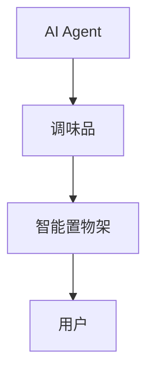
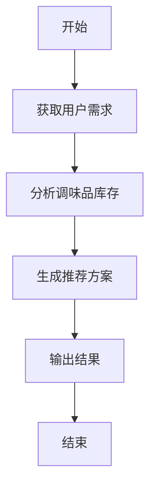
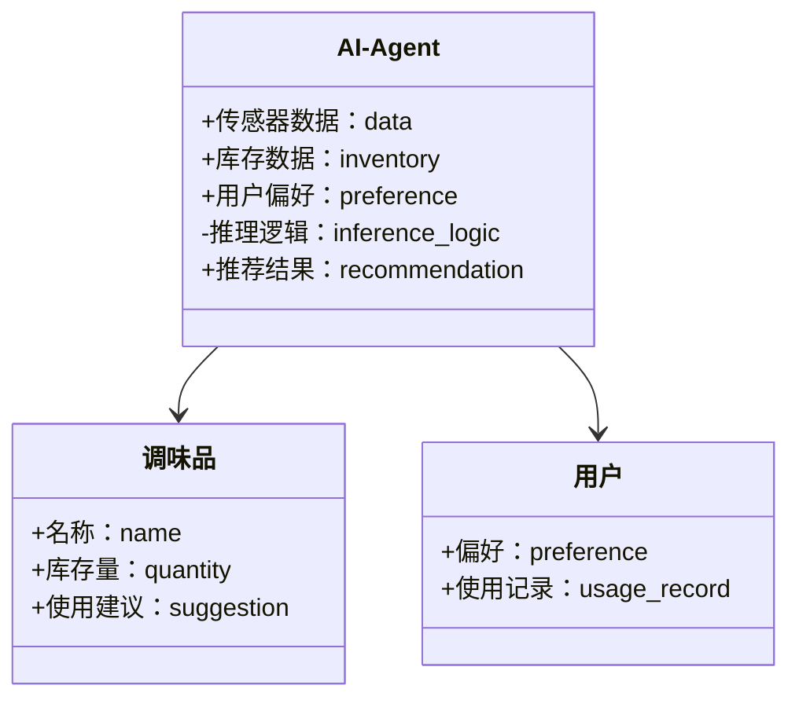
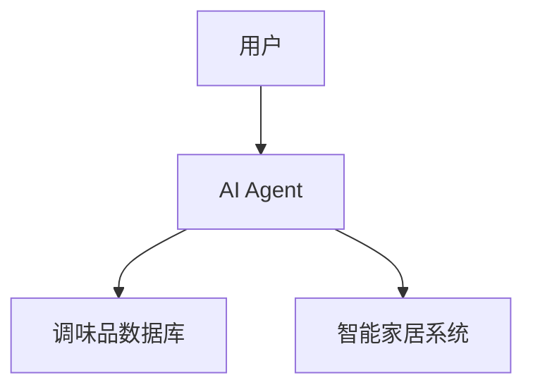
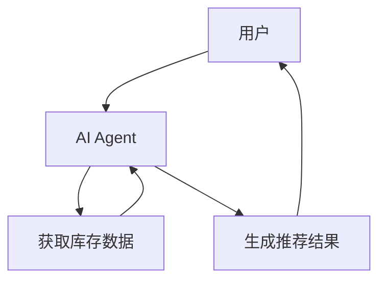

                 


# 智能厨房置物架：AI Agent的调味品使用建议

## 关键词：智能厨房置物架、AI Agent、调味品管理、推荐系统、物联网

## 摘要：本文深入探讨了智能厨房置物架在调味品管理中的应用，结合AI Agent技术，提出了一套基于规则的推荐算法和系统架构设计，详细分析了系统实现的各个环节，并通过实际案例展示了AI Agent在调味品管理中的优势和潜力。

---

# 第一部分: 智能厨房置物架与AI Agent的背景介绍

## 第1章: 智能厨房置物架与AI Agent概述

### 1.1 问题背景与描述

#### 1.1.1 厨房调味品管理的痛点
在现代家庭中，厨房调味品的管理常常面临以下问题：
- **存储混乱**：调味品种类繁多，存放位置不固定，导致使用时难以找到。
- **使用浪费**：用户可能因为忘记调味品的使用方法或过期情况而造成浪费。
- **购买重复**：由于无法实时掌握库存情况，容易出现重复购买的情况。

#### 1.1.2 智能厨房置物架的定义与目标
智能厨房置物架是一种结合物联网（IoT）和人工智能（AI）技术的智能设备，旨在通过自动化管理和智能化推荐，帮助用户优化调味品的使用和管理。其目标是：
- 提供实时的调味品库存管理。
- 提供基于用户偏好的智能化推荐。
- 实现与智能家居系统的无缝集成。

#### 1.1.3 AI Agent在调味品管理中的作用
AI Agent（智能代理）通过感知用户行为和环境信息，能够主动为用户提供决策支持。在调味品管理中，AI Agent可以：
- 分析用户的烹饪习惯，推荐合适的调味品。
- 根据库存情况，提醒用户及时补充或清理过期调味品。
- 学习用户的口味偏好，优化推荐策略。

### 1.2 问题解决与边界

#### 1.2.1 AI Agent如何优化调味品使用
AI Agent通过以下方式优化调味品的使用：
- **数据采集**：通过传感器采集调味品的使用频率、用量等数据。
- **数据分析**：分析数据，识别用户的使用习惯和偏好。
- **决策支持**：根据分析结果，为用户提供最优的调味品使用建议。

#### 1.2.2 智能置物架的功能边界
智能置物架的功能边界包括：
- **硬件功能**：支持调味品的存储、传感器数据采集。
- **软件功能**：AI Agent的数据分析和推荐功能。
- **交互功能**：与用户和其他智能家居设备的交互接口。

#### 1.2.3 调味品管理的场景外延
调味品管理的场景外延包括：
- **家庭场景**：服务于家庭用户。
- **餐厅场景**：应用于餐饮行业。
- **智能厨房生态**：与其他智能家居设备联动。

### 1.3 核心概念与结构

#### 1.3.1 AI Agent的核心要素
AI Agent的核心要素包括：
- **感知能力**：通过传感器感知环境和用户行为。
- **推理能力**：基于感知数据进行逻辑推理。
- **执行能力**：根据推理结果执行相应的操作。

#### 1.3.2 智能置物架的系统架构
智能置物架的系统架构包括：
- **硬件层**：传感器、存储模块、通信模块。
- **数据层**：数据采集、数据存储、数据处理。
- **应用层**：用户界面、推荐算法、交互接口。

#### 1.3.3 调味品管理的逻辑关系
调味品管理的逻辑关系包括：
- **用户需求**：用户的烹饪需求和口味偏好。
- **库存状态**：调味品的库存量和使用情况。
- **推荐策略**：基于用户需求和库存状态的推荐结果。

## 1.4 本章小结
本章通过分析厨房调味品管理的痛点，介绍了智能厨房置物架的目标和AI Agent的作用，明确了系统的功能边界和核心要素。

---

## 第2章: AI Agent与智能置物架的核心概念

### 2.1 核心概念原理

#### 2.1.1 AI Agent的基本原理
AI Agent的基本原理包括：
- **数据采集**：通过传感器采集环境数据。
- **数据处理**：对采集的数据进行清洗、分析和建模。
- **决策推理**：基于分析结果进行推理和决策。
- **执行反馈**：根据决策结果执行操作，并根据反馈调整策略。

#### 2.1.2 智能置物架的技术基础
智能置物架的技术基础包括：
- **物联网技术**：实现设备间的互联互通。
- **人工智能技术**：支持数据的智能分析和推荐。
- **传感器技术**：采集环境和用户行为数据。

#### 2.1.3 调味品管理的逻辑模型
调味品管理的逻辑模型包括：
- **输入层**：用户的烹饪需求和库存数据。
- **处理层**：数据的分析和推理。
- **输出层**：推荐结果和执行指令。

### 2.2 核心概念对比分析

#### 2.2.1 AI Agent与传统自动化设备的对比
| 特性 | AI Agent | 传统自动化设备 |
|------|-----------|----------------|
| 智能性 | 高         | 低             |
| 可定制性 | 高         | 低             |
| 学习能力 | 高         | 无             |

#### 2.2.2 智能置物架与普通置物架的差异
- **功能**：智能置物架具备智能化管理和推荐功能，而普通置物架仅提供存储功能。
- **技术**：智能置物架结合了物联网和人工智能技术，而普通置物架仅是机械装置。
- **用户交互**：智能置物架支持人机交互，提供个性化服务，而普通置物架仅支持简单的物理操作。

#### 2.2.3 调味品管理的场景特征
- **实时性**：调味品的使用和库存需要实时监控。
- **个性化**：根据用户的口味偏好提供个性化推荐。
- **联动性**：与其他智能家居设备联动，实现协同工作。

### 2.3 ER实体关系图


## 2.4 本章小结
本章通过对比分析，明确了AI Agent和智能置物架的核心概念和差异，为后续的系统设计奠定了基础。

---

## 第3章: AI Agent的算法原理

### 3.1 算法原理概述

#### 3.1.1 基于规则的推理算法
基于规则的推理算法是一种简单的推荐算法，适用于规则明确的场景。例如：
- **规则**：如果用户喜欢辣味，推荐使用辣椒粉。
- **优点**：简单易实现，规则清晰。
- **缺点**：难以处理复杂场景，推荐结果可能不够精准。

#### 3.1.2 基于机器学习的推荐算法
基于机器学习的推荐算法通过训练模型，能够自动学习用户的偏好，推荐更精准的调味品。例如：
- **算法**：协同过滤、聚类分析。
- **优点**：推荐结果更精准，能够处理复杂场景。
- **缺点**：需要大量数据训练，计算复杂度较高。

#### 3.1.3 算法选择的依据
选择算法的依据包括：
- **数据特征**：数据量、数据类型。
- **计算资源**：算法的计算复杂度。
- **推荐效果**：算法的推荐精度和用户满意度。

### 3.2 算法流程图


### 3.3 算法实现代码

#### 3.3.1 基于规则的推荐算法
```python
def get_recommendation(user_preference):
    # 简单示例：基于规则的推荐算法
    if user_preference == '咸':
        return '盐'
    elif user_preference == '甜':
        return '糖'
    else:
        return '酱油'
```

#### 3.3.2 基于机器学习的推荐算法
```python
from sklearn.neighbors import NearestNeighbors

# 假设我们有一个训练好的协同过滤模型
model = NearestNeighbors(n_neighbors=3).fit(X)

# 获取推荐结果
distances, indices = model.kneighbors([new_user], n_neighbors=3)
recommended_products = [products[i] for i in indices[0]]
```

### 3.4 数学模型与公式

#### 3.4.1 分类问题的数学模型
$$ P(y|x) = \frac{P(x|y)P(y)}{P(x)} $$

#### 3.4.2 推荐算法的损失函数
$$ L = -\sum_{i=1}^{n} \log P(y_i|x_i) $$

### 3.5 本章小结
本章详细介绍了AI Agent的算法原理，包括基于规则的推理算法和基于机器学习的推荐算法，并通过代码示例和数学公式进行了深入分析。

---

## 第4章: 系统分析与架构设计方案

### 4.1 问题场景介绍
智能厨房置物架的应用场景包括：
- **家庭用户**：帮助用户优化调味品的使用和管理。
- **餐饮行业**：应用于餐厅和酒店，优化食材管理。
- **智能家居生态**：与其他智能家居设备联动，实现智能化管理。

### 4.2 系统功能设计

#### 4.2.1 领域模型类图


#### 4.2.2 系统架构图


#### 4.2.3 系统接口设计
- **输入接口**：用户输入调味品使用需求和偏好。
- **输出接口**：推荐结果和执行指令。
- **交互接口**：与智能家居设备的通信接口。

#### 4.2.4 系统交互流程图


### 4.3 本章小结
本章通过系统分析和架构设计，明确了智能厨房置物架的系统功能和交互流程。

---

## 第5章: 项目实战

### 5.1 环境安装
为了运行智能厨房置物架系统，需要安装以下环境：
- **硬件**：智能置物架、传感器、通信模块。
- **软件**：Python编程环境、机器学习库（如Scikit-learn）。
- **依赖**：安装必要的Python包，如`mermaid`、`scikit-learn`。

### 5.2 系统核心实现

#### 5.2.1 AI Agent的实现
```python
class AIAgent:
    def __init__(self):
        self.inventory = {}  # 存储调味品库存
        self.preference = {}  # 用户偏好

    def get_recommendation(self, user_id):
        # 获取用户偏好
        pref = self.preference.get(user_id, '通用')
        # 根据偏好生成推荐
        if pref == '辣':
            return '辣椒粉'
        elif pref == '甜':
            return '糖'
        else:
            return '酱油'

    def update_inventory(self, product, quantity):
        self.inventory[product] = quantity
```

#### 5.2.2 调味品数据库的实现
```python
class SpiceDatabase:
    def __init__(self):
        self.data = {}

    def add_spice(self, name, quantity):
        self.data[name] = quantity

    def get_stock(self, name):
        return self.data.get(name, 0)
```

### 5.3 代码应用解读与分析
- **AI Agent类**：负责处理用户的请求，生成推荐结果，并更新库存数据。
- **调味品数据库类**：负责存储和管理调味品的库存信息。
- **交互逻辑**：用户通过AI Agent提交请求，AI Agent调用数据库获取数据，并生成推荐结果。

### 5.4 实际案例分析
假设用户A喜欢辣味，当前库存有辣椒粉和酱油。AI Agent会根据用户的偏好推荐辣椒粉，并提醒用户及时补充库存。

### 5.5 项目小结
本章通过实际案例分析，详细展示了智能厨房置物架的系统实现和代码应用。

---

## 第6章: 最佳实践与总结

### 6.1 小结
智能厨房置物架通过AI Agent技术，能够实现调味品的智能化管理和推荐，显著优化用户的使用体验。

### 6.2 注意事项
- **数据隐私**：用户数据的隐私保护。
- **系统稳定性**：确保系统的稳定运行和数据的安全性。
- **用户体验**：推荐结果需要符合用户的实际需求。

### 6.3 拓展阅读
- **相关技术**：深入学习物联网和人工智能技术。
- **应用场景**：探索智能厨房置物架在更多场景中的应用。

---

## 作者
作者：AI天才研究院/AI Genius Institute  
作者：禅与计算机程序设计艺术/Zen And The Art of Computer Programming

