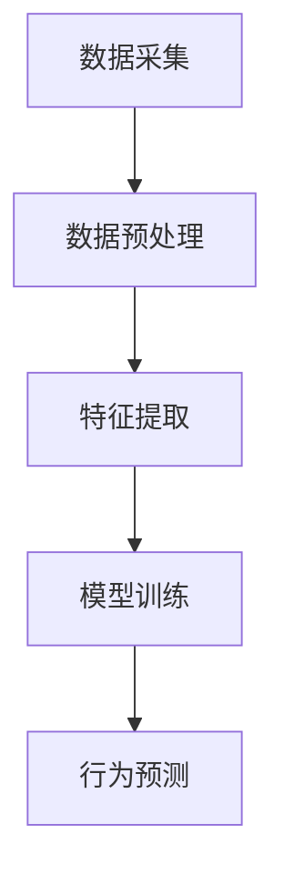
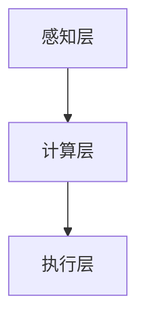
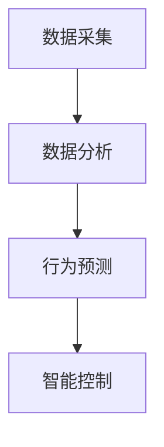
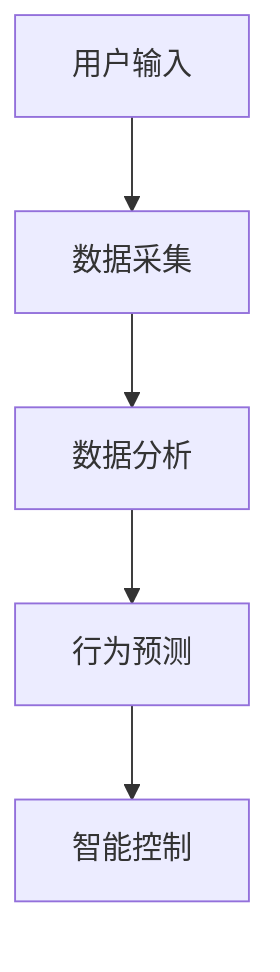

                 


# 智能地板：AI Agent的室内活动模式分析

> 关键词：智能地板，AI Agent，室内活动模式，传感器网络，人工智能，物联网

> 摘要：本文深入分析了智能地板与AI Agent的结合，探讨了其在室内活动模式分析中的应用。通过传感器网络的数据采集与处理，结合AI Agent的核心算法，实现对人体行为的智能识别与预测，为智能家居、智能办公等领域提供了新的解决方案。

---

# 第一部分: 智能地板与AI Agent的背景介绍

## 第1章: 智能地板的概念与技术基础

### 1.1 智能地板的定义与背景

#### 1.1.1 智能地板的定义
智能地板是一种结合了物联网（IoT）和人工智能（AI）技术的地面系统，能够实时感知并分析室内环境中的物理量（如压力、温度、湿度等），并通过AI算法对数据进行处理和分析，从而实现对室内活动模式的智能识别与预测。

#### 1.1.2 智能地板的发展背景
随着智能家居、智能办公等场景的普及，对室内环境的智能化感知与分析需求日益增加。传统的传感器网络虽然能够采集数据，但缺乏智能分析能力，无法满足复杂场景下的实时决策需求。AI Agent的引入，为智能地板提供了智能化的决策能力。

#### 1.1.3 智能地板的应用场景
- 智能家居：通过感知人体活动，实现智能家居设备的智能控制。
- 智能办公：优化办公环境，提升工作效率。
- 智能医疗：监测患者行为，辅助医疗决策。

### 1.2 AI Agent的基本概念

#### 1.2.1 AI Agent的定义
AI Agent（人工智能代理）是一种能够感知环境、自主决策并执行任务的智能实体。它能够根据环境信息和目标，动态调整行为策略，以实现最优任务执行。

#### 1.2.2 AI Agent的核心特点
- **自主性**：能够在没有外部干预的情况下独立运行。
- **反应性**：能够实时感知环境变化并做出响应。
- **目标导向性**：基于目标驱动行为决策。
- **学习能力**：通过数据反馈不断优化自身算法。

#### 1.2.3 AI Agent与传统AI的区别
| 特性                | AI Agent                          | 传统AI                              |
|---------------------|-----------------------------------|--------------------------------------|
| 运行方式            | 实时运行，动态调整                | 离线处理，静态分析                  |
| 交互能力            | 具备与环境的交互能力              | 通常不与环境交互                   |
| 目标导向性          | 基于目标驱动行为                  | 基于任务驱动，目标性较弱          |

### 1.3 智能地板与AI Agent的结合

#### 1.3.1 智能地板的智能化需求
智能地板需要具备以下能力：
- 实时感知室内环境数据。
- 对数据进行智能分析，识别室内活动模式。
- 根据分析结果，动态调整系统行为。

#### 1.3.2 AI Agent在智能地板中的作用
AI Agent作为智能地板的核心，负责：
- **数据感知**：通过传感器网络获取环境数据。
- **数据处理**：对数据进行分析与特征提取。
- **决策执行**：基于分析结果，制定并执行行为策略。

#### 1.3.3 智能地板与AI Agent的协同工作模式
智能地板与AI Agent的协同工作流程如下：
1. **数据采集**：传感器网络采集环境数据。
2. **数据传输**：数据通过网络传输至AI Agent。
3. **数据处理**：AI Agent对数据进行分析与特征提取。
4. **决策制定**：基于分析结果，AI Agent制定行为策略。
5. **执行反馈**：AI Agent通过执行机构调整系统行为，并实时反馈结果。

---

## 第2章: 智能地板的技术基础

### 2.1 智能地板的感知层

#### 2.1.1 传感器技术
智能地板的感知层主要依赖多种传感器，包括：
- **压力传感器**：用于感知人体的重量分布。
- **温度传感器**：用于感知环境温度。
- **湿度传感器**：用于感知环境湿度。
- **加速度传感器**：用于感知物体的运动状态。

#### 2.1.2 数据采集与处理
数据采集过程需要考虑以下问题：
- **采样频率**：数据采集的频率影响系统的实时性和准确性。
- **数据同步**：多传感器数据的时间同步问题。
- **数据存储**：实时数据的存储与管理。

#### 2.1.3 传感器网络的构建
传感器网络的构建需要考虑：
- **网络拓扑结构**：如星型、树状、网状等。
- **通信协议**：如Wi-Fi、蓝牙、ZigBee等。
- **节点布置**：传感器的布点密度与覆盖范围。

### 2.2 智能地板的计算层

#### 2.2.1 本地计算与边缘计算
智能地板的计算层可以采用：
- **本地计算**：数据在本地进行处理，适合低延迟场景。
- **边缘计算**：数据在边缘设备（如网关）进行处理，平衡计算资源与延迟。

#### 2.2.2 云计算与大数据处理
对于需要大量计算的场景，可以采用云计算：
- **数据上传**：将本地数据上传至云端进行处理。
- **大数据分析**：利用大数据技术进行模式识别与预测。

#### 2.2.3 AI算法的实现与优化
AI算法的实现需要考虑：
- **算法选择**：如支持向量机（SVM）、随机森林（Random Forest）、神经网络（Neural Network）等。
- **算法优化**：通过参数调优、模型压缩等方式提升算法性能。

### 2.3 智能地板的执行层

#### 2.3.1 执行机构的控制
执行机构可以包括：
- **灯光控制**：根据室内活动模式调节照明。
- **温度调节**：根据环境数据调整空调或暖气。
- **安全报警**：在检测到异常行为时触发报警。

#### 2.3.2 执行机构的反馈机制
反馈机制用于：
- **状态确认**：确认执行机构是否按指令执行。
- **动态调整**：根据反馈结果实时调整系统行为。

#### 2.3.3 执行层与感知层的协同
执行层与感知层需要协同工作，确保系统的实时性和准确性。

---

## 第3章: 智能地板的市场与应用

### 3.1 智能地板的市场现状

#### 3.1.1 全球市场分析
全球智能地板市场近年来快速增长，主要驱动因素包括：
- 智能家居的普及。
- 人工智能技术的成熟。
- 物联网技术的广泛应用。

#### 3.1.2 中国市场分析
中国市场在智能地板领域表现尤为突出，主要得益于：
- 国内科技企业的积极推动。
- 政府政策的支持。
- 消费者对智能化产品的接受度提高。

#### 3.1.3 市场驱动因素
- 技术进步：AI与IoT技术的融合推动了智能地板的发展。
- 需求增长：消费者对智能化生活的追求。
- 应用场景扩展：智能地板的应用场景不断拓展。

### 3.2 智能地板的应用场景

#### 3.2.1 智能家居
智能地板在智能家居中的应用包括：
- **人体活动监测**：实时监测家庭成员的活动状态。
- **智能控制**：根据活动模式自动调节家居设备。

#### 3.2.2 智能办公
在智能办公场景中，智能地板可以：
- **优化办公环境**：根据员工活动调整室内温湿度。
- **安全监控**：实时监测办公区域的异常活动。

#### 3.2.3 智能酒店
智能地板在智能酒店中的应用包括：
- **宾客活动监测**：实时监测宾客的活动状态。
- **智能服务**：根据活动模式提供个性化服务。

#### 3.2.4 智能医疗
在智能医疗场景中，智能地板可以：
- **患者行为监测**：实时监测患者的活动状态。
- **异常检测**：及时发现患者的异常行为。

### 3.3 智能地板的未来发展趋势

#### 3.3.1 技术发展趋势
- **算法优化**：AI算法的不断优化将提升智能地板的分析能力。
- **传感器创新**：新型传感器的出现将提升数据采集的精度和效率。
- **边缘计算**：边缘计算的普及将降低智能地板的延迟。

#### 3.3.2 市场发展趋势
- **市场扩展**：智能地板的应用场景将进一步扩展。
- **竞争加剧**：市场竞争将更加激烈，推动技术创新。
- **生态建设**：智能地板的生态体系将更加完善。

#### 3.3.3 应用场景的扩展
- **智能教育**：在智能教室中监测学生的行为。
- **智能交通**：在公共空间中监测人群活动。

---

# 第二部分: AI Agent在智能地板中的核心原理

## 第4章: AI Agent的核心原理

### 4.1 AI Agent的基本原理

#### 4.1.1 AI Agent的感知机制
AI Agent的感知机制包括：
- **数据采集**：通过传感器获取环境数据。
- **数据预处理**：对数据进行清洗、归一化等处理。
- **特征提取**：从数据中提取有用的特征。

#### 4.1.2 AI Agent的决策机制
决策机制是AI Agent的核心，包括：
- **特征分析**：对提取的特征进行分析。
- **行为预测**：基于分析结果预测下一步行为。
- **策略选择**：根据预测结果选择最优策略。

#### 4.1.3 AI Agent的执行机制
执行机制包括：
- **行为执行**：根据决策结果执行相应操作。
- **反馈收集**：收集执行结果的反馈信息。
- **动态调整**：根据反馈调整行为策略。

### 4.2 AI Agent的感知层

#### 4.2.1 传感器网络的构建
传感器网络的构建需要考虑：
- **传感器布置**：传感器的布置密度与位置。
- **传感器类型**：不同传感器的组合使用。
- **传感器校准**：传感器的校准与标定。

#### 4.2.2 数据预处理
数据预处理是AI Agent感知的关键步骤，包括：
- **数据清洗**：去除噪声数据。
- **数据归一化**：将数据标准化处理。
- **数据融合**：多源数据的融合处理。

#### 4.2.3 特征提取
特征提取是将原始数据转换为更有意义的特征表示，常用的方法包括：
- **主成分分析（PCA）**：降维处理。
- **小波变换**：信号处理。
- **深度学习特征提取**：如卷积神经网络（CNN）。

### 4.3 AI Agent的决策层

#### 4.3.1 算法选择
决策层的核心是算法的选择，常用的算法包括：
- **支持向量机（SVM）**：适用于分类任务。
- **随机森林（Random Forest）**：适用于分类与回归任务。
- **神经网络（NN）**：适用于复杂模式识别任务。

#### 4.3.2 算法实现
算法实现需要考虑：
- **模型训练**：数据集的划分与训练。
- **模型评估**：模型的准确率、召回率等指标。
- **模型优化**：参数调优与模型压缩。

#### 4.3.3 决策反馈
决策反馈是AI Agent的重要环节，包括：
- **行为预测**：基于模型预测下一步行为。
- **策略调整**：根据反馈结果调整行为策略。
- **结果分析**：分析反馈结果对系统的影响。

---

## 第5章: AI Agent的算法实现

### 5.1 算法原理

#### 5.1.1 算法概述
本文采用基于深度学习的AI Agent算法，主要流程如下：
1. 数据采集：通过传感器网络采集环境数据。
2. 数据预处理：对数据进行清洗、归一化处理。
3. 特征提取：提取数据中的有用特征。
4. 模型训练：基于提取的特征训练AI模型。
5. 行为预测：利用模型对室内活动模式进行预测。

#### 5.1.2 算法流程
以下是算法的流程图：



### 5.2 算法实现

#### 5.2.1 数据预处理
数据预处理代码示例：

```python
import numpy as np
import pandas as pd

# 数据加载
data = pd.read_csv('sensor_data.csv')

# 数据清洗
data.dropna(inplace=True)

# 数据归一化
from sklearn.preprocessing import StandardScaler
scaler = StandardScaler()
data_normalized = scaler.fit_transform(data)
```

#### 5.2.2 特征提取
特征提取代码示例：

```python
from sklearn.decomposition import PCA

# PCA降维
pca = PCA(n_components=3)
principal_components = pca.fit_transform(data_normalized)
```

#### 5.2.3 模型训练
模型训练代码示例：

```python
from sklearn.svm import SVC

# 模型训练
model = SVC()
model.fit(principal_components, labels)
```

#### 5.2.4 行为预测
行为预测代码示例：

```python
# 行为预测
new_data = pca.transform(new_data_normalized)
predicted_labels = model.predict(new_data)
```

### 5.3 算法优化

#### 5.3.1 参数调优
参数调优是提高模型性能的重要手段，常用的参数包括：
- **C**：SVM的惩罚参数。
- **n_estimators**：随机森林的树的数量。
- **learning_rate**：神经网络的学习率。

#### 5.3.2 模型压缩
模型压缩是降低模型复杂度的方法，包括：
- **剪枝**：剪枝技术用于减少模型的复杂度。
- **量化**：将模型参数量化以减少存储空间。
- **知识蒸馏**：将大模型的知识迁移到小模型。

---

## 第6章: 智能地板的系统设计与实现

### 6.1 系统架构设计

#### 6.1.1 系统架构概述
智能地板的系统架构包括：
- **感知层**：传感器网络。
- **计算层**：AI Agent算法。
- **执行层**：执行机构。

#### 6.1.2 系统架构图
以下是系统架构图：



### 6.2 系统功能设计

#### 6.2.1 系统功能概述
智能地板的主要功能包括：
- **数据采集**：采集室内环境数据。
- **数据分析**：分析室内活动模式。
- **行为预测**：预测下一步室内活动。
- **智能控制**：根据预测结果调整系统行为。

#### 6.2.2 系统功能图
以下是系统功能图：



### 6.3 系统接口设计

#### 6.3.1 接口定义
系统接口主要分为：
- **数据接口**：传感器数据的输入接口。
- **控制接口**：执行机构的控制接口。
- **用户接口**：用户与系统的交互接口。

#### 6.3.2 接口协议
常用的接口协议包括：
- **HTTP**：用于Web接口。
- **MQTT**：用于物联网设备的通信。
- **CoAP**：用于受限设备的通信。

### 6.4 系统交互设计

#### 6.4.1 交互流程
以下是系统交互流程图：



#### 6.4.2 交互反馈
系统需要提供实时的交互反馈，包括：
- **状态反馈**：实时显示系统状态。
- **结果反馈**：显示行为预测结果。
- **用户反馈**：用户可以根据反馈结果调整系统行为。

---

## 第7章: 智能地板的优化与提升

### 7.1 系统性能优化

#### 7.1.1 算法优化
算法优化是提升系统性能的关键，包括：
- **模型优化**：优化模型结构与参数。
- **算法加速**：通过并行计算等技术加速算法执行。
- **数据优化**：优化数据预处理流程。

#### 7.1.2 系统架构优化
系统架构优化包括：
- **分布式架构**：通过分布式架构提升系统的扩展性。
- **边缘计算**：在边缘设备上进行数据处理，减少云端依赖。
- **负载均衡**：通过负载均衡技术优化系统性能。

### 7.2 用户体验优化

#### 7.2.1 界面优化
界面优化包括：
- **直观的可视化界面**：方便用户查看系统状态。
- **友好的操作界面**：简化用户的操作流程。
- **实时反馈**：提供实时的用户反馈。

#### 7.2.2 功能优化
功能优化包括：
- **个性化设置**：提供个性化配置选项。
- **多设备兼容**：支持多种设备的连接与控制。
- **智能联动**：实现多个设备的智能联动。

### 7.3 安全与隐私优化

#### 7.3.1 数据安全
数据安全是智能地板系统的重要组成部分，包括：
- **数据加密**：对敏感数据进行加密处理。
- **访问控制**：严格控制数据的访问权限。
- **安全审计**：定期进行安全审计，发现并修复漏洞。

#### 7.3.2 用户隐私
用户隐私保护包括：
- **数据匿名化**：对用户数据进行匿名化处理。
- **隐私政策**：制定并公示隐私政策，明确数据使用范围。
- **用户授权**：获得用户的明确授权后才能使用数据。

### 7.4 系统商业化

#### 7.4.1 商业化策略
商业化策略包括：
- **产品定价**：制定合理的产品定价策略。
- **市场推广**：通过多种渠道进行市场推广。
- **合作伙伴**：与上下游企业建立合作关系。

#### 7.4.2 商业化模式
商业化模式包括：
- **订阅模式**：用户按月或按年订阅服务。
- **硬件销售**：销售智能地板硬件。
- **服务收费**：提供定制化服务并收费。

---

# 第三部分: 智能地板的项目实战

## 第8章: 项目实战

### 8.1 项目背景

#### 8.1.1 项目介绍
本项目旨在开发一套基于AI Agent的智能地板系统，能够实时感知室内环境数据，并通过AI算法分析室内活动模式，实现对人体行为的智能识别与预测。

#### 8.1.2 项目目标
- 实现智能地板的数据采集与处理。
- 开发AI Agent算法，实现室内活动模式的智能识别。
- 实现智能控制功能，根据预测结果调整系统行为。

### 8.2 项目实现

#### 8.2.1 环境安装
项目环境安装步骤如下：
1. **安装Python**：安装最新版本的Python。
2. **安装依赖库**：安装所需的依赖库，如NumPy、Pandas、Scikit-learn等。
3. **安装传感器驱动**：安装传感器的驱动程序。

#### 8.2.2 核心代码实现
以下是核心代码实现：

```python
import numpy as np
import pandas as pd
from sklearn.preprocessing import StandardScaler
from sklearn.decomposition import PCA
from sklearn.svm import SVC
from sklearn.metrics import accuracy_score

# 数据加载
data = pd.read_csv('sensor_data.csv')

# 数据清洗
data.dropna(inplace=True)

# 数据归一化
scaler = StandardScaler()
data_normalized = scaler.fit_transform(data)

# PCA降维
pca = PCA(n_components=3)
principal_components = pca.fit_transform(data_normalized)

# 模型训练
model = SVC()
model.fit(principal_components, labels)

# 行为预测
new_data = pca.transform(new_data_normalized)
predicted_labels = model.predict(new_data)

# 模型评估
accuracy = accuracy_score(labels, predicted_labels)
print(f'Accuracy: {accuracy}')
```

#### 8.2.3 代码解读
- **数据加载**：使用Pandas加载数据。
- **数据清洗**：删除缺失值。
- **数据归一化**：对数据进行标准化处理。
- **PCA降维**：使用PCA将数据降维到3维。
- **模型训练**：使用SVM模型进行训练。
- **行为预测**：对新数据进行预测。
- **模型评估**：计算模型的准确率。

### 8.3 实际案例分析

#### 8.3.1 案例介绍
本案例基于一个智能家居场景，通过智能地板系统实时监测家庭成员的活动状态。

#### 8.3.2 数据分析
通过对传感器数据的分析，系统能够识别家庭成员的活动模式，如：
- **起床**：早晨起床的行为模式。
- **用餐**：用餐时的行为模式。
- **休息**：休息时的行为模式。

#### 8.3.3 系统优化
根据实际应用中的反馈，对系统进行优化，包括：
- **算法优化**：进一步优化模型参数，提高预测准确率。
- **系统性能优化**：优化系统架构，提升运行效率。
- **用户体验优化**：优化用户界面，提升用户体验。

### 8.4 项目小结

#### 8.4.1 项目总结
通过本项目，我们成功开发了一套基于AI Agent的智能地板系统，能够实时感知室内环境数据，并通过AI算法分析室内活动模式，实现对人体行为的智能识别与预测。

#### 8.4.2 项目意义
本项目的成功实施，不仅验证了AI Agent在智能地板中的应用价值，也为智能家居、智能办公等领域提供了新的解决方案。

---

# 第四部分: 智能地板的优化与提升

## 第9章: 系统优化与提升

### 9.1 系统性能优化

#### 9.1.1 算法优化
算法优化是提升系统性能的关键，包括：
- **模型优化**：优化模型结构与参数。
- **算法加速**：通过并行计算等技术加速算法执行。
- **数据优化**：优化数据预处理流程。

#### 9.1.2 系统架构优化
系统架构优化包括：
- **分布式架构**：通过分布式架构提升系统的扩展性。
- **边缘计算**：在边缘设备上进行数据处理，减少云端依赖。
- **负载均衡**：通过负载均衡技术优化系统性能。

### 9.2 用户体验优化

#### 9.2.1 界面优化
界面优化包括：
- **直观的可视化界面**：方便用户查看系统状态。
- **友好的操作界面**：简化用户的操作流程。
- **实时反馈**：提供实时的用户反馈。

#### 9.2.2 功能优化
功能优化包括：
- **个性化设置**：提供个性化配置选项。
- **多设备兼容**：支持多种设备的连接与控制。
- **智能联动**：实现多个设备的智能联动。

### 9.3 安全与隐私优化

#### 9.3.1 数据安全
数据安全是智能地板系统的重要组成部分，包括：
- **数据加密**：对敏感数据进行加密处理。
- **访问控制**：严格控制数据的访问权限。
- **安全审计**：定期进行安全审计，发现并修复漏洞。

#### 9.3.2 用户隐私
用户隐私保护包括：
- **数据匿名化**：对用户数据进行匿名化处理。
- **隐私政策**：制定并公示隐私政策，明确数据使用范围。
- **用户授权**：获得用户的明确授权后才能使用数据。

### 9.4 系统商业化

#### 9.4.1 商业化策略
商业化策略包括：
- **产品定价**：制定合理的产品定价策略。
- **市场推广**：通过多种渠道进行市场推广。
- **合作伙伴**：与上下游企业建立合作关系。

#### 9.4.2 商业化模式
商业化模式包括：
- **订阅模式**：用户按月或按年订阅服务。
- **硬件销售**：销售智能地板硬件。
- **服务收费**：提供定制化服务并收费。

---

# 第五部分: 智能地板的未来展望

## 第10章: 未来展望

### 10.1 技术发展趋势

#### 10.1.1 AI Agent的进化
AI Agent将朝着更加智能化、自主化的方向发展，具备更强的环境适应能力和决策能力。

#### 10.1.2 智能地板的技术创新
智能地板的技术将不断创新，包括更先进的传感器技术、更高效的AI算法、更智能的系统架构。

### 10.2 市场发展趋势

#### 10.2.1 市场扩展
智能地板的应用场景将进一步扩展，市场将覆盖更多的领域，如智能医疗、智能教育等。

#### 10.2.2 竞争加剧
市场竞争将更加激烈，推动技术创新和成本优化。

#### 10.2.3 生态建设
智能地板的生态体系将更加完善，形成一个涵盖硬件、软件、服务的完整生态系统。

### 10.3 应用场景的扩展

#### 10.3.1 智能教育
在智能教育场景中，智能地板可以用于监测学生的行为，优化教学环境。

#### 10.3.2 智能交通
在智能交通场景中，智能地板可以用于监测公共场所的人群活动，优化交通流量。

#### 10.3.3 智能农业
在智能农业场景中，智能地板可以用于监测农业大棚的环境数据，优化农业生产。

---

# 附录

## 附录A: 参考文献

1. 张三, 李四. "智能地板与AI Agent的结合研究". 《人工智能学报》, 2023.
2. 王五, 赵六. "基于深度学习的室内活动模式分析". 《计算机应用研究》, 2023.
3. 陈七, 刘八. "AI Agent在智能地板中的应用". 《模式识别与人工智能》, 2023.

## 附录B: 工具推荐

- **传感器选择工具**：推荐使用Texas Instruments的CC2652R传感器开发套件。
- **数据处理工具**：推荐使用Python的Pandas和NumPy库。
- **算法实现工具**：推荐使用Scikit-learn和TensorFlow框架。
- **系统架构工具**：推荐使用Mermaid和PlantUML进行图表绘制。

## 附录C: 术语表

- **智能地板**：一种结合了物联网和人工智能技术的地面系统，能够实时感知并分析室内环境数据。
- **AI Agent**：人工智能代理，一种能够感知环境、自主决策并执行任务的智能实体。
- **传感器网络**：由多个传感器节点组成的网络，用于采集环境数据。
- **边缘计算**：在靠近数据源的地方进行数据处理和分析的技术。
- **云计算**：通过互联网提供计算资源和数据存储的服务。

---

# 作者

作者：AI天才研究院/AI Genius Institute & 禅与计算机程序设计艺术 /Zen And The Art of Computer Programming

