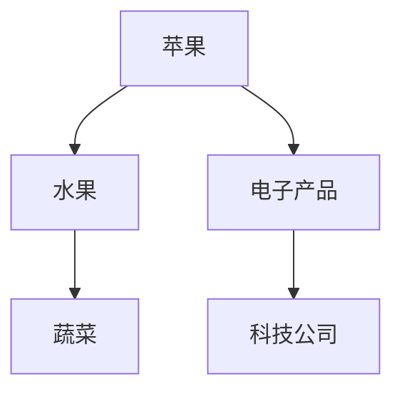
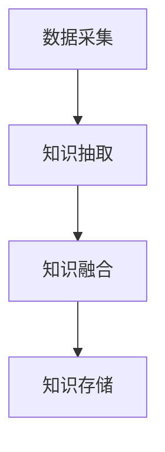
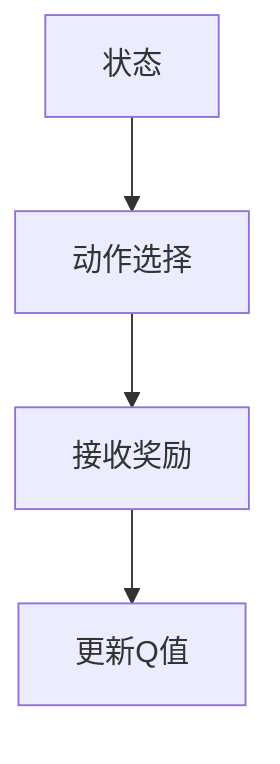

                 


# 构建具有知识图谱的AI Agent系统

## 关键词：知识图谱、AI Agent、智能系统、自然语言处理、机器学习

## 摘要：本文详细探讨了如何构建具有知识图谱的AI Agent系统。从知识图谱的基本概念到AI Agent的核心能力，再到两者的结合与应用，文章系统地介绍了构建该系统的背景、核心概念、算法原理、系统架构设计以及实际项目案例。通过本文，读者将能够理解并掌握如何利用知识图谱增强AI Agent的智能性，实现更高效、更智能的系统设计。

---

# 第一部分: 知识图谱与AI Agent系统背景

## 第1章: 知识图谱与AI Agent概述

### 1.1 知识图谱的基本概念

知识图谱是一种以图结构形式表示知识的语义网络，由实体（节点）和关系（边）组成。它能够将分散的知识点连接起来，形成一个结构化的知识网络，为AI系统提供丰富的语义信息。

#### 1.1.1 知识图谱的定义

知识图谱（Knowledge Graph）是一种用于表示知识的图形数据结构，其中节点代表实体或概念，边表示实体之间的关系或属性。知识图谱通过结构化的形式，将海量数据中的实体和关系进行建模，形成一个可计算的语义网络。

**知识图谱的特点：**
- **结构化：** 以图结构形式组织知识，便于计算机理解和推理。
- **语义化：** 包含丰富的语义信息，能够表示复杂的概念关系。
- **动态性：** 可以根据新数据不断更新和扩展。

#### 1.1.2 知识图谱与传统数据库的区别

传统数据库主要存储结构化数据，关注数据的存储和查询效率。而知识图谱不仅存储数据，还关注数据之间的语义关系，能够支持复杂的语义查询和推理。

| 特性                | 传统数据库          | 知识图谱          |
|---------------------|---------------------|-------------------|
| 数据表示            | 行数据，表结构       | 图结构，节点和边   |
| 查询方式            | 基于条件查询        | 基于语义关系查询   |
| 可扩展性            | 有限               | 高度可扩展         |
| 应用场景            | 事务处理            | 知识推理，语义搜索 |

#### 1.1.3 AI Agent的基本概念

AI Agent（人工智能代理）是一种能够感知环境、自主决策并执行任务的智能实体。它具备感知、推理、学习和执行的能力，能够在复杂环境中完成特定任务。

**AI Agent的核心能力：**
1. **感知能力：** 通过传感器或接口获取环境信息。
2. **推理能力：** 基于知识和逻辑进行推理和决策。
3. **学习能力：** 通过经验或数据不断优化自身能力。
4. **执行能力：** 执行任务并产生输出。

### 1.2 知识图谱与AI Agent的结合

知识图谱为AI Agent提供了丰富的知识库，使其能够更好地理解和处理复杂信息。通过知识图谱，AI Agent可以进行语义推理、知识检索和智能决策，从而提升整体智能水平。

#### 1.2.1 知识图谱在AI Agent中的作用

知识图谱作为AI Agent的知识库，支持其进行语义理解、关联推理和知识检索。例如，在智能问答系统中，AI Agent可以通过知识图谱快速定位相关知识，提供准确的答案。

#### 1.2.2 知识图谱增强AI Agent的智能性

知识图谱为AI Agent提供了上下文理解和关联推理的能力，使其能够处理复杂语义和跨领域知识。例如，在医疗领域，AI Agent可以通过知识图谱理解疾病的关联症状、治疗方法等，提供更精准的诊断建议。

#### 1.2.3 知识图谱与AI Agent的未来发展趋势

随着大数据和深度学习技术的发展，知识图谱与AI Agent的结合将更加紧密。未来的AI Agent将具备更强的自主学习和推理能力，能够处理更复杂的问题，提供更智能化的服务。

---

## 第2章: 知识图谱的核心概念与联系

### 2.1 知识图谱的核心概念

知识图谱的核心概念包括实体、关系、属性和知识抽取。实体是知识图谱的基本单元，关系描述实体之间的关联，属性则进一步丰富实体的信息。

#### 2.1.1 实体与关系

**实体（Entity）：** 知识图谱中的基本单元，代表现实世界中的具体事物或概念。例如，“苹果”是一个实体。

**关系（Relation）：** 描述实体之间关联的语义信息。例如，“苹果”和“水果”之间的关系是“属于”。

#### 2.1.2 知识图谱的表示形式

知识图谱常用的表示形式包括RDF（资源描述框架）和图嵌入。RDF通过三元组（主语-谓词-宾语）描述知识，图嵌入则通过向量化方法表示实体和关系。

**RDF表示法：**
$$ (主语, 谓词, 宾语) $$
例如，$$ (苹果, 是一种, 水果) $$

**图嵌入表示法：** 使用向量表示实体和关系，便于机器学习模型处理。

#### 2.1.3 知识图谱的存储与管理

知识图谱的存储与管理涉及数据建模、存储技术和查询优化。常用的知识图谱存储技术包括RDF三元组存储和图数据库（如Neo4j）。

### 2.2 知识图谱与AI Agent的关系

知识图谱作为AI Agent的知识库，为其提供语义理解、关联推理和知识检索的能力。AI Agent通过知识图谱实现更智能的决策和交互。

#### 2.2.1 知识图谱作为AI Agent的知识库

知识图谱为AI Agent提供丰富的语义信息，支持其进行知识检索和语义推理。例如，在智能问答系统中，AI Agent可以通过知识图谱快速定位相关知识，提供准确的答案。

#### 2.2.2 知识图谱驱动AI Agent的推理与决策

知识图谱中的语义信息为AI Agent提供推理的依据。AI Agent可以通过知识图谱进行路径分析、关系推理，从而做出更智能的决策。

#### 2.2.3 知识图谱与AI Agent的协同进化

随着AI Agent能力的提升，知识图谱需要不断扩展和优化。两者相辅相成，共同推动智能系统的发展。

### 2.3 知识图谱的构建与优化

知识图谱的构建包括知识抽取、实体识别、关系抽取等步骤。优化过程涉及数据清洗、知识融合和冗余消除。

#### 2.3.1 知识抽取与实体识别

知识抽取是从文本中提取实体和关系的过程，常用的技术包括分词、实体识别和关系抽取。例如，从文本“苹果是一种水果”中提取实体“苹果”和“水果”，以及关系“是一种”。

#### 2.3.2 关系抽取与属性建模

关系抽取是从文本中识别实体之间的关系，例如“苹果是水果的一种”。属性建模则描述实体的属性信息，例如“颜色”、“形状”等。

#### 2.3.3 知识图谱的融合与优化

知识图谱的融合涉及多个数据源的数据整合，优化过程包括数据清洗、冗余消除和冲突解决。例如，多个数据源提供的同一实体信息可能有冲突，需要进行合并和优化。

---

## 第3章: 知识图谱与AI Agent的核心概念联系

### 3.1 知识图谱的实体关系图

知识图谱通过实体和关系构建语义网络，支持AI Agent进行关联推理和语义理解。

#### 实体关系图示例：



### 3.2 知识图谱的构建流程

知识图谱的构建流程包括数据采集、知识抽取、知识融合和知识存储。

#### 知识图谱构建流程图：



---

## 第4章: 知识图谱与AI Agent的算法原理

### 4.1 知识图谱中的嵌入方法

嵌入方法将实体和关系映射到向量空间，便于机器学习模型处理。常用的方法包括TransE、TransH和RotatE。

#### 4.1.1 TransE模型

TransE是一种基于翻译的嵌入模型，将关系看作是将头节点映射到尾节点的翻译操作。

**TransE公式：**
$$ \text{score}(h, r, t) = ||h + r - t||_2^2 $$

#### 4.1.2 TransH模型

TransH是TransE的改进版本，引入了关系向量的投影操作，能够处理不同关系长度的问题。

**TransH公式：**
$$ \text{score}(h, r, t) = ||h + p_r \cdot r - t||_2^2 $$

### 4.2 AI Agent中的强化学习

强化学习通过奖励机制训练AI Agent，使其能够在复杂环境中做出最优决策。

#### 4.2.1 DQN算法

DQN（Deep Q-Network）是一种基于深度学习的强化学习算法，通过神经网络近似Q值函数。

**DQN算法流程图：**



---

## 第5章: 系统分析与架构设计

### 5.1 系统功能设计

系统功能包括知识图谱构建、AI Agent交互、语义理解与推理。

#### 5.1.1 知识图谱构建模块

知识图谱构建模块负责从数据源中抽取实体和关系，构建知识图谱。

**知识图谱构建流程：**
1. 数据采集：从多种数据源获取数据。
2. 知识抽取：提取实体和关系。
3. 知识融合：整合多个数据源的信息。
4. 知识存储：将知识图谱存储在图数据库中。

#### 5.1.2 AI Agent交互模块

AI Agent交互模块负责与用户进行交互，理解用户需求并生成响应。

**交互流程：**
1. 用户输入查询或命令。
2. AI Agent解析输入，生成语义表示。
3. 通过知识图谱进行推理和检索。
4. 生成响应并输出。

### 5.2 系统架构设计

系统架构包括知识图谱层、AI Agent层和交互层。

#### 5.2.1 知识图谱层

知识图谱层负责存储和管理知识图谱，支持高效的语义查询。

**知识图谱层组件：**
- 数据存储：使用图数据库存储实体和关系。
- 查询接口：提供语义查询接口，支持SPARQL等查询语言。

#### 5.2.2 AI Agent层

AI Agent层负责处理用户的输入，进行语义理解、推理和决策。

**AI Agent层组件：**
- 自然语言处理：进行文本解析和语义理解。
- 知识推理：基于知识图谱进行关联推理。
- 决策模块：根据推理结果生成响应。

### 5.3 系统接口设计

系统接口包括知识图谱接口和AI Agent接口。

#### 5.3.1 知识图谱接口

知识图谱接口提供语义查询和知识检索功能。

**接口功能：**
- SPARQL查询：支持复杂的语义查询。
- 实体检索：根据实体名称检索相关信息。

#### 5.3.2 AI Agent接口

AI Agent接口提供与用户交互的功能。

**接口功能：**
- 用户输入接收：支持文本输入。
- 语义理解：解析用户意图。
- 知识检索：通过知识图谱检索相关信息。
- 响应生成：生成自然语言响应。

### 5.4 系统交互设计

系统交互设计包括用户与AI Agent的交互流程和交互界面设计。

#### 5.4.1 交互流程

1. 用户输入查询或命令。
2. AI Agent解析输入，生成语义表示。
3. 通过知识图谱进行推理和检索。
4. 生成响应并输出。

---

## 第6章: 项目实战

### 6.1 智能问答系统案例

本节以构建一个智能问答系统为例，详细讲解知识图谱与AI Agent的结合应用。

#### 6.1.1 项目环境安装

安装必要的软件和库，包括Python、TensorFlow、Keras、Neo4j等。

#### 6.1.2 知识图谱构建

从数据源中抽取实体和关系，构建知识图谱。

#### 6.1.3 AI Agent实现

实现自然语言处理和知识推理功能，支持智能问答。

#### 6.1.4 系统测试

进行功能测试和性能优化，确保系统稳定运行。

### 6.2 系统核心代码实现

#### 6.2.1 知识图谱构建代码

```python
from neo4j import GraphDatabase
from neo4j.exceptions import Neo4jError

class KnowledgeGraph:
    def __init__(self, uri, user, password):
        self.driver = GraphDatabase.driver(uri, auth=(user, password))
    
    def close(self):
        self.driver.close()
    
    def add_entity(self, entity_name, entity_type):
        with self.driver.session() as session:
            session.run("CREATE (:Entity {name: $name, type: $type})", 
                        name=entity_name, type=entity_type)
    
    def add_relation(self, head, relation, tail):
        with self.driver.session() as session:
            session.run("MATCH (a {name: $head}), (b {name: $tail}) CREATE (a)-[r:$relation]->(b)", 
                        head=head, relation=relation, tail=tail)
```

#### 6.2.2 AI Agent实现代码

```python
class AI-Agent:
    def __init__(self, knowledge_graph):
        self.kg = knowledge_graph
    
    def understand_query(self, query):
        # 自然语言处理，生成语义表示
        pass
    
    def reason(self, semantic_representation):
        # 通过知识图谱进行推理
        pass
    
    def respond(self, query):
        semantic_rep = self.understand_query(query)
        result = self.reason(semantic_rep)
        return result
```

---

## 第7章: 最佳实践与总结

### 7.1 最佳实践

1. 知识图谱的构建需要结合具体应用场景，选择合适的数据源和抽取方法。
2. AI Agent的设计需要考虑系统的可扩展性和可维护性。
3. 在实际应用中，需要不断优化知识图谱和AI Agent的能力，提升系统的智能水平。

### 7.2 小结

本文详细探讨了知识图谱与AI Agent系统的构建过程，从知识图谱的基本概念到AI Agent的核心能力，再到两者的结合与应用，系统地介绍了构建该系统的背景、核心概念、算法原理、系统架构设计以及实际项目案例。通过本文，读者能够理解并掌握如何利用知识图谱增强AI Agent的智能性，实现更高效、更智能的系统设计。

### 7.3 注意事项

1. 知识图谱的构建需要考虑数据的质量和准确性。
2. AI Agent的设计需要考虑系统的安全性和隐私保护。
3. 在实际应用中，需要不断监控和优化系统的性能。

### 7.4 拓展阅读

1. 《知识图谱入门与实践》
2. 《AI Agent原理与应用》
3. 《深度学习与自然语言处理》

---

## 作者：AI天才研究院/AI Genius Institute & 禅与计算机程序设计艺术 /Zen And The Art of Computer Programming

---

以上是《构建具有知识图谱的AI Agent系统》的技术博客文章的详细大纲和内容，涵盖了从基础到高级的各个方面，包括背景、核心概念、算法原理、系统设计、项目实战和总结。希望这篇文章能够为读者提供清晰的指导和深入的见解。

