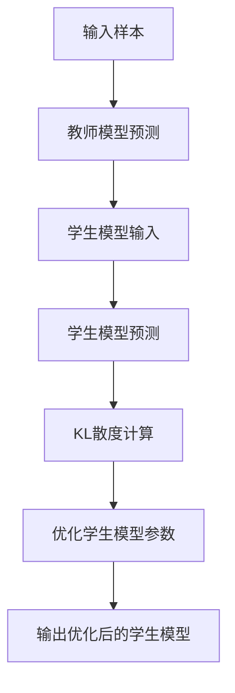
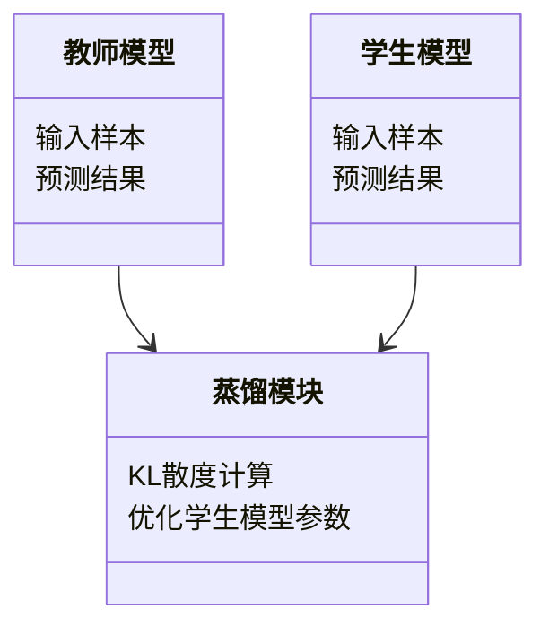

                 


# 知识蒸馏：从教师模型到高效AI Agent

---

## 关键词

- 知识蒸馏（Knowledge Distillation）
- 教师模型（Teacher Model）
- 学生模型（Student Model）
- AI Agent（人工智能代理）
- 模型压缩（Model Compression）
- 知识迁移（Knowledge Transfer）

---

## 摘要

知识蒸馏是一种通过将复杂模型（教师模型）的知识迁移到简单模型（学生模型）的技术，旨在提高小模型的性能，使其能够在资源受限的环境中高效运行。本文从知识蒸馏的基本概念出发，详细探讨了教师模型与学生模型的核心概念、算法原理、数学模型、系统架构设计以及实际应用案例。通过理论与实践相结合的方式，本文揭示了如何利用知识蒸馏技术构建高效、轻量级的AI代理，并为读者提供了丰富的代码实现和系统设计参考。

---

# 正文

## 第一部分: 知识蒸馏的背景与概述

### 第1章: 知识蒸馏的基本概念

#### 1.1 知识蒸馏的定义与背景

知识蒸馏是一种通过将复杂模型（教师模型）的知识迁移到简单模型（学生模型）的技术。教师模型通常是一个大而复杂的模型，经过大量数据训练，具有较高的准确性和泛化能力。学生模型则是一个小而精简的模型，通过模仿教师模型的行为和决策，快速学习并达到接近教师模型的性能。

**知识蒸馏的核心思想：**

- 教师模型通过概率分布的方式输出预测结果，学生模型通过优化自身的预测分布，使其尽可能接近教师模型的预测分布。
- 知识蒸馏不仅关注最终的分类结果，还关注模型内部的中间特征和概率分布。

**知识蒸馏的发展历程：**

1. **早期阶段（2010年前）**：知识蒸馏的概念最早由Hinton等人提出，主要用于将深度神经网络的知识迁移到小模型中。
2. **快速发展阶段（2010-2020年）**：随着深度学习的快速发展，知识蒸馏被广泛应用于图像分类、自然语言处理等领域。
3. **当前阶段（2020年至今）**：知识蒸馏技术逐渐成熟，并扩展到实时推理、边缘计算等场景。

**知识蒸馏在AI代理中的应用价值：**

- 提高模型的推理速度和效率。
- 降低模型的计算资源消耗（如内存、计算力）。
- 实现模型的轻量化，适用于资源受限的环境。

---

#### 1.2 知识蒸馏与模型压缩的关系

**模型压缩的定义与分类：**

- **模型压缩（Model Compression）**：通过减少模型的参数数量或降低参数的复杂度，使得模型在存储和计算上更加高效。
- **分类**：
  - 参数剪枝（Parameter Pruning）：删除模型中冗余的参数。
  - 知识蒸馏（Knowledge Distillation）：通过知识迁移降低模型复杂度。
  - 模型量化（Quantization）：降低模型参数的位数。

**知识蒸馏在模型压缩中的作用：**

- 知识蒸馏通过迁移教师模型的知识，使得学生模型能够在参数量大幅减少的情况下保持较高的性能。
- 知识蒸馏不仅减少模型的参数数量，还保留了教师模型的特征和决策能力。

**知识蒸馏与传统压缩方法的对比：**

| 对比维度 | 知识蒸馏 | 参数剪枝 | 模型量化 |
|----------|----------|----------|----------|
| 优缺点   | 保持模型性能，减少计算开销 | 参数冗余减少，但性能损失较大 | 参数位数降低，性能损失较小 |
| 适用场景 | 高性能轻量化模型 | 降低存储需求 | 边缘计算、实时推理 |

---

#### 1.3 本章小结

本章介绍了知识蒸馏的基本概念、发展历程及其在AI代理中的应用价值，重点分析了知识蒸馏与模型压缩的关系。知识蒸馏通过将教师模型的知识迁移到学生模型，实现了模型的轻量化和高效推理，是构建高效AI代理的重要技术。

---

## 第二部分: 教师模型与学生模型的核心概念

### 第2章: 教师模型的构建与特点

#### 2.1 教师模型的构建过程

**教师模型的训练目标：**

- 教师模型通常是一个复杂的深度学习模型，如大型神经网络。
- 训练目标是通过大量数据学习到丰富的特征表示和决策能力。

**教师模型的评估标准：**

- 分类准确率（Classification Accuracy）
- 模型的泛化能力（Generalization Ability）
- 模型的解释性（Interpretability）

**教师模型的优缺点分析：**

- **优点**：
  - 高准确性和泛化能力。
  - 丰富的特征表示能力。
- **缺点**：
  - 参数量大，计算开销高。
  - 对硬件资源要求高。

---

#### 2.2 学生模型的设计与优化

**学生模型的设计原则：**

- 参数量少，计算速度快。
- 保持与教师模型相似的架构，便于知识迁移。
- 优化目标函数，使其预测分布接近教师模型。

**学生模型的优化方法：**

- 使用交叉熵损失函数优化分类任务。
- 引入知识蒸馏损失函数，优化概率分布。
- 通过正则化技术（如Dropout）防止过拟合。

**学生模型与教师模型的对比分析：**

| 对比维度 | 教师模型 | 学生模型 |
|----------|----------|----------|
| 参数量   | 高       | 低       |
| 计算开销 | 高       | 低       |
| 性能     | 高       | 中高     |

---

#### 2.3 教师模型与学生模型的关系

**知识蒸馏的核心原理：**

- 教师模型通过概率分布的方式输出预测结果，学生模型通过优化自身的预测分布，使其尽可能接近教师模型的预测分布。

**教师模型与学生模型的知识传递过程：**

1. **知识表示**：教师模型通过概率分布的形式表示其对输入样本的预测结果。
2. **知识迁移**：学生模型通过优化自身的概率分布，使其尽可能接近教师模型的预测分布。
3. **联合优化**：学生模型在优化自身预测分布的同时，保留教师模型的特征和决策能力。

**知识蒸馏的效果评估方法：**

- 分类准确率（Classification Accuracy）
- 概率分布相似度（KL散度）
- 模型的推理速度（Inference Speed）

---

#### 2.4 本章小结

本章详细探讨了教师模型和学生模型的核心概念，分析了它们的设计原则和优化方法。知识蒸馏通过将教师模型的概率分布迁移到学生模型，实现了模型的轻量化和高效推理，是构建高效AI代理的重要技术。

---

## 第三部分: 知识蒸馏的算法原理

### 第3章: 知识蒸馏的核心算法

#### 3.1 知识蒸馏的基本流程

**知识蒸馏的输入与输出：**

- **输入**：
  - 教师模型：已经训练好的复杂模型。
  - 学生模型：待训练的简单模型。
  - 训练数据：用于蒸馏的样本数据。
- **输出**：
  - 学生模型：经过蒸馏训练后，性能接近教师模型的轻量化模型。

**知识蒸馏的主要步骤：**

1. **教师模型的预测**：教师模型对输入样本进行预测，输出概率分布。
2. **学生模型的预测**：学生模型对输入样本进行预测，输出概率分布。
3. **损失函数计算**：
   - 计算学生模型预测分布与教师模型预测分布的差异（KL散度）。
   - 计算学生模型预测分布与真实标签的差异（交叉熵损失）。
4. **优化**：通过反向传播优化学生模型的参数，使其预测分布尽可能接近教师模型的预测分布。

---

#### 3.2 温度缩放与直觉对比

**温度缩放的原理与实现：**

- **温度缩放（Temperature Scaling）**：通过调整概率分布的“温度”，使得预测分布更加平滑，降低对单个标签的过度自信。
- **实现方式**：
  - 在教师模型的预测结果中引入温度参数 $T$，通过公式 $P_i = P_i^{T}$ 实现概率分布的调整。
  - 学生模型在优化过程中，通过调整温度参数 $T$ 使得其预测分布与教师模型的预测分布更加一致。

**直觉对比的核心思想：**

- **直觉对比（Intuition Distillation）**：通过对比教师模型和学生模型的决策直觉，优化学生模型的预测能力。
- **实现方式**：
  - 将教师模型的预测结果作为参考，优化学生模型的预测结果，使其在决策过程中与教师模型保持一致。

**温度缩放与直觉对比的对比分析：**

| 对比维度 | 温度缩放 | 直觉对比 |
|----------|----------|----------|
| 核心思想 | 调整概率分布的平滑度 | 对比决策直觉 |
| 优缺点   | 简单易实现，但可能无法捕捉复杂的特征 | 能够捕捉复杂的特征，但实现复杂 |
| 适用场景 | 预测结果需要平滑分布 | 需要捕捉复杂的决策特征 |

---

#### 3.3 知识蒸馏的优化方法

**知识蒸馏的损失函数设计：**

- **交叉熵损失（Cross-Entropy Loss）**：用于优化学生模型的分类任务。
  $$ L_{\text{CE}}(y, \hat{y}) = -\sum_{i=1}^C y_i \log \hat{y}_i $$
- **KL散度损失（KL-Divergence Loss）**：用于优化学生模型的预测分布与教师模型的预测分布。
  $$ L_{\text{KL}}(P, Q) = \sum_{i=1}^C P_i \log \frac{P_i}{Q_i} $$

**知识蒸馏的正则化方法：**

- **Dropout**：在学生模型的训练过程中，随机屏蔽部分神经元，防止过拟合。
- **权重正则化**：通过添加L2正则化项，减少模型的参数量。

**知识蒸馏的优化步骤：**

1. **初始化**：将学生模型的参数初始化为随机值。
2. **前向传播**：学生模型对输入样本进行前向传播，输出预测结果。
3. **计算损失**：计算交叉熵损失和KL散度损失的总和。
4. **反向传播**：通过反向传播优化学生模型的参数。
5. **更新参数**：更新学生模型的参数，使其预测分布尽可能接近教师模型的预测分布。

---

#### 3.4 本章小结

本章详细探讨了知识蒸馏的核心算法，包括温度缩放和直觉对比等方法。通过优化学生模型的预测分布，使其尽可能接近教师模型的预测分布，从而实现模型的轻量化和高效推理。

---

## 第四部分: 数学模型与公式

### 第4章: 知识蒸馏的数学模型

#### 4.1 知识蒸馏的核心公式

**教师模型的预测分布：**

- 教师模型对输入样本 $x$ 的预测分布为 $P(x)$，具体表示为：
  $$ P(x) = \text{softmax}(f_T(x) / T) $$
  其中，$f_T(x)$ 是教师模型的输出，$T$ 是温度参数。

**学生模型的预测分布：**

- 学生模型对输入样本 $x$ 的预测分布为 $Q(x)$，具体表示为：
  $$ Q(x) = \text{softmax}(f_S(x) / T) $$

**KL散度损失：**

- 知识蒸馏的KL散度损失为：
  $$ L_{\text{KL}}(P, Q) = \sum_{i=1}^C P_i \log \frac{P_i}{Q_i} $$

---

#### 4.2 知识蒸馏的优化目标

**知识蒸馏的优化目标：**

- 通过优化学生模型的参数 $\theta$，使得学生模型的预测分布 $Q(x)$ 尽可能接近教师模型的预测分布 $P(x)$，同时保持较高的分类准确率。

**数学表达式：**

$$ \min_{\theta} \left( L_{\text{CE}}(y, Q) + \alpha L_{\text{KL}}(P, Q) \right) $$
其中，$\alpha$ 是调节系数，$L_{\text{CE}}$ 是交叉熵损失，$L_{\text{KL}}$ 是KL散度损失。

---

#### 4.3 本章小结

本章通过数学公式详细推导了知识蒸馏的核心原理，重点分析了教师模型和学生模型的预测分布，以及它们之间的KL散度损失。通过优化学生模型的参数，使其预测分布尽可能接近教师模型的预测分布。

---

## 第五部分: 系统分析与架构设计

### 第5章: 系统分析与架构设计

#### 5.1 知识蒸馏的系统架构

**知识蒸馏的系统架构：**

1. **输入模块**：接收输入样本和教师模型的预测结果。
2. **蒸馏模块**：计算学生模型的预测分布与教师模型的预测分布之间的KL散度损失。
3. **优化模块**：通过反向传播优化学生模型的参数。
4. **输出模块**：输出优化后的学生模型。

**系统架构图：**



---

#### 5.2 系统功能设计

**知识蒸馏的功能需求：**

- 实现教师模型和学生模型的预测分布计算。
- 计算KL散度损失并优化学生模型的参数。
- 输出优化后的学生模型。

**领域模型设计：**

- **教师模型**：负责生成预测结果。
- **学生模型**：负责学习教师模型的知识。
- **蒸馏模块**：负责计算KL散度损失。

**领域模型图：**



---

#### 5.3 系统接口设计

**系统接口描述：**

- **输入接口**：
  - 输入样本数据。
  - 教师模型的预测结果。
- **输出接口**：
  - 学生模型的预测结果。
  - 优化后的学生模型参数。

---

#### 5.4 本章小结

本章详细分析了知识蒸馏的系统架构和功能设计，通过Mermaid图展示了系统的交互过程和领域模型。系统架构的设计为知识蒸馏技术的实际应用提供了理论基础。

---

## 第六部分: 项目实战

### 第6章: 项目实战

#### 6.1 环境安装与配置

**项目环境要求：**

- Python 3.8+
- PyTorch 1.9+
- transformers库 4.15+

**安装步骤：**

```bash
pip install torch transformers
```

---

#### 6.2 知识蒸馏的核心代码实现

**教师模型的定义：**

```python
class TeacherModel(torch.nn.Module):
    def __init__(self, input_size, hidden_size, output_size):
        super(TeacherModel, self).__init__()
        self.fc1 = torch.nn.Linear(input_size, hidden_size)
        self.fc2 = torch.nn.Linear(hidden_size, output_size)
        self.softmax = torch.nn.Softmax(dim=1)
    
    def forward(self, x):
        x = self.fc1(x)
        x = self.fc2(x)
        x = self.softmax(x)
        return x
```

**学生模型的定义：**

```python
class StudentModel(torch.nn.Module):
    def __init__(self, input_size, hidden_size, output_size):
        super(StudentModel, self).__init__()
        self.fc1 = torch.nn.Linear(input_size, hidden_size)
        self.fc2 = torch.nn.Linear(hidden_size, output_size)
        self.softmax = torch.nn.Softmax(dim=1)
    
    def forward(self, x):
        x = self.fc1(x)
        x = self.fc2(x)
        x = self.softmax(x)
        return x
```

**知识蒸馏的训练代码：**

```python
def train(student_model, teacher_model, criterion_kl, optimizer, device, epochs=100):
    for epoch in range(epochs):
        student_model.train()
        optimizer.zero_grad()
        # 前向传播
        outputs_student = student_model(x)
        outputs_teacher = teacher_model(x)
        # 计算KL散度损失
        loss_kl = criterion_kl(outputs_student, outputs_teacher)
        # 计算交叉熵损失
        loss_ce = criterion_ce(outputs_student, y)
        # 总损失
        total_loss = loss_ce + alpha * loss_kl
        # 反向传播
        total_loss.backward()
        optimizer.step()
    return student_model
```

---

#### 6.3 代码实现与解读

**代码实现解读：**

- **教师模型**：定义了一个简单的多层感知机模型，输出概率分布。
- **学生模型**：定义了一个与教师模型结构相似的简单模型。
- **训练过程**：
  - 前向传播：学生模型和教师模型分别对输入样本进行预测。
  - 损失计算：计算学生模型预测分布与真实标签的交叉熵损失，以及学生模型预测分布与教师模型预测分布的KL散度损失。
  - 反向传播：通过反向传播优化学生模型的参数。
  - 更新参数：更新学生模型的参数，使其预测分布尽可能接近教师模型的预测分布。

---

#### 6.4 本章小结

本章通过具体的代码实现，详细展示了知识蒸馏技术的实际应用。通过训练学生模型，使其预测分布尽可能接近教师模型的预测分布，从而实现模型的轻量化和高效推理。

---

## 第七部分: 最佳实践与小结

### 第7章: 最佳实践与小结

#### 7.1 知识蒸馏的应用技巧

- **选择合适的教师模型**：教师模型的性能直接影响学生模型的性能。
- **调整温度参数**：通过调整温度参数，优化学生模型的预测分布。
- **结合其他压缩技术**：将知识蒸馏与其他模型压缩技术（如量化、剪枝）结合使用，进一步降低模型的计算开销。

---

#### 7.2 注意事项

- **数据质量**：知识蒸馏的效果依赖于训练数据的质量。
- **模型复杂度**：学生模型的复杂度直接影响知识蒸馏的效果。
- **计算资源**：知识蒸馏需要大量的计算资源，尤其是训练教师模型时。

---

#### 7.3 未来发展方向

- **多教师模型蒸馏**：研究如何利用多个教师模型的知识，进一步优化学生模型的性能。
- **动态蒸馏**：研究如何在动态环境下，实时更新学生模型的知识。
- **跨模态蒸馏**：研究如何将不同模态（如图像、文本）的知识迁移到目标模型中。

---

#### 7.4 本章小结

本章总结了知识蒸馏技术的应用技巧和注意事项，并展望了未来的发展方向。通过不断优化知识蒸馏技术，可以进一步提升AI代理的性能和效率。

---

## 作者

作者：AI天才研究院/AI Genius Institute & 禅与计算机程序设计艺术 /Zen And The Art of Computer Programming

