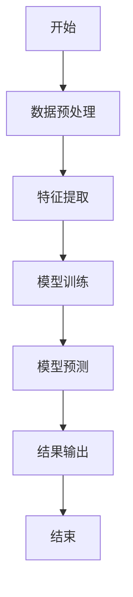
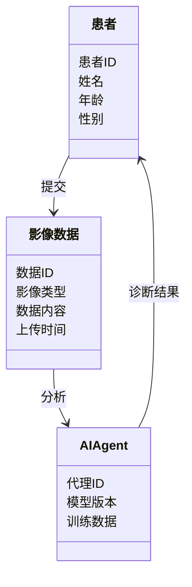

                 


# AI Agent在智能医疗影像分析中的角色

> 关键词：AI Agent, 智能医疗影像分析, 医疗影像诊断, 人工智能, 深度学习

> 摘要：AI Agent在智能医疗影像分析中扮演着越来越重要的角色。本文将从AI Agent的基本概念出发，探讨其在医疗影像分析中的核心原理、算法实现、系统架构以及实际应用。通过对AI Agent在医疗影像分析中的感知、决策和执行三个阶段的详细分析，揭示其在疾病诊断、影像数据处理和患者个性化医疗中的重要作用。

---

# 第1章: AI Agent与智能医疗影像分析概述

## 1.1 AI Agent的基本概念

### 1.1.1 什么是AI Agent
AI Agent（人工智能代理）是一种能够感知环境、自主决策并执行任务的智能系统。它结合了机器学习、自然语言处理和计算机视觉等多种技术，能够通过数据驱动的方式解决问题。

AI Agent的核心特点包括：
- **自主性**：能够在没有人工干预的情况下完成任务。
- **反应性**：能够实时感知环境并做出响应。
- **目标导向**：以特定目标为导向，优化决策过程。

### 1.1.2 AI Agent与传统医疗影像分析的区别
传统的医疗影像分析主要依赖于人工标注和专家经验，而AI Agent能够通过深度学习模型自动提取影像特征，并基于这些特征进行疾病诊断。AI Agent的优势在于其高效性和准确性，能够显著减少医生的工作负担。

### 1.1.3 AI Agent在医疗影像分析中的应用
AI Agent在医疗影像分析中的应用包括：
- **疾病诊断**：通过分析X光片、MRI等影像数据，辅助医生进行疾病诊断。
- **影像数据处理**：自动标注、分割和增强影像数据。
- **患者个性化医疗**：根据患者的影像数据，提供个性化的治疗建议。

## 1.2 智能医疗影像分析的背景与挑战

### 1.2.1 医疗影像分析的重要性
医疗影像分析是现代医学的重要组成部分，能够帮助医生更准确地诊断疾病。通过影像分析，医生可以发现病灶的早期症状，从而提高治疗效果。

### 1.2.2 传统医疗影像分析的局限性
传统的医疗影像分析存在以下问题：
- **效率低**：人工分析需要大量时间，尤其是在处理大量患者数据时。
- **主观性**：不同医生的诊断结果可能因经验不同而有所差异。
- **成本高**：需要大量专业人员进行分析。

### 1.2.3 AI Agent在医疗影像分析中的角色
AI Agent能够通过深度学习模型自动分析影像数据，显著提高分析效率和准确性。它在医疗影像分析中的角色包括：
- **数据预处理**：自动标注和分割影像数据。
- **疾病诊断**：通过模型预测病灶的存在与否。
- **结果解释**：将模型的预测结果以可视化的方式呈现给医生。

## 1.3 AI Agent在医疗影像分析中的应用前景

### 1.3.1 AI Agent在疾病诊断中的潜力
AI Agent可以通过深度学习模型，如卷积神经网络（CNN）和Transformer模型，实现对医疗影像的高效分析。未来，AI Agent在疾病诊断中的潜力将更加显著，尤其是在早期诊断和精准医疗方面。

### 1.3.2 AI Agent在医疗影像分析中的优势
AI Agent的优势包括：
- **高效性**：能够快速处理大量影像数据。
- **准确性**：通过深度学习模型，能够提高诊断的准确性。
- **可扩展性**：能够应用于多种类型的医疗影像数据。

### 1.3.3 AI Agent在医疗影像分析中的挑战
AI Agent在医疗影像分析中也面临一些挑战：
- **数据隐私**：医疗影像数据涉及患者隐私，需要确保数据的安全性。
- **模型解释性**：深度学习模型的黑箱特性可能影响医生对诊断结果的信任。
- **法律法规**：医疗领域的AI应用需要符合相关的法律法规，如《HIPAA》（美国）等。

## 1.4 本章小结
本章介绍了AI Agent的基本概念及其在医疗影像分析中的应用。AI Agent通过深度学习模型能够显著提高医疗影像分析的效率和准确性。然而，其在医疗领域的应用还需要克服数据隐私、模型解释性和法律法规等挑战。

---

# 第2章: AI Agent的核心概念与联系

## 2.1 AI Agent的核心概念

### 2.1.1 AI Agent的感知层
AI Agent的感知层是其与外界交互的接口，能够通过传感器或数据输入获取环境信息。在医疗影像分析中，感知层通常包括影像数据的输入和预处理。

#### 感知层的功能
- **数据输入**：接收患者的影像数据，如X光片、MRI等。
- **数据预处理**：对影像数据进行归一化、增强和标准化处理，以提高模型的准确性。

### 2.1.2 AI Agent的决策层
AI Agent的决策层是其核心部分，负责根据感知到的信息做出决策。在医疗影像分析中，决策层通常包括模型训练和预测两个阶段。

#### 决策层的功能
- **模型训练**：使用大量的标注影像数据训练深度学习模型。
- **模型预测**：基于训练好的模型，对新的影像数据进行预测，生成诊断结果。

### 2.1.3 AI Agent的执行层
AI Agent的执行层负责将决策层的决策转化为具体的行动。在医疗影像分析中，执行层通常包括结果输出和可视化展示。

#### 执行层的功能
- **结果输出**：将模型的预测结果输出给医生或患者。
- **可视化展示**：以图形化的方式展示诊断结果，帮助医生更好地理解和分析。

### 2.1.4 AI Agent的核心原理
AI Agent的核心原理包括：
- **数据驱动**：通过大量数据的输入和分析，生成决策。
- **深度学习**：利用卷积神经网络（CNN）和Transformer模型等深度学习技术，提高模型的准确性。
- **实时反馈**：根据环境的实时变化，调整决策策略。

---

## 2.2 AI Agent的核心属性特征对比

| **属性**         | **传统医疗影像分析** | **AI Agent医疗影像分析** |
|------------------|----------------------|---------------------------|
| **分析效率**     | 低                   | 高                       |
| **分析准确性**    | 受限于医生经验       | 通过深度学习模型提高准确性 |
| **可扩展性**      | 有限                 | 高                       |
| **可解释性**      | 高                   | 低                       |
| **成本**          | 高                   | 低                       |

---

## 2.3 ER实体关系图

```mermaid
erDiagram
    class 患者 {
        患者ID
        姓名
        年龄
        性别
    }
    class 影像数据 {
        数据ID
        影像类型
        数据内容
        上传时间
    }
    class AI Agent {
        代理ID
        模型版本
        训练数据
    }
    患者 --o> 影像数据 : 提交
    影像数据 --o> AI Agent : 分析
    AI Agent --> 患者 : 诊断结果
```

---

## 2.4 本章小结
本章详细讲解了AI Agent的核心概念，包括感知层、决策层和执行层。通过对比传统医疗影像分析和AI Agent医疗影像分析的属性特征，以及ER实体关系图的展示，我们能够更好地理解AI Agent在医疗影像分析中的作用和结构。

---

# 第3章: AI Agent的算法原理与实现

## 3.1 算法原理概述

### 3.1.1 数据预处理
数据预处理是AI Agent医疗影像分析的第一步，主要包括：
- **归一化**：将影像数据的值域归一化到一个固定的范围内。
- **增强**：通过旋转、缩放和翻转等操作，增加数据的多样性。
- **标准化**：将影像数据标准化，使其符合模型的输入要求。

### 3.1.2 特征提取
特征提取是通过深度学习模型从影像数据中提取有用的特征。常用的特征提取方法包括：
- **卷积神经网络（CNN）**：通过多层卷积操作，提取影像数据的空间特征。
- **Transformer模型**：通过自注意力机制，提取影像数据的全局特征。

### 3.1.3 分类器设计
分类器设计是基于提取的特征进行分类，常用的分类器包括：
- **支持向量机（SVM）**：通过构建超平面，将数据分为不同的类别。
- **随机森林**：通过构建多个决策树，进行投票分类。
- **深度学习模型**：如ResNet、EfficientNet等，用于分类任务。

---

## 3.2 算法实现步骤



### 3.2.1 数据预处理
```python
import numpy as np
import cv2

def preprocess_image(image_path):
    image = cv2.imread(image_path)
    image = cv2.resize(image, (224, 224))
    image = image / 255.0  # 归一化
    return image
```

### 3.2.2 特征提取
```python
import tensorflow as tf
from tensorflow.keras import layers

model = tf.keras.Sequential([
    layers.Conv2D(32, (3,3), activation='relu', input_shape=(224, 224, 3)),
    layers.MaxPooling2D((2,2)),
    layers.Conv2D(64, (3,3), activation='relu'),
    layers.MaxPooling2D((2,2)),
    layers.Flatten(),
    layers.Dense(128, activation='relu'),
    layers.Dense(1, activation='sigmoid')
])

model.compile(optimizer='adam', loss='binary_crossentropy', metrics=['accuracy'])
```

### 3.2.3 模型训练与预测
```python
# 训练模型
model.fit(X_train, y_train, epochs=10, batch_size=32, validation_data=(X_test, y_test))

# 预测结果
predictions = model.predict(X_test)
```

---

## 3.3 算法的数学模型

### 3.3.1 损失函数
$$ L = -\frac{1}{N} \sum_{i=1}^{N} y_i \log(p_i) + (1 - y_i) \log(1 - p_i) $$

### 3.3.2 优化器
$$ \theta_{t+1} = \theta_t - \eta \frac{\partial L}{\partial \theta_t} $$

### 3.3.3 分类器
$$ y = \text{ArgMax}(p_1, p_2, ..., p_n) $$

---

## 3.4 本章小结
本章详细讲解了AI Agent在医疗影像分析中的算法原理与实现。通过数据预处理、特征提取和分类器设计，我们能够构建一个高效的AI Agent系统。同时，通过数学模型的展示，我们能够更好地理解模型的优化和分类过程。

---

# 第4章: AI Agent的系统架构设计与实现

## 4.1 问题场景介绍
在医疗影像分析中，AI Agent需要处理大量的影像数据，并提供准确的诊断结果。常见的问题场景包括：
- **疾病诊断**：如肺癌筛查、乳腺癌早期检测。
- **影像数据管理**：如影像数据的存储、检索和共享。
- **个性化医疗**：根据患者的影像数据，提供个性化的治疗建议。

---

## 4.2 系统功能设计

### 4.2.1 领域模型


### 4.2.2 系统架构


---

## 4.3 系统接口设计

### 4.3.1 接口定义
- **输入接口**：接收患者的影像数据。
- **输出接口**：返回诊断结果。
- **交互接口**：支持医生与AI Agent的交互。

### 4.3.2 接口实现
```python
class Patient:
    def __init__(self, patient_id, name, age, gender):
        self.patient_id = patient_id
        self.name = name
        self.age = age
        self.gender = gender

class ImageData:
    def __init__(self, data_id, image_type, data_content, upload_time):
        self.data_id = data_id
        self.image_type = image_type
        self.data_content = data_content
        self.upload_time = upload_time

class AIAssistant:
    def __init__(self, model_version, training_data):
        self.model_version = model_version
        self.training_data = training_data

    def analyze_image(self, image_data):
        # 具体实现
        pass
```

---

## 4.4 本章小结
本章详细讲解了AI Agent医疗影像分析系统的架构设计，包括领域模型、系统架构和接口设计。通过这些设计，我们能够构建一个高效、可靠的AI Agent系统，为医疗影像分析提供强有力的支持。

---

# 第5章: 项目实战与经验总结

## 5.1 环境安装

### 5.1.1 安装Python
```bash
python --version
pip install --upgrade pip
```

### 5.1.2 安装TensorFlow和Keras
```bash
pip install tensorflow==2.10.0
pip install keras==2.10.0
```

---

## 5.2 核心代码实现

### 5.2.1 数据预处理
```python
import cv2
import numpy as np

def preprocess_image(image_path):
    image = cv2.imread(image_path)
    image = cv2.resize(image, (224, 224))
    image = image / 255.0  # 归一化
    return image
```

### 5.2.2 模型训练
```python
import tensorflow as tf
from tensorflow.keras import layers

model = tf.keras.Sequential([
    layers.Conv2D(32, (3,3), activation='relu', input_shape=(224, 224, 3)),
    layers.MaxPooling2D((2,2)),
    layers.Conv2D(64, (3,3), activation='relu'),
    layers.MaxPooling2D((2,2)),
    layers.Flatten(),
    layers.Dense(128, activation='relu'),
    layers.Dense(1, activation='sigmoid')
])

model.compile(optimizer='adam', loss='binary_crossentropy', metrics=['accuracy'])
model.fit(X_train, y_train, epochs=10, batch_size=32, validation_data=(X_test, y_test))
```

---

## 5.3 案例分析与解读

### 5.3.1 案例背景
假设我们有一个肺癌筛查的项目，需要对患者的胸部X光片进行分析。

### 5.3.2 案例分析
```python
# 加载模型
model = tf.keras.models.load_model('lung_cancer_model.h5')

# 加载测试图像
test_image = preprocess_image('test_image.png')

# 预测结果
prediction = model.predict(test_image)
print('预测结果:', prediction)
```

### 5.3.3 分析结果解读
预测结果为1表示可能存在肺癌，预测结果为0表示不存在肺癌。医生可以根据预测结果进一步进行检查和诊断。

---

## 5.4 项目小结
本章通过一个实际的项目案例，详细讲解了AI Agent医疗影像分析的实现过程。从环境安装、数据预处理、模型训练到案例分析，我们能够清晰地看到AI Agent在实际应用中的潜力。

---

# 第6章: 总结与展望

## 6.1 总结
AI Agent在智能医疗影像分析中的应用前景广阔。通过深度学习模型，AI Agent能够显著提高医疗影像分析的效率和准确性。然而，其在实际应用中仍面临数据隐私、模型解释性和法律法规等挑战。

## 6.2 展望
未来，AI Agent在医疗影像分析中的应用将更加广泛和深入。随着深度学习技术的进步，AI Agent将能够实现更复杂的任务，如多模态数据融合和实时诊断。同时，随着法律法规的完善和数据隐私保护技术的进步，AI Agent在医疗领域的应用将更加安全和可靠。

---

# 作者：AI天才研究院/AI Genius Institute & 禅与计算机程序设计艺术 /Zen And The Art of Computer Programming

---

以上是《AI Agent在智能医疗影像分析中的角色》的完整目录和内容概述。希望这篇文章能够为读者提供清晰的思路和详细的实现过程，帮助大家更好地理解AI Agent在医疗影像分析中的重要作用。

