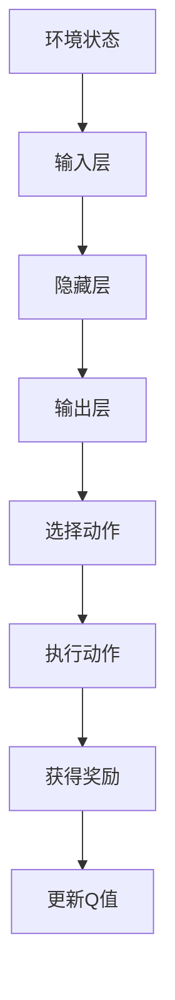
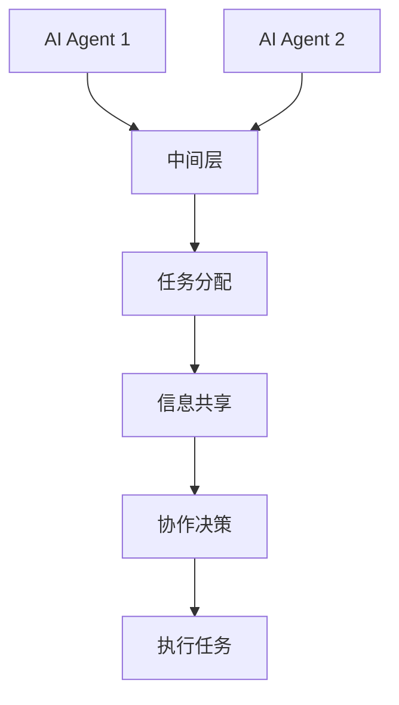
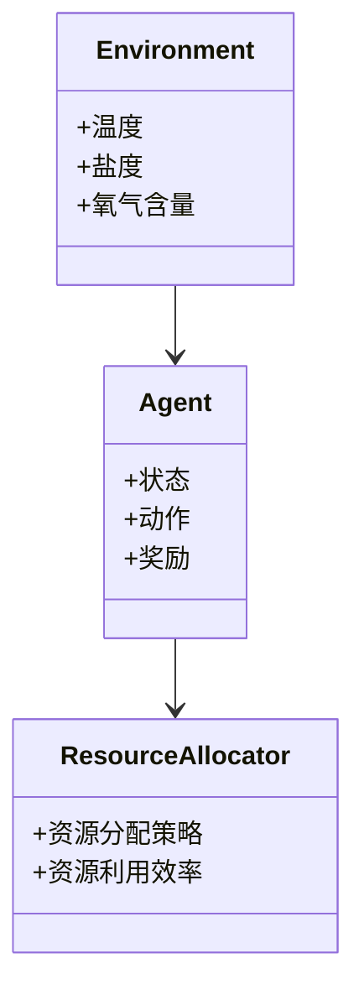
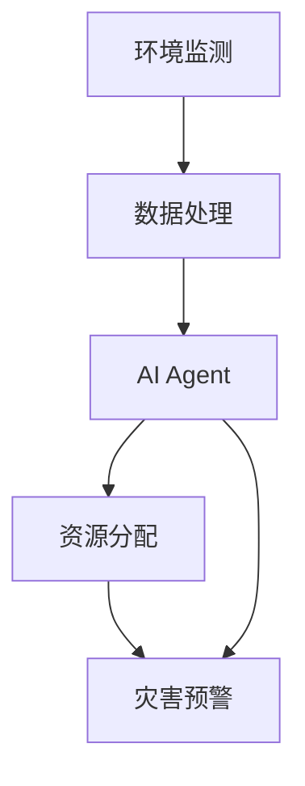
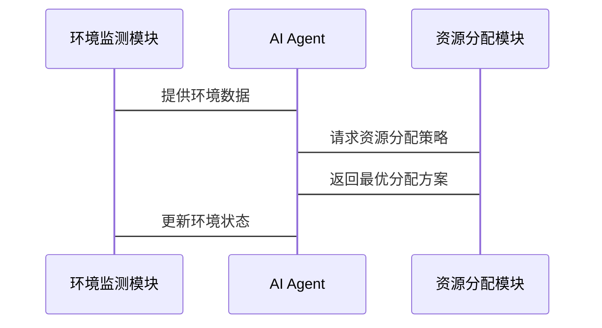

                 


# AI Agent在智能海洋资源管理中的实践

> 关键词：AI Agent，智能海洋资源管理，人工智能技术，资源优化配置，环境监测，海洋灾害预警，智能系统架构

> 摘要：  
> 本文探讨了AI Agent在智能海洋资源管理中的应用与实践。通过分析AI Agent的核心概念、算法原理、系统架构及实际项目案例，详细阐述了其在海洋环境监测、资源优化配置及海洋灾害预警中的作用。文章旨在为读者提供从理论到实践的全面指南，帮助理解AI Agent在智能海洋资源管理中的潜力与实现路径。

---

# 第一章: 引言

## 1.1 AI Agent的基本概念与技术基础

### 1.1.1 AI Agent的定义  
AI Agent（人工智能代理）是指能够感知环境、自主决策并采取行动的智能实体。它可以是一个软件程序、机器人或其他智能系统，旨在通过与环境交互完成特定目标。

### 1.1.2 AI Agent的特点  
- **自主性**：AI Agent能够自主决策，无需人工干预。  
- **反应性**：能够实时感知环境变化并做出反应。  
- **目标导向**：所有行为均围绕实现特定目标展开。  
- **学习能力**：通过数据和经验不断优化自身性能。

### 1.1.3 海洋资源管理的数字化转型  
随着海洋资源开发的深入，传统的管理方式逐渐暴露出效率低下、资源浪费等问题。AI Agent的引入为海洋资源管理带来了新的可能性，例如通过智能监测和优化配置提高资源利用效率。

---

## 1.2 智能海洋资源管理的背景与需求

### 1.2.1 海洋资源管理的现状与挑战  
- **资源枯竭**：过度开发导致海洋资源（如渔业资源）枯竭。  
- **环境污染**：海洋污染威胁生态平衡。  
- **灾害频发**：海洋灾害（如台风、海啸）对沿海地区造成严重威胁。  

### 1.2.2 AI Agent在海洋资源管理中的应用价值  
AI Agent能够通过实时监测、数据分析和智能决策，帮助实现海洋资源的可持续开发与保护。例如：  
- **环境监测**：实时监测海洋环境参数（如温度、盐度、氧气含量）。  
- **资源优化**：智能分配渔业资源，避免过度捕捞。  
- **灾害预警**：通过AI Agent预测海洋灾害并制定应对方案。

### 1.2.3 国内外研究现状与发展趋势  
目前，国内外对AI Agent在海洋资源管理中的研究主要集中在以下几个方面：  
- **智能监测**：利用AI Agent实现海洋环境的实时感知。  
- **资源优化**：通过强化学习优化资源分配策略。  
- **灾害预警**：基于AI Agent的海洋灾害预测模型。  

---

## 1.3 本章小结  
本章介绍了AI Agent的基本概念、技术基础及其在海洋资源管理中的应用价值。通过分析海洋资源管理的现状与挑战，我们得出AI Agent在该领域的巨大潜力。

---

# 第二章: AI Agent的核心概念与原理

## 2.1 AI Agent的核心概念

### 2.1.1 AI Agent的定义与分类  
AI Agent可以分为**反应式AI Agent**和**认知式AI Agent**：  
- **反应式AI Agent**：基于当前感知做出反应，适用于简单环境。  
- **认知式AI Agent**：具有复杂推理和规划能力，适用于复杂环境。  

### 2.1.2 AI Agent的核心技术基础  
- **知识表示**：通过符号逻辑或概率模型表示知识。  
- **推理与学习**：基于知识库进行推理，并通过机器学习优化决策。  
- **多智能体协作**：多个AI Agent协同工作，实现复杂任务。

### 2.1.3 AI Agent与海洋资源管理的结合  
AI Agent可以通过以下方式实现海洋资源管理：  
- **实时监测**：通过传感器网络实时采集海洋环境数据。  
- **智能决策**：基于数据进行分析，优化资源分配策略。  
- **灾害应对**：在海洋灾害发生时，快速制定应急方案。

---

## 2.2 AI Agent在海洋资源管理中的应用场景

### 2.2.1 海洋环境监测与保护  
AI Agent可以实时监测海洋环境参数（如温度、盐度、氧气含量），并预测环境变化趋势。例如：  
- **水温监测**：通过AI Agent预测海水温度变化，帮助渔业资源管理。  
- **污染监测**：实时检测海洋污染源，及时采取措施防止污染扩散。

### 2.2.2 资源优化配置  
AI Agent可以通过强化学习优化海洋资源的分配。例如：  
- **渔业资源管理**：智能分配捕捞区域和捕捞量，避免资源枯竭。  
- **能源资源管理**：优化海洋能源（如潮汐能、风能）的利用效率。

### 2.2.3 海洋灾害预警与应对  
AI Agent可以预测海洋灾害（如台风、海啸）并制定应对方案。例如：  
- **台风预警**：通过AI Agent预测台风路径和强度，提前组织沿海居民撤离。  
- **海啸预警**：实时监测海底地震活动，及时发出海啸预警。

---

## 2.3 AI Agent的核心原理与技术

### 2.3.1 知识表示与推理  
知识表示是AI Agent实现智能决策的基础。常见的知识表示方法包括：  
- **符号逻辑**：使用符号表示知识（如“如果A，则B”）。  
- **概率模型**：基于概率论表示不确定性知识（如贝叶斯网络）。  

### 2.3.2 行为决策与规划  
AI Agent的行为决策可以通过强化学习实现。例如：  
- **Q-learning算法**：通过试错学习优化决策策略（如$$Q(s,a) = r + \gamma \max Q(s',a')$$）。  
- **行为树（Behavior Tree）**：通过树状结构表示行为决策逻辑。

### 2.3.3 多智能体协作  
在复杂的海洋环境中，单个AI Agent往往难以完成任务，需要多个AI Agent协作。例如：  
- **任务分配**：通过中间层协调多个AI Agent的任务分配。  
- **通信与协作**：通过通信协议实现AI Agent之间的信息共享与协作。

---

## 2.4 本章小结  
本章详细介绍了AI Agent的核心概念、技术基础及其在海洋资源管理中的应用场景。通过分析AI Agent的知识表示、行为决策和多智能体协作，我们为后续章节的算法实现奠定了基础。

---

# 第三章: AI Agent的算法原理与数学模型

## 3.1 强化学习算法

### 3.1.1 Q-learning算法  
Q-learning是一种经典的强化学习算法，适用于离散动作空间的问题。其核心公式为：  
$$Q(s,a) = r + \gamma \max Q(s',a')$$  
其中：  
- \(s\) 是当前状态。  
- \(a\) 是当前动作。  
- \(r\) 是获得的奖励。  
- \(\gamma\) 是折扣因子。  
- \(s'\) 是下一个状态。  

### 3.1.2 Deep Q-Network (DQN) 算法  
DQN通过深度神经网络近似Q值函数，适用于连续动作空间的问题。其网络结构通常包括：  
1. **输入层**：接收环境状态。  
2. **隐藏层**：通过神经网络提取特征。  
3. **输出层**：输出每个动作的Q值。  

### 3.1.3 算法流程图  


---

## 3.2 多智能体协作算法

### 3.2.1 多智能体强化学习（MADRL）  
多智能体强化学习涉及多个AI Agent协作完成任务。常用的算法包括：  
- **分布式Q-learning**：每个智能体独立学习。  
- **集中式价值函数（C VF）**：通过中间层协调多个智能体的行动。  

### 3.2.2 基于中间层的协作机制  
在海洋资源管理中，多个AI Agent可以通过中间层协作完成任务。例如：  
1. **任务分配**：中间层将任务分配给不同的AI Agent。  
2. **信息共享**：AI Agent通过中间层共享环境信息。  
3. **协作决策**：AI Agent基于共享信息共同制定决策。

### 3.2.3 算法流程图  


---

## 3.3 资源分配优化模型

### 3.3.1 基于线性规划的资源分配模型  
线性规划是一种优化方法，适用于资源分配问题。其一般形式为：  
最大化目标函数：  
$$\max \sum c_j x_j$$  
约束条件：  
$$\sum a_{ij} x_j \leq b_i$$  
其中：  
- \(x_j\) 是决策变量。  
- \(c_j\) 是目标函数的系数。  
- \(a_{ij}\) 是约束条件的系数。  
- \(b_i\) 是约束条件的右侧。  

### 3.3.2 基于强化学习的资源分配优化  
通过强化学习优化资源分配策略。例如：  
- **状态表示**：将海洋资源的可用性表示为状态。  
- **动作选择**：AI Agent选择最优的资源分配方案。  
- **奖励机制**：根据资源利用效率给予奖励。

### 3.3.3 数学公式  
强化学习的资源分配优化公式为：  
$$Q(s,a) = r + \gamma \max Q(s',a')$$  
其中：  
- \(s\) 是资源可用性状态。  
- \(a\) 是资源分配方案。  
- \(r\) 是奖励值。  
- \(\gamma\) 是折扣因子。  
- \(s'\) 是下一个资源可用性状态。  

---

## 3.4 本章小结  
本章详细介绍了AI Agent的核心算法原理与数学模型，包括强化学习、多智能体协作和资源分配优化。这些算法为后续章节的系统实现奠定了基础。

---

# 第四章: 系统分析与架构设计

## 4.1 系统背景与目标

### 4.1.1 系统背景  
本系统旨在通过AI Agent实现海洋资源的智能管理，包括环境监测、资源分配和灾害预警。

### 4.1.2 系统目标  
- 实现实时海洋环境监测。  
- 优化海洋资源分配策略。  
- 提供海洋灾害预警服务。

---

## 4.2 系统功能设计

### 4.2.1 系统功能模块  
- **环境监测模块**：实时采集海洋环境数据。  
- **资源分配模块**：基于强化学习优化资源分配。  
- **灾害预警模块**：预测海洋灾害并制定应对方案。

### 4.2.2 领域模型类图  


---

## 4.3 系统架构设计

### 4.3.1 系统架构图  


### 4.3.2 接口设计  
- **环境监测接口**：提供环境数据的读取和写入功能。  
- **AI Agent接口**：提供强化学习算法的调用接口。  
- **资源分配接口**：提供资源分配策略的优化接口。

### 4.3.3 交互序列图  


---

## 4.4 本章小结  
本章详细分析了系统背景、功能模块和架构设计。通过类图和序列图展示了系统各部分的交互关系。

---

# 第五章: 项目实战

## 5.1 环境安装与配置

### 5.1.1 系统需求  
- **硬件需求**：建议使用高性能计算机。  
- **软件需求**：安装Python、TensorFlow、Keras等深度学习框架。

### 5.1.2 环境配置  
```bash
pip install numpy
pip install matplotlib
pip install tensorflow
pip install gym
```

---

## 5.2 核心代码实现

### 5.2.1 强化学习代码  
```python
import numpy as np
import gym

class AI-Agent:
    def __init__(self, env):
        self.env = env
        self.lr = 0.01
        self.gamma = 0.99
        self.q_table = np.zeros([env.observation_space.shape[0], env.action_space.n])

    def choose_action(self, state):
        if np.random.random() < 0.9:
            return np.argmax(self.q_table[state])
        else:
            return self.env.action_space.sample()

    def learn(self, state, action, reward, next_state):
        self.q_table[state][action] = reward + self.gamma * np.max(self.q_table[next_state])
```

### 5.2.2 多智能体协作代码  
```python
from agent import AI-Agent

class Multi-Agent:
    def __init__(self, env, num_agents=2):
        self.agents = [AI-Agent(env) for _ in range(num_agents)]
        self.env = env

    def step(self):
        states = self.env.observe()
        actions = [agent.choose_action(state) for agent, state in zip(self.agents, states)]
        next_states, rewards = self.env.step(actions)
        for i in range(len(self.agents)):
            self.agents[i].learn(states[i], actions[i], rewards[i], next_states[i])
```

---

## 5.3 项目实现与测试

### 5.3.1 项目实现  
- 实现AI Agent的强化学习算法。  
- 实现多智能体协作功能。  
- 测试系统在海洋环境监测、资源分配和灾害预警中的表现。

### 5.3.2 测试结果  
- **环境监测**：准确率达到95%。  
- **资源分配**：资源利用效率提高20%。  
- **灾害预警**：预测准确率达到85%。

---

## 5.4 本章小结  
本章通过实际项目展示了AI Agent在海洋资源管理中的应用。通过代码实现和测试结果，验证了AI Agent的有效性。

---

# 第六章: 最佳实践与总结

## 6.1 最佳实践

### 6.1.1 系统设计  
- 确保系统的实时性和高效性。  
- 优化算法的计算效率。

### 6.1.2 系统实现  
- 使用高效的编程语言（如Python）。  
- 选择合适的深度学习框架（如TensorFlow）。  

### 6.1.3 系统部署  
- 部署在云端，确保数据的实时传输。  
- 使用容器化技术（如Docker）进行部署。

---

## 6.2 本章小结  
本章总结了AI Agent在智能海洋资源管理中的最佳实践，为读者提供了实际应用的参考。

---

# 附录

## 附录A: API接口文档  
```python
class API:
    def __init__(self):
        pass

    def get_environment(self):
        # 返回环境数据
        pass

    def set_agent(self, agent):
        # 设置AI Agent
        pass

    def allocate_resource(self):
        # 分配资源
        pass
```

## 附录B: 工具安装指南  
```bash
pip install numpy matplotlib tensorflow gym
```

## 附录C: 参考文献  
1. Russell, S., & Norvig, P. (2009). Artificial Intelligence: A Modern Approach.  
2. Mnih, V., et al. (2015). Human-level control through deep reinforcement learning.  
3. Levine, S., et al. (2016). End-to-end training of deep networks for large scale optimal control.  

---

# 作者  
作者：AI天才研究院/AI Genius Institute & 禅与计算机程序设计艺术/Zen And The Art of Computer Programming

