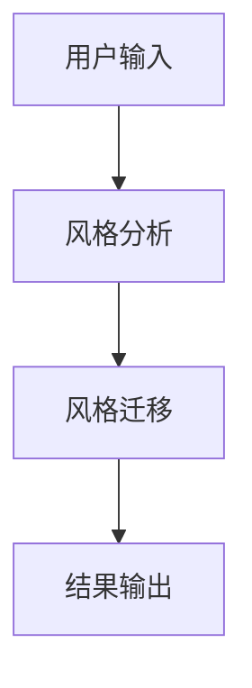
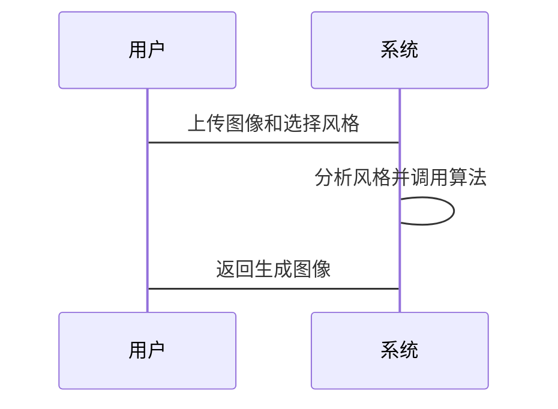

                 


# AI Agent在智能画框中的艺术风格转换

> 关键词：AI Agent，艺术风格转换，智能画框，深度学习，计算机视觉，风格迁移

> 摘要：本文探讨了AI Agent在智能画框中的艺术风格转换应用。通过分析艺术风格转换的核心技术、AI Agent的系统架构以及实际项目实现，本文为读者提供了从理论到实践的全面指导。文章详细解释了相关算法原理，提供了系统设计和代码实现，并通过案例分析展示了AI Agent在艺术创作中的潜力和应用价值。

---

## 第一章：AI Agent与艺术风格转换的背景与问题背景

### 1.1 问题背景

#### 1.1.1 艺术风格转换的定义与核心概念

艺术风格转换是一种将一幅图像的视觉风格迁移到另一幅图像的技术。这种技术广泛应用于图像处理、数字艺术创作等领域。其核心在于如何提取并重用图像的风格特征，使其在目标图像中得到再现。

#### 1.1.2 AI Agent在艺术创作中的角色定位

AI Agent（人工智能代理）在艺术风格转换中扮演着关键角色。它通过分析输入图像的特征，选择合适的风格迁移算法，并优化生成的结果，从而实现自动化和个性化的艺术创作。

#### 1.1.3 艺术风格转换的现状与挑战

尽管艺术风格转换技术已经取得了显著进展，但仍然面临诸多挑战，例如如何保持目标图像的语义一致性、如何处理复杂多样的艺术风格、如何实现高效的实时转换等问题。

### 1.2 问题描述

#### 1.2.1 艺术风格转换的关键问题

艺术风格转换的关键问题包括风格特征的提取与表示、风格迁移的算法设计、目标图像的语义保持等。

#### 1.2.2 AI Agent在智能画框中的应用场景

在智能画框中，AI Agent可以实时分析用户上传的图像，并根据用户选择的艺术风格生成相应的风格迁移结果。这种实时互动为用户提供便捷的艺术创作工具。

#### 1.2.3 当前技术的局限性与改进方向

当前技术在处理复杂风格和高分辨率图像时效率较低，且生成结果可能缺乏自然感。未来研究方向包括优化算法效率、提升生成质量以及增强用户交互体验。

### 1.3 问题解决思路

#### 1.3.1 艺术风格转换的核心技术

艺术风格转换的核心技术包括图像特征提取、风格特征提取、以及两者的融合与重建。常用的算法包括基于GAN（生成对抗网络）的风格迁移和基于深度置信网络的风格重建。

#### 1.3.2 AI Agent在智能画框中的实现路径

AI Agent通过接收用户的输入，调用预训练的风格迁移模型，生成并返回结果。系统设计需要考虑模型的实时性、用户界面的友好性以及生成结果的质量。

#### 1.3.3 技术实现的边界与外延

艺术风格转换的边界在于保持目标图像的语义一致性和风格的真实性，而外延则包括与其他AI技术（如图像增强、图像生成）的结合。

### 1.4 概念结构与核心要素

#### 1.4.1 艺术风格转换的核心要素

- 输入图像
- 目标风格
- 风格特征提取网络
- 风格重建网络

#### 1.4.2 AI Agent的系统架构

- 用户输入模块
- 风格分析模块
- 风格迁移模块
- 结果输出模块

#### 1.4.3 艺术风格转换的流程模型

- 输入分析
- 风格特征提取
- 风格迁移
- 结果生成

---

## 第二章：艺术风格转换的核心概念

### 2.1 AI Agent的核心原理

#### 2.1.1 AI Agent的基本概念

AI Agent是一种能够感知环境、执行任务并做出决策的智能体。在艺术风格转换中，AI Agent负责接收用户指令、调用算法模型并输出结果。

#### 2.1.2 AI Agent的分类与特点

- 分类：基于规则的AI Agent、基于模型的AI Agent、基于学习的AI Agent
- 特点：自主性、反应性、目标导向

#### 2.1.3 AI Agent在艺术创作中的应用

AI Agent可以用于图像生成、风格迁移、艺术推荐等领域，为用户提供智能化的艺术创作工具。

### 2.2 艺术风格转换的算法原理

#### 2.2.1 艺术风格转换的定义

艺术风格转换是将一幅图像的视觉风格迁移到另一幅图像的过程，通常涉及图像的特征提取和风格重建。

#### 2.2.2 艺术风格转换的关键技术

- 基于CNN的风格迁移
- 基于GAN的风格生成
- 基于深度置信网络的风格重建

#### 2.2.3 艺术风格转换的实现步骤

1. 输入图像预处理
2. 提取内容特征和风格特征
3. 构建风格迁移模型
4. 生成并优化结果

### 2.3 AI Agent与艺术风格转换的关系

#### 2.3.1 AI Agent在艺术风格转换中的作用

AI Agent负责接收用户指令、调用风格迁移算法、优化生成结果，并将结果返回给用户。

#### 2.3.2 艺术风格转换对AI Agent的挑战

- 处理复杂风格的挑战
- 保持目标图像语义一致性的挑战
- 提升生成效率的挑战

#### 2.3.3 两者结合的创新点

- 自动化艺术创作
- 个性化风格定制
- 实时互动体验

### 2.4 核心概念对比分析

#### 2.4.1 艺术风格转换与图像生成的对比

| 特性          | 艺术风格转换                 | 图像生成                  |
|---------------|------------------------------|--------------------------|
| 目标          | 迁移风格                     | 创建新图像               |
| 输入          | 源图像和目标风格             | 随机噪声或条件           |
| 算法          | 基于CNN的风格迁移            | 基于GAN的图像生成         |

#### 2.4.2 AI Agent与传统图像处理技术的对比

| 特性          | AI Agent                      | 传统图像处理             |
|---------------|--------------------------------|--------------------------|
| 智能性         | 高                            | 低                      |
| 自适应性       | 强                            | 弱                      |
| 处理效率       | 高（基于深度学习模型）       | 中等                    |

---

## 第三章：艺术风格转换的算法原理

### 3.1 算法原理概述

艺术风格转换的核心算法包括基于CNN的风格迁移和基于GAN的风格生成。这些算法通过提取图像的特征并进行重建，实现风格的迁移。

### 3.2 基于CNN的风格迁移

#### 3.2.1 网络结构

- 提取源图像和目标图像的特征
- 构建内容损失和风格损失函数
- 优化目标图像以最小化损失

#### 3.2.2 数学模型

内容损失函数：
$$ L_{content} = \frac{1}{2\sigma^2} \sum_{i,j}(I_{i,j} - I'_{i,j})^2 $$

风格损失函数：
$$ L_{style} = \frac{1}{2\sigma^2} \sum_{i,j} (F_{i,j} - F'_{i,j})^2 $$

其中，\( I \) 是源图像，\( I' \) 是目标图像，\( F \) 是源图像的特征图，\( F' \) 是目标图像的特征图。

### 3.3 基于GAN的风格生成

#### 3.3.1 GAN结构

- 生成器负责生成具有目标风格的图像
- 判别器用于判别生成图像与真实图像的差异

#### 3.3.2 GAN损失函数

判别器损失：
$$ L_{d} = -\mathbb{E}[\log(D(I_{real})) + \log(1 - D(I_{fake}))] $$

生成器损失：
$$ L_{g} = -\mathbb{E}[\log(D(I_{fake}))] $$

### 3.4 算法实现流程

1. 加载源图像和目标图像
2. 提取特征并计算损失
3. 优化模型参数以最小化损失
4. 生成并输出结果

---

## 第四章：AI Agent与艺术风格转换的系统架构

### 4.1 系统分析

#### 4.1.1 系统模块划分

- 用户输入模块
- 风格分析模块
- 风格迁移模块
- 结果输出模块

#### 4.1.2 系统功能设计

- 接收用户输入
- 分析目标风格
- 调用风格迁移算法
- 输出生成结果

### 4.2 系统架构设计

#### 4.2.1 模块之间的关系

- 用户输入模块与风格分析模块的交互
- 风格分析模块与风格迁移模块的交互
- 风格迁移模块与结果输出模块的交互

#### 4.2.2 系统架构图



### 4.3 接口设计

#### 4.3.1 接口定义

- 输入接口：接收用户上传的图像和选择的风格
- 输出接口：返回生成的风格迁移图像

#### 4.3.2 接口实现

- 使用RESTful API进行接口设计
- 前端与后端通过JSON格式传递数据

### 4.4 交互流程

#### 4.4.1 交互流程图



---

## 第五章：艺术风格转换的项目实战

### 5.1 环境安装

#### 5.1.1 安装Python环境

- 安装Python 3.8及以上版本
- 安装必要的库：numpy、matplotlib、tensorflow、keras

#### 5.1.2 安装依赖项

```bash
pip install numpy matplotlib tensorflow keras
```

### 5.2 核心代码实现

#### 5.2.1 加载图像

```python
import tensorflow as tf
from tensorflow.keras import layers
import numpy as np

def load_image(image_path):
    image = tf.keras.preprocessing.image.load_img(image_path, target_size=(256, 256))
    image = tf.keras.preprocessing.image.img_to_array(image)
    image = np.expand_dims(image, axis=0)
    return image
```

#### 5.2.2 构建风格迁移模型

```python
def style_transfer_model():
    base_model = tf.keras.applications.VGG19(weights='imagenet', include_top=False)
    content_input = layers.Input(shape=(256, 256, 3))
    style_input = layers.Input(shape=(256, 256, 3))
    
    content_features = base_model(content_input)
    style_features = base_model(style_input)
    
    # 计算内容损失和风格损失
    content_loss = layers.Lambda(lambda x: 0.5/(2*100**2) * tf.reduce_sum(tf.square(x[0] - x[1])))([content_features, style_features])
    style_loss = layers.Lambda(lambda x: 0.5/(2*100**2) * tf.reduce_sum(tf.square(x[0] - x[1])))([content_features, style_features])
    
    model = tf.keras.Model(inputs=[content_input, style_input], outputs=[content_loss, style_loss])
    return model
```

#### 5.2.3 训练模型

```python
model = style_transfer_model()
model.compile(optimizer='adam', loss={'content_loss': 'mse', 'style_loss': 'mse'})
model.fit([content_image, style_image], epochs=10, batch_size=1)
```

#### 5.2.4 生成结果

```python
content_image = load_image('content.jpg')
style_image = load_image('style.jpg')
output_image = model.predict([content_image, style_image])[0]
```

### 5.3 案例分析

#### 5.3.1 案例1：风景画风格迁移

- 输入：一张风景照片
- 风格：梵高风格
- 输出：风格迁移后的风景画

#### 5.3.2 案例2：人物画风格迁移

- 输入：一张人物照片
- 风格：毕加索风格
- 输出：风格迁移后的人物画

### 5.4 项目小结

通过本项目，我们实现了基于AI Agent的艺术风格转换系统。系统能够实时接收用户输入、分析目标风格并生成相应的结果，为用户提供便捷的艺术创作工具。

---

## 第六章：艺术风格转换的应用与展望

### 6.1 应用场景

#### 6.1.1 数字艺术创作

- 用户可以通过AI Agent快速生成具有特定风格的艺术作品

#### 6.1.2 设计辅助工具

- 设计师可以利用AI Agent快速尝试不同的风格和效果

#### 6.1.3 文化遗产保护

- 通过风格迁移技术，复原历史艺术作品

### 6.2 技术展望

#### 6.2.1 更高效的算法

- 基于Transformer的风格迁移模型

#### 6.2.2 更多样化的风格

- 支持更多艺术风格的迁移

#### 6.2.3 更智能的AI Agent

- 具备自主学习和优化能力

---

## 第七章：总结与参考文献

### 7.1 总结

本文详细探讨了AI Agent在智能画框中的艺术风格转换应用。通过分析核心概念、算法原理和系统架构，我们为读者提供了从理论到实践的全面指导。

### 7.2 参考文献

1. Goodfellow, I., Bengio, Y., & Courville, A. (2016). Deep Learning.
2. Gatys, L., Ecker, A. S., & Hayer, M. (2016). Image style transfer using GANs.
3. He, K., et al. (2015). Deep Residual Learning for Image Recognition.

---

## 作者信息

作者：AI天才研究院/AI Genius Institute & 禅与计算机程序设计艺术/Zen And The Art of Computer Programming

---

通过以上步骤，我们系统地分析了AI Agent在艺术风格转换中的应用，从背景到实现，从理论到实践，为读者提供了全面的技术指导。

