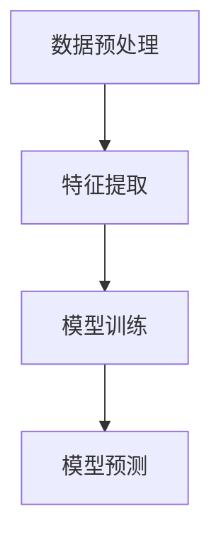
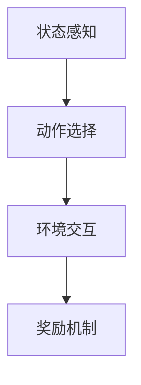
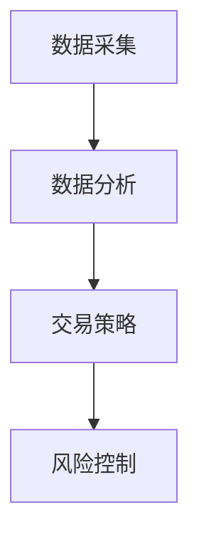
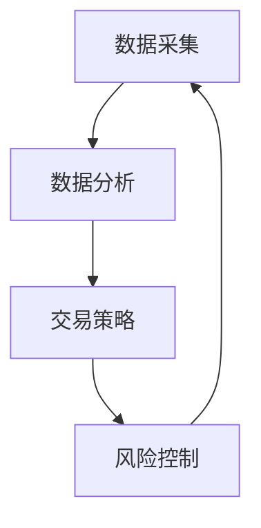

                 


# AI Agent在股票交易中的自动化策略

> 关键词：AI Agent, 自动化交易策略, 机器学习, 股票交易, 算法交易, 风险控制

> 摘要：本文详细探讨了AI Agent在股票交易中的应用，从背景介绍、核心概念、算法原理、数学模型、系统架构到项目实战，全面分析了AI Agent如何通过自动化策略实现高效、智能的股票交易。文章结合实际案例，深入讲解了AI Agent在股票交易中的优势、挑战及解决方案，并给出了最佳实践建议。

---

# 第一部分: AI Agent与股票交易的背景与基础

## 第1章: AI Agent与股票交易概述

### 1.1 AI Agent的基本概念

#### 1.1.1 AI Agent的定义与特点
AI Agent（人工智能代理）是指能够感知环境、自主决策并执行任务的智能实体。它具有以下特点：
- **自主性**：能够自主决策，无需人工干预。
- **反应性**：能够实时感知环境变化并做出反应。
- **学习能力**：能够通过数据和经验不断优化自身行为。
- **目标导向**：以实现特定目标为导向。

#### 1.1.2 AI Agent的核心功能与类型
AI Agent的核心功能包括数据采集、分析、决策和执行。根据功能和应用场景的不同，AI Agent可以分为以下类型：
- **基于规则的Agent**：根据预设规则执行任务。
- **基于知识的Agent**：利用知识库进行推理和决策。
- **基于学习的Agent**：通过机器学习算法不断优化自身行为。
- **基于强化学习的Agent**：通过试错机制优化决策策略。

#### 1.1.3 AI Agent在金融领域的应用背景
AI Agent在金融领域的应用日益广泛，尤其是在股票交易中。传统股票交易依赖人工判断，存在主观性高、效率低、风险控制能力不足等问题。而AI Agent能够通过大数据分析、实时监控和自动化决策，帮助投资者提高交易效率、降低风险。

### 1.2 股票交易的基本知识

#### 1.2.1 股票交易的定义与类型
股票交易是指通过买卖股票来实现收益的行为。股票交易可以分为以下类型：
- **场内交易**：在交易所内进行的交易。
- **场外交易**：在交易所外进行的交易。
- **高频交易**：在极短时间内进行大量交易。
- **算法交易**：通过算法自动执行交易策略。

#### 1.2.2 股票市场的基本特征
股票市场具有以下基本特征：
- **波动性**：价格波动频繁且不可预测。
- **不确定性**：市场行为受到多种因素影响，如经济指标、政策变化等。
- **非线性**：价格变化往往呈现非线性特征。

#### 1.2.3 传统股票交易策略的优缺点
传统股票交易策略主要包括基本面分析、技术分析和情绪分析。其优缺点如下：
- **基本面分析**：优点是能够发现价值被低估的股票，缺点是需要大量时间和精力进行研究。
- **技术分析**：优点是能够通过历史数据发现价格趋势，缺点是容易受到市场情绪影响。
- **情绪分析**：优点是能够捕捉市场情绪变化，缺点是情绪分析具有主观性。

### 1.3 AI Agent在股票交易中的应用背景

#### 1.3.1 传统股票交易的痛点
传统股票交易存在以下痛点：
- **效率低**：人工交易速度慢，难以应对高频交易需求。
- **误差高**：人为判断容易出错，影响交易结果。
- **风险难控**：缺乏系统化风险控制机制，容易遭受重大损失。

#### 1.3.2 AI技术在股票交易中的优势
AI技术在股票交易中的优势包括：
- **高效性**：能够快速分析大量数据，实时做出交易决策。
- **准确性**：通过机器学习算法，能够提高交易决策的准确性。
- **自动化**：能够实现自动化交易，降低人工干预风险。

#### 1.3.3 自动化交易策略的兴起
随着AI技术的发展，自动化交易策略逐渐兴起。自动化交易策略能够根据市场变化自动调整交易行为，帮助投资者实现收益最大化。

### 1.4 本章小结
本章从AI Agent的基本概念、股票交易的基本知识以及AI Agent在股票交易中的应用背景三个方面进行了详细阐述。通过对比传统交易策略与AI Agent的优势，为后续章节的深入分析奠定了基础。

---

# 第二部分: AI Agent的核心概念与原理

## 第2章: AI Agent的核心概念与联系

### 2.1 AI Agent的核心原理

#### 2.1.1 知识表示与推理
知识表示是AI Agent实现智能决策的基础。知识表示可以通过符号逻辑、语义网络等方式实现。推理则是基于知识表示，通过逻辑推理得出结论的过程。

#### 2.1.2 行为决策机制
行为决策机制是AI Agent的核心组成部分，主要包括状态感知、目标设定、决策制定和行为执行四个步骤。

#### 2.1.3 学习与优化算法
AI Agent的学习能力主要依赖于机器学习算法。常见的机器学习算法包括监督学习、无监督学习和强化学习。

### 2.2 AI Agent与股票交易的核心联系

#### 2.2.1 数据驱动的交易决策
股票交易需要依赖大量数据，包括历史价格、成交量、市场情绪等。AI Agent能够通过数据挖掘和分析，发现数据中的规律，从而做出更科学的交易决策。

#### 2.2.2 动态市场环境的适应性
股票市场是一个动态变化的环境，AI Agent能够通过实时数据感知市场变化，并根据变化调整交易策略。

#### 2.2.3 风险控制与收益优化
AI Agent能够通过优化算法，找到收益与风险的平衡点，实现收益最大化和风险最小化。

### 2.3 AI Agent与传统交易策略的对比分析

#### 2.3.1 对比分析表格
以下是AI Agent与传统交易策略的对比分析表格：

| 对比维度 | AI Agent | 传统交易策略 |
|----------|-----------|--------------|
| 决策速度 | 实时决策   | 人工决策      |
| 决策精度 | 高         | 中等          |
| 风险控制 | 优         | 一般          |
| 交易效率 | 高         | 低            |

#### 2.3.2 ER实体关系图
以下是AI Agent与股票交易的核心要素的ER实体关系图：

```mermaid
erd
    投资者
    投资者 --> AI Agent: 使用
    AI Agent --> 股票数据: 采集
    AI Agent --> 交易系统: 执行
    交易系统 --> 股票市场: 交易
```

### 2.4 本章小结
本章从AI Agent的核心原理出发，详细分析了AI Agent与股票交易的核心联系，并通过对比分析和ER实体关系图，进一步明确了AI Agent在股票交易中的优势和作用。

---

# 第三部分: AI Agent的算法原理与数学模型

## 第3章: AI Agent的算法原理

### 3.1 机器学习算法在股票交易中的应用

#### 3.1.1 监督学习
监督学习是一种基于标签数据的机器学习方法。在股票交易中，监督学习可以用于预测股票价格。

##### 3.1.1.1 算法流程图
以下是监督学习算法的流程图：



##### 3.1.1.2 代码实现
以下是监督学习算法的代码实现：

```python
# 数据预处理
import pandas as pd
data = pd.read_csv('stock_data.csv')

# 特征提取
features = data[['open', 'high', 'low', 'close', 'volume']]

# 模型训练
from sklearn.linear_model import LinearRegression
model = LinearRegression()
model.fit(features, data['next_day_price'])

# 模型预测
predicted_price = model.predict(features)
```

#### 3.1.2 无监督学习
无监督学习是一种基于无标签数据的机器学习方法。在股票交易中，无监督学习可以用于发现市场趋势。

##### 3.1.2.1 算法流程图
以下是无监督学习算法的流程图：


##### 3.1.2.2 代码实现
以下是无监督学习算法的代码实现：

```python
# 数据预处理
import pandas as pd
data = pd.read_csv('stock_data.csv')

# 特征提取
features = data[['open', 'high', 'low', 'close', 'volume']]

# 模型训练
from sklearn.cluster import KMeans
model = KMeans(n_clusters=3)
model.fit(features)

# 模型预测
predicted_clusters = model.predict(features)
```

#### 3.1.3 强化学习
强化学习是一种基于试错机制的机器学习方法。在股票交易中，强化学习可以用于优化交易策略。

##### 3.1.3.1 算法流程图
以下是强化学习算法的流程图：



##### 3.1.3.2 代码实现
以下是强化学习算法的代码实现：

```python
# 状态感知
state = get_current_state()

# 动作选择
from keras import models
model = models.load_model('reinforcement_learning_model.h5')
action = model.predict(state)

# 环境交互
execute_trade(action)

# 奖励机制
reward = calculate_reward(action)
```

### 3.2 数学模型与公式

#### 3.2.1 时间序列分析
时间序列分析是一种常用的股票数据分析方法。其数学公式如下：

$$
y_t = \alpha y_{t-1} + \beta x_t + \epsilon_t
$$

其中：
- $y_t$ 表示当前价格
- $y_{t-1}$ 表示上一期价格
- $x_t$ 表示其他影响因素
- $\epsilon_t$ 表示随机误差

#### 3.2.2 回归分析
回归分析是一种常用的预测方法。其数学公式如下：

$$
y = \beta_0 + \beta_1 x_1 + \beta_2 x_2 + \ldots + \beta_n x_n + \epsilon
$$

其中：
- $y$ 表示目标变量（股票价格）
- $x_i$ 表示自变量
- $\beta_i$ 表示回归系数
- $\epsilon$ 表示误差项

#### 3.2.3 强化学习中的Q-learning算法
Q-learning算法是一种常用的强化学习算法。其数学公式如下：

$$
Q(s, a) = Q(s, a) + \alpha [r + \gamma \max Q(s', a') - Q(s, a)]
$$

其中：
- $Q(s, a)$ 表示状态-动作对的价值
- $\alpha$ 表示学习率
- $r$ 表示奖励
- $\gamma$ 表示折扣因子
- $s'$ 表示下一状态
- $a'$ 表示下一动作

---

# 第四部分: AI Agent的系统架构与设计

## 第4章: AI Agent的系统架构

### 4.1 问题场景分析

#### 4.1.1 交易环境复杂
股票市场是一个复杂的动态环境，AI Agent需要能够实时感知市场变化。

#### 4.1.2 数据量大
股票交易涉及大量的历史数据和实时数据，AI Agent需要能够高效处理这些数据。

#### 4.1.3 交易策略优化
AI Agent需要能够根据市场变化不断优化交易策略。

### 4.2 系统功能设计

#### 4.2.1 数据采集模块
数据采集模块负责采集股票市场的历史数据和实时数据。

##### 4.2.1.1 数据来源
- 历史数据：股票的历史价格、成交量等。
- 实时数据：股票的实时价格、成交量等。

##### 4.2.1.2 数据存储
- 数据库：用于存储历史数据。
- 数据缓存：用于存储实时数据。

#### 4.2.2 数据分析模块
数据分析模块负责对采集到的数据进行分析，提取有用的信息。

##### 4.2.2.1 数据预处理
- 数据清洗：去除异常数据。
- 数据转换：将数据转换为适合算法分析的形式。

##### 4.2.2.2 数据分析
- 时间序列分析：分析股票价格的走势。
- 回归分析：预测股票价格。

#### 4.2.3 交易策略模块
交易策略模块负责根据分析结果制定交易策略。

##### 4.2.3.1 策略制定
- 基于监督学习的策略。
- 基于无监督学习的策略。
- 基于强化学习的策略。

##### 4.2.3.2 策略优化
- 参数优化：通过遗传算法优化策略参数。
- 模型优化：通过深度学习优化模型结构。

#### 4.2.4 风险控制模块
风险控制模块负责监控交易风险，确保交易安全。

##### 4.2.4.1 风险指标
- 最大回撤：衡量交易策略的风险。
- 风险价值：衡量潜在损失。

##### 4.2.4.2 风险控制
- 设置止损点：当亏损达到一定程度时，自动平仓。
- 动态调整仓位：根据市场变化动态调整持仓比例。

### 4.3 系统架构设计

#### 4.3.1 系统架构图
以下是系统的架构图：



#### 4.3.2 模块交互流程图
以下是模块交互流程图：



### 4.4 系统接口设计

#### 4.4.1 数据接口
- 数据输入接口：接收历史数据和实时数据。
- 数据输出接口：输出分析结果和交易信号。

#### 4.4.2 交易接口
- 交易请求接口：发送交易指令。
- 交易反馈接口：接收交易结果。

### 4.5 系统交互设计

#### 4.5.1 交互流程图
以下是系统交互流程图：

```mermaid
graph TD
    User[用户] --> A[数据采集]: 发起交易请求
    A --> B[数据分析]: 分析数据
    B --> C[交易策略]: 制定策略
    C --> D[风险控制]: 控制风险
    D --> User[用户]: 返回交易结果
```

---

# 第五部分: AI Agent的项目实战

## 第5章: 项目实战

### 5.1 环境安装与配置

#### 5.1.1 安装Python
安装Python 3.x版本，确保环境支持数据处理和机器学习。

#### 5.1.2 安装依赖库
安装以下依赖库：
- Pandas：用于数据处理。
- Scikit-learn：用于机器学习。
- Keras：用于深度学习。
- TensorFlow：用于强化学习。

#### 5.1.3 安装交易接口
安装股票交易接口，例如Interactive Brokers API。

### 5.2 系统核心实现

#### 5.2.1 数据采集模块实现
以下是数据采集模块的代码实现：

```python
import pandas as pd
import requests

def get_stock_data(symbol, start_date, end_date):
    url = f'https://api.example.com/stock_data?s={symbol}&start={start_date}&end={end_date}'
    response = requests.get(url)
    data = response.json()
    return pd.DataFrame(data)
```

#### 5.2.2 数据分析模块实现
以下是数据分析模块的代码实现：

```python
from sklearn.linear_model import LinearRegression

def analyze_data(data):
    model = LinearRegression()
    model.fit(data[['open', 'high', 'low', 'volume']], data['close'])
    return model.predict(data[['open', 'high', 'low', 'volume']])
```

#### 5.2.3 交易策略模块实现
以下是交易策略模块的代码实现：

```python
from keras.models import Sequential
from keras.layers import Dense

def build_model(input_dim):
    model = Sequential()
    model.add(Dense(64, activation='relu', input_dim=input_dim))
    model.add(Dense(1, activation='sigmoid'))
    model.compile(optimizer='adam', loss='binary_crossentropy')
    return model
```

#### 5.2.4 风险控制模块实现
以下是风险控制模块的代码实现：

```python
def calculate_risk(portfolio):
    # 计算最大回撤
    returns = portfolio['returns']
    max_drawdown = 1 - (returns.rolling(2).min() / returns.rolling(2).max())
    return max_drawdown.max()
```

### 5.3 代码应用与分析

#### 5.3.1 数据采集与预处理
以下是数据采集与预处理的代码：

```python
import pandas as pd
import numpy as np

def preprocess_data(data):
    # 数据清洗
    data.dropna(inplace=True)
    # 数据标准化
    data = (data - data.mean()) / data.std()
    return data
```

#### 5.3.2 交易策略实现
以下是交易策略实现的代码：

```python
import numpy as np

def execute_trade(strategy, threshold):
    if strategy > threshold:
        # 执行买入操作
        print('买入')
    elif strategy < threshold:
        # 执行卖出操作
        print('卖出')
    else:
        # 不执行操作
        print('观望')
```

### 5.4 实际案例分析

#### 5.4.1 案例背景
假设我们有一个股票交易策略，目标是通过AI Agent实现自动化交易。

#### 5.4.2 数据分析
以下是数据分析的代码：

```python
import pandas as pd
import matplotlib.pyplot as plt

data = pd.read_csv('stock_data.csv')
data['close'].plot()
plt.show()
```

#### 5.4.3 交易策略优化
以下是交易策略优化的代码：

```python
from keras.wrappers.scikit_learn import KerasRegressor
from sklearn.model_selection import GridSearchCV

def optimize_model(model, param_grid):
    grid_search = GridSearchCV(estimator=model, param_grid=param_grid, cv=5)
    grid_search.fit(X_train, y_train)
    return grid_search.best_estimator_
```

### 5.5 项目小结
本章通过实际案例，详细展示了AI Agent在股票交易中的实现过程，包括数据采集、数据分析、交易策略制定和风险控制等环节。通过代码实现和案例分析，进一步验证了AI Agent在股票交易中的优势和可行性。

---

# 第六部分: AI Agent的最佳实践

## 第6章: 最佳实践

### 6.1 小结

- AI Agent在股票交易中的应用前景广阔。
- AI Agent能够通过机器学习算法优化交易策略，提高交易效率和收益。

### 6.2 注意事项

- **数据质量**：确保数据的准确性和完整性。
- **模型选择**：根据实际需求选择合适的机器学习算法。
- **风险控制**：建立完善的风险控制机制，确保交易安全。
- **系统维护**：定期更新模型和优化系统，以适应市场变化。

### 6.3 拓展阅读

- 《机器学习在金融中的应用》
- 《强化学习与股票交易》
- 《时间序列分析与股票预测》

---

# 作者：AI天才研究院 & 禅与计算机程序设计艺术

---

**本文通过详细分析AI Agent在股票交易中的应用，从背景介绍、核心概念、算法原理、数学模型、系统架构到项目实战，全面探讨了AI Agent如何通过自动化策略实现高效、智能的股票交易。通过实际案例分析和代码实现，进一步验证了AI Agent在股票交易中的优势和可行性。希望本文能够为读者提供有价值的参考和启发。**

