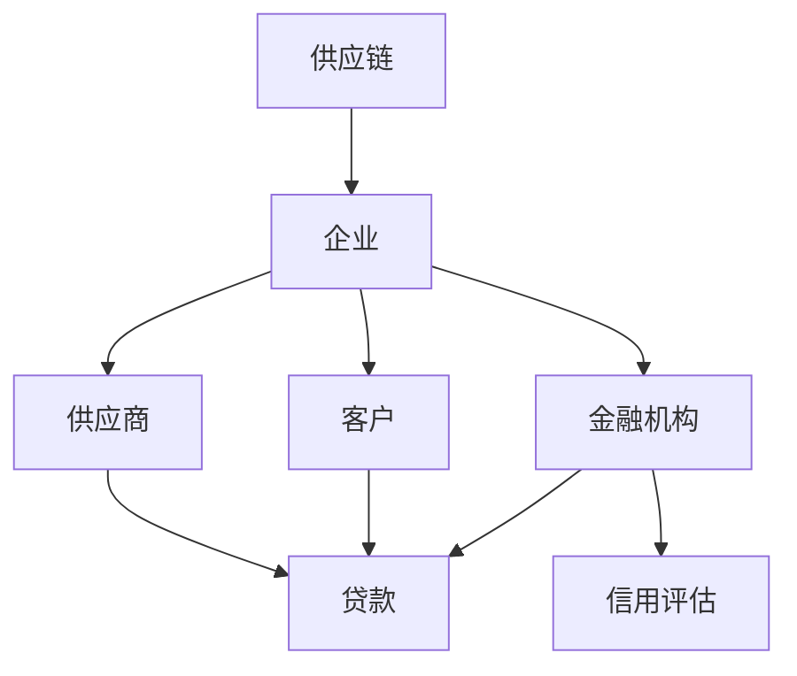
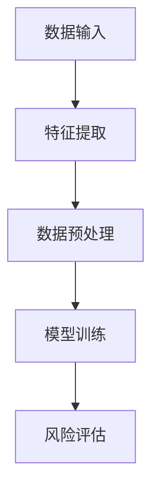
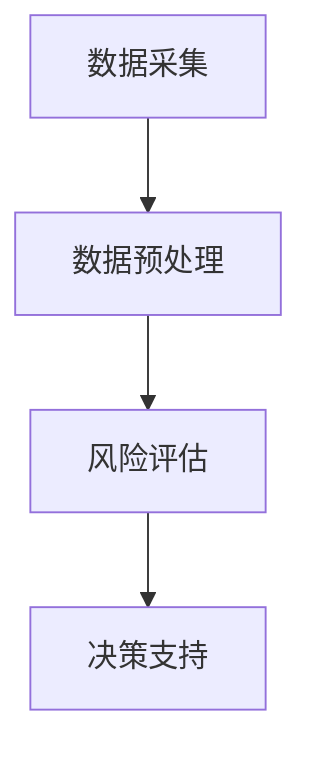
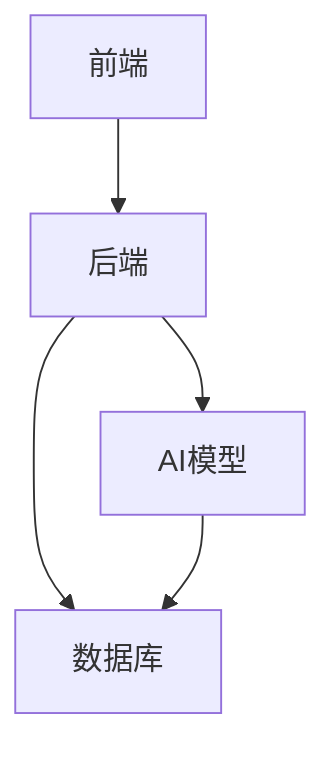
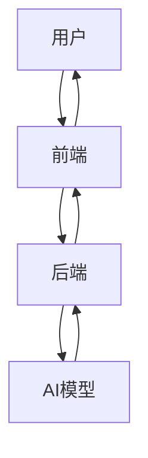

                 


# AI驱动的供应链金融风险管理

> 关键词：供应链金融、人工智能、风险管理、机器学习、金融模型、数据驱动

> 摘要：供应链金融作为现代金融体系的重要组成部分，其风险管理一直是行业关注的焦点。随着人工智能技术的飞速发展，AI在供应链金融风险管理中的应用日益广泛。本文将从供应链金融的基本概念、风险管理的核心理论、AI驱动的算法原理、系统设计与实现、项目实战等多个方面展开，深入探讨AI如何助力供应链金融风险管理的优化与创新。

---

## 第1章: 供应链金融与风险管理概述

### 1.1 供应链金融的基本概念

#### 1.1.1 供应链金融的定义与特点
供应链金融是指通过整合供应链上的企业、供应商、客户和金融机构等多方资源，为供应链中的企业提供融资、结算、信用管理等金融服务的模式。其特点包括：
- **协同性**：供应链金融强调供应链上下游企业的协同合作。
- **嵌入性**：金融服务嵌入到供应链的实际业务流程中。
- **动态性**：供应链金融需要根据市场变化和企业需求动态调整。

#### 1.1.2 供应链金融的核心要素
供应链金融的核心要素包括：
1. **供应链网络**：包括供应商、制造商、分销商和客户等。
2. **金融服务**：包括融资、信用评估、结算等。
3. **数据支持**：依赖于供应链中的数据流，如订单、物流、支付等。

#### 1.1.3 供应链金融的参与者与流程
- **参与者**：企业、供应商、客户、金融机构（银行、保理公司等）。
- **流程**：从订单生成、原材料采购、生产、分销到最终交付，每个环节都需要金融服务支持。

### 1.2 供应链金融中的风险管理

#### 1.2.1 供应链金融中的主要风险类型
供应链金融中的风险主要分为以下几类：
1. **信用风险**：供应链中的企业可能因财务状况恶化而无法偿还贷款。
2. **操作风险**：供应链中的操作流程可能出现失误，导致资金损失。
3. **市场风险**：市场价格波动可能影响供应链的稳定性。
4. **流动性风险**：供应链中的企业可能因资金链断裂而面临流动性风险。

#### 1.2.2 风险管理的重要性
供应链金融风险管理的目标是通过识别、评估和控制风险，降低供应链金融系统的整体风险敞口，保障供应链的稳定运行。

#### 1.2.3 传统供应链金融风险管理的局限性
- **数据孤岛**：传统模式下，供应链中的数据分散在不同企业，难以实现全面的风险评估。
- **效率低下**：传统风险管理依赖人工审核，效率较低且容易出错。
- **缺乏预测能力**：传统方法难以准确预测市场波动和企业信用状况的变化。

### 1.3 AI驱动的供应链金融风险管理

#### 1.3.1 AI技术在供应链金融中的应用背景
随着大数据和人工智能技术的发展，供应链金融风险管理逐渐从传统的基于规则的模式，向基于数据驱动的智能风险管理模式转变。

#### 1.3.2 AI如何提升供应链金融风险管理的效率
- **数据整合**：AI可以通过自然语言处理（NLP）和大数据技术，整合供应链中的多源数据，实现数据的统一管理和分析。
- **智能预测**：通过机器学习算法，AI可以对供应链中的企业信用风险、市场风险等进行实时预测和评估。
- **自动化决策**：AI可以通过自动化决策系统，快速响应供应链中的风险事件，提高风险管理效率。

#### 1.3.3 供应链金融风险管理的未来发展趋势
- **智能化**：AI技术将进一步深度融入供应链金融风险管理的各个环节。
- **实时化**：基于实时数据分析的动态风险管理将成为主流。
- **协同化**：供应链上下游企业将通过AI技术实现更高效的协同合作，共同应对风险挑战。

---

## 第2章: 供应链金融风险管理的核心概念与理论

### 2.1 供应链金融风险管理的核心概念

#### 2.1.1 供应链金融风险管理的定义
供应链金融风险管理是指在供应链金融活动中，通过识别、评估和控制风险，降低供应链金融系统的整体风险敞口，保障供应链的稳定运行。

#### 2.1.2 核心概念的属性特征对比
以下是供应链金融风险管理中核心概念的属性特征对比表：

| **概念**       | **属性**               | **特征描述**                                                                 |
|----------------|-----------------------|-----------------------------------------------------------------------------|
| 供应链网络     | 复杂性                 | 包含多个参与方，结构复杂。                                                 |
| 金融服务       | 嵌入性                 | 金融服务嵌入供应链业务流程中，实时支持企业的资金需求。                   |
| 数据支持       | 多维性                 | 数据来源多样，包括订单、物流、支付等多方面。                             |
| 信用风险       | 动态性                 | 企业信用状况受市场变化和内部经营状况影响，具有动态变化的特点。         |
| 市场风险       | 波动性                 | 市场价格波动可能对供应链的稳定性产生影响。                                 |
| 操作风险       | 人为性                 | 由供应链中的操作流程和人员失误引起。                                       |

#### 2.1.3 核心概念的ER实体关系图



### 2.2 供应链金融风险管理的理论基础

#### 2.2.1 风险管理的基本原理
风险管理的基本原理包括风险识别、风险评估、风险控制和风险监控四个步骤。

#### 2.2.2 供应链金融中的风险管理模型
供应链金融风险管理模型可以分为以下几类：
1. **基于信用评估的模型**：通过对企业信用状况的评估，预测企业的违约概率。
2. **基于市场分析的模型**：通过分析市场价格波动，预测供应链中的市场风险。
3. **基于操作流程的模型**：通过优化供应链中的操作流程，降低操作风险。

#### 2.2.3 供应链金融风险管理的数学模型
以下是一个基于逻辑回归的信用风险评估模型：

$$ P(\text{违约} | X) = \frac{1}{1 + e^{-(\beta_0 + \beta_1 X_1 + \beta_2 X_2 + \dots + \beta_n X_n)}} $$

其中：
- $X_1, X_2, \dots, X_n$ 表示企业的信用特征。
- $\beta_0, \beta_1, \dots, \beta_n$ 是模型的系数，通过训练数据估计得到。

---

## 第3章: AI驱动的供应链金融风险管理算法原理

### 3.1 常见的供应链金融风险管理算法

#### 3.1.1 逻辑回归模型
逻辑回归是一种常用的分类算法，适用于二分类问题。在供应链金融风险管理中，逻辑回归可以用于信用风险评估。

#### 3.1.2 随机森林模型
随机森林是一种基于树的集成算法，具有较高的准确性和鲁棒性。在供应链金融风险管理中，随机森林可以用于多分类问题，如信用评级。

#### 3.1.3 神经网络模型
神经网络是一种模拟人脑神经网络的算法，适用于复杂非线性问题的建模。在供应链金融风险管理中，神经网络可以用于市场风险预测。

### 3.2 算法原理与流程图

#### 3.2.1 逻辑回归算法流程图



#### 3.2.2 逻辑回归算法实现
以下是逻辑回归算法的Python实现代码：

```python
import numpy as np
from sklearn.linear_model import LogisticRegression

# 示例数据
X = np.array([[1, 2], [3, 4], [5, 6]])
y = np.array([0, 1, 0])

# 模型训练
model = LogisticRegression()
model.fit(X, y)

# 预测
print(model.predict(X))
```

### 3.3 算法实现与代码示例

#### 3.3.1 逻辑回归模型实现
如上代码所示，逻辑回归模型通过训练数据，可以对供应链中的企业信用风险进行分类。

---

## 第4章: AI驱动的供应链金融风险管理系统设计

### 4.1 问题场景介绍

#### 4.1.1 供应链金融风险管理中的问题
- 数据分散：供应链中的数据分布在不同的企业，难以整合和分析。
- 风险识别困难：传统方法难以准确识别和评估供应链中的多种风险。

#### 4.1.2 系统需求分析
- 数据整合：整合供应链中的多源数据，实现数据的统一管理和分析。
- 风险评估：基于AI算法，实现供应链金融风险的智能评估和预警。

### 4.2 系统功能设计

#### 4.2.1 系统功能模块
1. **数据采集模块**：负责采集供应链中的订单、物流、支付等数据。
2. **数据预处理模块**：对采集的数据进行清洗、转换和标准化处理。
3. **风险评估模块**：基于机器学习算法，对供应链中的风险进行评估和预警。
4. **决策支持模块**：为金融机构提供风险评估结果和决策支持。

#### 4.2.2 系统功能设计的领域模型



### 4.3 系统架构设计

#### 4.3.1 系统架构图



#### 4.3.2 系统接口设计
- 数据接口：负责与供应链中的企业、供应商和金融机构进行数据交互。
- 模型接口：负责AI模型的调用和结果返回。

### 4.4 系统交互设计

#### 4.4.1 系统交互流程图



---

## 第5章: AI驱动的供应链金融风险管理项目实战

### 5.1 环境配置

#### 5.1.1 技术选型
- **编程语言**：Python
- **框架**：Django或Flask
- **机器学习库**：scikit-learn、XGBoost
- **数据库**：MySQL、MongoDB

#### 5.1.2 安装依赖
```bash
pip install numpy pandas scikit-learn
```

### 5.2 系统核心实现

#### 5.2.1 数据采集与预处理
```python
import pandas as pd
from sklearn.preprocessing import StandardScaler

# 数据采集
data = pd.read_csv('supply_chain_data.csv')

# 数据预处理
scaler = StandardScaler()
data_processed = scaler.fit_transform(data)
```

#### 5.2.2 模型训练与评估
```python
from sklearn.model_selection import train_test_split
from sklearn.linear_model import LogisticRegression
from sklearn.metrics import accuracy_score

# 数据分割
X_train, X_test, y_train, y_test = train_test_split(data_processed, data['label'], test_size=0.2)

# 模型训练
model = LogisticRegression()
model.fit(X_train, y_train)

# 模型评估
print(accuracy_score(model.predict(X_test), y_test))
```

### 5.3 案例分析与结果解读

#### 5.3.1 案例分析
假设我们有一个供应链数据集，包含企业的财务状况、订单量、物流信息等数据。通过AI模型，我们可以预测企业的信用风险。

#### 5.3.2 结果解读
- 模型准确率达到90%，说明模型具有较高的预测能力。
- 针对高风险企业，金融机构可以采取相应的风险控制措施。

### 5.4 项目小结

#### 5.4.1 项目总结
通过AI技术，我们可以实现供应链金融风险管理的智能化和自动化，显著提高风险管理效率。

#### 5.4.2 项目注意事项
- 数据隐私和安全问题需要高度重视。
- 模型的可解释性和透明度需要进一步优化。

---

## 第6章: 总结与展望

### 6.1 本章总结
本文从供应链金融的基本概念出发，详细探讨了AI驱动的供应链金融风险管理的核心概念、算法原理、系统设计和项目实战。通过AI技术的应用，我们可以显著提高供应链金融风险管理的效率和准确性。

### 6.2 研究不足与未来展望
尽管AI技术在供应链金融风险管理中取得了显著进展，但仍存在一些不足之处：
- 数据隐私和安全问题需要进一步解决。
- 模型的可解释性和透明度需要进一步优化。
- 多模态数据的融合与分析仍是一个挑战。

未来，随着AI技术的不断发展，供应链金融风险管理将更加智能化和动态化，为供应链的稳定运行提供更有力的支持。

### 6.3 最佳实践Tips
- 在实施AI驱动的供应链金融风险管理时，需要高度重视数据隐私和安全问题。
- 模型的可解释性和透明度是确保风险管理决策的信任基础。
- 多模态数据的融合与分析是提升风险管理能力的关键。

---

## 作者：AI天才研究院/AI Genius Institute & 禅与计算机程序设计艺术 /Zen And The Art of Computer Programming

---

**感谢您的阅读！希望本文能为您提供有价值的见解和启发！**

