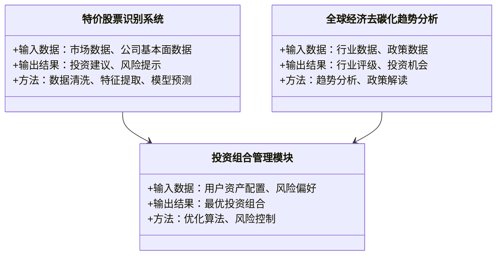
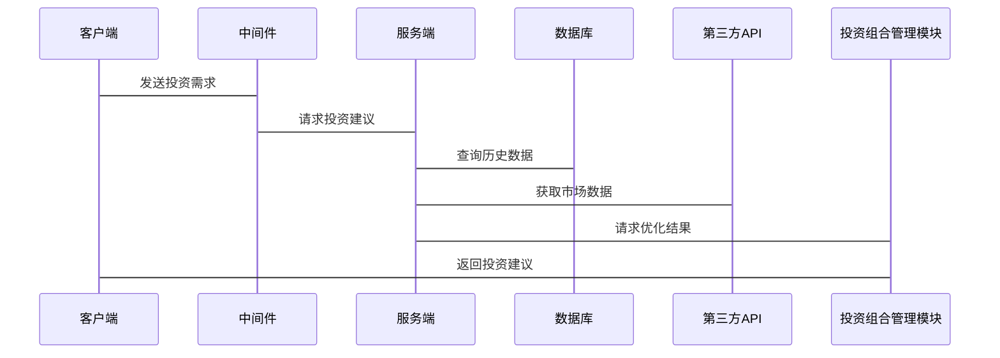

                 


# 如何利用特价股票投资应对全球经济去碳化趋势

> 关键词：全球经济去碳化、特价股票、投资策略、绿色能源、可持续发展

> 摘要：本文详细探讨了全球经济去碳化趋势对投资的影响，特别是如何利用特价股票进行投资。文章从背景、行业影响、投资策略、全球市场机会、系统设计和项目实战等多个方面进行分析，结合数学模型和算法原理，为投资者提供深度指导。

---

## 第一部分: 全球经济去碳化趋势与特价股票投资概述

### 第1章: 全球经济去碳化趋势的背景与影响

#### 1.1 全球经济去碳化趋势的背景

##### 1.1.1 气候变化与可持续发展的重要性
气候变化是21世纪最大的全球性挑战之一。根据联合国政府间气候变化专门委员会（IPCC）的报告，全球气温上升速度远超预期，极端天气事件频发，威胁人类生存环境。为应对气候变化，全球各国纷纷签署《巴黎协定》，承诺将全球气温上升控制在1.5摄氏度以内。

经济去碳化是实现碳中和目标的核心路径。通过减少温室气体排放，推动经济体系向低碳化转型，是实现可持续发展的重要手段。这一过程涉及能源结构优化、产业升级和技术创新。

##### 1.1.2 全球经济去碳化的定义与目标
经济去碳化是指减少经济活动对化石能源的依赖，降低碳排放强度的过程。其目标是通过技术创新、政策引导和市场机制，构建一个清洁、高效、可持续的经济体系。

##### 1.1.3 去碳化对全球经济结构的影响
- **能源结构优化**：传统化石能源占比下降，可再生能源占比上升。
- **产业升级**：高碳行业面临转型压力，绿色产业迎来发展机遇。
- **就业结构变化**：新能源、环保等领域就业机会增加，传统行业就业机会减少。

#### 1.2 特价股票投资的基本概念

##### 1.2.1 特价股票的定义与特点
特价股票是指因市场波动、行业周期或公司基本面变化导致股价短期被低估的股票。其特点包括：
- 价格波动大
- 市盈率低
- 市净率低
- 投资价值被市场忽视

##### 1.2.2 特价股票投资与全球经济去碳化的联系
全球经济去碳化趋势为投资者提供了新的投资方向，特别是绿色能源、环保技术和低碳产业等领域。这些领域的公司在转型期可能出现股价低估，成为特价股票的投资机会。

#### 1.3 本章小结
本章从气候变化的背景出发，分析了经济去碳化的必要性和目标，探讨了去碳化对全球经济结构的影响，并介绍了特价股票的定义和特点，为后续投资策略分析奠定基础。

---

## 第二部分: 全球经济去碳化趋势对各行业的影响

### 第2章: 全球经济去碳化趋势对各行业的影响

#### 2.1 能源行业的去碳化转型

##### 2.1.1 可再生能源的发展趋势
- **太阳能**：成本持续下降，装机容量稳步增长。
- **风能**：技术进步推动发电效率提升。
- **储能技术**：解决可再生能源不稳定问题。

##### 2.1.2 石油、天然气行业的转型压力
- 石油和天然气企业面临需求下降的压力，必须向下游延伸，发展绿色石化产品。
- 石化企业需要加大技术研发，开发低碳排放的技术和产品。

##### 2.1.3 核能与氢能的未来发展
- 核能：安全性和成本是主要挑战。
- 氢能：绿氢技术是未来发展重点。

#### 2.2 制造业的绿色转型

##### 2.2.1 绿色制造的概念与实践
绿色制造是指在产品生命周期内，从设计、生产到报废的全过程实现绿色化。包括：
- 绿色设计
- 绿色生产
- 绿色包装
- 绿色物流

##### 2.2.2 传统制造业的去碳化路径
- 技术创新：开发低能耗工艺。
- 设备更新：淘汰高能耗设备。
- 能源替代：使用可再生能源。

##### 2.2.3 新兴绿色产业的投资机会
- 新能源汽车
- 绿色建筑
- 循环经济

#### 2.3 交通行业的去碳化变革

##### 2.3.1 电动汽车的崛起
- 电动汽车市场快速增长，特斯拉、比亚迪等企业成为行业领导者。
- 充电基础设施建设加快。

##### 2.3.2 智能交通系统的去碳化应用
- 智能交通管理：优化交通流量，减少碳排放。
- 共享经济：提高车辆利用率，减少闲置。

##### 2.3.3 新能源交通工具的投资潜力
- 电动公交车
- 电动自行车
- 氢能车

#### 2.4 金融行业的去碳化责任

##### 2.4.1 绿色金融的概念与实践
绿色金融是指支持环境改善、应对气候变化和资源节约高效利用的金融活动。包括：
- 绿色债券
- 碳金融
- 环保基金

##### 2.4.2 金融机构的去碳化投资策略
- 建立绿色金融标准
- 开发绿色金融产品
- 加强环境风险管理

#### 2.5 本章小结
本章分析了去碳化趋势对能源、制造、交通和金融等行业的具体影响，揭示了各行业转型中的投资机会和挑战。

---

## 第三部分: 特价股票投资的核心策略

### 第3章: 特价股票投资的核心策略

#### 3.1 特价股票的识别与评估

##### 3.1.1 特价股票的定义与分类
根据市场周期和公司基本面，特价股票可以分为以下几类：
- 周期性股票：受经济周期影响大的行业。
- 价值型股票：市盈率、市净率低于行业平均水平。
- 股息率高股票：高分红回报。

##### 3.1.2 特价股票的估值方法
- 市盈率（P/E）：股价/每股净利润。
- 市净率（P/B）：股价/每股净资产。
- 市销率（P/S）：股价/每股收入。

##### 3.1.3 特价股票的市场周期分析
- 经济衰退期：寻找基本面良好、估值低的股票。
- 经济复苏期：关注周期性行业股票。
- 经济繁荣期：寻找估值修复机会。

#### 3.2 全球经济去碳化趋势下的投资机会

##### 3.2.1 绿色能源行业的投资机会
- 太阳能、风能等可再生能源企业。
- 储能技术相关企业。
- 新能源汽车产业链企业。

##### 3.2.2 绿色科技企业的投资潜力
- 环保技术企业。
- 节能技术企业。
- 智能电网企业。

##### 3.2.3 环保服务行业的投资机会
- 环境监测服务。
- 废弃物处理服务。
- 环境咨询与认证服务。

#### 3.3 特价股票投资的风险与控制

##### 3.3.1 特价股票投资的主要风险
- 市场波动风险。
- 公司基本面恶化风险。
- 行业周期性风险。

##### 3.3.2 风险评估与管理策略
- 分散投资：避免过度集中。
- 设置止损：控制最大损失。
- 定期复盘：及时调整投资组合。

##### 3.3.3 投资组合的分散与优化
- 采用现代投资组合理论（MPT）进行优化。
- 结合价值投资和趋势投资策略。

#### 3.4 本章小结
本章详细分析了特价股票的投资策略，结合全球经济去碳化趋势，提出了具体的行业配置建议和风险管理方案。

---

## 第四部分: 全球主要市场的去碳化投资机会

### 第4章: 全球主要市场的去碳化投资机会

#### 4.1 欧盟市场的去碳化政策与投资机会

##### 4.1.1 欧盟的碳中和目标与政策支持
- 到2050年实现碳中和。
- 推行碳边境调节机制。
- 加大对可再生能源的补贴。

##### 4.1.2 欧洲绿色能源市场的投资机会
- 德国的可再生能源市场。
- 北欧的风电市场。
- 南欧的太阳能市场。

##### 4.1.3 欧洲环保企业的投资潜力
- 环保技术企业。
- 循环经济企业。
- 绿色金融企业。

#### 4.2 中国市场的去碳化发展与投资机会

##### 4.2.1

---

## 第五部分: 系统分析与架构设计

### 第5章: 投资决策系统的架构与实现

#### 5.1 问题场景介绍
投资者需要一个自动化系统，实时监控全球经济去碳化趋势和市场动态，识别特价股票投资机会。

#### 5.2 系统功能设计

##### 5.2.1 领域模型（Mermaid 类图）


#### 5.3 系统架构设计（Mermaid 架构图）
```mermaid
archi
    客户端 <---> 中间件 <---> 服务端
    服务端 --> 数据库
    服务端 --> 第三方API（市场数据、政策数据）
```

#### 5.4 系统接口设计
- 数据接口：获取市场数据和公司基本面数据。
- 政策接口：获取各国政策信息。
- 投资建议接口：返回投资组合建议。

#### 5.5 系统交互（Mermaid 序列图）


#### 5.6 本章小结
本章从系统架构的角度，设计了一个自动化投资决策系统，帮助投资者利用技术手段应对全球经济去碳化趋势。

---

## 第六部分: 项目实战

### 第6章: 投资组合管理系统的实现

#### 6.1 环境安装与配置

##### 6.1.1 技术选型
- 语言：Python
- 框架：Flask/Django
- 数据库：MySQL/PostgreSQL
- 工具：Jupyter Notebook、Git

##### 6.1.2 安装依赖
```bash
pip install numpy pandas matplotlib requests beautifulsoup4
```

#### 6.2 核心功能实现

##### 6.2.1 数据获取与处理
- 从Yahoo Finance获取市场数据。
- 从公司财报获取基本面数据。

##### 6.2.2 投资组合优化
- 使用现代投资组合理论（MPT）进行优化。
- 应用均值-方差优化模型。

##### 6.2.3 风险管理
- 设置止损线。
- 实时监控市场波动。

##### 6.2.4 系统实现（Python 代码）
```python
import numpy as np
import pandas as pd
import matplotlib.pyplot as plt

# 示例代码：投资组合优化
def portfolio_optimization(returns, weights):
    # 计算夏普比率
    portfolio_return = np.sum(returns.mean() * weights)
    portfolio_risk = np.sqrt(weights.T @ returns.cov() @ weights)
    sharpe_ratio = portfolio_return / portfolio_risk
    return sharpe_ratio

# 示例代码：市场数据获取
import requests
from bs4 import BeautifulSoup

def get_market_data(ticker):
    url = f"https://finance.yahoo.com/quote/{ticker}"
    response = requests.get(url)
    soup = BeautifulSoup(response.text, 'html.parser')
    data = {}
    data['price'] = soup.find('div', {'class': 'C($mfj-s-Px)})').text
    # 其他字段类似提取
    return data

# 示例代码：投资组合构建
tickers = ['AAPL', 'GOOGL', 'MSFT', 'AMZN']
returns = pd.DataFrame()
for t in tickers:
    data = get_market_data(t)
    returns[t] = data['price']
returns = returns.pct_change().dropna()

# 示例代码：优化投资组合
weights = np.array([0.25, 0.25, 0.25, 0.25])
sharpe_ratio = portfolio_optimization(returns, weights)
print(f"夏普比率：{sharpe_ratio}")
```

#### 6.3 项目实战：投资组合管理系统的应用与分析

##### 6.3.1 案例分析
- 投资标的：全球绿色能源企业。
- 数据来源：公开市场数据。
- 投资策略：均值-方差优化。

##### 6.3.2 系统实现与解读
- 系统实现：构建投资组合管理模块。
- 功能解读：实时监控、自动调整、风险提示。

##### 6.3.3 项目小结
通过实战项目，验证了投资组合优化算法的有效性，证明了技术在应对全球经济去碳化趋势中的实际应用价值。

---

## 第七部分: 总结与展望

### 第7章: 总结与展望

#### 7.1 本章总结
本文从全球经济去碳化趋势出发，分析了其对投资的影响，提出了利用特价股票投资的策略。通过系统设计和项目实战，验证了技术在投资中的应用价值。

#### 7.2 未来展望
- 技术创新：人工智能在投资中的应用将更加广泛。
- 市场发展：绿色金融市场规模将扩大。
- 政策支持：各国将出台更多支持去碳化的政策。

#### 7.3 最佳实践 Tips
- 长期投资：避免短期波动影响。
- 分散投资：降低风险。
- 持续学习：关注行业动态。

#### 7.4 本章小结
总结全文，展望未来，为读者提供了持续学习和实践的方向。

---

## 附录: 进一步阅读与学习

### 附录A: 术语表

- 经济去碳化：减少经济活动中的碳排放。
- 特价股票：股价被低估的股票。
- 投资组合优化：通过算法优化投资组合。

### 附录B: 数据来源

- 全球市场数据：Yahoo Finance、Bloomberg。
- 政策文件：各国政府官网、国际组织报告。

### 附录C: 工具推荐

- 数据分析工具：Python、R。
- 绘图工具：Matplotlib、Tableau。
- 版本控制工具：Git。

---

## 作者：AI天才研究院/AI Genius Institute & 禅与计算机程序设计艺术/Zen And The Art of Computer Programming

---

**文章结束**

