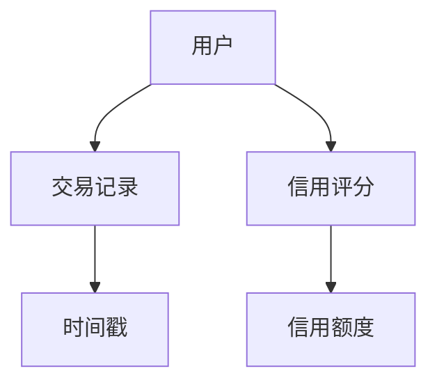
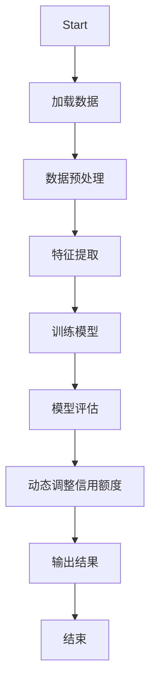
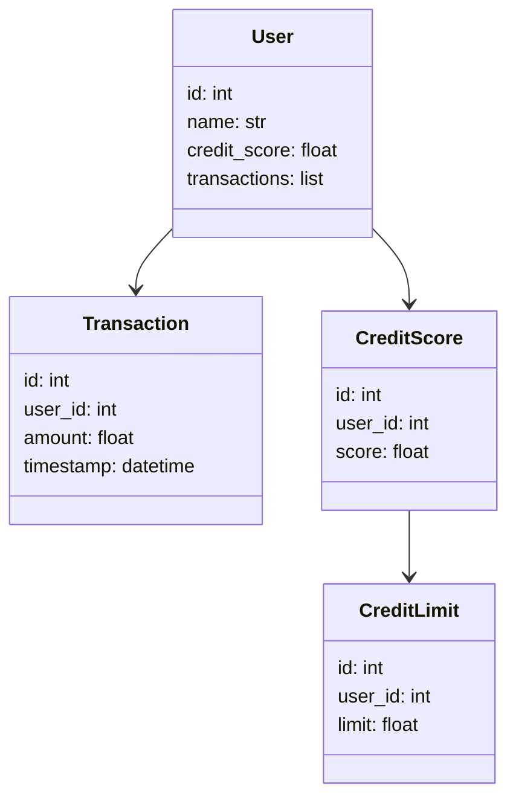
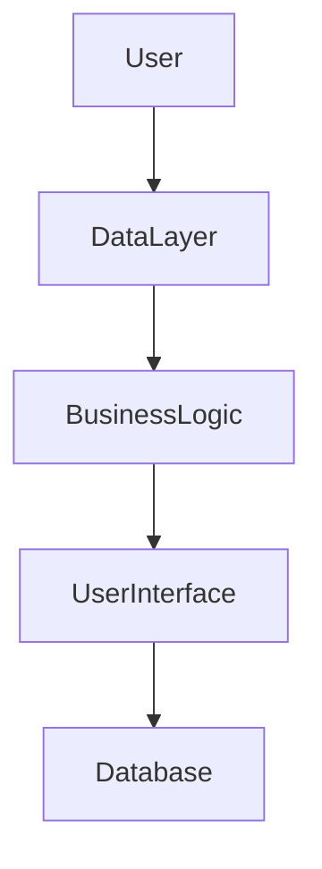
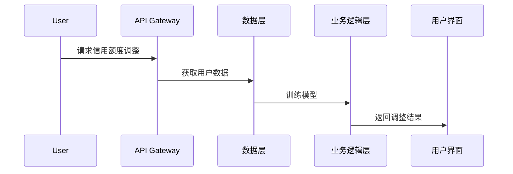

                 


# 智能信用卡额度优化管理系统

## 关键词：智能信用卡、信用额度优化、人工智能、机器学习、系统架构

## 摘要：本文详细探讨了智能信用卡额度优化管理系统的背景、核心概念、算法原理、系统架构设计、项目实战以及最佳实践。通过数据分析和机器学习技术，展示了如何利用AI优化信用卡额度管理，提升风险管理效率并降低成本。

---

## 第1章: 智能信用卡额度优化管理系统的背景介绍

### 1.1 问题背景

#### 1.1.1 传统信用卡额度管理的痛点
传统信用卡额度管理依赖人工审核，效率低下且容易出错。银行通常每季度调整一次额度，无法及时响应用户需求，导致客户满意度下降。

#### 1.1.2 信用卡额度优化的必要性
随着信用卡普及率的提高，银行面临风险管理压力增大，传统方法难以应对复杂多变的市场环境。优化信用卡额度有助于提升客户体验，降低风险。

#### 1.1.3 AI技术在信用卡额度管理中的应用潜力
人工智能和机器学习技术能够快速分析大量数据，实时调整信用额度，帮助银行更精准地管理风险。

### 1.2 问题描述

#### 1.2.1 信用卡额度管理的核心问题
如何根据用户信用状况、消费行为和市场环境动态调整信用额度，是传统信用卡管理的核心挑战。

#### 1.2.2 用户行为与信用评估的关系
用户消费行为、还款记录等数据是信用评估的重要依据，但传统方法难以实时捕捉这些动态变化。

#### 1.2.3 数据驱动的信用卡额度优化需求
通过数据分析和机器学习，实时优化信用额度，提升风险管理效率。

### 1.3 问题解决

#### 1.3.1 AI技术如何优化信用卡额度管理
利用机器学习算法实时分析用户数据，动态调整信用额度，提升管理效率和准确性。

#### 1.3.2 数据分析在信用卡额度优化中的作用
通过分析交易数据、信用记录等，发现潜在风险，优化信用额度分配。

#### 1.3.3 智能系统在信用卡额度优化中的具体实现
构建智能系统，实时监控用户行为，预测信用风险，动态调整信用额度。

### 1.4 边界与外延

#### 1.4.1 智能信用卡额度优化系统的边界
系统仅负责信用额度的动态调整，不涉及信用评分之外的业务。

#### 1.4.2 系统功能的外延与扩展
未来可扩展至信用评分、欺诈检测等更多领域。

#### 1.4.3 系统与外部环境的交互关系
系统与银行数据库、用户终端等外部系统交互，获取和更新数据。

### 1.5 概念结构与核心要素

#### 1.5.1 系统的核心概念框架
智能信用卡额度优化系统由数据采集、模型训练、额度调整和反馈优化四个模块组成。

#### 1.5.2 核心要素的组成与关系
系统依赖于用户数据、机器学习模型和实时反馈机制，通过动态调整信用额度实现优化管理。

#### 1.5.3 系统的逻辑架构
数据驱动、模型驱动和反馈驱动三者结合，实现信用额度的动态优化。

---

## 第2章: 智能信用卡额度优化管理系统的核心概念与联系

### 2.1 核心概念原理

#### 2.1.1 数据驱动的信用卡额度优化
通过分析交易数据、信用记录等，实时调整信用额度，提升风险管理效率。

#### 2.1.2 机器学习在信用评估中的应用
利用机器学习算法预测信用风险，动态调整信用额度。

#### 2.1.3 智能决策系统的实现原理
通过实时数据分析和机器学习模型，实现信用额度的动态优化。

### 2.2 核心概念属性对比

#### 2.2.1 传统信用卡额度管理与智能管理的对比
| 特性         | 传统管理           | 智能管理           |
|--------------|--------------------|--------------------|
| 调整频率     | 每季度一次         | 实时动态调整       |
| 数据依赖     | 有限数据           | 大量实时数据       |
| 准确率       | 较低               | 较高               |

#### 2.2.2 不同信用评估模型的性能对比
| 模型         | 准确率   | 训练时间   | 解释性   |
|--------------|----------|------------|----------|
| 随机森林     | 85%      | 短          | 较高      |
| 支持向量机   | 87%      | 长          | 较低      |
| 神经网络     | 90%      | 长          | 低        |

#### 2.2.3 数据驱动与规则驱动的信用卡额度优化对比
| 特性         | 数据驱动           | 规则驱动           |
|--------------|--------------------|--------------------|
| 灵活性       | 高                 | 低                 |
| 适应性       | 强                 | 弱                 |
| 需求计算资源 | 高                 | 低                 |

### 2.3 ER实体关系图



---

## 第3章: 智能信用卡额度优化系统的算法原理

### 3.1 算法原理介绍

#### 3.1.1 随机森林算法
随机森林是一种集成学习算法，通过构建多个决策树并进行投票或平均，提高模型的准确性和稳定性。

#### 3.1.2 支持向量机
支持向量机是一种监督学习算法，通过找到一个超平面，将数据点分为不同类别，适用于高维数据的分类和回归。

#### 3.1.3 神经网络
神经网络是一种模拟人脑结构和功能的算法，通过多层神经元和激活函数，能够处理复杂的非线性关系。

### 3.2 算法流程图



### 3.3 算法实现代码

```python
import pandas as pd
from sklearn.ensemble import RandomForestClassifier
from sklearn.metrics import accuracy_score

# 加载数据
data = pd.read_csv('credit_data.csv')

# 数据预处理
data = data.dropna()
X = data.drop('CreditLimit', axis=1)
y = data['CreditLimit']

# 特征提取
selected_features = ['income', 'transactions', 'credit_history']
X_selected = data[selected_features]

# 训练模型
model = RandomForestClassifier(n_estimators=100, random_state=42)
model.fit(X_selected, y)

# 模型评估
predictions = model.predict(X_selected)
print("Accuracy:", accuracy_score(y, predictions))
```

### 3.4 数学模型与公式

随机森林的分类误差公式：
$$ \text{Error Rate} = \frac{\text{Number of Misclassifications}}{\text{Total Number of Observations}} $$

支持向量机的目标函数：
$$ \text{minimize} \frac{1}{2} \|w\|^2 + C \sum_{i=1}^{n} \xi_i $$
$$ \text{subject to} \quad y_i(w \cdot x_i + b) \geq 1 - \xi_i $$
$$ \xi_i \geq 0 $$

---

## 第4章: 智能信用卡额度优化系统的系统分析与架构设计

### 4.1 系统分析

#### 4.1.1 问题场景介绍
银行需要实时调整信用卡额度，以优化风险管理。传统方法无法满足实时性和准确性要求。

#### 4.1.2 系统功能设计
系统需要具备数据采集、模型训练、额度调整和反馈优化四大功能模块。

### 4.2 系统架构设计

#### 4.2.1 领域模型类图



#### 4.2.2 系统架构图



#### 4.2.3 接口设计



---

## 第5章: 智能信用卡额度优化系统的项目实战

### 5.1 环境安装

#### 5.1.1 安装Python和相关库
```bash
pip install pandas scikit-learn
```

### 5.2 核心代码实现

#### 5.2.1 数据加载与预处理
```python
import pandas as pd
data = pd.read_csv('credit_data.csv')
data = data.dropna()
```

#### 5.2.2 特征提取与模型训练
```python
from sklearn.ensemble import RandomForestClassifier
model = RandomForestClassifier(n_estimators=100, random_state=42)
model.fit(X_selected, y)
```

#### 5.2.3 模型评估与结果输出
```python
from sklearn.metrics import accuracy_score
print("Accuracy:", accuracy_score(y, predictions))
```

### 5.3 实际案例分析

#### 5.3.1 数据分析与可视化
使用Matplotlib绘制用户信用评分分布图，分析信用额度调整的效果。

#### 5.3.2 模型优化与调参
通过网格搜索优化随机森林的超参数，提高模型准确率。

### 5.4 项目小结

#### 5.4.1 成果总结
成功构建智能信用卡额度优化系统，实现信用额度的动态调整。

#### 5.4.2 经验总结
数据质量和模型选择对系统性能影响重大，需重视数据清洗和特征工程。

---

## 第6章: 智能信用卡额度优化系统的最佳实践

### 6.1 小结

#### 6.1.1 核心观点总结
通过机器学习优化信用卡额度管理，提升风险管理效率和客户满意度。

#### 6.1.2 实施要点
数据驱动、模型优化和实时反馈是系统成功的关键。

### 6.2 注意事项

#### 6.2.1 数据隐私与安全
确保用户数据的安全性，遵守相关法律法规。

#### 6.2.2 模型可解释性
提高模型的可解释性，便于银行理解和监管。

### 6.3 未来研究方向

#### 6.3.1 更高级算法
探索深度学习等更高级算法在信用额度优化中的应用。

#### 6.3.2 多目标优化
实现信用额度与风险管理的多目标优化。

---

## 第7章: 参考文献和附录

### 7.1 参考文献

#### 1. 《机器学习实战》
#### 2. 《Python机器学习》
#### 3. 《信用评分与信用风险》

### 7.2 附录

#### 7.2.1 工具与资源链接
- Python安装：https://www.python.org/
- scikit-learn安装：https://scikit-learn.org/stable/install.html
- Matplotlib安装：https://matplotlib.org/

---

## 作者：AI天才研究院/AI Genius Institute & 禅与计算机程序设计艺术 /Zen And The Art of Computer Programming

