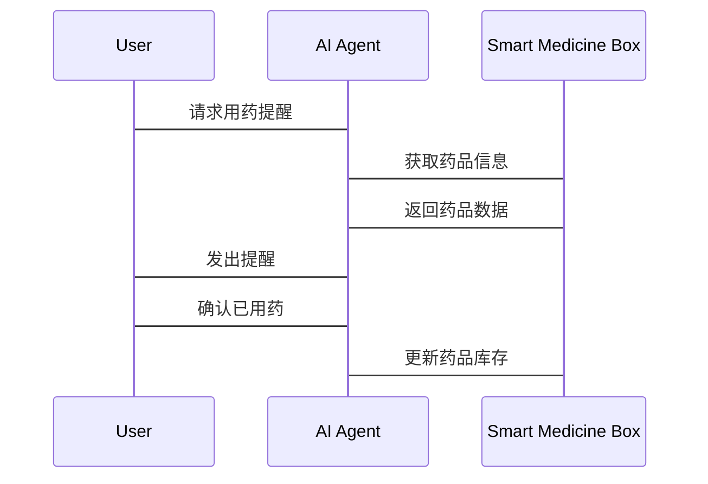
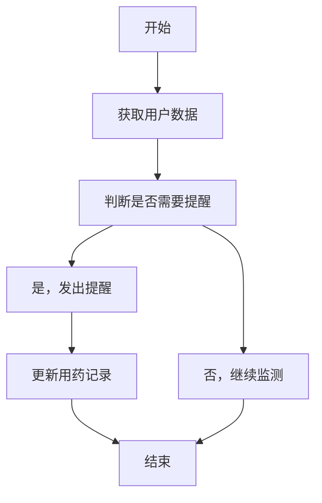
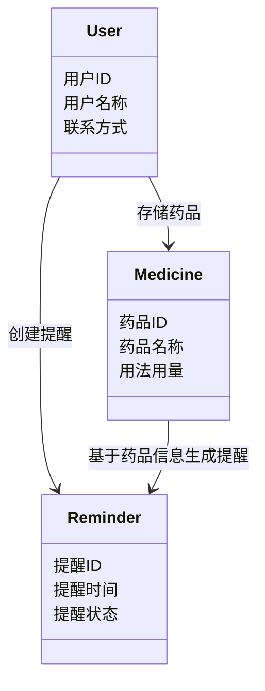
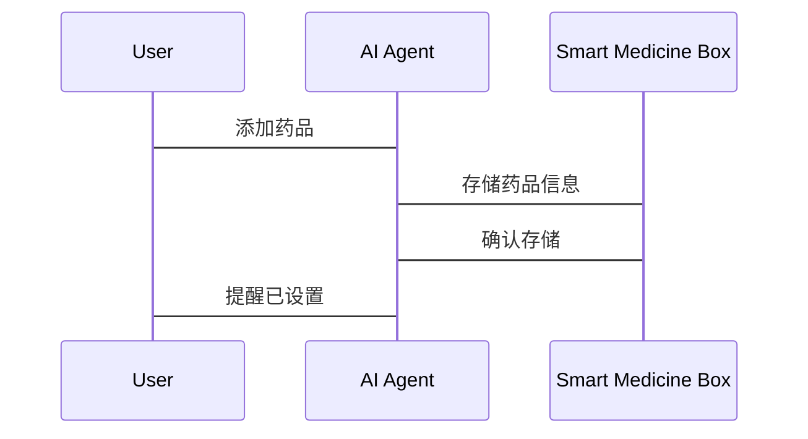

                 


# 智能药箱：AI Agent的用药管理与提醒系统

> 关键词：智能药箱, AI Agent, 用药管理, 提醒系统, 人工智能, 健康管理

> 摘要：本文探讨了智能药箱结合AI Agent的用药管理与提醒系统的设计与实现。通过分析传统药箱的不足，提出基于AI Agent的智能药箱解决方案，详细介绍其核心概念、算法原理、系统架构、项目实战及最佳实践。

---

## 第一部分: 智能药箱与AI Agent的背景介绍

### 第1章: 智能药箱的背景与意义

#### 1.1 传统药箱的不足与痛点

##### 1.1.1 传统药箱的功能局限性
传统药箱主要依赖手动管理，用户需要自行记录和提醒用药时间，容易遗忘或漏服。此外，传统药箱不具备数据分析能力，无法根据用户的健康状况提供个性化建议。

##### 1.1.2 用户用药管理的常见问题
- 用药提醒不及时，导致用户遗忘。
- 多种药品混存，易混淆药品名称和用法。
- 缺乏数据分析，无法提供用药建议。

##### 1.1.3 市场需求与痛点分析
随着慢性病患者增多，用药管理需求日益增长。市场亟需一种智能化、个性化的药箱解决方案。

#### 1.2 AI Agent的基本概念

##### 1.2.1 什么是AI Agent
AI Agent（人工智能代理）是指能够感知环境、自主决策并执行任务的智能体。它通过传感器获取信息，利用算法进行分析，并通过执行器完成目标。

##### 1.2.2 AI Agent的核心特征
- **自主性**：无需外部干预，自主完成任务。
- **反应性**：能够实时感知环境变化并做出反应。
- **目标导向**：基于目标进行决策和行动。

##### 1.2.3 AI Agent的应用场景
AI Agent广泛应用于医疗、金融、交通等领域。在医疗领域，AI Agent可以用于病情监测、用药提醒等场景。

#### 1.3 智能药箱与AI Agent的结合

##### 1.3.1 智能药箱的定义与目标
智能药箱是一种结合AI技术的智能设备，旨在通过AI Agent实现用药提醒、数据分析和个性化管理。

##### 1.3.2 AI Agent在智能药箱中的角色
AI Agent负责感知用户的用药需求，分析数据，并通过执行器（如智能药盒）完成任务。

##### 1.3.3 智能药箱的优势与价值
- 提高用药依从性，减少漏服和误服。
- 提供个性化用药建议，优化用户健康状况。
- 支持远程监控，便于医护人员管理患者。

### 第2章: 问题背景与解决方案

#### 2.1 用药管理中的问题分析

##### 2.1.1 用户端的问题
- **忘记用药**：用户常因忙碌或其他原因忘记按时用药。
- **用药混乱**：多种药品混存易导致误服。
- **缺乏指导**：用户无法获得专业的用药建议。

##### 2.1.2 医护人员的问题
- **难以监控**：无法实时了解患者的用药情况。
- **工作量大**：需要手动记录和提醒，效率低下。

##### 2.1.3 医疗机构的问题
- **数据分散**：患者的用药数据分散，难以整合分析。
- **资源浪费**：传统管理方式效率低下，浪费资源。

#### 2.2 AI Agent如何解决用药管理问题

##### 2.2.1 提醒机制的设计
AI Agent通过智能药箱内的传感器和定时提醒功能，确保用户按时用药。

##### 2.2.2 数据分析与个性化建议
AI Agent可以分析用户的用药数据，结合健康状况，提供个性化的用药建议。

##### 2.2.3 远程监控与反馈
AI Agent支持远程监控，医护人员可以通过系统查看患者的用药情况，及时调整治疗方案。

#### 2.3 智能药箱的边界与外延

##### 2.3.1 功能边界
智能药箱的核心功能包括药品存储、用药提醒和数据分析。不涉及药品配送和医疗诊断。

##### 2.3.2 与外部系统的接口
智能药箱需要与用户的日历、健康数据（如心率、血压）以及其他医疗系统进行数据交互。

##### 2.3.3 系统的可扩展性
智能药箱的设计应具备扩展性，未来可以集成更多功能，如与智能家居联动、接入更多的医疗数据源。

---

## 第二部分: 核心概念与联系

### 第3章: 核心概念与联系

#### 3.1 AI Agent的核心原理

##### 3.1.1 感知层
AI Agent通过传感器、摄像头等设备感知环境信息。

##### 3.1.2 决策层
基于感知的信息，AI Agent利用算法进行分析和决策。

##### 3.1.3 执行层
AI Agent通过执行器（如智能药盒）完成决策后的任务。

#### 3.2 智能药箱的实体关系图

```mermaid
er
    class User {
        用户ID
        用户名称
        联系方式
        身份验证信息
    }
    class Medicine {
        药品ID
        药品名称
        用法用量
        处方信息
    }
    class Reminder {
        提醒ID
        提醒时间
        提醒状态
        提醒内容
    }
    User --> Reminder: 创建提醒
    User --> Medicine: 存储药品
    Medicine --> Reminder: 基于药品信息生成提醒
```

#### 3.3 AI Agent与智能药箱的交互流程



---

## 第三部分: 算法原理讲解

### 第4章: 算法原理与实现

#### 4.1 基于规则的AI Agent算法

##### 4.1.1 算法流程图



##### 4.1.2 算法实现代码

```python
def medication_reminder(user_data):
    # 获取用户数据
    for user in user_data:
        # 判断是否需要提醒
        if is_due(user['reminder_time']):
            send_notification(user['id'])
            update_record(user['id'])
    return

def is_due(last_time):
    # 判断是否需要提醒
    current_time = datetime.now()
    return (current_time - last_time).hours >= 24

def send_notification(user_id):
    # 发送提醒
    print(f"提醒用户{user_id}服药")

def update_record(user_id):
    # 更新用药记录
    pass
```

##### 4.1.3 算法的数学模型

$$ 状态 = \text{用药提醒时间} \mod 24 $$

$$ 提醒条件 = \text{当前时间} \geq \text{用药提醒时间} $$

---

## 第四部分: 系统分析与架构设计方案

### 第5章: 系统分析与架构设计

#### 5.1 问题场景介绍

##### 5.1.1 用户场景
用户需要智能药箱帮助管理多种药品，设置提醒，并获取用药建议。

##### 5.1.2 医护人员场景
医护人员需要通过系统查看患者的用药记录，评估治疗效果。

#### 5.2 系统功能设计

##### 5.2.1 领域模型



#### 5.3 系统架构设计

##### 5.3.1 分层架构


#### 5.4 系统接口设计

##### 5.4.1 RESTful API

```http
POST /api/users
{
    "name": "张三",
    "contact": "13812345678"
}
```

##### 5.4.2 序列图



---

## 第五部分: 项目实战

### 第6章: 项目实战与代码实现

#### 6.1 环境搭建

##### 6.1.1 安装Python和依赖库
```bash
pip install Flask
pip install SQLAlchemy
```

#### 6.2 核心代码实现

##### 6.2.1 数据库连接

```python
from sqlalchemy import create_engine
from sqlalchemy.ext.declarative import declarative_base
from sqlalchemy import Column, Integer, String

engine = create_engine('sqlite:///medication.db')
Base = declarative_base()
```

##### 6.2.2 添加药品功能

```python
from sqlalchemy.orm import sessionmaker

Session = sessionmaker(bind=engine)
session = Session()

class Medicine(Base):
    __tablename__ = 'medicines'
    id = Column(Integer, primary_key=True)
    name = Column(String)
    dosage = Column(String)

# 创建药品记录
new_medicine = Medicine(name='降压药', dosage='每天两次，每次1片')
session.add(new_medicine)
session.commit()
```

##### 6.2.3 提醒逻辑实现

```python
import datetime

def send_reminder(user_id):
    # 查询药品信息
    medicines = session.query(Medicine).filter(Medicine.user_id == user_id).all()
    # 发送提醒
    print(f"用户{user_id}需要服用{medicines[0].name}")

# 定时任务
schedule.every(24).hours.do(send_reminder, user_id)
```

#### 6.3 代码解读与分析

##### 6.3.1 数据库设计
- 使用SQLAlchemy进行数据库设计，定义了用户、药品、提醒记录等实体。

##### 6.3.2 业务逻辑实现
- 通过Flask框架实现API接口，AI Agent负责处理请求和响应。

##### 6.3.3 定时任务
- 使用apscheduler库实现定时提醒功能，确保用户按时用药。

#### 6.4 实际案例分析

##### 6.4.1 用户案例
用户张三使用智能药箱管理高血压药物，系统每天自动提醒用药，记录用药情况，并根据血压数据调整提醒时间。

##### 6.4.2 医护人员案例
医生李四通过系统查看患者的用药记录，评估治疗效果，并与患者沟通用药方案。

#### 6.5 项目小结

##### 6.5.1 项目总结
通过本项目，我们实现了智能药箱的核心功能，包括药品存储、用药提醒和数据分析。

##### 6.5.2 实践中的注意事项
- 确保数据安全性，保护用户隐私。
- 定期维护系统，更新药品信息和提醒规则。
- 提供良好的用户界面，提升用户体验。

---

## 第六部分: 总结与展望

### 第7章: 总结与展望

#### 7.1 项目总结

##### 7.1.1 核心成果
成功开发了基于AI Agent的智能药箱系统，实现了用药提醒、数据分析和个性化管理。

##### 7.1.2 技术总结
通过本项目，我们掌握了AI Agent的设计与实现、系统架构设计以及项目管理的经验。

#### 7.2 未来展望

##### 7.2.1 技术发展
AI Agent在医疗领域的应用将更加广泛，智能药箱将集成更多功能，如远程诊断、健康监测等。

##### 7.2.2 市场应用
随着人们对健康管理需求的增加，智能药箱市场潜力巨大，未来将成为家庭医疗的重要组成部分。

---

## 作者

作者：AI天才研究院/AI Genius Institute & 禅与计算机程序设计艺术/Zen And The Art of Computer Programming

