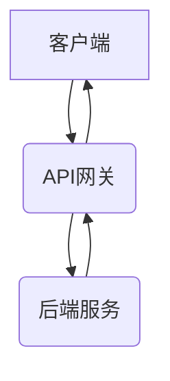
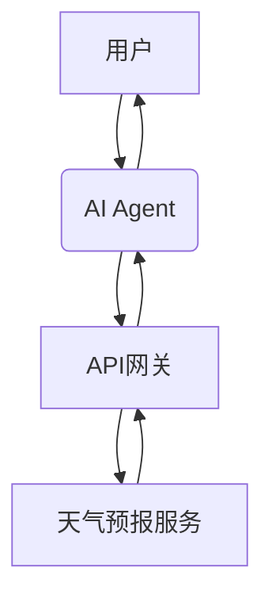
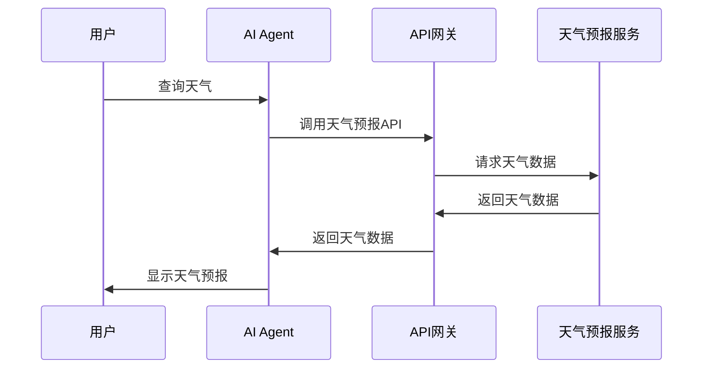

                 


# 构建AI Agent的API集成能力：连接外部服务

## 关键词：AI Agent, API集成, 外部服务, RESTful API, GraphQL, WebSocket, API网关

## 摘要：  
AI Agent是一种能够感知环境、执行任务并与其他系统交互的智能实体。在实际应用中，AI Agent需要通过API集成外部服务，以获取数据、触发操作或与第三方系统进行通信。本文将详细探讨AI Agent的API集成能力，从基本概念到高级实现，涵盖API集成的核心原理、系统架构设计、项目实战和最佳实践。通过本文，读者将能够全面理解AI Agent如何通过API连接外部服务，并掌握实现这一能力的关键技术与方法。

---

# 第1章: AI Agent与API集成概述

## 1.1 AI Agent的基本概念

### 1.1.1 什么是AI Agent
AI Agent（人工智能代理）是一种能够感知环境、自主决策并执行任务的智能实体。它可以是一个软件程序，也可以是一个物理设备，通过传感器和执行器与外部世界交互。AI Agent的核心目标是通过自动化的方式完成特定任务，例如数据处理、信息检索、设备控制等。

### 1.1.2 AI Agent的核心特点
- **自主性**：AI Agent能够在没有外部干预的情况下自主决策和行动。
- **反应性**：AI Agent能够实时感知环境变化并做出反应。
- **目标导向**：AI Agent的行为以完成特定目标为导向。
- **学习能力**：许多AI Agent具备学习能力，能够通过数据优化自身的决策过程。

### 1.1.3 AI Agent的分类与应用场景
AI Agent可以根据功能、智能水平和应用场景进行分类：
- **根据功能**：分为数据处理型、任务执行型、监控型等。
- **根据智能水平**：分为基于规则的Agent、基于模型的Agent、学习型Agent等。
- **根据应用场景**：例如智能家居、自动驾驶、智能助手（如Siri、Alexa）等。

---

## 1.2 API集成的重要性

### 1.2.1 API的定义与作用
API（应用程序编程接口）是软件系统之间的接口，允许不同的系统通过定义好的接口进行通信。API的作用在于提供一个标准化的交互方式，使得不同系统之间能够高效协作。

### 1.2.2 AI Agent中API集成的价值
AI Agent需要与外部系统交互，API集成是其实现这一能力的核心技术。通过API，AI Agent可以：
- 获取外部数据（如天气数据、用户信息等）。
- 调用外部服务（如支付网关、文件存储等）。
- 与其他系统协同工作，完成复杂的任务。

### 1.2.3 API集成的挑战与解决方案
- **挑战**：
  - API的兼容性问题。
  - API的安全性问题。
  - 多个API的集成与协调。
- **解决方案**：
  - 使用API网关统一管理API。
  - 采用标准协议（如REST、GraphQL）。
  - 使用中间件处理复杂逻辑。

---

## 1.3 本章小结

### 1.3.1 AI Agent与API集成的关系
AI Agent通过API集成外部服务，实现与外部系统的交互。API是AI Agent连接外部世界的桥梁。

### 1.3.2 本章重点回顾
- AI Agent的基本概念。
- API在AI Agent中的作用与价值。
- API集成的挑战与解决方案。

---

# 第2章: API集成的核心概念与原理

## 2.1 API的结构与分类

### 2.1.1 API的基本结构
API通常由以下几个部分组成：
- **资源**：API操作的对象，例如用户、订单、产品等。
- **动词**：表示操作类型，例如GET、POST、PUT等。
- **路径**：表示资源的访问路径，例如`/api/users`。
- **参数**：附加的查询条件或请求数据。

### 2.1.2 API的分类与特点对比
API可以根据协议、传输方式和功能进行分类：

| 分类标准 | 类型               | 特点                                                                 |
|----------|--------------------|----------------------------------------------------------------------|
| 协议     | RESTful API         | 基于HTTP协议，使用标准方法（GET、POST等）和资源路径。                             |
|          | GraphQL            | 基于查询语言，允许客户端发送自定义查询。                                         |
| 传输方式  | REST               | 使用HTTP协议进行请求和响应。                                                   |
|          | WebSocket           | 实时双向通信协议，适合需要实时反馈的场景。                                       |
| 功能     | 数据API            | 提供数据查询和操作功能。                                                         |
|          | 服务API            | 提供特定服务的调用功能，例如支付网关、天气查询等。                                   |

### 2.1.3 API的生命周期
API的生命周期包括设计、开发、测试、部署和维护五个阶段。

---

## 2.2 API集成的关键技术

### 2.2.1 API网关的作用与原理
API网关是位于客户端和后端服务之间的服务器，用于统一管理API的访问。其主要作用包括：
- **路由与转发**：将客户端请求转发到相应的后端服务。
- **鉴权与授权**：验证客户端的身份和权限。
- **速率限制**：控制API的调用频率，防止滥用。
- **监控与日志**：记录API的调用情况，便于后续分析。

### 2.2.2 API调用协议
- **REST（Representational State Transfer）**：基于HTTP协议，使用标准方法和资源路径。
- **GraphQL**：允许客户端自定义查询字段，减少请求次数。

### 2.2.3 API鉴权机制
常用的鉴权方式包括：
- **JWT（JSON Web Token）**：通过令牌验证用户身份。
- **OAuth**：授权框架，允许第三方应用获取受限访问权限。

---

## 2.3 API集成的核心原理

### 2.3.1 API请求的流程
API请求的典型流程如下：



### 2.3.2 API响应的处理
API的响应通常包含状态码、响应头和响应体。客户端根据状态码判断请求是否成功。

### 2.3.3 API错误处理与重试机制
API集成中常见的错误处理策略包括：
- **错误码**：根据状态码判断错误类型。
- **重试机制**：对于暂时性错误（如网络波动），可以设置重试次数和间隔。
- **日志记录**：记录错误信息，便于排查问题。

---

## 2.4 本章小结

### 2.4.1 API集成的核心概念总结
API集成是AI Agent连接外部服务的关键技术。通过API网关、协议选择和鉴权机制，可以实现高效、安全的API调用。

### 2.4.2 本章重点回顾
- API的结构与分类。
- API集成的关键技术。
- API集成的核心原理。

---

# 第3章: API集成的算法原理与实现

## 3.1 API调用的算法流程

### 3.1.1 API请求的发起与响应处理
API请求的典型流程如下：


### 3.1.2 API调用的同步与异步处理
- **同步调用**：客户端等待API响应后再继续执行。
- **异步调用**：客户端发起请求后继续执行，通过回调处理响应。

### 3.1.3 API调用的超时与重试机制
- **超时设置**：设置请求超时时间，避免长时间等待。
- **重试机制**：对于失败请求，设置重试次数和间隔。

---

## 3.2 API集成的协议实现

### 3.2.1 RESTful API的实现原理
RESTful API基于HTTP协议，通过资源路径和动词（如GET、POST）进行操作。

### 3.2.2 GraphQL的请求与响应流程
GraphQL允许客户端发送自定义查询，减少多次请求的开销。

### 3.2.3 WebSocket的实时通信原理
WebSocket是一种双向通信协议，适用于需要实时反馈的场景。

---

## 3.3 API集成的错误处理算法

### 3.3.1 错误处理算法
错误处理算法通常包括以下步骤：

1. **捕获错误**：监控API调用过程中的异常。
2. **记录日志**：记录错误信息，便于后续分析。
3. **重试机制**：对于暂时性错误，设置重试次数和间隔。
4. **错误反馈**：将错误信息反馈给客户端或日志系统。

---

## 3.4 本章小结

### 3.4.1 API集成的算法原理总结
API集成的算法流程包括请求发起、响应处理、错误处理等步骤。

### 3.4.2 本章重点回顾
- API调用的算法流程。
- RESTful API、GraphQL和WebSocket的实现原理。
- 错误处理算法的设计与实现。

---

# 第4章: 系统分析与架构设计方案

## 4.1 项目介绍

### 4.1.1 项目背景
假设我们正在开发一个智能助手AI Agent，需要集成外部天气预报服务。

### 4.1.2 系统功能设计
- **用户查询**：用户输入查询指令。
- **API调用**：AI Agent调用天气预报API获取数据。
- **结果展示**：AI Agent将结果反馈给用户。

### 4.1.3 系统架构设计



### 4.1.4 系统接口设计
- **输入接口**：用户指令。
- **输出接口**：天气预报结果。

### 4.1.5 系统交互设计



---

## 4.2 本章小结

### 4.2.1 系统分析与架构设计总结
通过系统分析和架构设计，我们可以清晰地了解AI Agent与外部服务的交互流程。

### 4.2.2 本章重点回顾
- 项目背景与功能设计。
- 系统架构设计与接口设计。
- 系统交互流程。

---

# 第5章: 项目实战

## 5.1 环境安装与配置

### 5.1.1 安装Python
```bash
python --version
pip install requests
```

### 5.1.2 安装API测试工具
```bash
pip install pytest
```

## 5.2 系统核心实现

### 5.2.1 API网关实现
```python
import requests

def call_weather_api(city):
    url = f"http://api.weather.com/weather?city={city}"
    response = requests.get(url)
    return response.json()
```

### 5.2.2 AI Agent实现
```python
class AI_Agent:
    def __init__(self):
        self.api_gateway = "http://localhost:8000"

    def get_weather(self, city):
        response = requests.get(f"{self.api_gateway}/weather/{city}")
        return response.json()
```

## 5.3 代码应用解读与分析

### 5.3.1 API网关实现解读
- **功能**：接收API请求并转发到后端服务。
- **实现细节**：使用`requests`库处理HTTP请求。

### 5.3.2 AI Agent实现解读
- **功能**：通过API网关调用天气预报服务。
- **实现细节**：通过`requests`库发起HTTP请求，解析返回的JSON数据。

## 5.4 实际案例分析与详细讲解

### 5.4.1 案例分析
用户输入“查询北京天气”，AI Agent调用天气预报API，返回天气数据。

### 5.4.2 详细讲解
1. **用户输入**：用户输入“查询北京天气”。
2. **API调用**：AI Agent调用API网关。
3. **网关转发**：API网关转发请求到天气预报服务。
4. **返回结果**：天气预报服务返回数据，网关返回给AI Agent。
5. **结果展示**：AI Agent将结果反馈给用户。

## 5.5 本章小结

### 5.5.1 项目实战总结
通过项目实战，我们可以清晰地了解API集成的具体实现过程。

### 5.5.2 本章重点回顾
- 环境安装与配置。
- 系统核心实现。
- 代码应用解读与分析。
- 实际案例分析与详细讲解。

---

# 第6章: 最佳实践与注意事项

## 6.1 API集成的最佳实践

### 6.1.1 使用标准协议
选择RESTful API或GraphQL等标准协议，确保兼容性。

### 6.1.2 采用API网关
通过API网关统一管理API，简化集成过程。

### 6.1.3 注意API安全
使用JWT或OAuth等鉴权机制，确保API的安全性。

### 6.1.4 优化API性能
通过缓存、分片等技术优化API的性能。

## 6.2 注意事项

### 6.2.1 API兼容性
确保API的版本和接口兼容。

### 6.2.2 API安全
防止API被滥用或攻击。

### 6.2.3 性能优化
优化API的响应速度和处理能力。

## 6.3 未来趋势

### 6.3.1 API自动化
通过自动化工具减少手动操作。

### 6.3.2 API智能化
结合AI技术实现智能API调用。

### 6.3.3 API无处不在
API将成为连接所有系统的核心。

---

# 第7章: 总结与展望

## 7.1 本章总结

### 7.1.1 核心知识点回顾
- AI Agent的基本概念。
- API集成的核心技术。
- API集成的实现流程。

### 7.1.2 本章重点回顾
- API集成的重要性。
- API集成的关键技术。
- API集成的算法原理。

## 7.2 未来展望

### 7.2.1 API集成的智能化
通过AI技术实现智能API调用。

### 7.2.2 API集成的自动化
通过自动化工具简化API集成过程。

### 7.2.3 API集成的未来发展
API将成为连接所有系统的核心，推动整个生态的发展。

---

# 作者

作者：AI天才研究院/AI Genius Institute & 禅与计算机程序设计艺术 /Zen And The Art of Computer Programming

