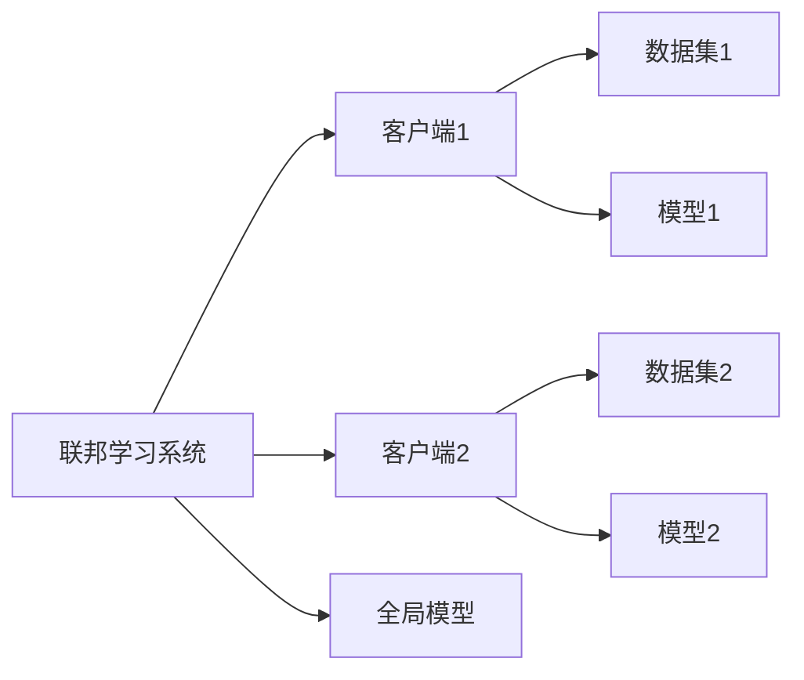
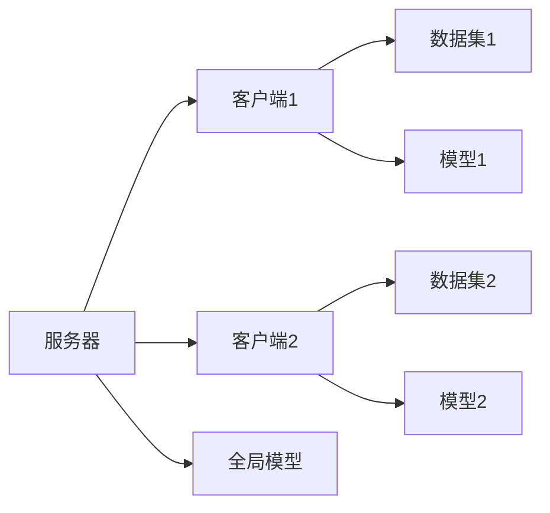
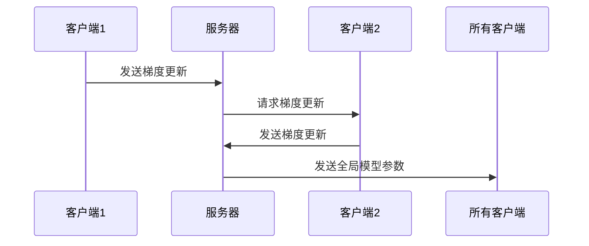

                 


# 联邦学习：在保护隐私的前提下训练AI Agent

> 关键词：联邦学习, 数据隐私, AI训练, 联邦算法, 联合学习, 联邦网络

> 摘要：  
联邦学习是一种在保护数据隐私的前提下，通过分布式协作训练模型的技术。本文从联邦学习的背景出发，详细探讨其核心概念、算法原理、系统架构以及实际应用场景。通过理论与实践结合的方式，帮助读者全面理解联邦学习的技术细节和应用价值。

---

## 目录

1. [背景介绍](#背景介绍)
   1.1 联邦学习的背景与动机
   1.2 数据隐私保护的重要性
   1.3 联邦学习的核心概念与目标

2. [核心概念与原理](#核心概念与原理)
   2.1 联邦学习的核心机制
   2.2 联邦学习与其他隐私保护技术的对比
   2.3 联邦学习的实体关系图

3. [算法原理](#算法原理)
   3.1 联邦学习的基本流程
   3.2 联邦学习的数学模型
   3.3 联邦学习的算法实现

4. [系统架构与设计](#系统架构与设计)
   4.1 联邦学习的系统架构
   4.2 系统功能模块的设计
   4.3 系统接口与交互流程

5. [项目实战](#项目实战)
   5.1 项目背景与目标
   5.2 项目环境搭建
   5.3 项目实现与代码解析
   5.4 项目测试与效果分析

6. [最佳实践与总结](#最佳实践与总结)
   6.1 联邦学习的实际应用案例
   6.2 联邦学习的注意事项与优化建议
   6.3 未来发展方向与挑战

---

## 背景介绍

### 1.1 联邦学习的背景与动机

随着人工智能技术的快速发展，数据成为了训练AI模型的核心资源。然而，数据的集中存储和使用往往面临隐私泄露的风险，尤其是在医疗、金融等敏感领域。联邦学习（Federated Learning）作为一种新兴的分布式机器学习技术，旨在在不共享原始数据的前提下，通过协作训练模型来解决这一问题。

#### 1.1.1 数据孤岛问题的提出
在现实场景中，数据通常分散在不同的机构或设备中，形成了“数据孤岛”。这些数据孤岛由于无法有效整合，导致模型训练效率低下，且数据利用率不足。

#### 1.1.2 隐私保护的重要性
数据隐私保护已成为全球关注的焦点。联邦学习通过局部建模和模型聚合的方式，避免了原始数据的传输，从而有效保护了数据隐私。

#### 1.1.3 联邦学习的定义与目标
联邦学习是指在多个参与方之间协作训练模型，同时保护各方数据隐私的一种技术。其目标是在不共享原始数据的前提下，实现模型的联合优化。

### 1.2 联邦学习的核心问题
联邦学习的核心问题是如何在分布式环境下，高效、安全地进行模型训练，同时确保数据隐私不被泄露。

#### 1.2.1 数据隐私保护的挑战
数据隐私保护的挑战主要体现在如何防止数据在传输和计算过程中被恶意攻击者窃取或篡改。

#### 1.2.2 联邦学习与数据共享的关系
联邦学习通过模型更新而非数据共享的方式，实现了模型的联合训练。这种机制既保护了数据隐私，又充分利用了各方数据资源。

#### 1.2.3 联邦学习的边界与外延
联邦学习的边界在于其仅涉及模型参数的更新，而不涉及原始数据的传输。其外延则包括多种分布式学习技术，如横向联邦和纵向联邦。

### 1.3 联邦学习的核心要素与概念结构

#### 1.3.1 参与方的定义与角色
在联邦学习中，参与方通常包括联邦服务器（协调各方训练）和多个客户端（负责本地数据建模）。

#### 1.3.2 数据的分布与共享方式
联邦学习中的数据分布可以是横向分布（同一特征空间下的数据）或纵向分布（不同特征空间下的数据）。数据不直接共享，而是通过模型更新进行交流。

#### 1.3.3 模型的训练与更新机制
联邦学习通过迭代的方式，将各客户端的模型更新上传至服务器，服务器再将全局模型参数分发给客户端，形成一个闭环。

---

## 核心概念与原理

### 2.1 联邦学习的原理与机制

#### 2.1.1 联邦学习的基本原理
联邦学习的核心原理是通过局部建模和模型聚合的方式，实现全局模型的优化，而不直接共享原始数据。

#### 2.1.2 联邦学习的核心机制
- **局部训练**：每个客户端基于本地数据训练模型。
- **模型聚合**：服务器将各客户端的模型参数进行聚合，生成全局模型。
- **模型分发**：服务器将全局模型分发给客户端，进行下一轮训练。

#### 2.1.3 联邦学习的数学模型
在横向联邦学习中，假设各客户端的数据集为$\{x_i, y_i\}$，模型参数为$w$。客户端在本地训练模型，更新参数$\Delta w_i$，服务器将所有$\Delta w_i$进行加权平均，更新全局模型。

### 2.2 联邦学习与其他隐私保护技术的对比

#### 2.2.1 数据加密技术
数据加密技术通过加密手段保护数据隐私，但加密后的数据难以直接用于模型训练，需要解密后处理，增加了计算开销。

#### 2.2.2 差分隐私
差分隐私通过对数据添加噪声，确保查询结果的隐私性。但其主要适用于特定查询场景，难以直接应用于模型训练。

#### 2.2.3 联邦学习的独特性与优势
联邦学习的独特性在于其通过模型更新而非数据共享的方式，保护数据隐私。其优势在于能够充分利用分布式数据，同时降低数据传输风险。

#### 2.2.4 联邦学习与数据共享的对比
| 技术 | 数据共享 | 模型更新 | 数据隐私 |
|------|----------|----------|----------|
| 数据加密 | 是       | 否       | 高       |
| 差分隐私 | 是       | 否       | 中       |
| 联邦学习 | 否       | 是       | 高       |

#### 2.2.5 实体关系图


### 2.3 联邦学习的实体关系图


---

## 算法原理

### 3.1 联邦学习的算法流程

#### 3.1.1 横向联邦学习
横向联邦学习适用于数据分布在同一特征空间下的场景。各客户端在本地训练模型，将梯度更新上传至服务器，服务器进行模型聚合。

#### 3.1.2 纵向联邦学习
纵向联邦学习适用于数据分布在不同特征空间下的场景。客户端在本地进行特征提取，服务器进行联合建模。

#### 3.1.3 联邦学习的通用流程
1. **初始化**：服务器初始化全局模型参数。
2. **本地训练**：各客户端基于本地数据训练模型，计算梯度更新。
3. **模型聚合**：服务器将所有客户端的梯度更新进行加权平均，更新全局模型。
4. **模型分发**：服务器将更新后的全局模型分发给客户端，进行下一轮训练。

### 3.2 联邦学习的数学模型

#### 3.2.1 模型更新公式
假设服务器从$n$个客户端收集梯度更新$\Delta w_i$，全局模型更新公式为：
$$
w_{\text{new}} = w_{\text{old}} + \eta \sum_{i=1}^n \frac{\Delta w_i}{n}
$$
其中，$\eta$为学习率，$n$为客户端数量。

#### 3.2.2 梯度聚合过程
客户端将梯度更新上传至服务器，服务器进行加权平均：
$$
\Delta w_{\text{agg}} = \sum_{i=1}^n \alpha_i \Delta w_i
$$
其中，$\alpha_i$为客户端$i$的权重。

---

## 系统架构与设计

### 4.1 联邦学习的系统架构

#### 4.1.1 系统架构图


#### 4.1.2 功能模块设计
- **联邦服务器**：负责协调客户端训练，聚合模型参数。
- **客户端**：负责本地数据建模，上传梯度更新。
- **数据管理模块**：负责数据的存储与管理。
- **模型管理模块**：负责模型的训练与更新。

#### 4.1.3 系统接口设计
- **客户端接口**：接收服务器分发的模型参数，上传本地模型更新。
- **服务器接口**：接收客户端上传的梯度更新，分发全局模型参数。

#### 4.1.4 系统交互流程


---

## 项目实战

### 5.1 项目背景与目标

#### 5.1.1 项目背景
本项目旨在通过联邦学习技术，在保护隐私的前提下，训练一个跨机构的客户 churn 预测模型。

#### 5.1.2 项目目标
- 实现一个简单的联邦学习系统。
- 验证联邦学习在实际场景中的可行性。
- 分析模型性能与数据隐私保护之间的平衡。

### 5.2 项目环境搭建

#### 5.2.1 环境配置
- 安装必要的依赖库，如TensorFlow、Flask等。
- 配置客户端和服务端的网络通信。

#### 5.2.2 数据准备
- 准备两个客户端的数据集，确保数据隐私不被泄露。
- 数据预处理，确保数据格式一致。

### 5.3 项目实现与代码解析

#### 5.3.1 服务器端代码
```python
import socket
import threading

class Server:
    def __init__(self, host, port):
        self.host = host
        self.port = port
        self.server_socket = socket.socket(socket.AF_INET, socket.SOCK_STREAM)
        self.server_socket.bind((host, port))
        self.server_socket.listen(5)
        self.clients = []

    def handle_client(self, conn, addr):
        while True:
            data = conn.recv(1024).decode()
            if not data:
                break
            # 处理客户端上传的梯度更新
            # 聚合模型参数
            # 发送全局模型参数给客户端
        conn.close()

    def run(self):
        while True:
            conn, addr = self.server_socket.accept()
            thread = threading.Thread(target=self.handle_client, args=(conn, addr))
            thread.start()
            self.clients.append(conn)
```

#### 5.3.2 客户端代码
```python
import socket

class Client:
    def __init__(self, host, port, data):
        self.host = host
        self.port = port
        self.data = data
        self.socket = socket.socket(socket.AF_INET, socket.SOCK_STREAM)
        self.socket.connect((host, port))

    def send_gradient(self, gradient):
        self.socket.send(gradient.encode())

    def receive_model(self):
        data = self.socket.recv(1024).decode()
        return data

    def train(self):
        # 基于本地数据训练模型
        # 计算梯度更新
        # 发送给服务器
        pass

    def close(self):
        self.socket.close()
```

### 5.4 项目测试与效果分析

#### 5.4.1 测试环境
- 两个客户端，分别训练本地模型。
- 服务器负责模型聚合与分发。

#### 5.4.2 模型性能分析
- 比较联邦学习模型与集中式模型的性能差异。
- 分析数据隐私保护的效果。

#### 5.4.3 优化建议
- 增加客户端数量，提升模型泛化能力。
- 引入差分隐私技术，进一步保护数据隐私。

---

## 最佳实践与总结

### 6.1 联邦学习的实际应用案例

#### 6.1.1 智能医疗
通过联邦学习技术，多个医院可以协作训练疾病预测模型，同时保护患者隐私。

#### 6.1.2 金融服务
银行等金融机构可以利用联邦学习技术，联合训练风险评估模型，降低数据泄露风险。

### 6.2 联邦学习的注意事项与优化建议

#### 6.2.1 数据质量
确保各客户端数据质量一致，避免因数据偏差影响模型性能。

#### 6.2.2 模型收敛性
通过调整学习率和训练轮数，确保模型能够有效收敛。

#### 6.2.3 网络延迟
优化网络通信机制，降低因网络延迟导致的训练时间增加。

#### 6.2.4 安全性
引入加密和认证机制，防止恶意客户端攻击。

### 6.3 未来发展方向与挑战

#### 6.3.1 跨领域应用
探索联邦学习在更多领域的应用，如图像识别、自然语言处理等。

#### 6.3.2 联邦学习的可扩展性
研究如何在大规模分布式环境中高效训练模型。

#### 6.3.3 数据多样性
如何处理数据分布不均衡的问题，提升模型的鲁棒性。

#### 6.3.4 与其他技术的结合
将联邦学习与其他隐私保护技术（如差分隐私、同态加密）结合，进一步提升数据安全性。

---

## 作者

作者：AI天才研究院/AI Genius Institute & 禅与计算机程序设计艺术 /Zen And The Art of Computer Programming

---

通过以上内容，我们系统地介绍了联邦学习的基本概念、算法原理、系统架构以及实际应用案例。希望读者能够通过本文，全面理解联邦学习的技术细节，并能够在实际场景中灵活应用这一技术，为保护数据隐私和提升模型性能做出贡献。

