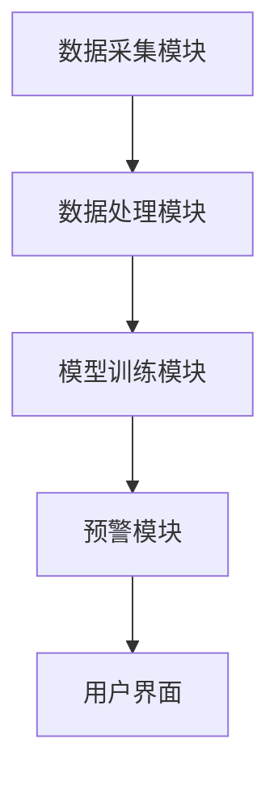

                 


# AI辅助企业财务异常检测：实时监控与智能预警系统

> 关键词：AI技术、财务异常检测、实时监控、智能预警系统、企业风险管理、数据挖掘、机器学习

> 摘要：本文深入探讨了AI技术在企业财务异常检测中的应用，重点介绍了实时监控与智能预警系统的构建与实现。通过分析财务数据的特征、选择合适的AI算法、设计系统的架构，结合实际案例，展示了如何利用AI技术提升企业财务风险管理的效率与准确性。文章内容涵盖从理论到实践的各个方面，为读者提供了一套完整的解决方案。

---

# 第一部分: 背景介绍与核心概念

---

## 第1章: 企业财务异常检测的背景与问题

### 1.1 问题背景

#### 1.1.1 企业财务异常检测的重要性
企业财务健康状况是衡量企业经营状况的重要指标。通过及时发现财务异常，企业可以采取措施避免更大的损失，例如防止欺诈、优化资金流动性和规避法律风险。传统的财务分析方法依赖人工审查，效率低且容易出错，而AI技术的引入可以显著提升检测的效率和准确性。

#### 1.1.2 传统财务异常检测的局限性
传统财务异常检测方法主要依赖财务报表分析和人工审查，存在以下问题：
- 数据量大、维度多，人工分析效率低；
- 易受主观因素影响，结果可能存在偏差；
- 无法实现实时监控，难以及时发现和处理异常。

#### 1.1.3 AI技术在财务异常检测中的优势
AI技术通过机器学习、深度学习等方法，能够从海量数据中提取特征，发现隐藏的模式和异常。其优势包括：
- 高效性：AI可以在短时间内处理大量数据；
- 准确性：通过训练模型，AI能够识别复杂的异常模式；
- 实时性：AI系统可以实时监控财务数据，及时发出预警。

---

### 1.2 问题描述

#### 1.2.1 财务异常的定义与分类
财务异常通常指财务数据中的异常波动，可能由欺诈、错误操作或市场波动引起。常见的财务异常包括：
- 财务数据的突变（如收入突然下降）；
- 账户余额异常（如应收账款大幅增加）；
- 财务报表数据不一致等。

#### 1.2.2 财务数据的特征与挑战
财务数据具有以下特征：
- 高维度：包括收入、支出、利润、资产负债表等多方面数据；
- 时间序列性：财务数据通常具有时间依赖性；
- 数据量大：企业每天会产生大量财务交易数据；
- 数据异质性：数据可能来自不同的系统，格式和结构不统一。

#### 1.2.3 实时监控与智能预警的需求
企业需要实时监控财务数据，及时发现潜在的异常情况，并根据异常的严重程度发出预警。这有助于企业快速响应，避免损失。

---

### 1.3 问题解决与边界

#### 1.3.1 AI辅助财务异常检测的核心目标
AI辅助财务异常检测的目标包括：
- 实时监控财务数据，发现异常；
- 提供智能预警，帮助决策者采取措施；
- 提高财务数据分析的效率和准确性。

#### 1.3.2 系统边界与功能范围
系统的边界包括：
- 数据输入：企业财务数据（如收入、支出、账户余额等）；
- 数据处理：数据清洗、特征提取；
- 异常检测：模型训练与预测；
- 预警输出：根据异常程度发出预警。

#### 1.3.3 相关概念与外延
- 数据挖掘：从海量数据中提取有用信息；
- 机器学习：通过算法学习数据的特征和模式；
- 实时计算：对数据流进行实时处理。

---

### 1.4 核心概念结构

#### 1.4.1 系统架构的核心要素
系统架构包括：
- 数据采集模块：收集财务数据；
- 数据处理模块：清洗和特征提取；
- 模型训练模块：训练异常检测模型；
- 预警模块：实时监控并发出预警。

#### 1.4.2 数据流与业务流的关系
数据流：数据从采集到处理再到模型分析的过程；
业务流：根据数据流的结果，企业采取相应的业务决策。

#### 1.4.3 关键技术的集成与协同
- 数据预处理技术：如标准化、归一化；
- 机器学习算法：如支持向量机、随机森林；
- 深度学习算法：如自编码器、对比学习。

---

### 1.5 本章小结
本章介绍了企业财务异常检测的背景、问题和核心概念，强调了AI技术在提升财务风险管理中的重要作用。接下来将深入探讨异常检测的基本原理和核心算法。

---

## 第2章: 异常检测的基本原理

### 2.1 异常检测的定义与分类

#### 2.1.1 基于统计的方法
- **Z-score方法**：通过计算数据点与均值的距离来判断异常。
  $$ Z = \frac{x - \mu}{\sigma} $$
- **箱线图法**：基于四分位数，判断数据点是否落在 whisker 之外。

#### 2.1.2 基于机器学习的方法
- **监督学习**：使用已标注的异常数据进行训练，如支持向量机（SVM）。
- **无监督学习**：无需标注数据，通过聚类或密度估计发现异常，如K-Means、DBSCAN。

#### 2.1.3 基于深度学习的方法
- **自编码器（Autoencoder）**：通过重建数据，发现重建误差大的数据点为异常。
  $$ \text{重建损失} = ||x - \hat{x}||_2 $$
- **对比学习**：通过对比正样本和负样本，学习数据的特征表示。

---

### 2.2 数据特征与异常判定

#### 2.2.1 财务数据的特征提取
- **收入与支出的比率**：$$ \text{收入/支出} $$
- **资产负债率**：$$ \text{总负债/总资产} $$
- **现金流健康度**：$$ \text{经营活动现金流/收入} $$

#### 2.2.2 异常特征的识别与分类
- 单变量分析：分析每个特征的分布情况；
- 多变量分析：分析特征之间的相互关系。

#### 2.2.3 数据预处理与标准化
- 数据清洗：处理缺失值、异常值；
- 标准化：归一化数据，方便模型训练。

---

### 2.3 AI模型的训练与优化

#### 2.3.1 数据标注与样本平衡
- 异常样本通常较少，需要采用过采样或欠采样技术平衡数据。

#### 2.3.2 模型选择与训练策略
- 监督学习：使用已标注的异常数据训练分类器；
- 无监督学习：使用聚类算法发现异常。

#### 2.3.3 模型评估与调优
- 评估指标：精确率（Precision）、召回率（Recall）、F1分数；
- 调参：使用网格搜索（Grid Search）优化模型参数。

---

### 2.4 本章小结
本章介绍了异常检测的基本原理，包括统计方法、机器学习和深度学习方法，以及数据特征提取和模型训练的策略。接下来将详细讲解异常检测的核心算法与实现。

---

## 第3章: 异常检测的核心算法与实现

### 3.1 基于监督学习的异常检测

#### 3.1.1 支持向量机（SVM）的应用
- SVM用于分类问题，可以用来区分正常和异常样本。
  $$ \text{损失函数} = \sum_{i=1}^n \xi_i + C \sum_{i=1}^n \xi_i $$
  其中，ξ_i 是松弛变量，C 是惩罚系数。

#### 3.1.2 线性回归模型的异常检测
- 通过最小二乘法拟合回归线，计算预测值与实际值的残差，残差较大的点可能是异常。
  $$ \text{残差} = y - \hat{y} $$

#### 3.1.3 随机森林在异常检测中的应用
- 使用随机森林进行分类，异常样本在决策树中的路径长度可能较短。

---

### 3.2 基于无监督学习的异常检测

#### 3.2.1 K-Means聚类算法
- 将数据分成k个簇，异常点通常位于簇外。
  $$ \text{目标函数} = \sum_{i=1}^k \sum_{j=1}^n (x_i - c_j)^2 $$

#### 3.2.2 DBSCAN算法的实现
- 基于密度的聚类算法，识别数据中的异常点。
  $$ \text{核心距离} = \text{distance}(x, \text{最近邻居}) $$

#### 3.2.3 Isolation Forest算法的应用
- 通过随机选择特征和分割数据，将异常点孤立出来。

---

### 3.3 基于深度学习的异常检测

#### 3.3.1 单样本学习与对比学习
- 使用对比学习，将正常样本的特征表示拉近，异常样本的表示推远。

#### 3.3.2 自编码器（Autoencoder）的应用
- 通过重建数据，计算重建损失，损失大的样本可能是异常。
  $$ \text{损失函数} = ||x - \hat{x}||_2 $$

#### 3.3.3 图神经网络在异常检测中的应用
- 使用图神经网络建模数据之间的关系，发现异常。

---

### 3.4 算法优缺点对比

#### 3.4.1 各种算法的优缺点分析
| 算法类型 | 优点 | 缺点 |
|----------|------|------|
| 统计方法 | 简单易懂 | 适用于简单场景 |
| 机器学习 | 高精度 | 需要标注数据 |
| 深度学习 | 强大学习能力 | 需要大量数据 |

#### 3.4.2 算法选择的依据与策略
- 数据量：数据量大时选择深度学习；
- 数据类型：时间序列数据适合LSTM；
- 异常比例：异常比例低时选择无监督学习。

#### 3.4.3 算法性能的评估指标
- 精确率（Precision）：$$ P = \frac{TP}{TP + FP} $$
- 召回率（Recall）：$$ R = \frac{TP}{TP + FN} $$
- F1分数：$$ F1 = \frac{2PR}{P + R} $$

---

### 3.5 本章小结
本章详细讲解了异常检测的核心算法，包括监督学习、无监督学习和深度学习方法。接下来将介绍系统架构设计和项目实战。

---

## 第4章: 系统架构设计与实现

### 4.1 系统功能设计

#### 4.1.1 系统功能模块
- 数据采集模块：实时采集财务数据；
- 数据处理模块：清洗和特征提取；
- 模型训练模块：训练异常检测模型；
- 预警模块：实时监控并发出预警。

#### 4.1.2 系统功能流程
1. 数据采集：从企业财务系统中获取数据；
2. 数据处理：清洗数据，提取特征；
3. 模型训练：训练异常检测模型；
4. 实时监控：将实时数据输入模型，检测异常；
5. 预警输出：根据异常程度发出预警。

---

### 4.2 系统架构设计

#### 4.2.1 系统架构图


#### 4.2.2 系统接口设计
- 数据接口：与财务系统对接，获取数据；
- 预警接口：与企业管理系统对接，发送预警信息。

#### 4.2.3 系统交互流程
1. 用户输入数据；
2. 系统处理数据并训练模型；
3. 系统实时监控数据；
4. 异常时，系统发出预警。

---

### 4.3 系统实现与优化

#### 4.3.1 系统实现
- 使用Python和深度学习框架（如TensorFlow）实现模型；
- 使用Flask构建Web界面，展示预警信息。

#### 4.3.2 系统优化
- 使用分布式架构，提升处理效率；
- 优化模型训练，减少计算时间。

---

### 4.4 本章小结
本章详细介绍了系统架构设计与实现，包括功能模块、架构图和交互流程。接下来将通过实际案例展示系统的应用。

---

## 第5章: 项目实战与案例分析

### 5.1 环境安装与配置

#### 5.1.1 环境要求
- Python 3.8+
- TensorFlow 2.0+
- Pandas、NumPy等数据处理库。

#### 5.1.2 安装依赖
```bash
pip install numpy pandas tensorflow scikit-learn
```

---

### 5.2 系统核心代码实现

#### 5.2.1 数据采集与处理
```python
import pandas as pd

# 数据采集
data = pd.read_csv('financial_data.csv')

# 数据清洗
data.dropna(inplace=True)
data = data[ data['amount'] > 0 ]
```

#### 5.2.2 模型训练
```python
from sklearn.ensemble import IsolationForest

# 训练模型
model = IsolationForest(n_estimators=100, random_state=42)
model.fit(X_train)

# 预测异常
y_pred = model.predict(X_test)
```

---

### 5.3 案例分析与解读

#### 5.3.1 案例背景
某企业财务数据中发现收入突然下降，需要检测是否异常。

#### 5.3.2 数据分析
- 收入数据：$$ \text{收入} = \text{正常收入} \times 0.5 $$
- 支出数据：$$ \text{支出} = \text{正常支出} \times 1.2 $$

#### 5.3.3 模型预测
- 模型预测该数据点为异常，发出预警。

---

### 5.4 项目总结

#### 5.4.1 项目成果
- 实现了实时监控与智能预警系统；
- 提高了财务异常检测的效率和准确性。

#### 5.4.2 经验总结
- 数据预处理是关键，需清洗和特征提取；
- 模型选择需根据数据特点和业务需求。

---

## 第6章: 最佳实践与小结

### 6.1 最佳实践 Tips

#### 6.1.1 数据处理
- 数据清洗是关键，需处理缺失值和异常值；
- 特征提取需结合业务需求。

#### 6.1.2 模型选择
- 根据数据量和异常比例选择合适的算法；
- 监督学习适用于标注数据，无监督学习适用于未标注数据。

#### 6.1.3 系统优化
- 使用分布式架构提升处理效率；
- 优化模型训练参数，减少计算时间。

---

### 6.2 本章小结
本文通过理论与实践相结合，详细介绍了AI辅助企业财务异常检测的实现过程。从背景介绍到算法实现，再到系统设计与项目实战，为读者提供了一套完整的解决方案。未来可以进一步研究实时计算和模型优化，提升系统的性能和准确性。

---

## 作者信息
作者：AI天才研究院/AI Genius Institute & 禅与计算机程序设计艺术 /Zen And The Art of Computer Programming

---

以上是《AI辅助企业财务异常检测：实时监控与智能预警系统》的技术博客文章目录大纲和部分详细内容。如果需要更详细的内容或调整结构，请随时告知。

