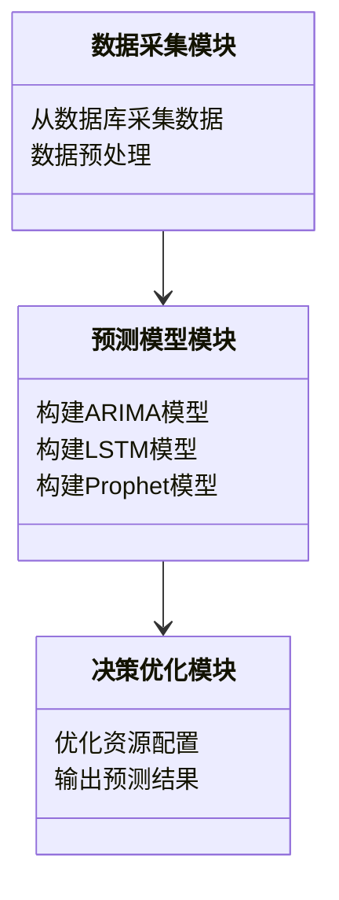
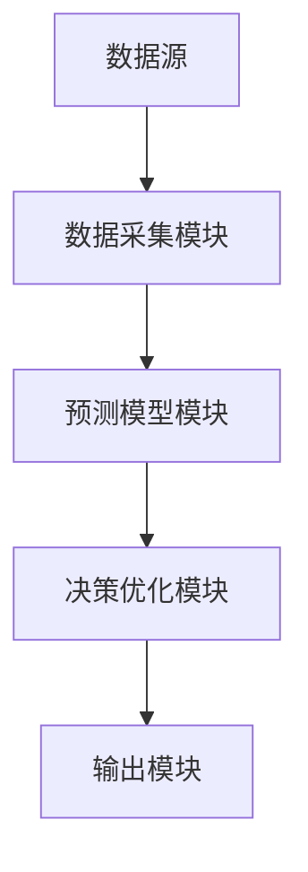

                 


# 企业AI Agent的时间序列预测在需求规划中的应用

## 关键词：
- 企业AI Agent
- 时间序列预测
- 需求规划
- 强化学习
- LSTM
- 系统架构设计

## 摘要：
本文深入探讨了企业AI Agent如何利用时间序列预测技术优化需求规划过程。通过分析时间序列预测的核心算法和AI Agent的工作机制，展示了它们在企业需求预测中的结合与应用。文章详细讲解了ARIMA、LSTM等经典算法，以及强化学习在时间序列预测中的创新应用，并通过实际案例分析展示了AI Agent在需求规划中的优势。本文还提供了系统的架构设计和项目实战指导，帮助读者全面掌握企业AI Agent在时间序列预测中的应用。

---

## 第1章: 时间序列预测概述

### 1.1 时间序列预测的基本概念
#### 1.1.1 时间序列的定义与特点
时间序列是一组按时间顺序排列的数据点，通常用于分析和预测未来趋势。时间序列数据具有以下特点：
- **趋势性**：数据点呈现出上升或下降的趋势。
- **周期性**：数据点在特定周期内重复出现。
- **随机性**：数据点中包含不可预测的随机波动。
- **季节性**：数据点在特定时间段内表现出规律性的变化。

#### 1.1.2 时间序列预测的目的与意义
时间序列预测的主要目的是通过分析历史数据，预测未来的趋势和数值。其意义在于帮助企业做出更精准的决策，例如库存管理、销售预测和资源分配。

#### 1.1.3 时间序列预测的应用领域
时间序列预测广泛应用于多个领域，包括：
- **金融领域**：股票价格预测、汇率预测。
- **制造业**：生产计划、库存管理。
- **零售业**：销售预测、需求预测。
- **能源领域**：电力需求预测、能源消耗分析。

### 1.2 AI Agent的基本概念
#### 1.2.1 AI Agent的定义与分类
AI Agent（人工智能代理）是指能够感知环境并采取行动以实现目标的智能实体。AI Agent可以分为以下几类：
- **简单反射型Agent**：基于当前输入做出简单反应。
- **基于模型的反射型Agent**：利用内部模型来规划行动。
- **目标驱动型Agent**：根据目标选择最优行动。
- **效用驱动型Agent**：通过最大化效用来做出决策。

#### 1.2.2 AI Agent的核心功能与特点
AI Agent的核心功能包括感知、决策、执行和学习。其特点如下：
- **自主性**：能够在没有外部干预的情况下运行。
- **反应性**：能够实时感知环境并做出反应。
- **目标导向**：根据目标选择最优行动。
- **学习能力**：能够通过经验改进性能。

#### 1.2.3 AI Agent在企业中的应用价值
AI Agent在企业中的应用价值主要体现在：
- **自动化决策**：通过AI Agent实现自动化决策，提高效率。
- **实时响应**：能够实时感知环境并做出反应，提升响应速度。
- **数据驱动**：基于大量数据进行分析和预测，提高决策的准确性。

### 1.3 企业需求规划中的时间序列预测
#### 1.3.1 需求规划的基本概念
需求规划是指根据历史数据和市场趋势，预测未来的需求量，并制定相应的计划。需求规划的核心在于准确预测需求，以避免库存过剩或短缺。

#### 1.3.2 时间序列预测在需求规划中的作用
时间序列预测在需求规划中的作用包括：
- **提高预测准确性**：通过分析历史数据，预测未来的趋势。
- **优化资源配置**：根据预测结果优化库存、生产和采购计划。
- **降低风险**：通过预测未来的需求，降低因需求波动带来的风险。

#### 1.3.3 企业需求规划的挑战与解决方案
企业需求规划的挑战主要在于数据的复杂性和不确定性。解决方案包括：
- **引入AI技术**：利用AI Agent和时间序列预测技术提高预测准确性。
- **实时数据分析**：通过实时数据分析快速响应市场变化。
- **多模型融合**：结合多种预测模型，提高预测的鲁棒性。

---

## 第2章: 时间序列预测的核心概念与联系

### 2.1 时间序列预测的原理
#### 2.1.1 时间序列的分解模型
时间序列的分解模型将数据分解为趋势、周期、季节性和随机性四个部分。常见的分解方法包括加法模型和乘法模型。

#### 2.1.2 时间序列预测的基本方法
时间序列预测的基本方法包括：
- **简单平均法**：基于历史数据的平均值进行预测。
- **指数平滑法**：通过加权平均历史数据进行预测。
- **ARIMA模型**：基于自回归和移动平均的统计模型。

#### 2.1.3 时间序列预测的误差分析
时间序列预测的误差分析包括均方误差（MSE）、平均绝对误差（MAE）和平均绝对百分比误差（MAPE）等指标。

### 2.2 AI Agent与时间序列预测的关系
#### 2.2.1 AI Agent如何辅助时间序列预测
AI Agent可以通过以下方式辅助时间序列预测：
- **数据预处理**：AI Agent可以自动处理数据，提取特征。
- **模型优化**：AI Agent可以通过强化学习优化预测模型的参数。
- **实时更新**：AI Agent可以实时更新模型，适应数据的变化。

#### 2.2.2 时间序列预测如何赋能AI Agent
时间序列预测可以赋能AI Agent，使其具备以下能力：
- **预测未来趋势**：通过时间序列预测，AI Agent能够预测未来的需求趋势。
- **动态调整策略**：根据预测结果动态调整行动策略。
- **提高决策效率**：通过预测数据，AI Agent可以更快地做出决策。

#### 2.2.3 两者的结合对企业需求规划的意义
两者的结合对企业需求规划的意义在于：
- **提高预测准确性**：通过AI Agent和时间序列预测的结合，提高需求预测的准确性。
- **优化资源配置**：根据预测结果优化资源配置，降低运营成本。
- **提高响应速度**：通过实时预测和动态调整，提高企业的响应速度。

### 2.3 核心概念对比分析
#### 2.3.1 时间序列预测与传统统计预测的对比
时间序列预测与传统统计预测的对比如下：

| 对比维度       | 时间序列预测             | 传统统计预测           |
|----------------|--------------------------|-----------------------|
| 数据类型       | 时间序列数据             | 截面数据               |
| 预测目标       | 预测未来趋势             | 预测总体特征           |
| 方法           | ARIMA、LSTM等            | 回归分析、聚类分析等   |

#### 2.3.2 AI Agent与传统预测模型的对比
AI Agent与传统预测模型的对比如下：

| 对比维度       | AI Agent                 | 传统预测模型           |
|----------------|--------------------------|-----------------------|
| 核心功能       | 自主决策、实时响应       | 数据分析、预测          |
| 数据需求       | 高实时性、多维度         | 低实时性、单维度       |
| 学习能力       | 强化学习、自适应          | 无学习能力             |

#### 2.3.3 时间序列预测在企业需求规划中的对比
时间序列预测在企业需求规划中的对比如下：

| 对比维度       | 时间序列预测             | 传统需求规划           |
|----------------|--------------------------|-----------------------|
| 数据基础       | 历史时间序列数据         | 历史需求数据           |
| 预测方法       | 统计模型、机器学习模型    | 经验判断、简单模型      |
| 应用效果       | 高准确性、实时性          | 中等准确性、低实时性    |

---

## 第3章: 时间序列预测的算法原理

### 3.1 时间序列预测的经典算法
#### 3.1.1 ARIMA模型
ARIMA（自回归积分滑动平均模型）是一种广泛应用于时间序列预测的统计模型。其基本假设是时间序列数据可以通过自回归和滑动平均过程来建模。

#### 3.1.2 LSTM网络
LSTM（长短期记忆网络）是一种基于循环神经网络的深度学习模型，能够有效地捕捉时间序列中的长期依赖关系。

#### 3.1.3 Prophet模型
Prophet是由Facebook开源的时间序列预测模型，适用于具有周期性或趋势性的数据。

### 3.2 AI Agent的算法原理
#### 3.2.1 强化学习的基本原理
强化学习是一种通过试错机制来优化决策的算法。AI Agent通过与环境交互，学习最优策略以最大化累积奖励。

#### 3.2.2 策略梯度方法
策略梯度方法是一种通过优化策略的参数来提高决策性能的算法。其核心思想是通过梯度上升方法最大化累积奖励。

#### 3.2.3 Q-learning算法
Q-learning是一种基于值函数的强化学习算法。通过更新Q值表，AI Agent学习最优动作策略。

### 3.3 时间序列预测与AI Agent的结合算法
#### 3.3.1 基于强化学习的时间序列预测
基于强化学习的时间序列预测算法结合了时间序列预测和强化学习的优势，通过强化学习优化预测模型的参数。

#### 3.3.2 基于LSTM的AI Agent预测
基于LSTM的AI Agent预测算法利用LSTM网络捕捉时间序列中的长期依赖关系，并通过强化学习动态调整预测策略。

#### 3.3.3 深度强化学习在时间序列预测中的应用
深度强化学习在时间序列预测中的应用主要体现在利用深度神经网络和强化学习结合，提高预测的准确性和实时性。

---

## 第4章: 时间序列预测的数学模型与公式

### 4.1 时间序列预测的数学模型
时间序列预测的数学模型包括ARIMA模型和LSTM模型。ARIMA模型的数学表达式如下：
$$ ARIMA(p, d, q) = \phi(B^p)(1-B)^d X_t + \theta(B^q) Z_t $$
其中，$p$为自回归阶数，$d$为差分阶数，$q$为滑动平均阶数，$B$为后移算子。

LSTM模型的数学表达式如下：
$$ f_t = \sigma(W_f \cdot [h_{t-1}, x_t] + b_f) $$
$$ i_t = \sigma(W_i \cdot [h_{t-1}, x_t] + b_i) $$
$$ o_t = \sigma(W_o \cdot [h_{t-1}, x_t] + b_o) $$
$$ c_t = i_t \cdot c_{t-1} + f_t \cdot x_t $$
$$ h_t = o_t \cdot \tanh(c_t) $$
其中，$f_t$为遗忘门，$i_t$为输入门，$o_t$为输出门，$c_t$为细胞状态，$h_t$为隐藏状态。

### 4.2 强化学习中的数学模型
强化学习中的数学模型包括策略梯度方法和Q-learning算法。策略梯度方法的数学表达式如下：
$$ \nabla \theta = \mathbb{E}[\nabla \log \pi_\theta(a|s) \cdot Q_\theta(s, a)] $$
其中，$\theta$为策略参数，$\pi_\theta(a|s)$为策略函数，$Q_\theta(s, a)$为价值函数。

Q-learning算法的数学表达式如下：
$$ Q(s, a) = Q(s, a) + \alpha (r + \gamma \max Q(s', a') - Q(s, a)) $$
其中，$\alpha$为学习率，$\gamma$为折扣因子。

---

## 第5章: 系统分析与架构设计方案

### 5.1 系统分析
#### 5.1.1 项目背景
本项目旨在利用AI Agent和时间序列预测技术优化企业需求规划过程。

#### 5.1.2 系统功能设计
系统功能设计包括数据采集、预测模型构建、预测结果输出和决策优化。

### 5.2 系统架构设计
#### 5.2.1 领域模型类图
领域模型类图展示了系统中的主要类及其关系。



#### 5.2.2 系统架构图
系统架构图展示了系统的整体架构。



### 5.3 接口设计与交互流程
#### 5.3.1 接口设计
接口设计包括数据接口和模型接口。

#### 5.3.2 交互流程
交互流程包括数据采集、模型训练、预测输出和决策优化。

---

## 第6章: 项目实战

### 6.1 环境安装
项目实战需要安装Python、TensorFlow、Keras和LSTM库。

### 6.2 系统核心实现源代码
以下是系统核心代码示例：

```python
import numpy as np
import pandas as pd
from keras.models import Sequential
from keras.layers import LSTM, Dense

# 数据准备
data = pd.read_csv('data.csv')
X = data[['feature1', 'feature2']]
y = data['target']

# 模型构建
model = Sequential()
model.add(LSTM(64, input_shape=(X.shape[1], 1)))
model.add(Dense(1))
model.compile(loss='mean_squared_error', optimizer='adam')

# 模型训练
model.fit(X, y, epochs=100, batch_size=32)
```

### 6.3 代码应用解读与分析
代码应用解读与分析包括数据预处理、模型构建、模型训练和结果输出。

### 6.4 实际案例分析和详细讲解剖析
实际案例分析包括数据采集、模型训练、预测结果输出和决策优化。

---

## 第7章: 总结与展望

### 7.1 最佳实践 tips
最佳实践 tips包括数据预处理、模型选择和结果分析。

### 7.2 小结
本文总结了企业AI Agent在时间序列预测中的应用，强调了其在需求规划中的重要性。

### 7.3 注意事项
注意事项包括数据质量、模型选择和结果验证。

### 7.4 拓展阅读
拓展阅读推荐了相关领域的书籍和论文，供读者进一步学习。

---

## 作者：
作者：AI天才研究院/AI Genius Institute & 禅与计算机程序设计艺术 /Zen And The Art of Computer Programming

