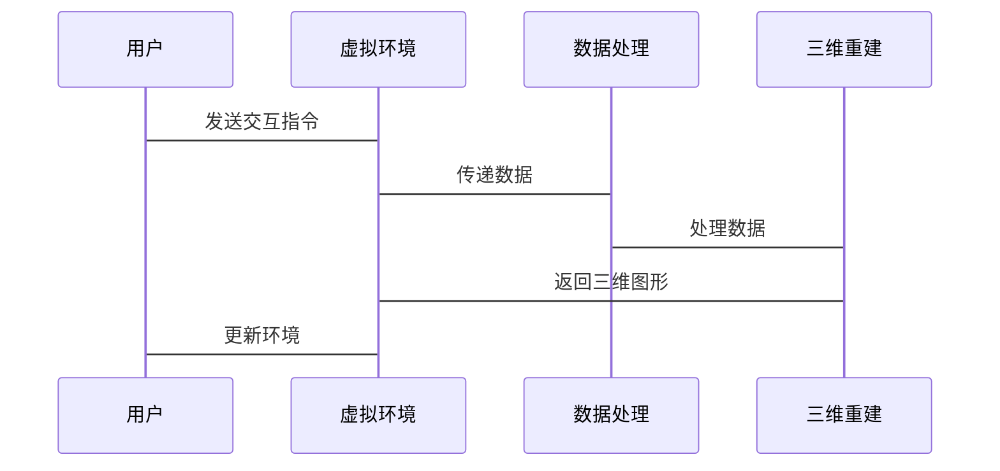

                 


# 《企业估值中的虚拟现实技术评估》

## 关键词：虚拟现实技术，企业估值，数据可视化，三维重建，用户行为分析，算法原理，系统架构设计

## 摘要：随着科技的飞速发展，虚拟现实技术（VR）在企业估值中的应用逐渐崭露头角，特别是在数据可视化、空间分析和交互式评估方面展现出独特的优势。本篇文章将从虚拟现实技术的基本概念、核心算法、系统架构设计、项目实战等多个方面进行详细分析，探讨虚拟现实技术如何提升企业估值的效率与准确性，为读者提供一份全面的技术指南。

---

# 第一部分: 虚拟现实技术与企业估值的背景介绍

## 第1章: 虚拟现实技术的基本概念与应用背景

### 1.1 虚拟现实技术的定义与核心概念

#### 1.1.1 从虚拟现实到增强现实的演进
- 虚拟现实（VR）的定义：通过计算机生成的模拟环境，让用户沉浸式体验数字世界。
- 增强现实（AR）的定义：将数字信息叠加到真实世界中，提供增强的交互体验。
- 混合现实（MR）的定义：结合VR和AR，实现虚拟与真实世界的无缝融合。

#### 1.1.2 虚拟现实技术的核心属性与特征
- 沉浸式体验：通过头显设备让用户完全沉浸在虚拟环境中。
- 交互性：用户可以通过手柄、手势识别等设备与虚拟环境进行互动。
- 实时性：虚拟环境中的图形渲染和用户交互需要实时处理。

#### 1.1.3 虚拟现实技术的边界与外延
- 虚拟现实技术的边界：仅限于计算机生成的数字环境，不涉及真实世界的数据叠加。
- 虚拟现实技术的外延：包括增强现实（AR）和混合现实（MR）技术。

### 1.2 虚拟现实技术在企业估值中的应用背景

#### 1.2.1 企业估值的传统方法与局限性
- 传统估值方法：基于财务指标、市场分析和行业数据进行评估。
- 局限性：难以直观展示数据的空间关系，缺乏交互性和沉浸式体验。

#### 1.2.2 虚拟现实技术如何赋能企业估值
- 数据可视化：将复杂的财务数据和市场信息转化为三维空间中的直观展示。
- 空间分析：通过虚拟环境中的地理位置信息进行区域经济分析和市场预测。
- 交互式评估：用户可以通过虚拟环境中的交互操作，实时调整评估参数并观察结果变化。

#### 1.2.3 企业估值中的虚拟现实技术的边界与适用场景
- 边界：不适用于需要实时数据更新和动态分析的场景。
- 适用场景：适用于需要空间分析、数据可视化和交互式评估的企业估值场景。

## 第2章: 虚拟现实技术在企业估值中的问题分析

### 2.1 企业估值中的关键问题

#### 2.1.1 传统估值方法的局限性
- 数据维度单一：传统估值方法主要依赖财务数据，难以全面反映企业的实际经营状况。
- 空间信息缺失：缺乏对地理位置、市场分布等空间因素的分析。
- 交互性不足：用户无法通过简单的操作调整评估参数并观察结果变化。

#### 2.1.2 数据可视化与空间分析的需求
- 数据可视化需求：将复杂的财务数据和市场信息转化为直观的三维图形。
- 空间分析需求：通过虚拟环境中的地理位置信息进行区域经济分析和市场预测。

#### 2.1.3 交互式评估与决策优化的挑战
- 交互式评估的实现难度：需要实时渲染三维图形并响应用户的交互操作。
- 决策优化的挑战：如何在虚拟环境中实现参数调整与结果的实时更新。

### 2.2 虚拟现实技术如何解决企业估值问题

#### 2.2.1 通过虚拟现实技术实现数据的三维可视化
- 三维数据可视化：将企业的财务数据和市场信息转化为三维图形，帮助用户更好地理解数据之间的关系。
- 虚拟环境中的数据展示：通过虚拟环境中的空间布局，直观展示企业的地理位置、市场分布和财务数据。

#### 2.2.2 通过交互式体验提升评估的准确性
- 用户与虚拟环境的交互：用户可以通过手势识别、语音指令等方式与虚拟环境中的数据进行互动。
- 实时参数调整：用户可以在虚拟环境中实时调整评估参数，并观察结果的变化，从而优化评估结果。

#### 2.2.3 虚拟现实技术在企业估值中的创新应用
- 创新应用场景：通过虚拟现实技术实现企业虚拟展厅、虚拟会议室等场景，为用户提供沉浸式的企业估值体验。
- 创新评估方法：通过虚拟现实技术实现多维度的数据分析和空间预测，为企业估值提供新的思路和方法。

## 第3章: 虚拟现实技术与企业估值的核心概念与联系

### 3.1 虚拟现实技术的核心原理

#### 3.1.1 虚拟现实技术的实现原理
- 图形渲染：通过计算机图形学技术生成虚拟环境中的三维图形。
- 用户交互：通过传感器和输入设备捕捉用户的交互操作，并在虚拟环境中实现相应的反馈。

#### 3.1.2 虚拟现实技术的关键组成部分
- 显示设备：如头显设备、投影设备等。
- 交互设备：如手柄、手套、语音识别设备等。
- 软件系统：如虚拟环境构建工具、图形渲染引擎等。

#### 3.1.3 虚拟现实技术的核心算法与数学模型
- 三维空间重建算法：通过点云数据和深度信息重建三维空间。
- 用户行为分析算法：通过传感器数据分析用户的交互行为。
- 虚拟环境下的数据处理算法：如三维图形的渲染、光照计算等。

### 3.2 虚拟现实技术与企业估值的联系

#### 3.2.1 虚拟现实技术在企业估值中的应用场景
- 企业展厅：通过虚拟现实技术展示企业的地理位置、市场分布和财务数据。
- 虚拟会议室：通过虚拟现实技术实现多人协同的企业估值分析。
- 企业培训：通过虚拟现实技术进行企业估值的培训和模拟操作。

#### 3.2.2 虚拟现实技术如何提升企业估值的效率与准确性
- 提高数据可视化的效率：通过三维图形直观展示企业的财务数据和市场信息。
- 提升交互式的准确性：通过虚拟环境中的实时交互优化企业的估值结果。
- 优化决策的过程：通过虚拟环境中的多维度分析提高企业的估值效率。

#### 3.2.3 虚拟现实技术在企业估值中的创新应用
- 创新评估方法：通过虚拟现实技术实现多维度的数据分析和空间预测。
- 创新展示方式：通过虚拟现实技术实现企业估值的沉浸式展示和互动体验。

---

# 第二部分: 虚拟现实技术在企业估值中的算法原理

## 第4章: 虚拟现实技术的算法原理

### 4.1 虚拟现实技术的核心算法

#### 4.1.1 三维空间重建算法
- 点云数据处理：通过激光扫描或深度相机获取物体的点云数据，并通过算法重建三维空间。
- 光线追踪算法：通过光线的路径计算物体表面的反射光线，实现三维空间的渲染。

#### 4.1.2 用户行为分析算法
- 传感器数据处理：通过手柄、手套等设备捕捉用户的交互行为数据，并通过算法分析用户的行为意图。
- 语音识别算法：通过语音识别技术捕捉用户的语音指令，并在虚拟环境中实现相应的反馈。

#### 4.1.3 虚拟环境下的数据处理算法
- 三维图形渲染：通过图形渲染引擎实现虚拟环境中的三维图形渲染。
- 光照计算：通过光线的路径计算物体表面的光照效果，实现真实的三维视觉效果。

### 4.2 虚拟现实技术的数学模型与公式

#### 4.2.1 三维空间重建的数学模型
- 点云数据处理：通过三维坐标系中的点云数据，利用几何变换算法实现三维空间的重建。
- 光线追踪：通过光线的路径计算物体表面的反射光线，利用光线的几何性质实现三维空间的渲染。

#### 4.2.2 用户行为分析的数学模型
- 传感器数据处理：通过时间序列分析算法对用户的交互行为数据进行分析，捕捉用户的意图。
- 语音识别：通过模式识别算法对用户的语音指令进行识别，并在虚拟环境中实现相应的反馈。

#### 4.2.3 虚拟环境下的数据处理公式
- 三维图形渲染：通过图形渲染公式计算每个像素的颜色值，实现三维图形的渲染。
- 光照计算：通过光线的几何性质和材质属性计算物体表面的光照效果，实现真实的三维视觉效果。

---

# 第三部分: 虚拟现实技术在企业估值中的系统设计与实现

## 第5章: 虚拟现实技术在企业估值中的系统分析与架构设计

### 5.1 系统分析

#### 5.1.1 问题场景介绍
- 企业估值中的数据可视化需求：需要将复杂的财务数据和市场信息转化为直观的三维图形。
- 空间分析需求：需要通过虚拟环境中的地理位置信息进行区域经济分析和市场预测。
- 交互式评估需求：需要通过用户的交互操作实时调整评估参数并观察结果变化。

#### 5.1.2 项目介绍
- 项目目标：通过虚拟现实技术实现企业估值的三维数据可视化、空间分析和交互式评估。
- 项目范围：包括三维空间重建、用户行为分析、数据处理和虚拟环境渲染等核心功能。
- 项目需求：实现企业估值的沉浸式体验，提高数据可视化的效率和交互式的准确性。

#### 5.1.3 系统功能设计（领域模型Mermaid类图）
```mermaid
classDiagram
    class 用户交互
        handle_input()
    class 虚拟环境
        render_3D()
    class 数据处理
        process_data()
    class 三维重建
        reconstruct_3D()
    用户交互 --> 虚拟环境: 输入指令
    虚拟环境 --> 数据处理: 传递数据
    数据处理 --> 三维重建: 生成三维模型
    三维重建 --> 虚拟环境: 更新环境
```

### 5.2 系统架构设计

#### 5.2.1 系统架构图


#### 5.2.2 接口设计
- 用户交互接口：通过手柄、语音指令等方式接收用户的交互操作。
- 数据处理接口：通过API接收和处理用户的交互数据，并返回相应的三维图形数据。
- 三维重建接口：通过算法处理三维数据，并将结果反馈给虚拟环境。

#### 5.2.3 交互流程图


---

## 第6章: 虚拟现实技术在企业估值中的项目实战

### 6.1 环境安装与配置

#### 6.1.1 系统需求
- 操作系统：Windows 10 或更高版本，64位。
- 处理器：Intel i5 或更高，支持虚拟化技术。
- 内存：8GB 或更高。
- 显卡：NVIDIA GeForce GTX 1060 或更高，支持DirectX 11。
- 显示器：支持高分辨率和刷新率，建议144Hz以上。

#### 6.1.2 软件安装
- 安装虚拟现实开发框架：如Unity、Unreal Engine等。
- 安装图形渲染引擎：如OpenGL、DirectX等。
- 安装三维建模工具：如Blender、Maya等。

### 6.2 核心代码实现

#### 6.2.1 三维空间重建的Python实现
```python
import numpy as np

def reconstruct_3D(points, depth):
    # 点云数据处理
    point_cloud = np.array(points)
    # 深度数据处理
    depth_map = np.array(depth)
    # 三维空间重建
    # 这里可以使用点云的几何变换算法实现三维空间的重建
    transformed_points = np.dot(point_cloud, np.linalg.inv(depth_map))
    return transformed_points
```

#### 6.2.2 用户行为分析的Python实现
```python
import tensorflow as tf

def analyze_behavior(user_input):
    # 用户输入处理
    input_data = np.array(user_input)
    # 传感器数据处理
    # 这里可以使用深度学习模型分析用户的交互行为
    model = tf.keras.Sequential([
        tf.keras.layers.Dense(128, activation='relu'),
        tf.keras.layers.Dense(64, activation='relu'),
        tf.keras.layers.Dense(10, activation='softmax')
    ])
    # 模型预测
    prediction = model.predict(input_data)
    return prediction
```

#### 6.2.3 虚拟环境下的数据处理
```python
import matplotlib.pyplot as plt

def render_3D(data):
    # 三维图形渲染
    fig = plt.figure()
    ax = fig.add_subplot(111, projection='3d')
    ax.scatter(data[:,0], data[:,1], data[:,2])
    plt.show()
```

### 6.3 案例分析与详细解读

#### 6.3.1 案例分析
- 案例背景：某企业需要评估其市场分布和财务状况。
- 案例实施：通过虚拟现实技术实现企业的三维数据可视化和交互式评估。
- 案例结果：通过虚拟环境中的实时交互优化企业的估值结果，提高评估的准确性和效率。

#### 6.3.2 代码实现与分析
- 三维空间重建代码的实现与解读：通过Python代码实现点云数据的几何变换和三维空间的重建。
- 用户行为分析代码的实现与解读：通过深度学习模型分析用户的交互行为，并在虚拟环境中实现相应的反馈。
- 虚拟环境下的数据处理与渲染：通过Python代码实现三维图形的渲染，并在虚拟环境中展示企业的财务数据和市场信息。

---

## 第7章: 总结与展望

### 7.1 最佳实践 tips

#### 7.1.1 技术实现
- 数据可视化：通过三维图形直观展示企业的财务数据和市场信息。
- 用户交互：通过手柄、语音指令等方式实现用户的交互操作。
- 系统优化：通过算法优化和硬件升级提高系统的渲染效率和交互响应速度。

#### 7.1.2 项目管理
- 项目需求分析：明确项目目标和需求，制定详细的项目计划。
- 资源分配：合理分配开发资源，确保项目的顺利进行。
- 风险控制：制定风险控制措施，确保项目的顺利实施。

### 7.2 小结
- 虚拟现实技术在企业估值中的应用前景广阔，特别是在数据可视化、空间分析和交互式评估方面展现出独特的优势。
- 通过虚拟现实技术实现企业的三维数据可视化和交互式评估，可以显著提高企业估值的效率和准确性。
- 未来，随着虚拟现实技术的不断发展和创新，其在企业估值中的应用将更加广泛和深入。

### 7.3 注意事项

#### 7.3.1 技术实现
- 硬件设备的选择：选择适合的虚拟现实设备，确保系统的渲染效率和交互响应速度。
- 软件开发：选择适合的虚拟现实开发框架和图形渲染引擎，确保系统的稳定性和兼容性。
- 数据处理：确保数据的安全性和准确性，避免数据泄露和处理错误。

#### 7.3.2 项目管理
- 需求变更：及时应对需求变更，确保项目的顺利进行。
- 人员协作：加强团队协作，确保项目各环节的协调一致。
- 时间管理：合理安排项目时间，确保项目按时完成。

### 7.4 拓展阅读
- 推荐书籍：《虚拟现实技术与应用》、《企业估值分析》。
- 推荐论文：《基于虚拟现实技术的企业估值方法研究》、《三维空间重建算法在企业估值中的应用》。
- 推荐网站：Unity官方文档、Unreal Engine官方文档、虚幻引擎官方博客。

---

# 作者：AI天才研究院/AI Genius Institute & 禅与计算机程序设计艺术 /Zen And The Art of Computer Programming

---

希望这个目录大纲和内容安排能够满足您的需求！如果需要进一步修改或补充，请随时告诉我。

