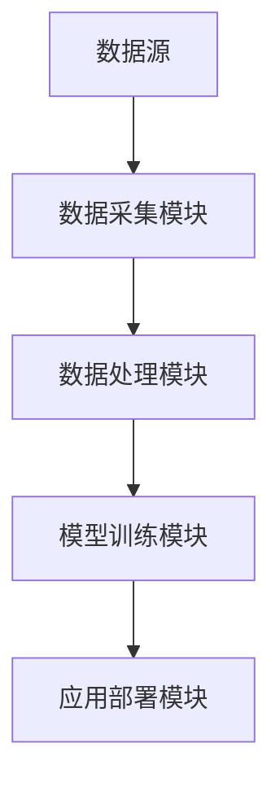
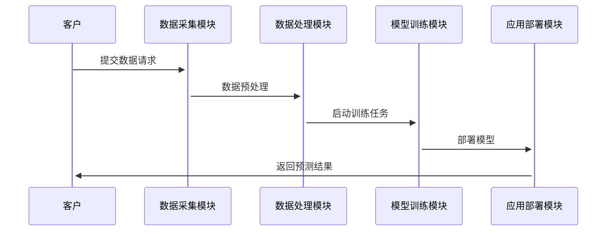

                 


# 如何识别企业的深度学习多模态融合优势

> 关键词：深度学习，多模态融合，企业优势，技术博客，人工智能

> 摘要：本文将详细探讨如何识别企业中深度学习多模态融合的优势，从背景介绍、核心概念、算法原理到系统设计与项目实战，帮助读者全面理解多模态融合在企业中的应用价值。

---

## 第一部分: 企业深度学习多模态融合的背景与概念

### 第1章: 多模态融合的背景与问题背景

#### 1.1 多模态融合的定义与问题背景

**1.1.1 多模态数据的定义与特点**  
多模态数据指的是来自不同感官或数据源的信息，例如文本、图像、语音、视频、传感器数据等。每种模态数据都有其独特的优势和局限性。通过将多种模态数据融合，可以互补信息，提升模型的泛化能力和准确性。

**1.1.2 企业深度学习的多模态融合需求**  
在企业中，数据往往来自多个部门和系统，例如销售数据、客户反馈、生产日志等。将这些数据进行多模态融合，可以帮助企业更好地理解业务流程、优化决策、提升用户体验。

**1.1.3 多模态融合在企业中的应用价值**  
通过多模态融合，企业可以实现以下目标：  
- 提升模型的鲁棒性和准确性。  
- 深度理解用户需求，提供个性化服务。  
- 优化业务流程，降低成本。  

#### 1.2 多模态融合的核心概念

**1.2.1 多模态融合的定义**  
多模态融合是指将来自不同模态的数据进行联合分析，以提取更丰富的信息。通过融合不同模态的数据，可以弥补单一模态的不足，提升模型的表现。

**1.2.2 多模态融合的核心要素**  
- **数据模态的多样性**：数据来源多样，例如文本、图像、语音等。  
- **模态间的信息互补性**：不同模态的数据可以相互补充，例如图像可以提供视觉信息，文本可以提供语义信息。  
- **模态融合的策略与方法**：选择合适的融合方式，例如早期融合、晚期融合、注意力机制等。  

#### 1.3 多模态融合与传统深度学习的对比

**1.3.1 传统深度学习的局限性**  
传统深度学习主要依赖单一模态的数据进行训练，例如仅使用文本或仅使用图像。这种方式在某些场景下表现良好，但在需要结合多源信息时显得力不从心。

**1.3.2 多模态融合的优势**  
- 提高模型的泛化能力。  
- 提升模型的鲁棒性。  
- 更好地理解复杂的业务场景。  

**1.3.3 多模态融合与传统深度学习的联系**  
多模态融合是在传统深度学习的基础上，进一步结合多源信息，提升模型的表现。  

#### 1.4 本章小结  
本章从背景、定义、核心要素等方面介绍了多模态融合的基本概念，并分析了其在企业中的应用价值和优势。

---

## 第二部分: 多模态融合的核心概念与联系

### 第2章: 多模态融合的核心原理

#### 2.1 多模态融合的原理与流程

**2.1.1 多模态数据的预处理流程**  
- 数据清洗：去除噪声、填补缺失值。  
- 数据标准化：将不同模态的数据进行标准化处理。  
- 数据增强：通过数据增强技术提升数据的多样性。  

**2.1.2 多模态特征提取的原理**  
通过卷积神经网络（CNN）、循环神经网络（RNN）、 transformers 等模型分别提取不同模态的特征。  

**2.1.3 多模态融合的实现方式**  
- **早期融合**：在特征提取阶段进行融合。  
- **晚期融合**：在特征提取后进行融合。  

#### 2.2 多模态融合的模型架构

**2.2.1 多模态融合的主流模型架构**  
- **多模态Transformer**：通过自注意力机制结合不同模态的特征。  
- **多模态对比学习**：通过对比不同模态的特征，提升模型的表征能力。  

**2.2.2 多模态融合模型的优缺点对比**  
| 模型架构       | 优点                       | 缺点                       |
|----------------|----------------------------|----------------------------|
| 多模态Transformer | 能够捕捉到模态间的全局关系 | 计算复杂度较高             |
| 多模态对比学习  | 提升特征的区分度           | 需要额外的对比损失设计     |

**2.2.3 多模态融合模型的性能评估**  
- 准确率、召回率、F1值等指标。  
- 模型的泛化能力。  

#### 2.3 多模态融合的核心要素

**2.3.1 数据模态的多样性**  
数据来源多样，例如文本、图像、语音等。  

**2.3.2 模态间的信息互补性**  
不同模态的数据可以相互补充，例如图像可以提供视觉信息，文本可以提供语义信息。  

**2.3.3 模态融合的策略与方法**  
选择合适的融合方式，例如注意力机制、对比学习等。  

#### 2.4 本章小结  
本章详细介绍了多模态融合的原理与流程，并分析了不同模型架构的优缺点，帮助读者理解多模态融合的核心要素。

---

## 第三部分: 多模态融合的算法原理与数学模型

### 第3章: 多模态融合的算法原理

#### 3.1 多模态融合的算法流程

**3.1.1 数据预处理与特征提取**  
- 文本数据：使用BERT进行特征提取。  
- 图像数据：使用ResNet提取特征。  

**3.1.2 多模态特征融合策略**  
- 使用注意力机制对不同模态的特征进行加权。  
- 使用对比学习提升特征的区分度。  

**3.1.3 模型训练与优化**  
- 使用交叉熵损失函数进行训练。  
- 采用Adam优化器进行优化。  

#### 3.2 多模态融合的主流算法

**3.2.1 多模态注意力机制**  
通过自注意力机制对不同模态的特征进行加权，例如：  
$$ \alpha_i = \text{softmax}(W_q q^T W_k k) $$  

**3.2.2 多模态对比学习**  
通过对比不同模态的特征，提升模型的表征能力，例如：  
$$ \mathcal{L} = -\log \text{cos}(x_i, x_j) $$  

**3.2.3 多模态图神经网络**  
通过图神经网络对多模态数据进行建模，例如：  
$$ h_i = \sigma(W h_i^{(prev)} + b) $$  

#### 3.3 多模态融合的数学模型

**3.3.1 多模态特征表示的数学模型**  
通过将不同模态的特征向量进行拼接或加权，例如：  
$$ f(x) = \sum_{i=1}^n \alpha_i x_i $$  

**3.3.2 多模态融合的损失函数**  
使用交叉熵损失函数或对比损失函数，例如：  
$$ \mathcal{L} = -\sum_{i=1}^n y_i \log(p_i) $$  

**3.3.3 多模态融合的优化算法**  
采用Adam优化器进行模型优化，例如：  
$$ \theta_{t+1} = \theta_t - \eta \nabla_\theta \mathcal{L} $$  

#### 3.4 本章小结  
本章从算法原理和数学模型的角度，详细介绍了多模态融合的核心技术，包括注意力机制、对比学习和图神经网络等。

---

## 第四部分: 多模态融合的系统分析与架构设计

### 第4章: 企业深度学习多模态融合系统分析

#### 4.1 问题场景介绍

**4.1.1 企业多模态数据的典型场景**  
例如，电商企业的客户行为数据、商品描述数据、用户评论数据等。  

**4.1.2 多模态融合在企业中的应用痛点**  
- 数据孤岛问题：不同部门的数据难以整合。  
- 模型性能不足：单一模态模型难以满足复杂业务需求。  

**4.1.3 企业多模态融合系统的建设目标**  
- 提升模型的准确性和鲁棒性。  
- 实现跨部门数据的高效融合。  

#### 4.2 系统功能设计

**4.2.1 系统功能模块划分**  
- 数据采集模块：采集多模态数据。  
- 数据处理模块：对数据进行预处理和特征提取。  
- 模型训练模块：训练多模态融合模型。  
- 应用部署模块：将模型部署到生产环境。  

**4.2.2 系统功能流程设计**  
1. 数据采集模块：采集文本、图像等多模态数据。  
2. 数据处理模块：对数据进行清洗、标准化和增强。  
3. 模型训练模块：使用多模态融合算法进行模型训练。  
4. 应用部署模块：将模型部署到企业系统中，提供实时预测服务。  

**4.2.3 系统功能的实现方式**  
- 数据采集：使用爬虫、API接口等方式采集数据。  
- 数据处理：使用Python的Pandas库进行数据清洗。  
- 模型训练：使用深度学习框架如TensorFlow、PyTorch进行模型训练。  

#### 4.3 系统架构设计

**4.3.1 系统架构图**  


**4.3.2 系统接口设计**  
- 数据采集接口：提供REST API接口，接收数据。  
- 模型训练接口：提供训练任务启动接口。  
- 应用预测接口：提供实时预测服务接口。  

**4.3.3 系统交互流程图**  


#### 4.4 本章小结  
本章从系统设计的角度，详细介绍了企业多模态融合系统的功能模块、架构设计和交互流程，为实际应用提供了参考。

---

## 第五部分: 项目实战

### 第5章: 多模态融合项目实战

#### 5.1 环境安装与配置

**5.1.1 安装依赖库**  
```bash
pip install tensorflow==2.5.0
pip install pytorch==1.9.0
pip install numpy==1.21.0
pip install matplotlib==3.5.0
pip install pandas==1.3.5
```

**5.1.2 配置GPU支持**  
确保安装了NVIDIA显卡驱动和CUDA Toolkit，并在代码中启用GPU加速。

#### 5.2 系统核心实现源代码

**5.2.1 数据预处理代码**  
```python
import pandas as pd
import numpy as np

def preprocess_data(data):
    # 数据清洗
    data = data.dropna()
    # 数据标准化
    data = (data - data.mean()) / data.std()
    return data
```

**5.2.2 多模态融合模型代码**  
```python
import torch
import torch.nn as nn

class MultiModalFusion(nn.Module):
    def __init__(self, input_dim1, input_dim2):
        super(MultiModalFusion, self).__init__()
        self.fc1 = nn.Linear(input_dim1, 128)
        self.fc2 = nn.Linear(input_dim2, 128)
        self.fc3 = nn.Linear(256, 1)
    
    def forward(self, x1, x2):
        x1 = self.fc1(x1)
        x2 = self.fc2(x2)
        x = torch.cat((x1, x2), dim=1)
        x = self.fc3(x)
        return x
```

**5.2.3 训练代码**  
```python
import torch.optim as optim

model = MultiModalFusion(128, 128)
criterion = nn.CrossEntropyLoss()
optimizer = optim.Adam(model.parameters(), lr=0.001)

for epoch in range(100):
    for inputs1, inputs2, labels in dataloader:
        outputs = model(inputs1, inputs2)
        loss = criterion(outputs, labels)
        loss.backward()
        optimizer.step()
```

#### 5.3 代码应用解读与分析

**5.3.1 数据预处理部分**  
- 使用Pandas进行数据清洗和标准化。  

**5.3.2 模型实现部分**  
- 使用PyTorch构建多模态融合模型，通过全连接层对不同模态的特征进行融合。  

**5.3.3 训练部分**  
- 使用Adam优化器和交叉熵损失函数进行模型训练。  

#### 5.4 实际案例分析

**5.4.1 案例背景**  
以电商企业的客户行为预测为例，目标是预测客户是否会购买商品。  

**5.4.2 数据来源**  
- 文本数据：用户评论。  
- 图像数据：商品图片。  

**5.4.3 模型训练与评估**  
- 训练集、验证集、测试集的比例为7:2:1。  
- 使用准确率、召回率、F1值评估模型性能。  

**5.4.4 模型优化与调参**  
- 调整学习率、批量大小等超参数，优化模型性能。  

#### 5.5 本章小结  
本章通过实际案例，详细讲解了多模态融合项目的实施过程，包括环境配置、代码实现、模型训练和评估等。

---

## 第六部分: 总结与展望

### 第6章: 总结与展望

#### 6.1 最佳实践 tips

**6.1.1 数据预处理**  
- 确保数据的多样性和完整性。  
- 对不同模态的数据进行标准化处理。  

**6.1.2 模型选择与优化**  
- 根据具体场景选择合适的模型架构。  
- 调整超参数，优化模型性能。  

**6.1.3 系统设计**  
- 设计高效的系统架构，确保数据流的畅通。  
- 采用模块化设计，便于后续优化和扩展。  

#### 6.2 本章小结  
本文从背景、核心概念、算法原理到系统设计和项目实战，全面介绍了如何识别和利用企业的深度学习多模态融合优势。

#### 6.3 注意事项

**6.3.1 数据隐私与安全**  
在处理企业数据时，需注意数据隐私和安全问题。  

**6.3.2 模型解释性**  
在实际应用中，模型的解释性也很重要，需注意可解释性设计。  

#### 6.4 拓展阅读

**6.4.1 多模态融合的经典论文**  
- "Unsupervised Representation Learning from Multimodal Data"  
- "Cross-modal Hashing for Efficient Similarity Search"  

**6.4.2 企业深度学习的最新动态**  
- 关注顶会论文，了解多模态融合的最新进展。  
- 参加技术交流活动，获取行业内的最新动态。  

---

## 作者信息

作者：AI天才研究院/AI Genius Institute & 禅与计算机程序设计艺术/Zen And The Art of Computer Programming

---

**注意**：由于篇幅限制，上述内容为简化版，实际文章应包含完整的代码实现、详细的案例分析以及更多技术细节。

