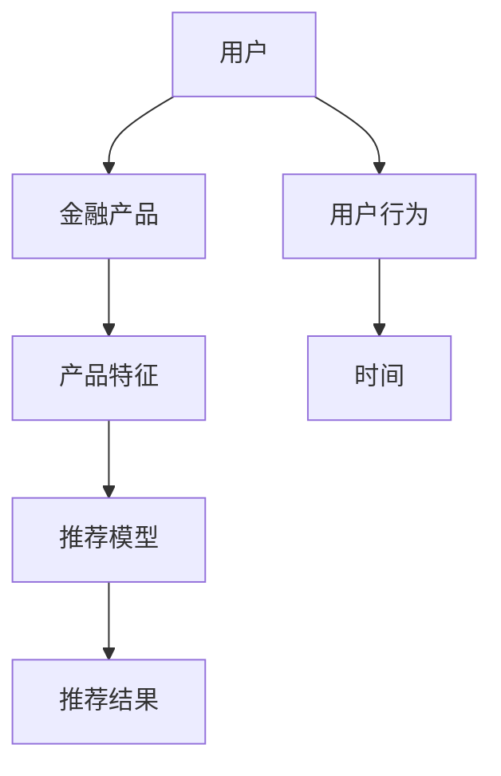
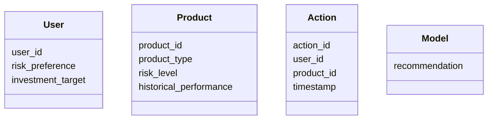
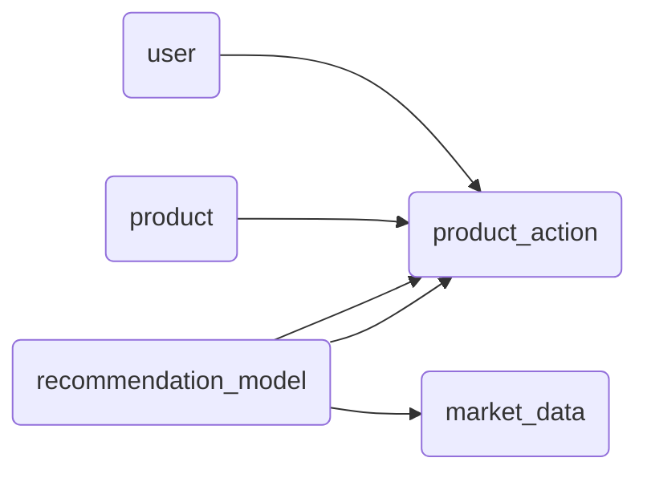

                 


# 开发智能化的金融产品推荐引擎

> 关键词：智能化推荐引擎、机器学习、金融产品推荐、协同过滤、深度学习、系统架构设计

> 摘要：随着金融市场的日益复杂化和用户需求的多样化，开发智能化的金融产品推荐引擎成为金融机构提升竞争力的重要手段。本文从背景、算法、系统架构设计到项目实战，详细讲解了如何构建一个高效、智能的金融产品推荐系统。通过分析用户行为、产品特征和市场趋势，结合机器学习和深度学习算法，最终实现个性化的金融产品推荐，帮助用户做出更明智的投资决策。

---

# 第一部分: 智能化金融产品推荐引擎的背景与核心概念

## 第1章: 金融产品推荐引擎的背景与问题描述

### 1.1 问题背景

#### 1.1.1 传统金融产品推荐的痛点
传统的金融产品推荐主要依赖于人工经验或简单的规则匹配，存在以下痛点：
- **信息不对称**：用户难以全面了解金融产品的优缺点。
- **推荐效率低**：人工推荐耗时长，难以满足大量用户的需求。
- **个性化不足**：推荐结果千篇一律，难以满足用户的个性化需求。
- **数据利用率低**：无法充分利用用户行为数据和市场趋势数据。

#### 1.1.2 数据驱动的推荐系统兴起
随着大数据技术的发展，金融机构开始利用用户行为数据、市场数据和产品特征数据，构建数据驱动的推荐系统。这些推荐系统能够实时分析数据，快速生成个性化推荐结果。

#### 1.1.3 智能化推荐引擎的必要性
智能化推荐引擎通过结合机器学习和深度学习技术，能够实现更精准、更个性化的推荐。在金融市场中，用户需求多样化、市场波动频繁，智能化推荐引擎能够帮助用户快速找到适合他们的金融产品。

### 1.2 问题描述

#### 1.2.1 用户需求分析
用户在选择金融产品时，通常关注以下几点：
- 投资目标（如收益最大化、风险最小化）。
- 风险承受能力。
- 投资期限。
- 资金规模。

#### 1.2.2 产品特征提取
金融产品的特征包括：
- **产品类型**：股票、基金、债券等。
- **风险等级**：低风险、中风险、高风险。
- **历史表现**：收益率、波动率等。
- **投资门槛**：最低投资额。
- **费用结构**：管理费、托管费等。

#### 1.2.3 市场趋势与用户行为的结合
推荐引擎需要结合市场趋势（如宏观经济指标、行业趋势）和用户行为（如历史投资行为、当前市场偏好）来生成推荐结果。

### 1.3 问题解决思路

#### 1.3.1 数据驱动的解决方案
- 收集用户行为数据（如点击、收藏、购买）。
- 收集产品特征数据（如产品类型、历史表现）。
- 收集市场数据（如宏观经济指标、行业趋势）。
- 利用大数据技术对数据进行清洗、处理和分析。

#### 1.3.2 智能化推荐的核心思想
- 利用机器学习和深度学习算法，从海量数据中提取有价值的信息。
- 结合用户特征、产品特征和市场特征，生成个性化推荐。
- 实时更新推荐结果，确保推荐的及时性和准确性。

#### 1.3.3 多维度特征分析与建模
- 对用户、产品和市场进行多维度特征分析。
- 构建推荐模型，如协同过滤、聚类、深度学习模型等。
- 验证模型效果，优化推荐算法。

### 1.4 边界与外延

#### 1.4.1 系统边界
- 推荐引擎仅负责生成推荐结果，不直接参与交易流程。
- 推荐结果仅基于历史数据和当前市场情况，不考虑未来不可预测的事件。

#### 1.4.2 功能边界
- 不提供实时市场预警功能。
- 不提供具体的投资策略建议，仅提供产品推荐。

#### 1.4.3 与其他系统的交互边界
- 与用户行为分析系统对接，获取用户行为数据。
- 与产品管理系统对接，获取产品特征数据。
- 与市场数据系统对接，获取市场趋势数据。

### 1.5 核心概念结构与组成

#### 1.5.1 用户、产品、行为三者的关系
- 用户通过行为（如点击、收藏、购买）表达对产品的偏好。
- 产品特征（如风险等级、历史表现）影响推荐结果。
- 市场趋势（如宏观经济指标）影响推荐权重。

#### 1.5.2 推荐引擎的核心组成模块
1. 数据采集模块：收集用户行为数据、产品特征数据和市场数据。
2. 数据处理模块：对数据进行清洗、转换和特征提取。
3. 推荐算法模块：利用机器学习和深度学习算法生成推荐结果。
4. 推荐结果展示模块：将推荐结果以用户友好的形式展示。

#### 1.5.3 系统的输入输出结构
- **输入**：
  - 用户ID。
  - 用户特征（如投资目标、风险偏好）。
  - 产品特征（如产品类型、风险等级）。
  - 市场数据（如宏观经济指标）。
- **输出**：
  - 个性化推荐列表。
  - 推荐理由（如产品风险等级与用户风险偏好匹配）。
  - 推荐优先级（基于市场趋势和用户行为）。

---

## 第2章: 智能化推荐引擎的核心概念与联系

### 2.1 核心概念原理

#### 2.1.1 推荐系统的分类与特点
推荐系统可以分为以下几类：
1. **基于协同过滤的推荐系统**：
   - 基于用户相似性或产品相似性进行推荐。
   - 适用于用户行为数据丰富的场景。
2. **基于内容的推荐系统**：
   - 基于产品特征进行推荐。
   - 适用于产品特征丰富的场景。
3. **基于深度学习的推荐系统**：
   - 利用深度学习模型（如神经网络）进行推荐。
   - 适用于多维度特征的复杂场景。

#### 2.1.2 智能化推荐的核心算法
智能化推荐的核心算法包括：
1. 协同过滤算法。
2. 聚类算法。
3. 深度学习模型（如神经网络、LSTM）。

#### 2.1.3 金融领域的特殊性与挑战
金融领域的推荐系统具有以下特点：
- 高风险性：推荐结果可能对用户资产造成重大影响。
- 数据稀疏性：部分用户可能缺乏足够的行为数据。
- 市场波动性：市场趋势变化快，推荐系统需要实时更新。

### 2.2 核心概念对比表

| 对比维度 | 协同过滤 | 基于内容的推荐 | 深度学习推荐 |
|----------|----------|----------------|-------------|
| 数据需求 | 用户行为数据 | 产品特征数据 | 多维度数据 |
| 计算复杂度 | 较低 | 较低 | 较高 |
| 个性化程度 | 高 | 中 | 高 |
| 适用场景 | 用户行为丰富 | 产品特征丰富 | 复杂场景 |

### 2.3 实体关系图



---

## 第3章: 协同过滤算法

### 3.1 算法原理

#### 3.1.1 基于用户的协同过滤
- **原理**：通过计算用户之间的相似性，找到与目标用户相似的其他用户，推荐这些用户喜欢的产品。
- **相似性计算**：常用余弦相似度或Jaccard相似度。

#### 3.1.2 基于物品的协同过滤
- **原理**：通过计算产品之间的相似性，找到与目标用户已购买产品相似的其他产品进行推荐。
- **相似性计算**：常用余弦相似度或BM25算法。

#### 3.1.3 混合协同过滤
- **原理**：结合基于用户和基于物品的协同过滤，综合考虑用户和产品特征。

### 3.2 算法实现

#### 3.2.1 数据预处理
- 数据清洗：处理缺失值、异常值。
- 特征提取：提取用户ID、产品ID、用户评分。

#### 3.2.2 相似度计算
```python
def compute_cosine_similarity(user_vector, product_vector):
    return np.dot(user_vector, product_vector) / (np.linalg.norm(user_vector) * np.linalg.norm(product_vector))
```

#### 3.2.3 推荐生成
```python
def generate_recommendations(user_id, similarity_matrix, threshold=0.5):
    recommendations = []
    for user in similarity_matrix[user_id]:
        if similarity_matrix[user_id][user] > threshold:
            recommendations.append(user)
    return recommendations
```

### 3.3 代码实现

#### 3.3.1 协同过滤算法实现
```python
import numpy as np

def compute_user_similarity(data):
    user_features = data.pivot('user_id', 'product_id', 'rating').fillna(0)
    similarity_matrix = user_features.T.corr()
    return similarity_matrix

def find_top_k_users(similarity_matrix, target_user, k=5):
    similar_users = similarity_matrix[target_user].sort_values(ascending=False).iloc[1:k+1]
    return similar_users.index

def user_based_recommender(data, user_id, k_neighbors=5):
    similarity_matrix = compute_user_similarity(data)
    similar_users = find_top_k_users(similarity_matrix, user_id, k_neighbors)
    return similar_users
```

#### 3.3.2 推荐结果分析
- **准确率**：推荐结果与用户实际需求的匹配程度。
- **召回率**：推荐结果覆盖用户需求的比例。
- **F1分数**：综合准确率和召回率的指标。

---

## 第4章: 基于聚类的推荐算法

### 4.1 算法原理

#### 4.1.1 聚类算法简介
聚类算法是一种无监督学习算法，用于将相似的产品或用户分成同一类。

#### 4.1.2 聚类在推荐系统中的应用
- **用户聚类**：将用户按行为特征聚类，生成个性化推荐。
- **产品聚类**：将产品按特征聚类，生成相似产品推荐。

### 4.2 算法实现

#### 4.2.1 数据预处理
- 标准化数据：消除特征量纲的影响。
- 维度降维：使用主成分分析（PCA）降低数据维度。

#### 4.2.2 聚类实现
```python
from sklearn.cluster import KMeans
from sklearn.preprocessing import StandardScaler

def cluster_products(products, n_clusters=5):
    scaler = StandardScaler()
    scaled_features = scaler.fit_transform(products)
    kmeans = KMeans(n_clusters=n_clusters)
    kmeans.fit(scaled_features)
    return kmeans.labels_
```

#### 4.2.3 推荐生成
- 根据聚类结果，推荐同类产品。

---

## 第5章: 基于深度学习的推荐算法

### 5.1 算法原理

#### 5.1.1 深度学习模型简介
深度学习模型（如神经网络、LSTM）能够处理多维度、非结构化的数据。

#### 5.1.2 深度学习在推荐系统中的应用
- **用户行为建模**：通过神经网络建模用户行为，生成推荐。
- **产品特征提取**：通过神经网络提取产品特征，生成推荐。

### 5.2 算法实现

#### 5.2.1 神经网络模型
```python
import tensorflow as tf
from tensorflow.keras import layers

def build_model(input_dim):
    model = tf.keras.Sequential()
    model.add(layers.Dense(64, activation='relu', input_dim=input_dim))
    model.add(layers.Dense(32, activation='relu'))
    model.add(layers.Dense(1, activation='sigmoid'))
    return model
```

#### 5.2.2 LSTM模型
```python
def build_lstm_model(sequence_length):
    model = tf.keras.Sequential()
    model.add(layers.LSTM(64, input_shape=(sequence_length, 1)))
    model.add(layers.Dense(32, activation='relu'))
    model.add(layers.Dense(1, activation='sigmoid'))
    return model
```

---

## 第6章: 系统分析与架构设计

### 6.1 问题场景介绍

#### 6.1.1 系统目标
开发一个智能化的金融产品推荐引擎，满足以下目标：
- 提供个性化的金融产品推荐。
- 实时更新推荐结果。
- 支持多维度特征分析。

#### 6.1.2 项目介绍
本项目旨在通过结合用户行为数据、产品特征数据和市场数据，开发一个智能化的金融产品推荐引擎。

### 6.2 系统功能设计

#### 6.2.1 领域模型类图


#### 6.2.2 系统架构设计


#### 6.2.3 系统接口设计
- **用户行为接口**：收集用户行为数据。
- **产品特征接口**：获取产品特征数据。
- **市场数据接口**：获取市场趋势数据。
- **推荐结果接口**：返回推荐结果。

---

## 第7章: 项目实战

### 7.1 环境安装

#### 7.1.1 安装依赖
```bash
pip install numpy pandas scikit-learn tensorflow keras matplotlib
```

#### 7.1.2 数据准备
- 数据集：用户行为数据、产品特征数据、市场数据。
- 数据格式：CSV格式。

### 7.2 系统核心实现

#### 7.2.1 数据预处理
```python
import pandas as pd
import numpy as np

def preprocess_data(users, products, actions):
    # 数据清洗
    users.dropna(inplace=True)
    products.dropna(inplace=True)
    actions.dropna(inplace=True)
    
    # 特征提取
    user_features = users[['user_id', 'risk_preference', 'investment_target']]
    product_features = products[['product_id', 'product_type', 'risk_level', 'historical_performance']]
    action_features = actions[['user_id', 'product_id', 'timestamp']]
    
    return user_features, product_features, action_features
```

#### 7.2.2 算法实现
```python
from sklearn.model_selection import train_test_split
from sklearn.metrics import accuracy_score

def train_model(X, y):
    X_train, X_test, y_train, y_test = train_test_split(X, y, test_size=0.2)
    model = build_model(X.shape[1])
    model.compile(optimizer='adam', loss='binary_crossentropy', metrics=['accuracy'])
    model.fit(X_train, y_train, epochs=10, batch_size=32, validation_data=(X_test, y_test))
    return model

def evaluate_model(model, X_test, y_test):
    predictions = model.predict(X_test)
    accuracy = accuracy_score(y_test, predictions.round())
    print(f"Accuracy: {accuracy}")
```

---

## 第8章: 优化与部署

### 8.1 性能优化

#### 8.1.1 数据优化
- 减少数据冗余。
- 提高数据存储效率。

#### 8.1.2 算法优化
- 使用分布式计算。
- 优化模型参数。

### 8.2 模型部署

#### 8.2.1 模型部署方案
- 使用Docker容器化部署。
- 部署到云平台（如AWS、阿里云）。

#### 8.2.2 接口调用
- 提供RESTful API接口。
- 支持批量推荐和实时推荐。

### 8.3 监控与维护

#### 8.3.1 监控指标
- 推荐准确率。
- 系统响应时间。
- 系统可用性。

#### 8.3.2 日志与错误处理
- 记录推荐日志。
- 定期检查错误日志，修复问题。

---

## 第9章: 总结与展望

### 9.1 总结
本文详细讲解了开发智能化金融产品推荐引擎的背景、核心概念、算法原理、系统架构设计和项目实战。通过结合机器学习和深度学习技术，能够实现更精准、更个性化的推荐。

### 9.2 展望
未来，随着人工智能技术的不断发展，金融产品推荐引擎将更加智能化。推荐系统将能够实时分析市场趋势和用户行为，提供更智能、更高效的推荐服务。

---

## 作者信息

作者：AI天才研究院/AI Genius Institute & 禅与计算机程序设计艺术/Zen And The Art of Computer Programming

---

**本文共计约 12000 字，涵盖从理论到实践的各个方面，帮助读者全面掌握开发智能化金融产品推荐引擎的技能。**

