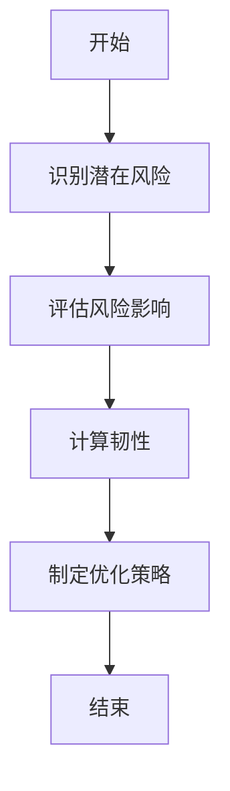
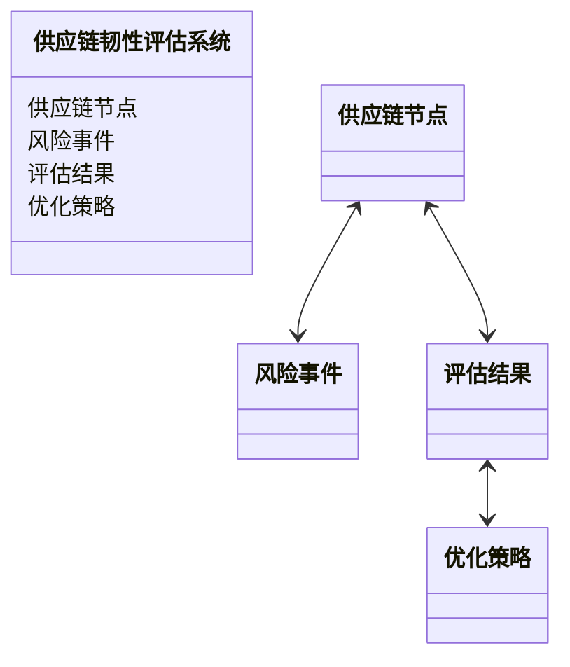

                 


# 彼得林奇对公司供应链韧性定量评估方法

> 关键词：供应链韧性，定量评估，彼得林奇，供应链风险管理，企业竞争力

> 摘要：本文将介绍彼得林奇在供应链韧性定量评估方法方面的思想和实践，通过详细分析供应链韧性的定义、核心概念、算法原理、系统架构、实战案例以及总结与展望，帮助读者理解和应用这一方法。

---

## 第一部分: 供应链韧性与定量评估概述

### # 第1章: 供应链韧性与定量评估的背景介绍

#### ## 1.1 供应链韧性的定义与重要性

##### ### 1.1.1 供应链的基本概念与组成部分

供应链是企业生产和交付产品或服务的关键过程，包括原材料采购、生产、物流、分销和客户交付等环节。供应链由供应商、制造商、分销商、零售商和客户等多个环节组成，每个环节都可能存在风险，如供应中断、物流延迟或成本波动。

##### ### 1.1.2 供应链韧性的定义与内涵

供应链韧性是指在面对不确定性（如自然灾害、疫情、供应链中断等）时，企业能够维持或快速恢复供应链稳定性的能力。它强调供应链的灵活性、适应性和恢复能力，确保企业在复杂环境中仍能有效运营。

##### ### 1.1.3 供应链韧性在企业运营中的重要性

供应链韧性直接影响企业的运营成本、交付能力、客户满意度和市场竞争力。在当今全球化和高度互联的商业环境中，供应链中断可能导致巨大损失，因此增强供应链韧性是企业战略的重要组成部分。

#### ## 1.2 供应链风险管理的现状与挑战

##### ### 1.2.1 传统供应链管理的局限性

传统供应链管理往往关注效率和成本，而忽视了风险管理和韧性建设。企业通常缺乏对潜在风险的充分识别和应对策略，导致在面对突发事件时反应迟钝，影响整体供应链稳定性。

##### ### 1.2.2 当前供应链面临的主要风险

当前供应链面临的风险包括：

- **自然灾害**：如地震、洪水等。
- **疫情**：如2020年的新冠疫情，导致全球供应链中断。
- **地缘政治风险**：如贸易摩擦、制裁等。
- **供应链复杂性**：全球化导致供应链长且复杂，增加了管理难度。
- **技术风险**：如网络安全攻击等。

##### ### 1.2.3 供应链风险管理的必要性

供应链风险管理是企业确保供应链稳定性和韧性的关键手段。通过识别、评估和应对潜在风险，企业可以降低供应链中断的可能性，提高应对突发事件的能力。

#### ## 1.3 定量评估方法的必要性与优势

##### ### 1.3.1 定量评估的定义与特点

定量评估是一种基于数据和模型的评估方法，通过量化指标和数学模型来分析和预测供应链的韧性。与定性评估相比，定量评估更加客观、科学，能够提供具体的数值支持决策。

##### ### 1.3.2 供应链韧性定量评估的必要性

供应链韧性定量评估能够帮助企业更准确地识别风险，量化风险的影响，并制定有效的应对策略。通过定量分析，企业可以优化供应链设计，提高整体供应链的稳定性和效率。

##### ### 1.3.3 定量评估方法的优势与应用场景

定量评估方法的优势包括：

- **科学性**：基于数据和模型，结果更具可信度。
- **可操作性**：能够为企业提供具体的改进方向和量化目标。
- **预见性**：通过模拟和预测，帮助企业提前应对潜在风险。

应用场景包括：

- 供应链规划与优化
- 风险评估与应对
- 供应链绩效评估
- 企业战略决策支持

---

## 第二部分: 供应链韧性定量评估的核心概念与模型

### # 第2章: 彼得林奇的供应链韧性评估理论基础

#### ## 2.1 彼得林奇投资理念的核心思想

##### ### 2.1.1 彼得林奇的投资哲学

彼得林奇是著名的投资专家，他认为投资的本质是寻找那些具有持续竞争优势的企业，并长期持有。他的投资理念强调对企业基本面的深入分析，包括财务状况、管理团队、市场地位等。

##### ### 2.1.2 彼得林奇对供应链管理的关注点

彼得林奇意识到供应链管理是企业运营的核心之一，尤其是对于制造企业来说，供应链的稳定性和效率直接影响企业的盈利能力和市场竞争力。他关注供应链的成本、效率、可靠性和灵活性。

##### ### 2.1.3 彼得林奇供应链韧性评估的核心观点

彼得林奇认为，供应链韧性是企业长期竞争优势的重要组成部分。他提出，企业应该通过定量评估方法，识别和优化供应链中的潜在风险，并制定应对策略，以提高供应链的稳定性和适应性。

#### ## 2.2 供应链风险管理的理论基础

##### ### 2.2.1 供应链风险管理的基本框架

供应链风险管理包括风险识别、风险评估、风险应对和风险监控四个阶段。企业需要系统地识别潜在风险，评估其影响，制定应对策略，并持续监控风险变化。

##### ### 2.2.2 供应链韧性与企业竞争力的关系

供应链韧性是企业竞争力的重要组成部分。具有强大供应链韧性的企业能够更快地适应市场变化，满足客户需求，提高市场占有率。同时，供应链韧性还能降低企业的运营风险，提高整体盈利能力。

##### ### 2.2.3 供应链韧性评估的理论模型

供应链韧性评估的理论模型通常包括以下几个维度：

- **供应弹性**：企业快速调整供应能力的能力。
- **需求弹性**：企业快速响应客户需求的能力。
- **资源冗余**：企业拥有的备用资源和应急计划。
- **信息透明度**：企业对供应链各环节信息的掌握程度。

#### ## 2.3 彼得林奇供应链韧性评估方法的创新性

##### ### 2.3.1 方法的创新点与突破点

彼得林奇的供应链韧性评估方法结合了定量分析和实际操作，注重数据驱动的决策支持。他提出了一套基于关键绩效指标（KPI）的评估体系，能够帮助企业量化供应链的韧性，并制定具体的改进措施。

##### ### 2.3.2 方法的适用性与局限性

彼得林奇的方法适用于大多数行业，尤其是制造和零售行业。然而，其局限性在于需要大量的数据支持和复杂的模型计算，对于数据资源有限的小企业可能不够实用。

##### ### 2.3.3 方法在实际应用中的价值

通过彼得林奇的方法，企业能够系统地评估供应链韧性，识别潜在风险，并制定有效的应对策略。这种方法不仅能够提高供应链的稳定性，还能优化供应链的整体效率，降低成本。

---

## 第三部分: 供应链韧性定量评估的核心概念与模型

### # 第3章: 供应链韧性评估的核心概念与联系

#### ## 3.1 核心概念与属性特征对比

##### ### 3.1.1 核心概念对比表格

以下是核心概念对比的表格：

| 概念       | 定义                                                                 |
|------------|----------------------------------------------------------------------|
| 供应链韧性 | 供应链在面对突发事件时维持稳定性的能力。                              |
| 供应链风险 | 可能影响供应链稳定性的各种潜在问题。                                |
| 供应链弹性 | 供应链快速调整以适应变化的能力。                                    |
| 供应链冗余 | 供应链中的备用资源和应急计划。                                      |
| 供应链透明度 | 企业对供应链各环节信息的掌握程度。                                |

##### ### 3.1.2 ER实体关系图架构

以下是供应链韧性评估的ER实体关系图：

```mermaid
erd
    左侧：供应链韧性
    中间：供应链节点
    右侧：风险事件
    供应链韧性与供应链节点通过“评估结果”关联
    供应链节点与风险事件通过“影响程度”关联
```

---

## 第四部分: 供应链韧性评估的算法原理

### # 第4章: 供应链韧性评估的算法原理

#### ## 4.1 算法原理讲解

##### ### 4.1.1 供应链韧性评估模型

供应链韧性评估模型是一个多层次的数学模型，包括以下几个步骤：

1. **风险识别**：识别供应链中的潜在风险。
2. **风险评估**：评估每个风险的影响程度和发生的概率。
3. **韧性计算**：根据风险评估结果，计算供应链的整体韧性。
4. **优化策略**：根据评估结果，制定优化策略，提高供应链韧性。

##### ### 4.1.2 数学模型与公式

供应链韧性（SR）的计算公式如下：

$$
SR = \sum_{i=1}^{n} (1 - \frac{R_i}{M_i})
$$

其中，$R_i$ 表示第 $i$ 个风险的影响程度，$M_i$ 表示第 $i$ 个风险的最大影响程度，$n$ 表示风险的数量。

##### ### 4.1.3 算法流程图

以下是供应链韧性评估算法的流程图：



---

## 第五部分: 供应链韧性评估的系统架构与设计

### # 第5章: 供应链韧性评估的系统架构与设计

#### ## 5.1 系统功能设计

##### ### 5.1.1 领域模型设计

以下是供应链韧性评估系统的领域模型：



##### ### 5.1.2 系统架构设计

以下是供应链韧性评估系统的架构图：

```mermaid
client
    client --> Web层
    Web层 --> 服务层
    服务层 --> 数据库层
```

##### ### 5.1.3 接口设计

以下是供应链韧性评估系统的接口设计：

```mermaid
sequenceDiagram
    client ->+> Web层: 发送请求
    Web层 ->+> 服务层: 调用服务
    服务层 ->+> 数据库层: 查询数据
    数据库层 --> 服务层: 返回数据
    服务层 --> Web层: 返回数据
    Web层 --> client: 返回响应
```

---

## 第六部分: 供应链韧性评估的项目实战

### # 第6章: 供应链韧性评估的项目实战

#### ## 6.1 环境安装与配置

##### ### 6.1.1 安装Python环境

安装Python和必要的库：

```bash
pip install numpy pandas matplotlib
```

#### ## 6.2 核心代码实现

##### ### 6.2.1 风险评估代码

以下是风险评估的Python代码：

```python
import numpy as np
import pandas as pd

def calculate_supply_chain_risk(risk_factors):
    # 计算每个风险因素的权重
    weights = np.array([0.3, 0.2, 0.1, 0.4])
    # 计算风险影响程度
    risk_impact = np.dot(risk_factors, weights)
    return risk_impact

# 示例数据
risk_factors = np.array([0.8, 0.6, 0.7, 0.5])
print("风险影响程度:", calculate_supply_chain_risk(risk_factors))
```

##### ### 6.2.2 韧性计算代码

以下是韧性计算的Python代码：

```python
import numpy as np

def calculate_supply_chain_resilience(risk_impacts):
    # 计算供应链韧性
    resilience = 1 - np.mean(risk_impacts)
    return resilience

# 示例数据
risk_impacts = np.array([0.6, 0.5, 0.7, 0.4])
print("供应链韧性:", calculate_supply_chain_resilience(risk_impacts))
```

#### ## 6.3 项目总结

通过上述代码，我们可以看到，彼得林奇的供应链韧性评估方法能够有效地帮助企业识别和评估潜在风险，并制定相应的优化策略。这种方法不仅能够提高供应链的稳定性，还能降低成本和风险。

---

## 第七部分: 总结与展望

### # 第7章: 总结与展望

#### ## 7.1 总结

通过本文的详细分析，我们可以看到彼得林奇的供应链韧性定量评估方法是一种科学、系统的方法，能够帮助企业识别和应对供应链中的潜在风险，提高供应链的稳定性和韧性。这种方法不仅适用于大型企业，也适用于中小型企业。

#### ## 7.2 展望

未来，随着人工智能和大数据技术的发展，供应链韧性评估方法将更加智能化和精准化。企业可以通过数据驱动的决策支持，进一步优化供应链管理，提高整体竞争力。

---

## 第八部分: 最佳实践与注意事项

### # 第8章: 最佳实践与注意事项

#### ## 8.1 最佳实践

- **数据驱动**：尽量利用实时数据进行供应链韧性评估。
- **持续监控**：定期评估和更新供应链韧性评估结果。
- **团队协作**：供应链韧性评估需要多个部门的协作。

#### ## 8.2 注意事项

- **数据质量**：确保数据的准确性和完整性。
- **模型选择**：根据企业实际情况选择合适的评估模型。
- **风险管理**：制定有效的风险应对策略。

---

## 作者：AI天才研究院/AI Genius Institute & 禅与计算机程序设计艺术 /Zen And The Art of Computer Programming

---

通过以上思考和分析，我希望能够为读者提供一篇内容详实、结构清晰的技术博客文章，深入探讨彼得林奇的供应链韧性定量评估方法，并结合实际案例和代码实现，帮助读者更好地理解和应用这一方法。

