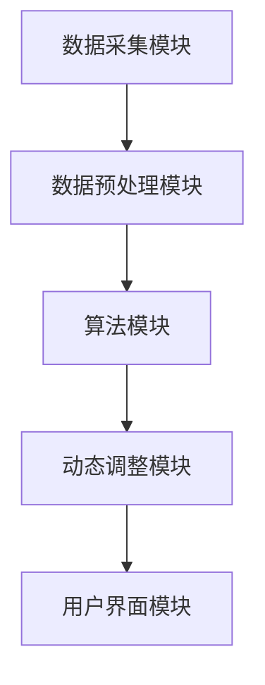
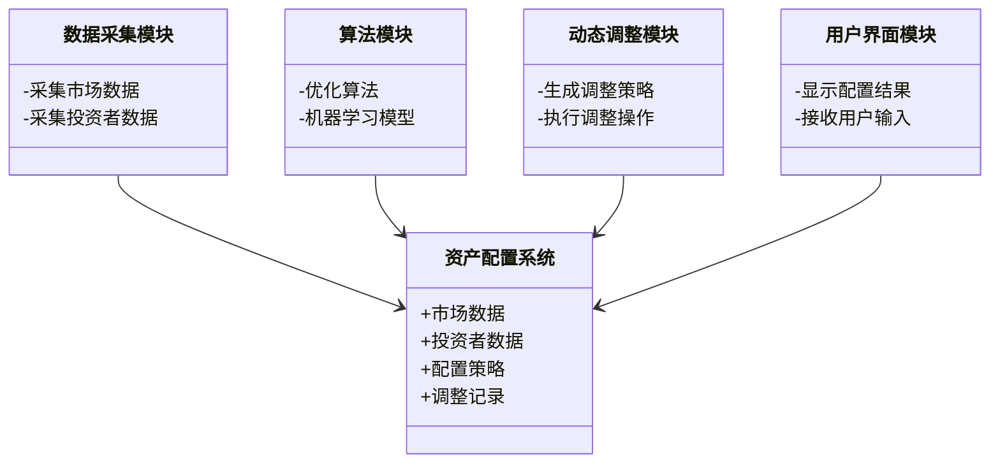
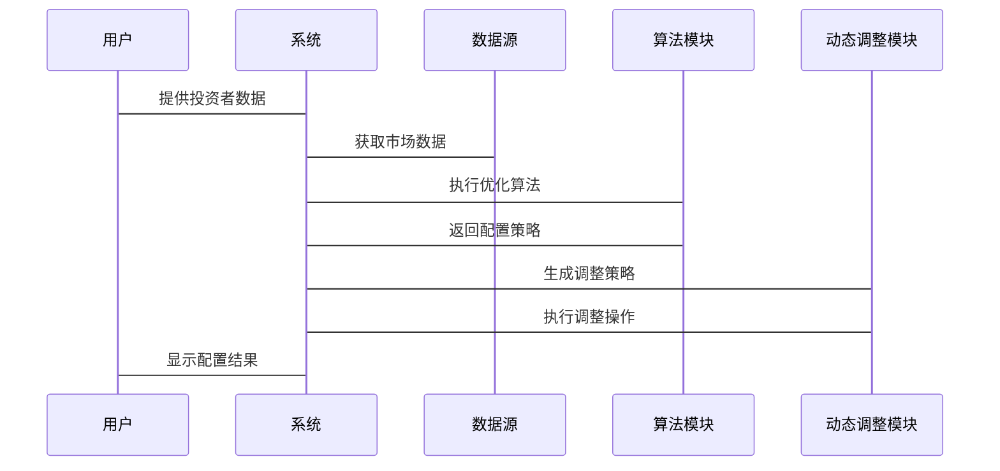

                 


# 《智能资产配置动态调整系统》

---

## 关键词

- 智能资产配置
- 动态调整系统
- 优化算法
- 风险管理
- 机器学习
- 系统架构设计

---

## 摘要

智能资产配置动态调整系统是一种基于智能化技术的资产配置方法，旨在通过动态调整投资组合来优化风险收益比。本文从背景、核心概念、算法原理、系统架构设计、项目实战等多方面详细阐述智能资产配置动态调整系统的核心思想和实现方法。通过结合优化算法和机器学习技术，本文提出了一种高效的资产配置动态调整方案，并通过实际案例分析验证了其有效性和可行性。

---

# 第1章: 智能资产配置动态调整系统概述

## 1.1 资产配置的基本概念

### 1.1.1 资产配置的定义与核心要素

资产配置是指将资金分配到不同资产类别（如股票、债券、房地产等）中的过程，以实现投资目标。核心要素包括：

1. **资产类别**：股票、债券、现金等。
2. **权重分配**：各资产类别的配置比例。
3. **投资目标**：收益、风险、流动性等。
4. **时间框架**：短期、中期、长期。

### 1.1.2 资产配置的目标与意义

- **目标**：最大化收益，最小化风险，实现资产的长期增值。
- **意义**：分散风险，优化收益，适应市场变化。

### 1.1.3 动态调整的必要性与应用场景

动态调整是指根据市场变化和投资者风险偏好调整资产配置比例。应用场景包括：

1. **市场波动**：如经济危机、市场崩盘。
2. **风险偏好变化**：投资者风险承受能力的变化。
3. **资产类别表现差异**：不同资产类别的表现不一致。

## 1.2 智能资产配置的背景与现状

### 1.2.1 传统资产配置方法的局限性

- **静态配置**：无法适应市场变化。
- **计算复杂**：手动调整效率低。
- **缺乏个性化**：难以满足不同投资者的需求。

### 1.2.2 智能化技术在资产配置中的应用趋势

- **机器学习**：用于预测资产收益和风险。
- **大数据分析**：利用海量数据优化配置。
- **自动化工具**：实现自动化的动态调整。

### 1.2.3 当前市场环境下的智能资产配置需求

- **复杂市场环境**：需要实时动态调整。
- **个性化投资**：满足不同投资者需求。
- **高效性**：提高配置效率，降低成本。

## 1.3 智能资产配置动态调整系统的核心价值

### 1.3.1 提高资产配置效率

通过智能化算法快速调整配置比例，减少人为干预。

### 1.3.2 优化风险收益比

通过动态调整，降低风险，提高收益。

### 1.3.3 实现个性化投资策略

根据投资者风险偏好和市场环境定制配置方案。

## 1.4 本章小结

---

# 第2章: 智能资产配置的核心概念与原理

## 2.1 资产配置模型与动态调整机制

### 2.1.1 基于均值-方差模型的传统配置方法

均值-方差模型通过优化投资组合的收益与风险，找到最优配置比例。

### 2.1.2 基于现代投资组合理论的优化方法

现代投资组合理论（MPT）通过最大化收益，最小化风险，找到最优配置。

### 2.1.3 基于机器学习的智能配置模型

机器学习模型通过历史数据和市场特征，预测资产收益和风险，优化配置。

### 2.1.4 资产配置模型对比

| 模型类型         | 优点               | 缺点               |
|------------------|--------------------|--------------------|
| 均值-方差模型     | 简单易懂           | 无法考虑非线性关系   |
| 现代投资组合理论   | 考虑风险分散       | 计算复杂           |
| 机器学习模型     | 高精度预测         | 需大量数据支持       |

### 2.2 动态调整机制的原理

动态调整机制根据市场变化和投资者需求，实时调整配置比例。

### 2.2.1 动态调整的核心逻辑

- **市场监控**：实时监控市场变化。
- **风险评估**：评估当前配置的风险。
- **调整决策**：根据评估结果调整配置比例。

### 2.2.2 市场环境变化对资产配置的影响

- **经济周期**：经济增长期增加股票配置，衰退期增加债券配置。
- **市场波动**：高波动市场减少高风险资产配置。
- **资产类别表现**：表现不佳的资产类别需要调整。

### 2.2.3 风险偏好变化对配置策略的调整

- **风险厌恶型投资者**：增加低风险资产配置。
- **风险偏好型投资者**：增加高风险资产配置。

## 2.2 智能资产配置与风险管理

### 2.2.1 风险评估与量化

- **风险评估**：通过历史数据和市场特征预测风险。
- **风险量化**：使用标准差、VaR等指标量化风险。

### 2.2.2 动态调整中的风险管理策略

- **风险对冲**：通过衍生品对冲部分风险。
- **分散投资**：通过分散投资降低风险。
- **动态再平衡**：定期调整配置比例以维持目标风险水平。

### 2.2.3 风险与收益的平衡优化

通过优化算法找到风险与收益的最佳平衡点。

---

## 2.3 本章小结

---

# 第3章: 智能资产配置的算法原理与实现

## 3.1 基于优化算法的资产配置模型

### 3.1.1 基于遗传算法的优化方法

遗传算法是一种模拟生物进化的过程的优化算法，适用于复杂的非线性优化问题。

### 3.1.2 基于粒子群优化的配置策略

粒子群优化是一种基于群体智能的优化算法，适用于多目标优化问题。

### 3.1.3 基于模拟退火的全局优化

模拟退火是一种全局优化算法，适用于避免陷入局部最优的情况。

### 3.2 基于机器学习的智能配置算法

### 3.2.1 基于神经网络的资产定价模型

神经网络通过学习历史数据，预测资产价格走势。

### 3.2.2 基于强化学习的投资决策算法

强化学习通过模拟投资环境，优化投资决策。

### 3.2.3 基于聚类分析的资产类别划分

聚类分析将相似的资产分为一类，便于配置。

## 3.3 动态调整算法的实现步骤

### 3.3.1 数据采集与预处理

- **数据来源**：市场数据、历史数据、投资者数据。
- **数据预处理**：清洗、标准化、特征提取。

### 3.3.2 算法模型的训练与优化

- **模型训练**：使用历史数据训练模型。
- **模型优化**：通过交叉验证优化模型参数。

### 3.3.3 动态调整策略的生成与执行

- **策略生成**：根据市场变化生成调整策略。
- **策略执行**：自动执行调整操作。

## 3.4 算法实现的代码示例

### 3.4.1 基于Python的优化算法实现

```python
import numpy as np
from scipy.optimize import minimize

# 定义目标函数
def portfolio_variance(weights, covariance_matrix):
    return np.dot(weights.T, np.dot(covariance_matrix, weights))

# 定义约束条件
def weight_sum(weights):
    return np.sum(weights) - 1

# 初始权重
initial_weights = [0.3, 0.3, 0.4]

# 使用 scipy.optimize.minimize 进行优化
result = minimize(portfolio_variance, initial_weights, args=(covariance_matrix,), 
                  method='SLSQP', constraints={'type': 'eq', 'fun': weight_sum})

# 输出优化后的权重
print(result.x)
```

### 3.4.2 基于机器学习的配置模型代码

```python
from sklearn.linear_model import LinearRegression

# 数据准备
X = ... # 特征矩阵
y = ... # 标签

# 模型训练
model = LinearRegression()
model.fit(X, y)

# 预测
y_pred = model.predict(X)
```

## 3.5 本章小结

---

# 第4章: 智能资产配置系统的架构与实现

## 4.1 系统架构设计

### 4.1.1 系统功能模块划分

- **数据采集模块**：采集市场数据和投资者数据。
- **算法模块**：实现优化算法和机器学习模型。
- **动态调整模块**：根据评估结果调整配置比例。
- **用户界面模块**：提供可视化界面供投资者操作。

### 4.1.2 系统架构图



### 4.2 系统功能设计

#### 4.2.1 领域模型



### 4.3 系统接口设计

- **API接口**：提供RESTful API供其他系统调用。
- **数据接口**：与数据源（如股票交易系统）对接。

### 4.4 系统交互流程



## 4.5 本章小结

---

# 第5章: 项目实战

## 5.1 环境配置与数据准备

### 5.1.1 环境安装

- **Python**：安装Python 3.x。
- **库依赖**：安装numpy、pandas、scipy、sklearn等库。

```bash
pip install numpy pandas scipy sklearn
```

### 5.1.2 数据来源

- **市场数据**：股票价格、债券收益率等。
- **投资者数据**：风险偏好、投资目标等。

## 5.2 核心代码实现

### 5.2.1 数据预处理

```python
import pandas as pd

# 读取数据
data = pd.read_csv('market_data.csv')

# 数据清洗
data.dropna(inplace=True)

# 特征提取
features = data[['stock_return', 'bond_return', 'cash_return']]
```

### 5.2.2 优化算法实现

```python
from scipy.optimize import minimize

# 定义目标函数
def portfolio_variance(weights, covariance_matrix):
    return np.dot(weights.T, np.dot(covariance_matrix, weights))

# 初始权重
initial_weights = [0.3, 0.3, 0.4]

# 使用 scipy.optimize.minimize 进行优化
result = minimize(portfolio_variance, initial_weights, args=(covariance_matrix,), 
                  method='SLSQP', constraints={'type': 'eq', 'fun': lambda w: np.sum(w)-1})

# 输出优化后的权重
print(result.x)
```

### 5.2.3 机器学习模型实现

```python
from sklearn.linear_model import LinearRegression

# 数据准备
X = features
y = data['market_return']

# 模型训练
model = LinearRegression()
model.fit(X, y)

# 预测
y_pred = model.predict(X)
```

## 5.3 案例分析与实际应用

### 5.3.1 案例分析

假设市场数据如下：

| 股票收益 | 债券收益 | 现金收益 |
|----------|----------|----------|
| 0.1      | 0.05     | 0.02     |
| 0.08     | 0.04     | 0.01     |
| 0.12     | 0.06     | 0.03     |

通过优化算法计算得到的最优配置比例为：股票40%，债券30%，现金30%。

### 5.3.2 系统实现

根据优化结果生成动态调整策略，并自动执行调整操作。

## 5.4 项目小结

---

# 第6章: 最佳实践与注意事项

## 6.1 最佳实践

### 6.1.1 数据质量

确保数据来源可靠，数据清洗充分。

### 6.1.2 模型选择

根据实际需求选择合适的模型和算法。

### 6.1.3 系统维护

定期更新模型和数据，确保系统稳定运行。

## 6.2 注意事项

### 6.2.1 风险管理

动态调整过程中要时刻关注风险。

### 6.2.2 系统安全性

确保系统数据安全，防止数据泄露。

### 6.2.3 法律合规

遵守相关法律法规，确保系统合法运行。

## 6.3 拓展阅读

推荐阅读以下书籍和论文：

- 《投资学》（Paul W. Gew往尔著）
- 《机器学习实战》（Aurélien Géron著）
- 《智能投资组合理论与算法优化》（张某某等著）

---

# 第7章: 小结与展望

## 7.1 本章小结

智能资产配置动态调整系统通过结合优化算法和机器学习技术，实现了高效、个性化的资产配置。本文从背景、核心概念、算法原理、系统架构设计、项目实战等多个方面详细阐述了系统的实现方法。

## 7.2 未来展望

未来，智能资产配置动态调整系统将在以下几个方面进一步发展：

1. **多目标优化**：实现多个目标的优化配置。
2. **实时交易**：实现实时市场数据的处理和调整。
3. **个性化服务**：提供更加个性化的投资策略。
4. **风险管理**：进一步完善风险评估和对冲机制。

---

# 作者：AI天才研究院/AI Genius Institute & 禅与计算机程序设计艺术 /Zen And The Art of Computer Programming

