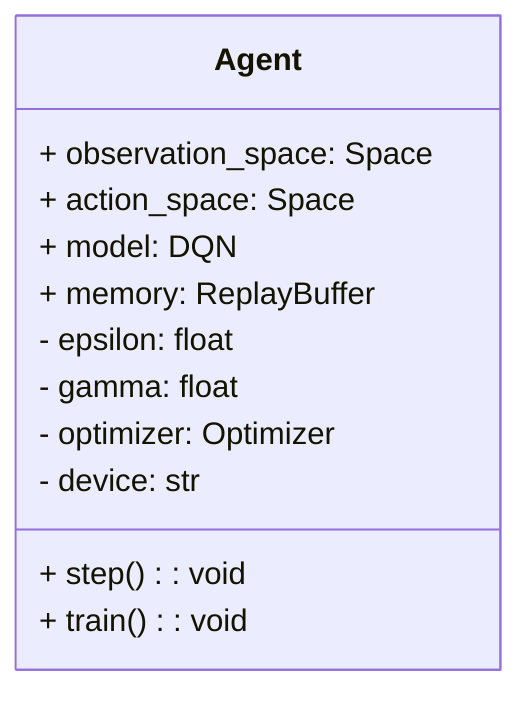
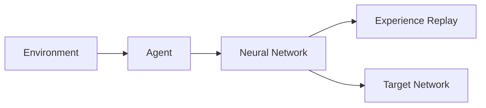

                 


# 《构建具有深度强化学习能力的AI Agent》

---

## 关键词

- 深度强化学习
- AI Agent
- 算法原理
- 系统架构
- 项目实战

---

## 摘要

本文旨在深入探讨如何构建一个具有深度强化学习能力的AI Agent。通过从背景介绍、核心概念、算法原理、系统架构设计到项目实战的全面解析，结合理论与实践，帮助读者掌握构建AI Agent的关键技术。文章不仅详细讲解了深度强化学习的基本原理，还通过实际案例展示了如何将这些原理应用于AI Agent的构建中，最后总结了最佳实践和未来研究方向。

---

## 第一部分：背景介绍

### 第1章：深度强化学习与AI Agent概述

#### 1.1 深度强化学习的基本概念

**1.1.1 强化学习的定义与特点**

强化学习（Reinforcement Learning, RL）是一种机器学习范式，其中智能体通过与环境交互来学习策略，以最大化累积奖励。其特点包括：

- **环境交互**：智能体通过与环境互动获得经验。
- **奖励驱动**：智能体的目标是通过最大化累积奖励来学习最优策略。
- **延迟回报**：奖励可能在多个动作之后才给出，需要考虑长期利益。

**1.1.2 深度强化学习的引入与优势**

深度强化学习（Deep Reinforcement Learning, DRL）将深度学习与强化学习结合，利用神经网络处理高维状态空间。其优势包括：

- **处理高维输入**：深度学习擅长处理图像、语音等高维数据。
- **端到端学习**：直接从输入到输出，无需手动特征提取。
- **复杂决策**：适用于复杂决策问题。

**1.1.3 AI Agent的基本概念与分类**

AI Agent是一个能够感知环境并采取行动以实现目标的智能体。分类包括：

- **反应式Agent**：基于当前感知做出反应。
- **基于模型的Agent**：维护环境模型以进行规划。
- **基于目标的Agent**：根据目标选择行动。

#### 1.2 AI Agent的应用场景与挑战

**1.2.1 AI Agent在游戏、机器人和自动驾驶中的应用**

- **游戏AI**：在游戏如《星际争霸》中实现复杂决策。
- **机器人控制**：用于工业机器人和家庭服务机器人。
- **自动驾驶**：用于车辆路径规划和决策控制。

**1.2.2 深度强化学习在AI Agent构建中的挑战**

- **计算资源需求**：需要大量计算资源进行训练。
- **算法复杂性**：复杂算法实现难度大。
- **环境多样性**：需要处理多种复杂环境。

**1.2.3 当前研究与产业界的热点问题**

- **多智能体协作**：研究多个AI Agent协作。
- **安全与伦理**：确保AI Agent行为符合伦理规范。
- **实时决策**：提升决策速度以应对实时场景。

#### 1.3 本书的目标与结构

**1.3.1 本书的核心目标**

- 掌握深度强化学习的基本原理。
- 学会构建基于深度强化学习的AI Agent。
- 理解AI Agent的系统架构设计。

**1.3.2 本书的章节安排与内容概览**

- 第二部分：核心概念与联系
- 第三部分：算法原理讲解
- 第四部分：系统架构设计
- 第五部分：项目实战
- 第六部分：最佳实践与扩展阅读

---

## 第二部分：核心概念与联系

### 第2章：深度强化学习的核心原理

#### 2.1 强化学习的基本原理

**2.1.1 状态、动作、奖励的定义**

- **状态（State）**：环境在某一时刻的观测。
- **动作（Action）**：智能体采取的行为。
- **奖励（Reward）**：智能体采取动作后获得的反馈。

**2.1.2 Q-learning算法的原理与流程**

Q-learning是一种经典的强化学习算法，通过更新Q表（Q-value）来学习最优策略。其流程包括：

1. 初始化Q表。
2. 与环境交互，获取状态和奖励。
3. 更新Q值：Q(s, a) = Q(s, a) + α(r + γ·max Q(s', a'))，其中α是学习率，γ是折扣因子。

**2.1.3 策略梯度方法的简介**

策略梯度方法直接优化策略，通过计算梯度更新参数。常用算法包括：

- **REINFORCE算法**：基于最大概率策略进行采样。
- **Actor-Critic算法**：结合价值函数和策略函数进行优化。

#### 2.2 深度强化学习的数学模型

**2.2.1 状态值函数的数学表达**

状态值函数V(s)表示从状态s开始的期望累积奖励：

$$ V(s) = E[G_t | s_t = s] $$

**2.2.2 动作值函数的数学表达**

动作值函数Q(s, a)表示从状态s采取动作a后的期望累积奖励：

$$ Q(s, a) = E[G_t | s_t = s, a_t = a] $$

**2.2.3 策略函数的数学表达**

策略函数π(a|s)表示在状态s下采取动作a的概率：

$$ π(a|s) = P(a_t = a | s_t = s) $$

#### 2.3 深度强化学习与AI Agent的关系

**2.3.1 深度强化学习作为AI Agent的核心算法**

深度强化学习通过神经网络处理复杂状态，提供决策支持。

**2.3.2 AI Agent的决策过程与深度强化学习的结合**

AI Agent通过深度强化学习模型进行状态感知和动作选择，实现自主决策。

**2.3.3 深度强化学习在AI Agent中的应用优势**

- **复杂任务处理**：适用于高维状态和动作空间。
- **自适应学习**：能根据环境变化调整策略。
- **端到端优化**：直接优化从输入到输出的决策过程。

---

## 第三部分：算法原理讲解

### 第3章：深度强化学习算法详解

#### 3.1 DQN算法原理

**3.1.1 DQN算法的结构**

DQN由深度神经网络近似Q值函数，包含经验回放和目标网络。

**3.1.2 DQN算法的实现**

1. 初始化经验回放池和目标网络。
2. 与环境交互，记录经验。
3. 采样经验，计算目标值和当前值。
4. 更新主网络权重以最小化损失。

**3.1.3 DQN算法的代码实现**

```python
import gym
import numpy as np
import torch
import torch.nn as nn
import torch.optim as optim

class DQN(nn.Module):
    def __init__(self, input_dim, output_dim):
        super(DQN, self).__init__()
        self.fc1 = nn.Linear(input_dim, 64)
        self.fc2 = nn.Linear(64, output_dim)
    
    def forward(self, x):
        x = x.float()
        x = torch.relu(self.fc1(x))
        x = self.fc2(x)
        return x

env = gym.make('CartPole-v0')
input_dim = env.observation_space.shape[0]
output_dim = env.action_space.n
model = DQN(input_dim, output_dim)
optimizer = optim.Adam(model.parameters(), lr=0.001)
```

---

## 第四部分：系统架构设计

### 第4章：AI Agent的系统架构

#### 4.1 项目介绍

本项目旨在构建一个基于深度强化学习的AI Agent，应用于游戏AI开发。

#### 4.2 系统功能设计

**4.2.1 领域模型设计**

使用mermaid类图展示系统各组件关系：



#### 4.3 系统架构设计

**4.3.1 系统架构图**

使用mermaid架构图展示系统架构：



---

## 第五部分：项目实战

### 第5章：AI Agent的实现与测试

#### 5.1 环境安装与配置

- 安装Python和相关库：`pip install gym torch numpy`
- 配置运行环境：选择合适的强化学习库和框架。

#### 5.2 系统核心实现源代码

```python
import gym
import numpy as np
import torch
import torch.nn as nn
import torch.optim as optim

class DQN(nn.Module):
    def __init__(self, input_dim, output_dim):
        super(DQN, self).__init__()
        self.fc1 = nn.Linear(input_dim, 64)
        self.fc2 = nn.Linear(64, output_dim)
    
    def forward(self, x):
        x = x.float()
        x = torch.relu(self.fc1(x))
        x = self.fc2(x)
        return x

class ReplayBuffer:
    def __init__(self, capacity):
        self.capacity = capacity
        self.buffer = []
    
    def push(self, transition):
        self.buffer.append(transition)
        if len(self.buffer) > self.capacity:
            self.buffer.pop(0)
    
    def sample(self, batch_size):
        idx = np.random.randint(len(self.buffer), size=batch_size)
        transitions = [self.buffer[i] for i in idx]
        return transitions

def train(agent, env, num_episodes=1000, batch_size=32, gamma=0.99, epsilon=0.1):
    for episode in range(num_episodes):
        state = env.reset()
        done = False
        total_reward = 0
        while not done:
            action = agent.act(state, epsilon)
            next_state, reward, done, _ = env.step(action)
            agent.memories.push((state, action, reward, next_state, done))
            if len(agent.memories.buffer) >= batch_size:
                batch = agent.memories.sample(batch_size)
                states = torch.tensor([t[0] for t in batch], dtype=torch.float32)
                actions = torch.tensor([t[1] for t in batch], dtype=torch.long)
                rewards = torch.tensor([t[2] for t in batch], dtype=torch.float32)
                next_states = torch.tensor([t[3] for t in batch], dtype=torch.float32)
                dones = torch.tensor([t[4] for t in batch], dtype=torch.float32)
                
                current_q = agent.model(states).gather(1, actions.unsqueeze(1)).squeeze(1)
                next_q = agent.target_model(next_states).max(1)[0].detach().unsqueeze(1)
                target_q = rewards + gamma * next_q * (1 - dones)
                
                loss = nn.MSELoss()(current_q, target_q)
                agent.optimizer.zero_grad()
                loss.backward()
                agent.optimizer.step()
                
                agent.target_model.load_state_dict(agent.model.state_dict())
                
            state = next_state
            total_reward += reward
        print(f"Episode {episode}, Total Reward: {total_reward}")

if __name__ == "__main__":
    env = gym.make('CartPole-v0')
    input_dim = env.observation_space.shape[0]
    output_dim = env.action_space.n
    model = DQN(input_dim, output_dim)
    target_model = DQN(input_dim, output_dim)
    target_model.load_state_dict(model.state_dict())
    optimizer = optim.Adam(model.parameters(), lr=0.001)
    memories = ReplayBuffer(10000)
    agent = {
        'model': model,
        'target_model': target_model,
        'optimizer': optimizer,
        'memories': memories,
        'epsilon': 0.1,
        'gamma': 0.99
    }
    train(agent, env)
```

#### 5.3 代码应用解读与分析

- **模型定义**：DQN网络结构，包含两个全连接层。
- **经验回放池**：存储和采样经验，用于经验重放。
- **训练函数**：实现DQN算法，包括状态感知、动作选择、奖励计算和网络更新。

#### 5.4 实际案例分析和详细讲解

- **训练过程**：智能体通过与环境交互，逐步学习最优策略。
- **结果分析**：观察奖励变化，判断训练效果。

#### 5.5 项目小结

- 成功实现DQN算法，应用于CartPole环境。
- 验证了深度强化学习在AI Agent构建中的有效性。

---

## 第六部分：最佳实践与扩展阅读

### 第6章：总结与展望

#### 6.1 最佳实践 tips

- **算法选择**：根据任务选择合适的算法。
- **超参数调优**：合理设置学习率、折扣因子等参数。
- **经验回放优化**：使用经验回放池提升学习效率。

#### 6.2 小结

- 本文详细讲解了构建深度强化学习AI Agent的全过程，包括理论、算法和实现。

#### 6.3 注意事项

- 确保环境稳定，避免干扰。
- 优化代码性能，提升训练效率。
- 处理好安全与伦理问题。

#### 6.4 拓展阅读

- 探索多智能体协作，研究安全与伦理问题。

---

## 作者

**作者：AI天才研究院/AI Genius Institute & 禅与计算机程序设计艺术 /Zen And The Art of Computer Programming**

---

**注**：由于篇幅限制，本文仅为目录和部分内容的展示。完整文章将涵盖每个部分的详细讲解，包括数学公式、代码实现和图表展示。

