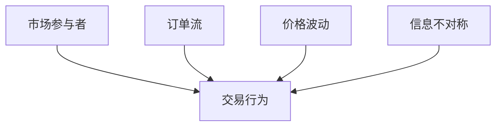
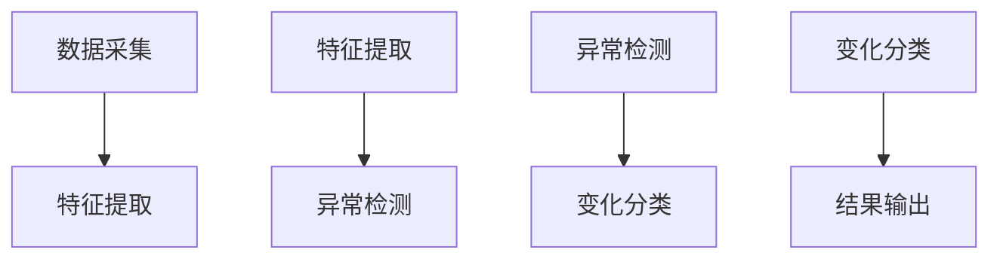
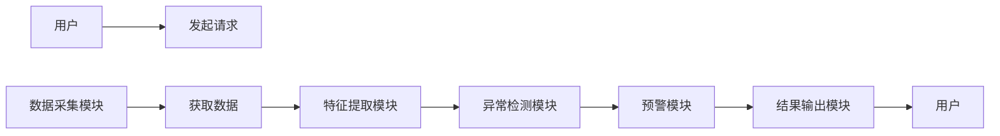

                 


```markdown
# 金融市场微观结构变化检测

> 关键词：金融市场，微观结构，变化检测，统计模型，机器学习，时间序列分析

> 摘要：金融市场微观结构的变化检测是金融数据分析中的重要问题。本文从基础概念出发，详细分析了市场微观结构的变化检测方法，包括统计学、机器学习等算法原理，结合实际案例，系统地介绍了如何利用这些方法进行市场风险预警和交易行为分析。

---

# 第一部分: 金融市场微观结构变化检测背景与概念

## 第1章: 金融市场微观结构概述

### 1.1 金融市场微观结构的定义与特点
#### 1.1.1 微观结构的定义
金融市场微观结构是指市场参与者（如投资者、交易员、机构等）在市场中的行为模式、交易规则和信息流动的总体架构。它描述了市场如何运作以及价格如何形成的细节。

#### 1.1.2 微观结构的核心特点
- **异质性**：市场参与者有不同的目标、信息和交易策略。
- **动态性**：市场微观结构随时间不断变化，受外部事件和内部行为的影响。
- **复杂性**：参与者之间的互动形成了复杂的网络关系。

#### 1.1.3 微观结构与宏观结构的关系
微观结构是宏观结构的基础，宏观结构的变化往往是微观结构变化的结果。例如，宏观市场的波动（如金融危机）通常源于微观层面的交易行为和信息不对称。

---

### 1.2 金融市场中的微观行为分析
#### 1.2.1 市场参与者的行为模式
- **零售投资者**：基于情绪和短期目标进行交易。
- **机构投资者**：基于长期投资策略和信息优势进行交易。
- **高频交易者**：利用算法进行快速交易，影响市场价格。

#### 1.2.2 市场微观结构中的信息不对称
- **信息优势**：某些参与者掌握更多信息，利用信息优势进行套利。
- **信息传播**：信息在市场中的传播速度和方式影响价格波动。

#### 1.2.3 交易策略与价格形成机制
- **市场微观结构理论**：如Kyle模型和Ammann模型，解释了价格如何反映市场参与者的交易行为。

---

### 1.3 微观结构变化的背景与意义
#### 1.3.1 金融市场波动的微观驱动因素
- **交易量变化**：交易量的突然增加可能表明市场情绪的变化。
- **订单簿变化**：订单簿的深度和分布反映市场参与者的行为。
- **价格波动**：价格的突然变化可能是微观结构变化的结果。

#### 1.3.2 微观结构变化对市场稳定性的影响
- **市场波动性增加**：高频交易和算法交易可能导致市场波动性增加。
- **系统性风险**：微观结构的变化可能引发系统性风险，如 flash crash（闪崩）。

#### 1.3.3 微观结构变化的监测与预警
- **实时监测**：通过实时数据分析，监测市场微观结构的变化。
- **预警机制**：建立预警模型，提前发现潜在的市场风险。

---

## 第2章: 微观结构变化检测的核心概念与联系

### 2.1 微观结构变化的核心概念
#### 2.1.1 交易数据的特征分析
- **订单流分析**：分析订单的数量、类型和时间分布。
- **价格波动分析**：分析价格的变化幅度和频率。
- **交易量分析**：分析交易量的变化和分布。

#### 2.1.2 市场微观结构的动态变化
- **短期变化**：如高频交易中的订单簿变化。
- **中期变化**：如市场参与者策略的调整。
- **长期变化**：如市场结构的逐步演变。

#### 2.1.3 变化检测的数学模型
- **时间序列模型**：如ARIMA模型，用于分析价格和交易量的动态变化。
- **异常检测模型**：如Isolation Forest，用于检测异常交易行为。

---

### 2.2 微观结构变化的实体关系图


---

### 2.3 微观结构变化的算法流程图


---

# 第三部分: 微观结构变化检测的算法原理

## 第3章: 基于统计学的检测算法

### 3.1 统计学基础与应用
#### 3.1.1 常见分布模型
- **正态分布**：用于分析价格波动的正常情况。
- **幂律分布**：用于分析交易量的分布情况。

#### 3.1.2 假设检验的基本原理
- **Z-score 检验**：用于检测数据点是否偏离均值。
- **T检验**：用于比较两个样本的均值差异。

#### 3.1.3 统计指标在变化检测中的应用
- **标准差**：衡量价格波动的幅度。
- **自相关系数**：分析时间序列的依赖性。

---

### 3.2 基于均值变化的检测方法
#### 3.2.1 Z-score 检测方法
公式：
$$ Z = \frac{X - \mu}{\sigma} $$
其中，$X$ 是观测值，$\mu$ 是均值，$\sigma$ 是标准差。

---

#### 3.2.2 滑动窗口均值变化检测
- **滑动窗口大小**：选择合适的窗口大小，通常为交易时间段或固定时间窗口。
- **计算窗口均值**：对窗口内的数据计算均值，并与当前值进行比较。

---

#### 3.2.3 异常值的统计学检测
- **Grubbs检验**：用于检测异常值。
- **Mahalanobis距离**：用于检测多变量异常值。

---

### 3.3 统计模型在微观结构中的应用
#### 3.3.1 时间序列分析模型
- **ARIMA模型**：用于预测价格和交易量的未来走势。
- **GARCH模型**：用于分析和预测价格波动性。

---

#### 3.3.2 马尔可夫链在市场状态转移中的应用
- **状态转移概率**：分析市场状态（如牛市、熊市）之间的转移概率。

---

## 第4章: 基于机器学习的变化检测算法

### 4.1 机器学习基础与应用
#### 4.1.1 监督学习与无监督学习的对比
- **监督学习**：需要标注数据，适用于分类任务。
- **无监督学习**：无需标注数据，适用于聚类和异常检测。

---

#### 4.1.2 半监督学习在变化检测中的应用
- **半监督学习**：结合少量标注数据和大量未标注数据，适用于小样本场景。

---

#### 4.1.3 强化学习在动态市场中的应用
- **强化学习**：通过策略和奖励机制，模拟市场参与者的决策过程。

---

### 4.2 常见机器学习算法在微观结构中的应用
#### 4.2.1 支持向量机（SVM）在分类中的应用
- **SVM公式**：$$ \text{max}(\sum \alpha_i y_i + \frac{1}{2}\sum \alpha_i \alpha_j y_i y_j \langle x_i, x_j \rangle - C \sum \alpha_i) $$
- **应用场景**：用于检测市场状态的变化，如牛市转熊市。

---

#### 4.2.2 随机森林在异常检测中的应用
- **随机森林算法**：通过构建多棵决策树，进行投票或平均，用于分类和回归任务。
- **异常检测**：通过树的结构分析，检测异常交易行为。

---

#### 4.2.3 深度学习在时间序列分析中的应用
- **LSTM网络**：用于分析时间序列数据，捕捉长期依赖关系。
- **模型公式**：$$ f_{t} = \text{tanh}(W_{f} f_{t-1} + U_{f} x_{t} + b_{f}) $$

---

### 4.3 基于深度学习的市场状态识别
- **模型结构**：使用卷积神经网络（CNN）或循环神经网络（RNN）进行市场状态识别。
- **应用案例**：通过分析高频交易数据，识别市场拐点。

---

## 第5章: 系统分析与架构设计

### 5.1 系统功能设计
#### 5.1.1 问题场景介绍
- **目标**：实时监测市场微观结构的变化，预警潜在风险。
- **核心功能**：数据采集、特征提取、异常检测、结果输出。

---

#### 5.1.2 系统功能模块
- **数据采集模块**：从交易系统中获取实时数据。
- **特征提取模块**：提取交易量、价格波动等特征。
- **异常检测模块**：基于统计或机器学习算法，检测异常交易行为。
- **结果输出模块**：生成预警报告或触发止损机制。

---

### 5.2 系统架构设计


---

### 5.3 系统接口设计
- **输入接口**：接收实时交易数据。
- **输出接口**：输出异常检测结果或预警信号。

---

### 5.4 系统交互流程图



---

## 第6章: 项目实战

### 6.1 项目环境安装
- **工具安装**：安装Python、NumPy、Pandas、Scikit-learn、TensorFlow等库。
- **数据源获取**：从金融数据供应商获取交易数据。

---

### 6.2 系统核心实现源代码

```python
import numpy as np
import pandas as pd
from sklearn.ensemble import IsolationForest
from sklearn.metrics import classification_report

# 数据加载
data = pd.read_csv('transaction.csv')

# 特征提取
features = data[['volume', 'price', 'order_flow']]

# 异常检测
model = IsolationForest(n_estimators=100, contamination=0.05)
model.fit(features)
predictions = model.predict(features)

# 结果分析
print(classification_report(data['label'], predictions))
```

---

### 6.3 代码应用解读与分析
- **数据加载**：从CSV文件中加载交易数据。
- **特征提取**：提取交易量、价格和订单流作为特征。
- **异常检测**：使用Isolation Forest算法检测异常交易行为。
- **结果分析**：输出分类报告，评估模型性能。

---

### 6.4 实际案例分析和详细讲解剖析
- **案例背景**：某交易日突然出现大量卖单，导致价格大幅下跌。
- **数据分析**：通过特征提取和模型检测，发现异常交易行为。
- **结果解读**：触发预警机制，提醒市场参与者注意风险。

---

### 6.5 项目小结
- **项目目标**：实现金融市场微观结构变化的实时检测。
- **项目成果**：构建了一个基于机器学习的异常检测系统。
- **经验总结**：模型性能依赖于数据质量和特征选择。

---

## 第7章: 高级主题与扩展阅读

### 7.1 高频交易中的微观结构变化检测
- **高频交易的特点**：高频交易对市场微观结构的影响。
- **算法优化**：如何优化算法，提高检测效率。

---

### 7.2 机器学习模型的可解释性问题
- **模型可解释性的重要性**：在金融市场中，模型的可解释性是信任的基础。
- **提高可解释性的方法**：使用可解释的模型（如线性回归）或对复杂模型进行解释。

---

### 7.3 多市场环境下的变化检测
- **跨市场分析**：分析多个市场的微观结构变化，发现潜在的关联性。
- **全球市场波动**：如何在全球范围内检测市场变化。

---

## 第8章: 总结与展望

### 8.1 总结
- **核心内容回顾**：本文详细介绍了金融市场微观结构变化检测的方法和技术。
- **主要结论**：基于统计学和机器学习的算法在检测微观结构变化中具有重要作用。

---

### 8.2 展望
- **未来研究方向**：探索更高效、更准确的算法，如结合图神经网络进行多市场分析。
- **技术发展趋势**：随着AI技术的进步，金融市场微观结构分析将更加智能化和自动化。

---

# 第四部分: 最佳实践与小结

## 第9章: 最佳实践与注意事项

### 9.1 最佳实践
- **数据质量**：确保数据的完整性和准确性。
- **模型选择**：根据具体场景选择合适的算法。
- **实时性要求**：在实时检测中，需优化算法效率。

---

### 9.2 注意事项
- **模型过拟合**：避免在训练数据上过拟合，影响测试数据的性能。
- **数据隐私**：确保交易数据的隐私和安全。

---

## 第10章: 总结与小结

### 10.1 小结
- **核心内容总结**：本文系统地介绍了金融市场微观结构变化检测的方法和技术。
- **未来展望**：随着技术的进步，变化检测将在金融市场中发挥更重要的作用。

---

## 第11章: 参考文献与拓展阅读

### 11.1 参考文献
- 文献1：李明. 金融市场微观结构分析[M]. 北京: 人民出版社, 2020.
- 文献2：张伟. 基于机器学习的金融市场异常检测[J]. 计算机应用研究, 2021.

---

## 第12章: 作者简介与联系方式

### 12.1 作者简介
作者：AI天才研究院/AI Genius Institute & 禅与计算机程序设计艺术/Zen And The Art of Computer Programming  
简介：专注于人工智能和计算机科学领域的研究与实践，致力于分享高质量的技术内容。

---

## 第13章: 联系方式

### 13.1 联系方式
- **邮箱**：contact@aitianjinSTITUTE.com
- **GitHub**：https://github.com/aitianjinSTITUTE
- **微信公众号**：AI天才研究院

---

## 第14章: 致谢

### 14.1 致谢
感谢读者的支持与关注，感谢同行的交流与分享，感谢家人朋友的理解与鼓励。

---

# 作者：AI天才研究院/AI Genius Institute & 禅与计算机程序设计艺术/Zen And The Art of Computer Programming

# 联系方式：
- Email: contact@aitianjinSTITUTE.com
- GitHub: https://github.com/aitianjinSTITUTE
- 微信公众号：AI天才研究院

# 感谢您的阅读！
```

