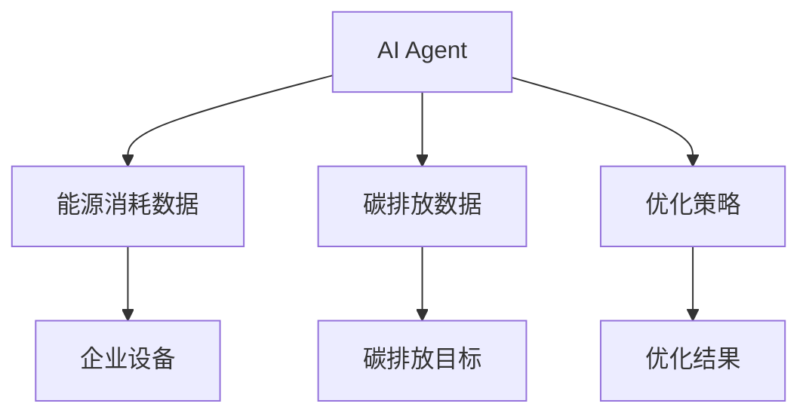
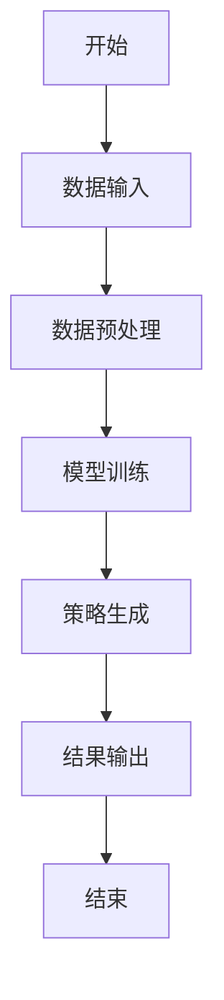
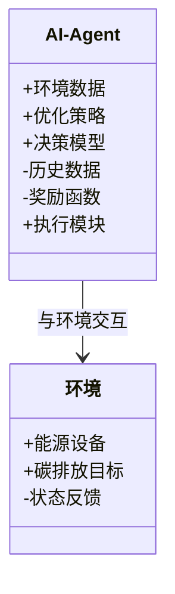
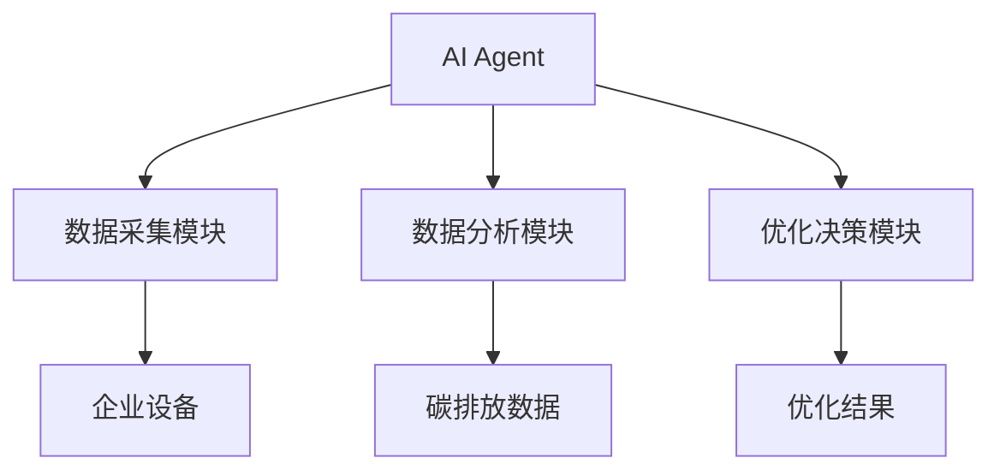

                 


# AI Agent在企业能源消耗优化与碳排放管理中的创新应用

> 关键词：AI Agent、能源消耗优化、碳排放管理、机器学习、能源效率、可持续发展

> 摘要：本文探讨了AI Agent在企业能源消耗优化与碳排放管理中的创新应用。通过分析AI Agent的核心原理、系统架构、算法实现以及实际案例，展示了如何利用人工智能技术提升企业的能源管理效率，降低碳排放，助力可持续发展。

---

## 第1章: 引言

### 1.1 问题背景

#### 1.1.1 企业能源消耗与碳排放的现状

随着全球能源危机和气候变化问题的加剧，企业能源消耗和碳排放已成为全球关注的焦点。企业作为主要的能源消耗者和碳排放源，优化能源使用、减少碳排放不仅是社会责任，也是降低成本、提高竞争力的重要手段。

#### 1.1.2 当前能源管理面临的挑战

传统能源管理方式依赖人工操作，存在数据采集不全面、分析不及时、优化策略不足等问题。能源消耗与碳排放涉及多个部门和复杂的系统，传统的管理方法难以实现全局优化。

#### 1.1.3 碳排放管理的重要性与紧迫性

碳排放是全球气候变化的主要原因，减少碳排放已成为全球共识。企业需要通过技术创新来实现低碳转型，AI Agent作为一种智能代理技术，能够实时监控、分析和优化能源使用，从而有效减少碳排放。

### 1.2 问题描述

#### 1.2.1 企业能源消耗的复杂性

企业的能源消耗涉及多个设备和系统，包括电力、热力、燃气等，且这些系统的运行相互关联，优化难度大。

#### 1.2.2 碳排放管理的多目标优化

碳排放管理需要在能源消耗、成本、环保等多个目标之间进行权衡，传统的单目标优化方法难以满足需求。

#### 1.2.3 当前解决方案的局限性

现有解决方案通常依赖静态规则或简单的反馈控制，缺乏动态优化和智能决策能力。

### 1.3 问题解决

#### 1.3.1 AI Agent的定义与核心功能

AI Agent是一种智能代理，能够感知环境、自主决策并执行任务。在能源管理中，AI Agent可以实时监控能源使用情况，分析数据并制定优化策略。

#### 1.3.2 AI Agent在能源管理中的应用价值

AI Agent能够通过机器学习和大数据分析，实现能源消耗的精准预测和优化，帮助企业在复杂环境中做出最优决策。

#### 1.3.3 创新性解决方案的提出

通过结合AI Agent与能源管理系统的集成，构建动态优化模型，实现能源消耗与碳排放的协同优化。

### 1.4 边界与外延

#### 1.4.1 AI Agent在能源管理中的边界

AI Agent主要负责能源数据的分析和优化策略的制定，具体执行由其他系统完成。

#### 1.4.2 相关概念的对比与区分

与传统规则系统相比，AI Agent具有更强的适应性和智能性；与简单优化模型相比，AI Agent能够处理更复杂的动态问题。

#### 1.4.3 与其他技术的协同关系

AI Agent可以与物联网、云计算等技术协同工作，形成完整的能源管理生态系统。

### 1.5 概念结构与核心要素组成

#### 1.5.1 AI Agent的核心要素

- 数据采集：实时采集企业能源消耗数据。
- 数据分析：利用机器学习模型进行分析。
- 决策制定：基于分析结果制定优化策略。
- 执行控制：将优化策略转化为具体操作。

#### 1.5.2 能源消耗与碳排放管理的系统架构

- 数据采集层：负责数据的实时采集。
- 数据分析层：进行数据的处理和分析。
- 优化决策层：制定优化策略。
- 执行控制层：将策略转化为实际操作。

#### 1.5.3 AI Agent与能源管理的结合模型

通过AI Agent的核心功能与能源管理系统的各层进行深度结合，实现从数据采集到优化执行的全链条管理。

---

## 第2章: AI Agent的核心概念与联系

### 2.1 AI Agent的核心原理

#### 2.1.1 AI Agent的基本原理

AI Agent通过感知环境、分析数据、制定策略和执行操作来实现目标。在能源管理中，AI Agent能够实时监控能源使用情况，并根据环境变化动态调整优化策略。

#### 2.1.2 AI Agent的核心算法

AI Agent的核心算法包括强化学习、监督学习和无监督学习。其中，强化学习常用于动态优化问题，监督学习用于分类和预测，无监督学习用于异常检测。

#### 2.1.3 AI Agent的决策机制

AI Agent的决策机制包括状态感知、目标设定、策略选择和行动执行。通过不断学习和优化，AI Agent能够提高决策的准确性和效率。

### 2.2 核心概念属性特征对比

#### 2.2.1 不同AI Agent模型的对比分析

| AI Agent模型 | 基础算法 | 优势 | 动态适应性 |
|--------------|----------|------|------------|
| Q-Learning    | 强化学习  | 离线学习，简单有效 | 较低           |
| DQN           | 深度强化学习 | 在线学习，处理复杂问题 | 高             |

#### 2.2.2 各种能源管理方法的优缺点

| 方法         | 优点                           | 缺点                           |
|--------------|--------------------------------|--------------------------------|
| 传统规则法   | 实施简单，成本低               | 灵活性差，难以应对复杂变化     |
| 简单优化法   | 计算速度快，适合静态问题       | 无法处理动态变化，优化效果有限 |
| AI Agent法   | 灵活性高，适应性强             | 实施复杂，需要大量数据和计算资源 |

#### 2.2.3 AI Agent与其他技术的对比

AI Agent相较于其他技术，具有更强的自主决策能力和适应性，能够处理复杂的动态问题。

### 2.3 ER实体关系图架构



---

## 第3章: 算法原理讲解

### 3.1 算法原理概述

#### 3.1.1 AI Agent的核心算法

AI Agent的核心算法是强化学习，特别是深度强化学习（DQN）。这种算法能够通过与环境的交互，不断优化策略，实现动态调整。

#### 3.1.2 算法的基本思想

DQN算法通过神经网络近似值函数，将状态和动作映射到Q值，通过最大化Q值来优化策略。公式如下：

$$ Q(s, a) = r + \gamma \max_{a'} Q(s', a') $$

其中，\( s \) 是状态，\( a \) 是动作，\( r \) 是奖励，\( \gamma \) 是折扣因子。

#### 3.1.3 算法的优化策略

通过经验回放和目标网络等技术，提高算法的稳定性和收敛速度。

### 3.2 算法流程图



### 3.3 算法实现代码

```python
import numpy as np
import gym

class DQN:
    def __init__(self, env):
        self.env = env
        self.memory = []
        self.gamma = 0.99
        self.epsilon = 0.5
        self.model = self.build_model()

    def build_model(self):
        # 简单的神经网络模型，实际应用中需要更复杂的结构
        return np.random.rand(2, 1)

    def remember(self, state, action, reward, next_state):
        self.memory.append((state, action, reward, next_state))

    def act(self, state):
        if np.random.random() < self.epsilon:
            return self.env.action_space.sample()
        else:
            return np.argmax(self.model.dot(state))

    def replay(self, batch_size):
        if len(self.memory) < batch_size:
            return
        minibatch = np.random.choice(self.memory, batch_size)
        for state, action, reward, next_state in minibatch:
            target = reward + self.gamma * np.max(self.model.dot(next_state))
            self.model[action] += (target - self.model[action]) * 0.1

    def train(self):
        for _ in range(100):
            self.replay(32)

# 初始化环境和AI Agent
env = gym.make('EnergyManagement-v0')
agent = DQN(env)

for _ in range(1000):
    state = env.reset()
    while True:
        action = agent.act(state)
        next_state, reward, done, _ = env.step(action)
        agent.remember(state, action, reward, next_state)
        agent.train()
        state = next_state
        if done:
            break
```

### 3.4 数学模型与公式

优化问题可以表示为：

$$ \min_{x} \sum_{i=1}^{n} E_i(x) + \lambda C(x) $$

其中，\( E_i(x) \) 是第 \( i \) 个设备的能源消耗，\( C(x) \) 是碳排放量，\( \lambda \) 是惩罚系数。

---

## 第4章: 系统分析与架构设计

### 4.1 项目介绍

本项目旨在通过AI Agent技术优化企业的能源消耗和碳排放管理，构建一个智能化的能源管理系统。

### 4.2 系统功能设计

#### 4.2.1 系统功能模块

- 数据采集模块：实时采集企业设备的能源消耗数据。
- 数据分析模块：利用机器学习算法分析数据，识别异常和优化机会。
- 优化决策模块：制定优化策略并执行。

#### 4.2.2 领域模型类图



### 4.3 系统架构设计

#### 4.3.1 系统架构图



#### 4.3.2 接口设计

- 数据采集接口：负责接收设备数据并传递给AI Agent。
- 优化策略接口：将优化策略传递给执行模块。
- 执行模块接口：根据策略执行具体操作。

#### 4.3.3 交互流程

1. 数据采集模块获取设备数据。
2. AI Agent分析数据并制定优化策略。
3. 执行模块根据策略执行操作。
4. 反馈执行结果并更新数据。

---

## 第5章: 项目实战

### 5.1 环境安装

安装必要的库和框架，如TensorFlow、Keras、gym等。

### 5.2 核心代码实现

```python
import gym
from gym import spaces
from gym.utils import seeding

class EnergyManagementEnv(gym.Env):
    def __init__(self):
        self.observation_space = spaces.Box(low=0, high=100, shape=(1,))
        self.action_space = spaces.Discrete(4)
        self.seed()

    def seed(self, seed=None):
        self.np_random, seed = seeding.np_random(seed)
        return [seed]

    def reset(self):
        self.state = 50  # 初始状态
        return self.state

    def step(self, action):
        # 根据动作更新状态
        if action == 0:
            self.state -= 10
        elif action == 1:
            self.state += 10
        elif action == 2:
            self.state -= 5
        else:
            self.state += 5
        # 计算奖励
        reward = -abs(50 - self.state)
        done = self.state == 50
        return self.state, reward, done, {}

# 使用环境进行训练
env = EnergyManagementEnv()
agent = DQN(env)
agent.train()
```

### 5.3 案例分析与解读

通过实际案例分析，展示AI Agent在能源管理中的应用效果，包括优化策略和执行结果。

---

## 第6章: 总结与展望

### 6.1 总结

AI Agent在企业能源消耗优化与碳排放管理中具有重要的应用价值。通过实时数据采集、智能分析和动态优化，AI Agent能够显著提高能源管理效率，减少碳排放。

### 6.2 展望

未来，随着AI技术的不断进步，AI Agent在能源管理中的应用将更加广泛和深入。通过与其他技术的协同，AI Agent将为企业实现更高效的能源管理和更低的碳排放目标。

---

## 小结

AI Agent作为一种智能代理技术，正在改变企业能源管理的方式。通过本文的详细分析和实际案例，我们展示了AI Agent在优化能源消耗和减少碳排放中的巨大潜力。未来，随着技术的进一步发展，AI Agent将在更多领域发挥重要作用。

---

作者：AI天才研究院 & 禅与计算机程序设计艺术

