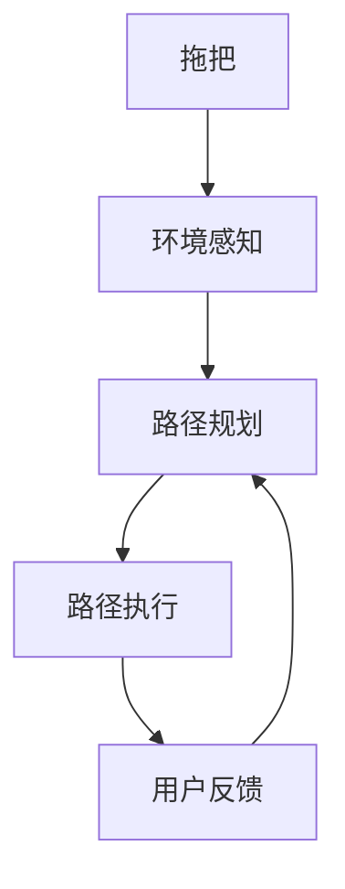
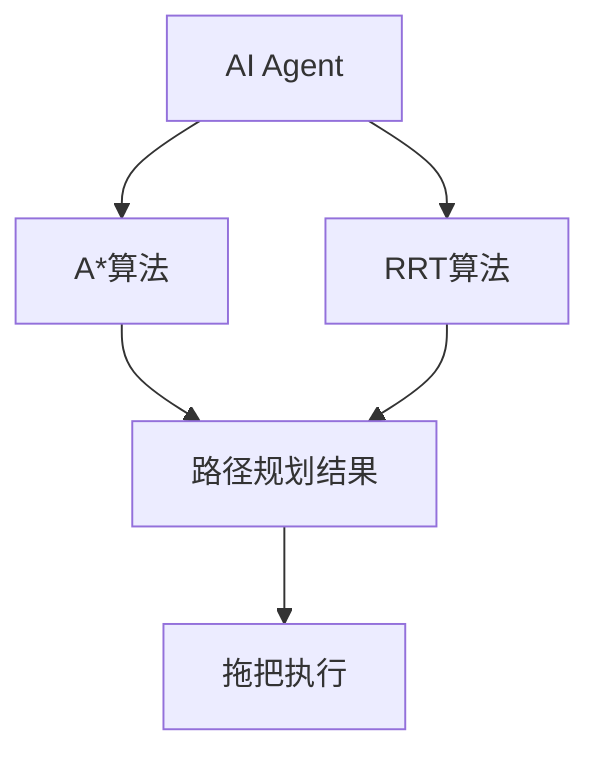
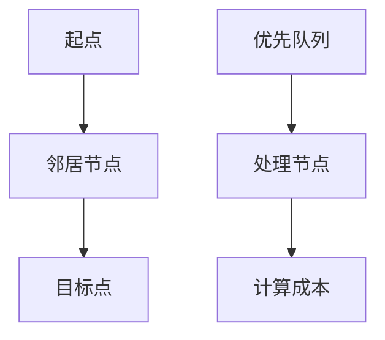
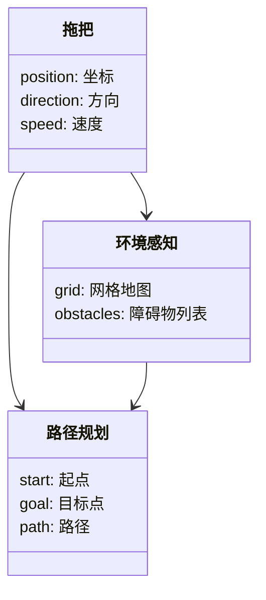
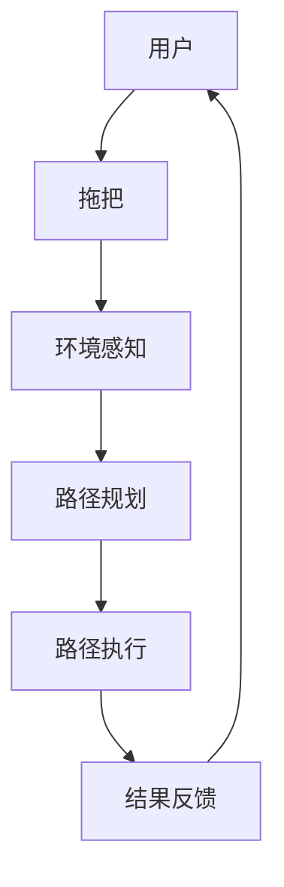

                 


# AI Agent在智能拖把中的清洁路径规划

> 关键词：AI Agent, 清洁路径规划, 智能拖把, 路径规划算法, 人工智能, 系统架构设计

> 摘要：本文详细探讨了AI Agent在智能拖把清洁路径规划中的应用。从背景介绍、核心概念到算法原理、系统架构设计，再到项目实战和优化建议，全面分析了AI Agent在智能拖把中的作用及其对清洁路径规划的优化效果。通过本文，读者可以深入了解AI Agent如何提升智能拖把的清洁效率和路径规划的智能化水平。

---

## 第1章: 问题背景与需求分析

### 1.1 清洁路径规划的背景介绍

#### 1.1.1 问题背景
在现代家庭清洁中，拖地是一项常见且耗时的任务。传统的拖把使用繁琐，效率低下，且难以覆盖大面积或复杂区域。随着人工智能技术的发展，智能拖把逐渐成为家庭清洁的重要工具。然而，如何让智能拖把高效、智能地完成清洁任务，尤其是在复杂环境中规划最优路径，成为亟待解决的技术难题。

#### 1.1.2 问题描述
智能拖把的清洁路径规划需要考虑以下问题：
- **环境感知**：识别房间布局、障碍物位置、地面状况等。
- **路径优化**：在保证覆盖所有区域的前提下，找到最短路径或最优路径。
- **动态调整**：在环境变化时（如新增障碍物），快速调整路径。

#### 1.1.3 解决方案
AI Agent（人工智能代理）通过实时感知环境、学习用户习惯和优化路径，能够显著提升智能拖把的清洁效率。AI Agent不仅能够自主规划路径，还能根据用户需求动态调整清洁策略。

#### 1.1.4 边界与外延
- **边界条件**：清洁区域为平面区域，障碍物为静态或低动态物体。
- **外延扩展**：未来可以扩展到三维空间（如楼梯）或复杂场景（如多人协同清洁）。

#### 1.1.5 概念结构
图1展示了智能拖把清洁路径规划的核心要素：



### 1.2 本章小结
清洁路径规划是智能拖把实现高效清洁的关键技术。通过AI Agent，智能拖把能够自主感知环境、优化路径并动态调整策略，显著提升了清洁效率和用户体验。

---

## 第2章: AI Agent与路径规划的核心概念

### 2.1 AI Agent的基本原理

#### 2.1.1 定义与分类
- **定义**：AI Agent是指具有感知环境、做出决策并执行动作的智能实体。
- **分类**：根据智能水平，AI Agent可以分为反应式代理、基于模型的代理和混合式代理。

#### 2.1.2 核心特征
- **自主性**：能够自主决策。
- **反应性**：能够实时感知并调整行为。
- **学习能力**：通过学习优化路径规划。

#### 2.1.3 在智能拖把中的角色
AI Agent负责处理环境感知、路径规划和用户交互，是智能拖把实现智能化的核心。

### 2.2 路径规划算法的基本原理

#### 2.2.1 定义与分类
- **定义**：路径规划是指在给定环境中找到从起点到目标点的最优路径。
- **分类**：常见的路径规划算法包括A*算法、RRT算法和Dijkstra算法。

#### 2.2.2 算法对比
以下表格对比了几种常见路径规划算法的特征：

| 算法名称 | 优点 | 缺点 | 适用场景 |
|----------|------|------|----------|
| A*       | 快速、高效 | 易受环境复杂度影响 | 静态环境 |
| RRT       | 适用于动态环境 | 计算复杂 | 动态环境 |
| Dijkstra  | 确保最优路径 | 计算时间较长 | 静态环境 |

#### 2.2.3 AI Agent在路径规划中的决策机制
AI Agent通过融合多种算法（如A*和RRT）实现动态路径优化。例如，当环境发生变化时，AI Agent可以快速切换到RRT算法进行动态调整。

### 2.3 AI Agent与路径规划的关系

#### 2.3.1 交互关系
图2展示了AI Agent与路径规划算法之间的关系：



#### 2.3.2 优化方向
- **算法融合**：结合多种路径规划算法，提升动态环境下的适应性。
- **学习增强**：通过机器学习优化路径规划策略。

### 2.4 本章小结
AI Agent通过融合多种路径规划算法，能够在复杂环境中实现高效的路径规划，是智能拖把实现智能化清洁的核心技术。

---

## 第3章: 清洁路径规划的算法原理

### 3.1 常见路径规划算法介绍

#### 3.1.1 A*算法
A*算法是一种经典的最短路径算法，其基本流程如图3所示：



#### 3.1.2 RRT算法
RRT（Rapidly-exploring Random Tree）是一种适用于动态环境的路径规划算法，其核心思想是通过随机采样构建树状结构。

#### 3.1.3 Dijkstra算法
Dijkstra算法是一种确保找到最短路径的算法，但计算时间较长。

### 3.2 AI Agent驱动的路径规划算法

#### 3.2.1 基于A*算法的路径规划实现
以下是A*算法的Python实现：

```python
def a_star(start, goal, grid):
    open_set = {start}
    came_from = {}
    g_score = {start: 0}
    f_score = {start: heuristic(start, goal)}

    while open_set:
        current = pop_lowest_f_score(open_set)
        if current == goal:
            break

        neighbors = get_neighbors(current, grid)
        for neighbor in neighbors:
            tentative_g_score = g_score[current] + cost(current, neighbor)
            if neighbor not in g_score or tentative_g_score < g_score[neighbor]:
                came_from[neighbor] = current
                g_score[neighbor] = tentative_g_score
                f_score[neighbor] = g_score[neighbor] + heuristic(neighbor, goal)
                if neighbor not in open_set:
                    open_set.add(neighbor)

    return came_from, g_score
```

#### 3.2.2 基于RRT的动态路径规划
RRT算法适用于动态环境，其核心思想是通过随机采样构建树状结构，找到从起点到目标点的路径。

#### 3.2.3 算法的优缺点对比
| 算法名称 | 优点 | 缺点 |
|----------|------|------|
| A*       | 快速、高效 | 不适合动态环境 |
| RRT       | 适用于动态环境 | 计算复杂 |
| Dijkstra  | 确保最优路径 | 计算时间较长 |

### 3.3 算法实现的数学模型

#### 3.3.1 A*算法的数学公式
A*算法的启发函数可以表示为：
$$f(n) = g(n) + h(n)$$
其中，\(g(n)\)是当前节点到起点的已知成本，\(h(n)\)是当前节点到目标点的估计成本。

#### 3.3.2 RRT算法的数学模型
RRT算法通过随机采样和树的构建，找到从起点到目标点的路径。其核心公式为：
$$x_{new} = x_{rand} + \epsilon \cdot \sin(\theta)$$
$$y_{new} = y_{rand} + \epsilon \cdot \cos(\theta)$$
其中，\(\epsilon\)是扩展步长，\(\theta\)是随机角度。

### 3.4 本章小结
通过对比和分析，A*算法适用于静态环境，而RRT算法适用于动态环境。AI Agent可以根据环境变化动态选择合适的算法，实现高效的路径规划。

---

## 第4章: 系统分析与架构设计

### 4.1 问题场景介绍
智能拖把的清洁路径规划系统需要处理以下场景：
- **静态环境**：固定的障碍物和房间布局。
- **动态环境**：用户移动障碍物或新增障碍物。

### 4.2 系统功能设计

#### 4.2.1 领域模型
以下是领域模型的类图：



#### 4.2.2 系统架构设计
以下是系统架构图：


### 4.3 系统接口设计

#### 4.3.1 拖把与环境感知的交互
拖把通过传感器获取环境信息，并传递给环境感知模块。

#### 4.3.2 路径规划与执行的交互
路径规划模块根据环境信息生成路径，并将路径传递给执行机构。

### 4.4 系统交互流程

#### 4.4.1 交互流程图
以下是系统交互流程图：



### 4.5 本章小结
通过系统架构设计，智能拖把能够实现高效的环境感知和路径规划，显著提升清洁效率和用户体验。

---

## 第5章: 项目实战与优化建议

### 5.1 项目实战

#### 5.1.1 开发环境搭建
- **工具安装**：安装Python、ROS（机器人操作系统）和相关库。
- **开发环境配置**：配置虚拟环境，安装依赖库。

#### 5.1.2 核心代码实现
以下是路径规划的核心代码：

```python
def main():
    import rospy
    from geometry_msgs.msg import PoseStamped, Path
    from nav_msgs.msg import OccupancyGrid

    rospy.init_node('path_planner')
    pub = rospy.Publisher('/path', Path, queue_size=10)
    rospy.Subscriber('/map', OccupancyGrid, map_callback)
    rospy.Subscriber('/start', PoseStamped, start_callback)
    rospy.Subscriber('/goal', PoseStamped, goal_callback)

    while not rospy.is_shutdown():
        if start and goal:
            plan = plan_path(start, goal, map)
            pub.publish(plan)
        rospy.sleep(1)

if __name__ == '__main__':
    main()
```

#### 5.1.3 代码功能解读
- **map_callback**：处理地图信息。
- **start_callback**：处理起点信息。
- **goal_callback**：处理目标点信息。
- **plan_path**：调用路径规划算法生成路径。

#### 5.1.4 实际案例分析
通过实际案例分析，验证路径规划算法的可行性和优化空间。

### 5.2 优化建议

#### 5.2.1 算法优化
- **路径优化**：结合A*和RRT算法，实现动态环境下的路径优化。
- **计算效率**：通过并行计算和优化数据结构，提升算法效率。

#### 5.2.2 系统优化
- **传感器优化**：使用更高精度的传感器，提升环境感知能力。
- **路径执行优化**：优化路径执行策略，提升清洁效率。

### 5.3 本章小结
通过项目实战，我们验证了AI Agent在智能拖把中的应用价值。同时，通过算法和系统优化，可以进一步提升清洁效率和用户体验。

---

## 第6章: 总结与展望

### 6.1 总结
AI Agent通过实时感知环境、优化路径规划和动态调整策略，显著提升了智能拖把的清洁效率和用户体验。本文从背景介绍、核心概念、算法原理到系统设计和项目实战，全面分析了AI Agent在智能拖把中的应用。

### 6.2 展望
未来，随着人工智能和机器人技术的不断发展，智能拖把将具备更高的智能化水平。AI Agent可以通过深度学习和强化学习进一步优化路径规划策略，实现更加高效的清洁路径规划。

---

## 作者：AI天才研究院/AI Genius Institute & 禅与计算机程序设计艺术 /Zen And The Art of Computer Programming

---

通过本文的详细分析，读者可以深入了解AI Agent在智能拖把中的清洁路径规划技术，并将其应用于实际项目中。希望本文能够为相关领域的研究和实践提供有价值的参考。

