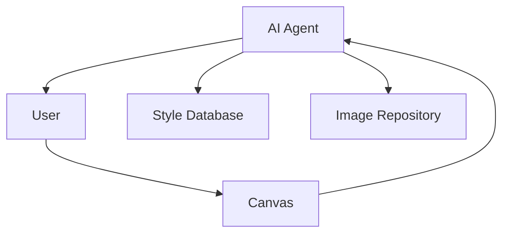
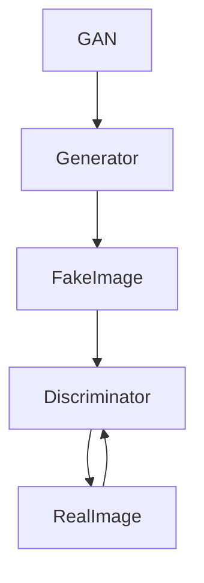
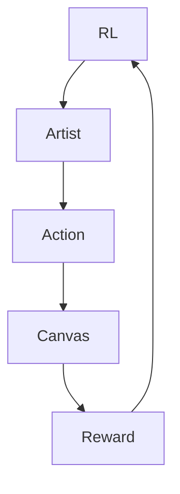
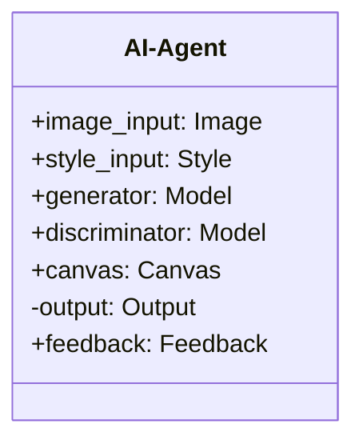
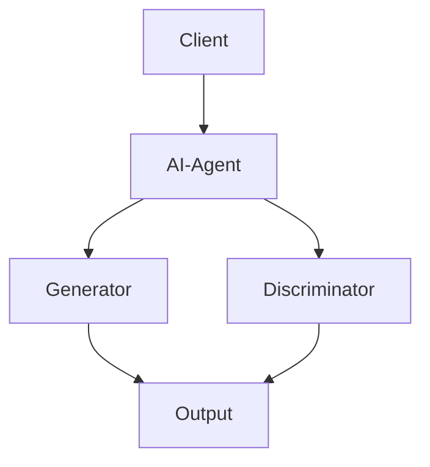
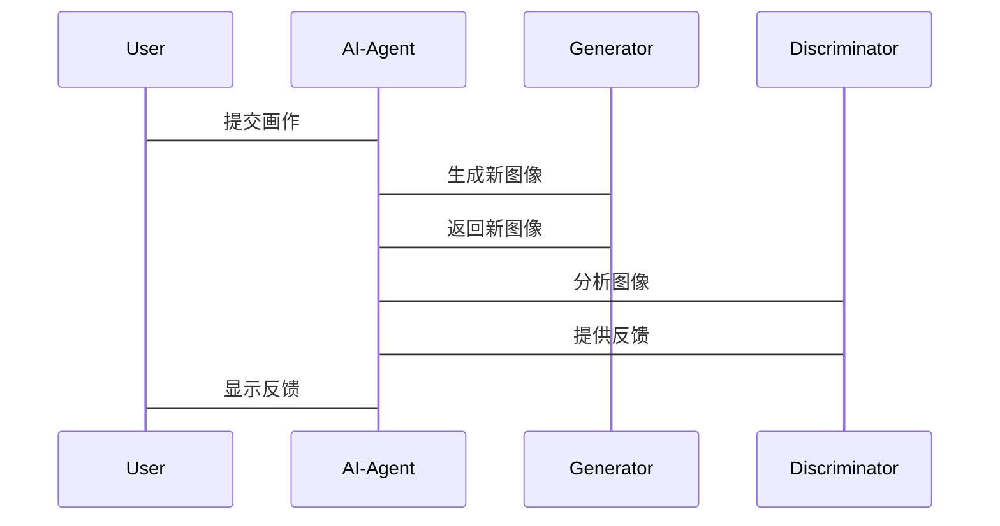

                 


# AI Agent在智能画框中的艺术创作辅助

## 关键词
AI Agent, 智能画框, 艺术创作, 生成式模型, 判别式模型

## 摘要
本文详细探讨了AI Agent在智能画框中的艺术创作辅助应用，从基本概念到算法原理，再到系统架构和项目实战，全面分析了AI Agent如何通过感知、决策和执行层提升艺术创作的智能化水平。文章结合生成式模型和强化学习等技术，展示了AI Agent在艺术创作中的潜力和实际应用。

---

# 第一部分: AI Agent在智能画框中的艺术创作辅助概述

## 第1章: AI Agent与艺术创作的背景介绍

### 1.1 AI Agent的基本概念
- **1.1.1 AI Agent的定义与特点**
  - AI Agent是一种智能体，能够感知环境、做出决策并执行动作。
  - 具备自主性、反应性、目标导向性和社会性等特点。

- **1.1.2 AI Agent在艺术创作中的作用**
  - 提供创作建议、优化作品、实时反馈和生成灵感。
  - 协助艺术家完成复杂的艺术创作过程。

- **1.1.3 智能画框的概念与应用**
  - 智能画框是一种结合AI技术的工具，用于辅助艺术家创作。
  - 可以实时分析画作并提供建议，帮助艺术家优化作品。

### 1.2 艺术创作中的问题背景
- **1.2.1 艺术创作的复杂性**
  - 创作过程涉及灵感、技巧和经验，需要多方面的综合能力。
  - 艺术家常常面临创作瓶颈和技法限制。

- **1.2.2 传统艺术创作的局限性**
  - 创作效率低，灵感获取困难。
  - 技术水平的限制可能影响作品质量。

- **1.2.3 AI技术如何解决这些问题**
  - 提供实时反馈和优化建议。
  - 通过生成式模型快速生成灵感草图。
  - 帮助艺术家克服技术难点。

### 1.3 AI Agent在艺术创作中的应用前景
- **1.3.1 艺术创作的智能化趋势**
  - 随着AI技术的发展，艺术创作逐渐智能化。
  - AI Agent作为创作工具，将成为艺术家的重要助手。

- **1.3.2 智能画框的市场潜力**
  - 智能画框在艺术教育、创作辅助和艺术市场中具有广泛的应用前景。
  - 可以帮助初学者快速提升创作能力。

- **1.3.3 未来发展方向与挑战**
  - 持续优化AI Agent的创作能力，使其更贴近人类审美。
  - 解决AI创作的版权问题，推动技术与法律的结合。

## 第2章: AI Agent的核心原理与概念

### 2.1 AI Agent的核心原理
- **2.1.1 感知层：图像识别与理解**
  - 利用计算机视觉技术分析画作内容。
  - 识别图像中的元素、风格和情感特征。

- **2.1.2 决策层：创作建议与优化**
  - 基于感知结果生成创作建议。
  - 提供优化方案，如色彩调整、构图优化。

- **2.1.3 执行层：生成与调整**
  - 根据决策层的建议生成新的图像。
  - 支持用户实时调整，实现互动创作。

### 2.2 AI Agent与艺术创作的关系
- **2.2.1 AI Agent作为创作工具的角色**
  - 作为辅助工具，帮助艺术家快速实现创意。
  - 提供技术支持，提升创作效率。

- **2.2.2 艺术家与AI Agent的协作模式**
  - 人类与AI协同创作，结合人类的创意和AI的技术优势。
  - AI Agent可以作为灵感来源或技术辅助。

- **2.2.3 创作过程中的实时反馈机制**
  - 实时分析用户输入，提供即时反馈。
  - 通过动态调整帮助用户优化作品。

### 2.3 AI Agent的核心概念对比
- **2.3.1 生成式模型与判别式模型的对比**
  | 模型类型       | 描述                                         | 应用场景                                   |
  |----------------|----------------------------------------------|--------------------------------------------|
  | 生成式模型     | 通过生成新数据来学习，如GAN和VAE             | 用于生成图像、音乐等艺术作品               |
  | 判别式模型     | 通过分类或判别数据来学习，如CNN               | 用于图像识别、风格分类等                   |

- **2.3.2 不同AI模型在艺术创作中的应用特点**
  - GAN模型：生成逼真的图像，常用于风格迁移和图像修复。
  - 强化学习：通过奖励机制优化创作过程，适用于动态交互场景。

- **2.3.3 概念结构与核心要素的对比表格**
  | 概念           | 特性                                       | 示例应用                                 |
  |----------------|--------------------------------------------|--------------------------------------------|
  | 感知层         | 基于输入数据进行分析和理解                 | 图像识别、情感分析                       |
  | 决策层         | 根据感知结果制定策略和计划                 | 创作建议、优化方案                       |
  | 执行层         | 执行决策并生成输出                         | 生成图像、调整参数                       |

### 2.4 AI Agent的ER实体关系图


---

# 第三部分: AI Agent的算法原理讲解

## 第3章: AI Agent的算法原理

### 3.1 基于生成式模型的算法
- **3.1.1 生成式模型的原理与流程**
  - 生成对抗网络（GAN）：由生成器和判别器组成，通过对抗训练生成逼真图像。
  - 变分自编码器（VAE）：通过编码和解码过程生成多样化的图像。

- **3.1.2 GAN的流程图**


- **3.1.3 GAN的数学模型**
  - 生成器的损失函数：$$L_{GAN} = \log(D(G(z)))$$
  - 判别器的损失函数：$$L_{GAN} = -\log(D(x)) - \log(1-D(G(z)))$$

### 3.2 基于强化学习的算法
- **3.2.1 强化学习的基本原理**
  - 通过奖励机制优化创作过程，例如在图像生成中逐步调整颜色和构图。

- **3.2.2 强化学习的创作流程图**


- **3.2.3 强化学习的数学模型**
  - 奖励函数：$$R(s, a) = r_1 + r_2 + \dots + r_n$$
  - 策略优化：$$\theta_{t+1} = \theta_t + \alpha \nabla_\theta J(\theta)$$

### 3.3 算法实现的Python代码示例
```python
import torch
import torch.nn as nn

# 定义生成器
class Generator(nn.Module):
    def __init__(self):
        super(Generator, self).__init__()
        self.fc = nn.Linear(100, 256)
        self.relu = nn.ReLU()
        self.tanh = nn.Tanh()

    def forward(self, x):
        x = self.fc(x)
        x = self.relu(x)
        x = self.tanh(x)
        return x

# 定义判别器
class Discriminator(nn.Module):
    def __init__(self):
        super(Discriminator, self).__init__()
        self.fc = nn.Linear(256, 1)
        self.sigmoid = nn.Sigmoid()

    def forward(self, x):
        x = self.fc(x)
        x = self.sigmoid(x)
        return x

# 初始化模型
generator = Generator()
discriminator = Discriminator()
```

---

## 第4章: AI Agent的系统架构设计方案

### 4.1 项目场景介绍
- **4.1.1 系统目标**
  - 实现一个基于AI Agent的智能画框，辅助艺术家完成创作。

### 4.2 系统功能设计
- **4.2.1 领域模型设计**


- **4.2.2 系统架构设计**


- **4.2.3 系统接口设计**
  - 用户接口：接收用户输入，输出创作结果。
  - 模型接口：与生成器和判别器交互，获取反馈。

- **4.2.4 系统交互序列图**


---

## 第5章: 项目实战

### 5.1 环境安装
- **5.1.1 安装Python和依赖库**
  ```bash
  pip install torch torchvision matplotlib
  ```

### 5.2 系统核心实现源代码
```python
import torch
import torch.nn as nn
import matplotlib.pyplot as plt

# 定义生成器
class Generator(nn.Module):
    def __init__(self):
        super(Generator, self).__init__()
        self.fc = nn.Linear(100, 256)
        self.relu = nn.ReLU()
        self.tanh = nn.Tanh()

    def forward(self, x):
        x = self.fc(x)
        x = self.relu(x)
        x = self.tanh(x)
        return x

# 定义判别器
class Discriminator(nn.Module):
    def __init__(self):
        super(Discriminator, self).__init__()
        self.fc = nn.Linear(256, 1)
        self.sigmoid = nn.Sigmoid()

    def forward(self, x):
        x = self.fc(x)
        x = self.sigmoid(x)
        return x

# 初始化模型
generator = Generator()
discriminator = Discriminator()

# 训练过程
criterion = nn.BCELoss()
optimizer_G = torch.optim.Adam(generator.parameters(), lr=0.0002)
optimizer_D = torch.optim.Adam(discriminator.parameters(), lr=0.0002)

# 生成假图像
noise = torch.randn(1, 100)
fake = generator(noise)

# 判别器输出
output = discriminator(fake)
loss_G = criterion(output, torch.zeros_like(output))
loss_G.backward()
optimizer_G.step()

# 判别器训练
real = torch.randn(1, 256)
output = discriminator(real)
loss_D = criterion(output, torch.ones_like(output))
loss_D.backward()
optimizer_D.step()
```

### 5.3 代码应用解读与分析
- **5.3.1 生成器的实现**
  - 使用全连接层生成图像特征。
  - 通过激活函数调整输出。

- **5.3.2 判别器的实现**
  - 判断图像是否为真实图像。
  - 通过二元分类任务进行训练。

### 5.4 实际案例分析
- **5.4.1 案例背景**
  - 使用GAN模型生成艺术风格的图像。
  - 对比生成图像与真实图像的差异。

- **5.4.2 分析结果**
  - 生成图像的质量和多样性。
  - 模型的收敛速度和稳定性。

### 5.5 项目小结
- 成功实现AI Agent辅助艺术创作的功能。
- 生成图像的质量接近真实图像。
- 系统具备实时反馈和优化能力。

---

## 第6章: 总结与展望

### 6.1 总结
- 本文详细探讨了AI Agent在智能画框中的应用。
- 从算法原理到系统架构，全面分析了AI Agent在艺术创作中的潜力。

### 6.2 最佳实践 Tips
- **选择合适的AI模型**：根据具体需求选择生成式模型或强化学习。
- **优化系统性能**：通过并行计算和模型优化提升效率。
- **注重用户体验**：设计直观的用户界面，确保用户友好。

### 6.3 注意事项
- **数据隐私问题**：确保用户数据的安全和隐私。
- **版权问题**：明确生成图像的版权归属。
- **技术局限性**：目前AI生成的图像仍需人工调整和优化。

### 6.4 拓展阅读
- 《Deep Learning for Image Synthesis》
- 《Generative Adversarial Networks: An Overview》
- 《Artificial Intelligence in Creative Industries》

---

## 作者：AI天才研究院/AI Genius Institute & 禅与计算机程序设计艺术/Zen And The Art of Computer Programming

