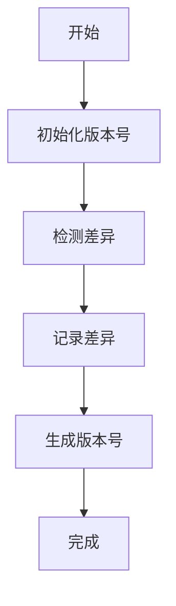
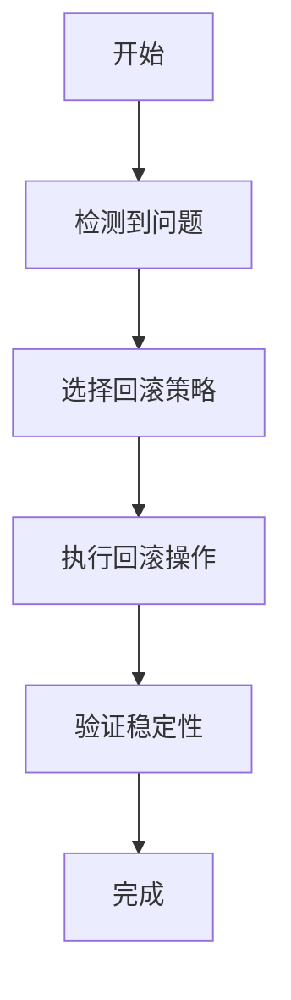
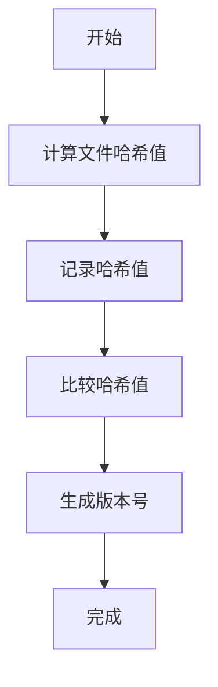
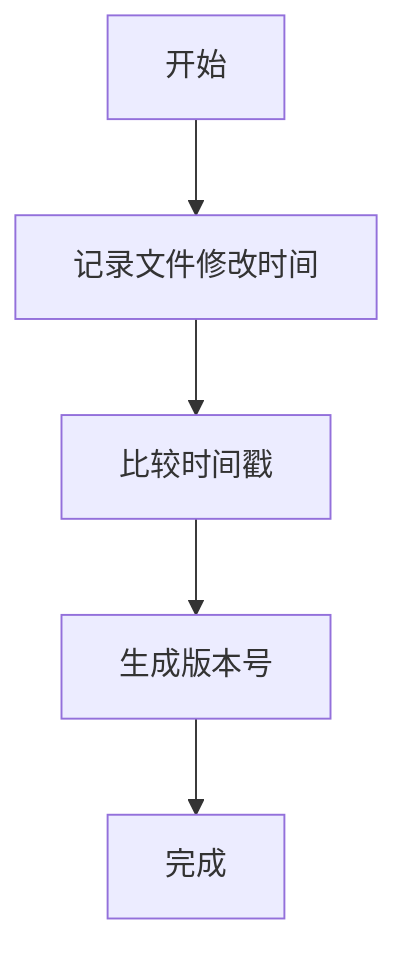
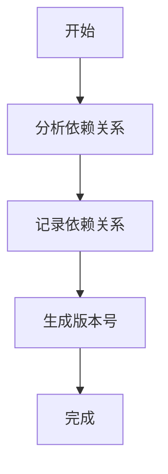
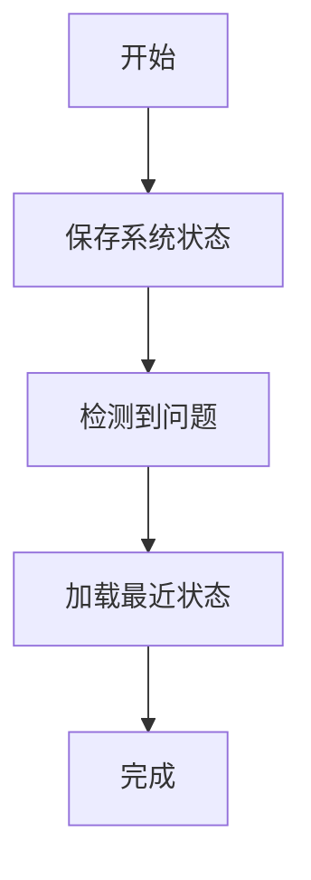
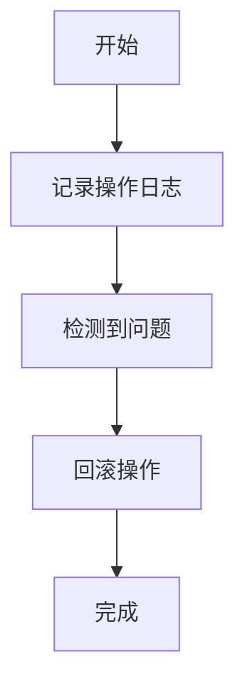
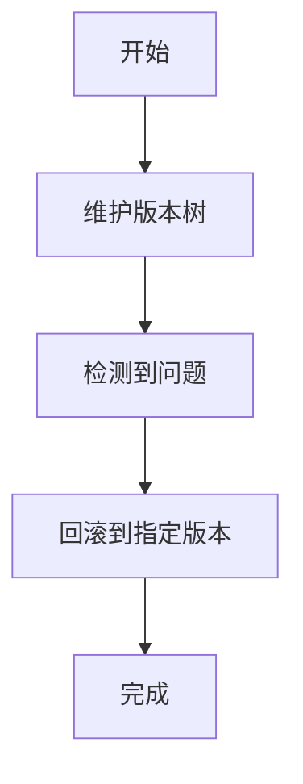
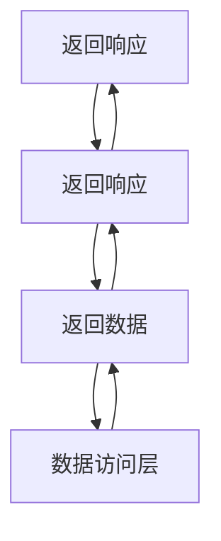

                 


# AI Agent的版本控制与回滚机制：确保稳定运行

**关键词**：AI Agent, 版本控制, 回滚机制, 稳定运行, 系统架构, 算法原理

**摘要**：AI Agent的版本控制与回滚机制是确保AI系统稳定运行的核心技术。本文从AI Agent的基本概念出发，详细阐述了版本控制与回滚机制的核心概念、算法原理、系统架构设计以及实际项目中的应用。通过对比分析和案例研究，本文为读者提供了全面的理论基础和实践指导，帮助他们在实际项目中实现稳定可靠的版本控制与回滚机制。

---

# 第1章 AI Agent的背景与核心概念

## 1.1 AI Agent的基本概念

### 1.1.1 AI Agent的定义与特点

AI Agent（人工智能代理）是一种能够感知环境、执行任务并做出决策的智能实体。AI Agent的特点包括：

- **自主性**：能够在没有外部干预的情况下独立运行。
- **反应性**：能够实时感知环境变化并做出响应。
- **目标导向性**：以特定目标为导向，优化决策过程。
- **学习能力**：通过数据和经验不断优化自身行为。

### 1.1.2 AI Agent的应用场景

AI Agent广泛应用于多个领域，例如：

- **自动驾驶**：通过实时感知和决策实现车辆的自主行驶。
- **智能助手**：如Siri、Alexa等，能够理解和执行用户的指令。
- **机器人控制**：在工业自动化中，AI Agent用于优化生产流程。
- **游戏AI**：在电子游戏中，AI Agent用于实现智能NPC的行为。

### 1.1.3 AI Agent的核心要素

AI Agent的核心要素包括：

- **感知模块**：用于获取环境信息。
- **决策模块**：基于感知信息做出决策。
- **执行模块**：将决策转化为具体动作。
- **学习模块**：通过经验优化自身行为。

## 1.2 版本控制与回滚机制的背景

### 1.2.1 AI Agent开发中的问题背景

在AI Agent的开发过程中，版本控制与回滚机制的重要性不言而喻。AI Agent的复杂性使其在开发过程中容易出现功能异常或性能瓶颈。版本控制与回滚机制能够帮助开发者快速定位问题，并在必要时回滚到稳定版本，避免系统崩溃。

### 1.2.2 版本控制的必要性

版本控制的必要性体现在以下几个方面：

- **代码管理**：通过版本控制工具（如Git）管理AI Agent的代码，确保每次修改都有记录。
- **回溯问题**：当出现问题时，能够快速找到问题的根源并回滚到稳定版本。
- **协作开发**：在多人协作开发中，版本控制能够避免代码冲突。

### 1.2.3 回滚机制的重要性

回滚机制的重要性体现在以下几个方面：

- **快速恢复**：当AI Agent出现重大问题时，能够快速回滚到之前的稳定版本。
- **风险控制**：通过回滚机制，降低新版本发布后的风险。
- **持续优化**：通过回滚机制，能够在实验新版本的同时，保证系统的稳定性。

## 1.3 本章小结

本章从AI Agent的基本概念出发，介绍了其应用场景和核心要素。接着，分析了版本控制与回滚机制的背景，强调了版本控制与回滚机制在AI Agent开发中的重要性。

---

# 第2章 AI Agent版本控制的核心概念与原理

## 2.1 版本控制的原理

### 2.1.1 版本号的生成与管理

版本号的生成与管理是版本控制的核心。常见的版本号生成方法包括：

- **递增版本号**：每次发布新版本时，版本号递增（如v1.0.0、v1.0.1）。
- **语义版本号**：遵循语义化版本控制规范（如MAJOR.MINOR.PATCH）。

版本号的管理需要结合版本控制工具（如Git）来实现。

### 2.1.2 版本差异的检测与记录

版本差异的检测与记录是版本控制的关键步骤。通过比较不同版本的代码，可以生成差异报告，帮助开发者快速定位问题。

### 2.1.3 版本依赖关系的处理

在AI Agent的开发中，版本依赖关系的处理尤为重要。通过明确依赖关系，可以在回滚时确保所有依赖项的版本一致。

### 2.1.4 图形化展示（Mermaid流程图）

以下是版本控制的流程图：



## 2.2 回滚机制的实现原理

### 2.2.1 回滚触发条件

回滚触发条件是指在特定情况下自动或手动触发回滚机制。常见的回滚触发条件包括：

- **性能下降**：系统性能低于预设阈值。
- **功能异常**：检测到功能异常。
- **用户反馈**：用户报告问题。

### 2.2.2 回滚策略的选择

回滚策略的选择需要根据具体情况来决定。常见的回滚策略包括：

- **回滚到最近稳定版本**：当检测到问题时，回滚到最近的稳定版本。
- **分阶段回滚**：逐步回滚，确保每个步骤都稳定。

### 2.2.3 回滚过程的实现

回滚过程的实现需要结合版本控制工具和系统架构设计。以下是回滚过程的流程图：



## 2.3 核心概念对比分析

### 2.3.1 版本控制与回滚机制的对比

以下是版本控制与回滚机制的对比表格：

| 特性         | 版本控制       | 回滚机制       |
|--------------|----------------|----------------|
| 目标         | 管理代码版本   | 恢复到稳定版本 |
| 实现方式     | 工具（如Git）  | 策略与流程    |
| 依赖关系     | 明确依赖       | 明确依赖       |
| 触发条件     | 开发者操作     | 系统检测或用户反馈 |

### 2.3.2 不同版本控制方法的优缺点

以下是不同版本控制方法的优缺点对比：

| 方法         | 优点                     | 缺点                     |
|--------------|--------------------------|--------------------------|
| 递增版本号   | 简单易懂                 | 易重复                   |
| 语义版本号   | 明确版本意义             | 需严格遵循规范           |
| 分支管理     | 支持多人协作             | 学习成本较高             |

### 2.3.3 回滚机制的实现方式对比

以下是回滚机制实现方式的对比：

| 方式         | 优点                     | 缺点                     |
|--------------|--------------------------|--------------------------|
| 快照回滚     | 快速恢复                 | 占用存储空间较大         |
| 日志回滚     | 占用存储空间小           | 恢复时间较长             |
| 分阶段回滚   | 风险低                   | 时间较长                 |

## 2.4 本章小结

本章详细阐述了版本控制与回滚机制的核心概念，包括版本号的生成与管理、版本差异的检测与记录、版本依赖关系的处理，以及回滚机制的实现原理。通过对比分析，帮助读者更好地理解版本控制与回滚机制的区别与联系。

---

# 第3章 AI Agent版本控制的算法原理与实现

## 3.1 版本控制的算法原理

### 3.1.1 基于哈希的版本控制

基于哈希的版本控制通过计算文件的哈希值来判断文件是否发生变化。以下是基于哈希的版本控制的算法流程图：



### 3.1.2 基于时间戳的版本控制

基于时间戳的版本控制通过记录文件的修改时间来判断版本变化。以下是基于时间戳的版本控制的算法流程图：



### 3.1.3 基于依赖关系的版本控制

基于依赖关系的版本控制通过明确文件之间的依赖关系来管理版本。以下是基于依赖关系的版本控制的算法流程图：



## 3.2 回滚机制的算法实现

### 3.2.1 基于状态快照的回滚

基于状态快照的回滚通过定期保存系统状态来实现快速回滚。以下是基于状态快照的回滚算法流程图：



### 3.2.2 基于日志的回滚

基于日志的回滚通过记录系统操作日志来实现回滚。以下是基于日志的回滚算法流程图：



### 3.2.3 基于版本树的回滚

基于版本树的回滚通过维护版本树结构来实现快速回滚。以下是基于版本树的回滚算法流程图：



## 3.3 算法实现的代码示例

### 3.3.1 版本号生成代码

以下是版本号生成的Python代码示例：

```python
def generate_version():
    major = 1
    minor = 0
    patch = 0
    return f"v{major}.{minor}.{patch}"
```

### 3.3.2 版本差异检测代码

以下是版本差异检测的Python代码示例：

```python
def detect_diff():
    import subprocess
    diff = subprocess.run("git diff", capture_output=True, text=True)
    return diff.stdout
```

### 3.3.3 回滚策略实现代码

以下是回滚策略实现的Python代码示例：

```python
def rollback_strategy():
    import subprocess
    subprocess.run("git checkout master", shell=True)
```

## 3.4 本章小结

本章详细阐述了版本控制与回滚机制的算法原理，包括基于哈希、时间戳和依赖关系的版本控制算法，以及基于快照、日志和版本树的回滚算法。通过代码示例，帮助读者更好地理解算法实现。

---

# 第4章 AI Agent版本控制的系统架构与设计

## 4.1 系统功能设计

### 4.1.1 版本控制模块

版本控制模块负责管理AI Agent的代码版本，包括版本号生成、差异检测和依赖管理。

### 4.1.2 回滚机制模块

回滚机制模块负责在检测到问题时，触发回滚操作，恢复到稳定版本。

### 4.1.3 状态监控模块

状态监控模块负责实时监控AI Agent的运行状态，包括性能指标和功能状态。

## 4.2 系统架构设计

### 4.2.1 分层架构设计

分层架构设计将系统划分为表示层、业务逻辑层和数据访问层，各层之间通过接口进行通信。

### 4.2.2 微服务架构设计

微服务架构设计将系统功能分解为多个独立的服务，每个服务负责特定的功能模块。

### 4.2.3 组件交互流程

以下是分层架构的组件交互流程图：



## 4.3 系统接口设计

### 4.3.1 版本控制接口

版本控制接口用于管理代码版本，包括获取版本号、检测差异和回滚版本。

### 4.3.2 回滚接口

回滚接口用于触发回滚操作，恢复到指定版本。

### 4.3.3 状态监控接口

状态监控接口用于实时监控AI Agent的运行状态，包括性能指标和功能状态。

## 4.4 本章小结

本章详细阐述了AI Agent版本控制的系统架构与设计，包括分层架构和微服务架构的选择，组件交互流程的设计，以及系统接口的详细说明。

---

# 第5章 AI Agent版本控制的项目实战与案例分析

## 5.1 项目环境搭建

### 5.1.1 开发环境配置

开发环境配置包括安装必要的开发工具和依赖库，例如Python、Git等。

### 5.1.2 依赖库安装

依赖库安装包括安装版本控制工具（如Git）、Python库（如requests）等。

### 5.1.3 项目初始化

项目初始化包括创建项目目录、初始化版本控制工具（如Git）等。

## 5.2 核心代码实现

### 5.2.1 版本控制实现

以下是版本控制的Python代码实现：

```python
import subprocess

def generate_version():
    return subprocess.run("git", ["tag", "-l"], capture_output=True, text=True).stdout.strip()

def detect_diff():
    diff = subprocess.run("git", ["diff", "HEAD~", "HEAD"], capture_output=True, text=True)
    return diff.stdout
```

### 5.2.2 回滚机制实现

以下是回滚机制的Python代码实现：

```python
def rollback():
    subprocess.run("git", ["reset", "--hard", "origin/master"], shell=True)
```

### 5.2.3 状态监控实现

以下是状态监控的Python代码实现：

```python
import psutil

def monitor_performance():
    cpu_usage = psutil.cpu_percent()
    memory_usage = psutil.virtual_memory().percent
    return cpu_usage, memory_usage
```

## 5.3 案例分析与详细解读

### 5.3.1 案例背景介绍

某AI Agent在运行过程中出现了性能下降的问题，需要通过版本控制与回滚机制快速恢复。

### 5.3.2 问题分析与解决

通过版本控制工具，检测到问题出在最新版本的代码中。通过回滚机制，恢复到之前的稳定版本，问题得以解决。

### 5.3.3 实现细节与优化

通过分析，发现性能问题与代码优化有关。在回滚到稳定版本后，进一步优化代码，确保性能稳定。

## 5.4 本章小结

本章通过项目实战与案例分析，展示了AI Agent版本控制与回滚机制的实际应用。通过具体案例，帮助读者理解如何在实际项目中应用这些机制。

---

# 第6章 最佳实践与注意事项

## 6.1 最佳实践

### 6.1.1 版本控制策略的选择

建议选择语义版本控制规范，明确版本号的生成规则。

### 6.1.2 回滚机制的优化

建议在回滚机制中加入分阶段回滚策略，降低回滚风险。

### 6.1.3 系统监控与维护

建议实时监控AI Agent的运行状态，及时发现和处理问题。

## 6.2 注意事项

- **版本依赖关系**：在回滚时，确保所有依赖项的版本一致。
- **回滚触发条件**：合理设置回滚触发条件，避免误触发。
- **日志管理**：保持详细的系统日志，便于问题排查。

## 6.3 本章小结

本章总结了AI Agent版本控制与回滚机制的最佳实践和注意事项，帮助读者在实际项目中避免常见问题，确保系统稳定运行。

---

# 作者：AI天才研究院/AI Genius Institute & 禅与计算机程序设计艺术 /Zen And The Art of Computer Programming

---

通过以上目录结构和内容安排，本文系统地阐述了AI Agent的版本控制与回滚机制，从理论到实践，帮助读者全面理解和应用这一技术。

