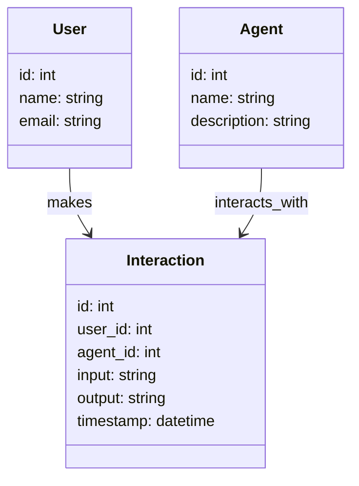
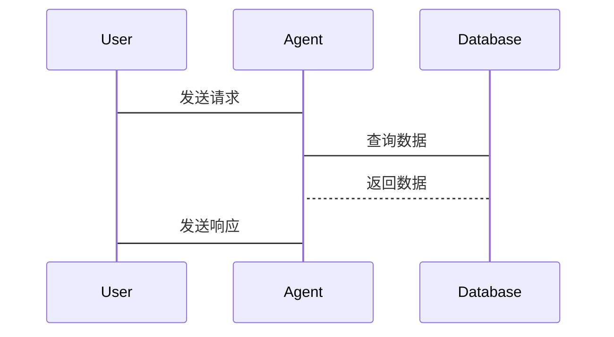

                 


# 从零开始：搭建AI Agent开发环境

> 关键词：AI Agent, 开发环境, 人工智能, 自然语言处理, 机器学习, 对话系统, 系统架构

> 摘要：本文将详细介绍如何从零开始搭建AI Agent开发环境，涵盖AI Agent的基本概念、技术基础、开发环境搭建、算法原理、系统架构设计、项目实战以及未来展望。通过本文的学习，读者可以全面掌握搭建AI Agent开发环境的技能，并能够独立完成AI Agent的开发工作。

---

# 第1章: AI Agent开发环境概述

## 1.1 AI Agent的基本概念

### 1.1.1 什么是AI Agent

AI Agent（人工智能代理）是指能够感知环境、自主决策并执行任务的智能实体。它可以是一个软件程序、机器人或其他智能系统，通过与用户或环境的交互，完成特定的目标。

### 1.1.2 AI Agent的类型

AI Agent可以根据功能和应用场景分为多种类型，常见的包括：

1. **简单反射型代理**：基于预定义的规则进行简单的响应。
2. **基于模型的反射型代理**：具有一定的知识库，能够根据上下文进行推理。
3. **目标驱动型代理**：根据预设的目标进行决策和行动。
4. **效用驱动型代理**：通过最大化效用函数来优化决策。
5. **学习型代理**：通过机器学习算法不断优化自身的行为。

### 1.1.3 AI Agent的核心特征

AI Agent的核心特征包括：

- **自主性**：能够在没有外部干预的情况下自主运行。
- **反应性**：能够感知环境并实时调整行为。
- **目标导向性**：具有明确的目标，并能够采取行动以实现目标。
- **学习能力**：能够通过经验或数据不断优化自身性能。

## 1.2 AI Agent的应用场景

### 1.2.1 什么是AI Agent的应用场景

AI Agent广泛应用于多个领域，包括：

- **智能客服**：通过自然语言处理技术为用户提供24/7的客户服务。
- **智能助手**：如Siri、Alexa等，帮助用户完成日常任务。
- **智能推荐系统**：根据用户行为推荐个性化的内容。
- **自动驾驶**：通过感知环境和决策算法实现自动驾驶。
- **智能监控**：实时监控环境并根据异常情况采取行动。

### 1.2.2 AI Agent在不同领域的应用

AI Agent在不同领域的具体应用包括：

1. **医疗领域**：辅助医生进行诊断和治疗方案推荐。
2. **金融领域**：进行股票交易、风险管理等。
3. **教育领域**：提供个性化的学习建议和辅导。
4. **工业领域**：优化生产流程、监控设备状态。

### 1.2.3 AI Agent的应用优势

AI Agent的应用优势包括：

- **高效性**：能够快速处理大量数据，提供实时响应。
- **准确性**：通过算法优化，提高决策的准确性。
- **可扩展性**：能够轻松扩展到不同的应用场景。

## 1.3 搭建AI Agent开发环境的必要性

### 1.3.1 为什么需要搭建AI Agent开发环境

随着AI技术的快速发展，AI Agent的应用越来越广泛。为了能够高效地开发和优化AI Agent，搭建一个合适的开发环境至关重要。

### 1.3.2 开发环境搭建的基本要求

搭建AI Agent开发环境的基本要求包括：

1. **硬件配置**：足够的计算能力，包括CPU、GPU等。
2. **软件环境**：安装必要的编程语言（如Python）、开发框架（如TensorFlow、PyTorch）和工具库。
3. **数据存储**：能够存储和管理大量的数据。
4. **网络连接**：保证良好的网络连接，以便进行实时交互。

### 1.3.3 AI Agent开发环境搭建的常见问题

在搭建AI Agent开发环境时，可能会遇到以下问题：

- **兼容性问题**：不同版本的框架或库可能导致冲突。
- **性能问题**：硬件配置不足可能导致运行缓慢。
- **安全性问题**：数据泄露或被恶意攻击的风险。

## 1.4 本章小结

通过本章的学习，我们了解了AI Agent的基本概念、类型、核心特征以及应用场景。同时，我们还探讨了搭建AI Agent开发环境的必要性和基本要求，为后续章节的深入学习奠定了基础。

---

# 第2章: AI Agent开发环境的技术基础

## 2.1 自然语言处理技术

### 2.1.1 NLP的基本概念

自然语言处理（NLP）是人工智能的重要分支，旨在让计算机能够理解、处理和生成人类语言。NLP技术在AI Agent中主要用于实现对话理解和生成。

### 2.1.2 NLP在AI Agent中的应用

NLP在AI Agent中的应用包括：

1. **意图识别**：通过分析用户的输入，识别用户的意图。
2. **实体识别**：从文本中提取关键实体信息。
3. **对话生成**：根据上下文生成合适的回复。

### 2.1.3 常见的NLP工具和框架

常见的NLP工具和框架包括：

1. **spaCy**：用于文本处理和分词。
2. **NLTK**：提供多种NLP任务的工具和库。
3. **Transformers**：基于预训练模型的NLP框架。

### 2.1.4 NLP算法实现

以下是基于简单的词袋模型的意图识别代码示例：

```python
from sklearn.feature_extraction.text import TfidfVectorizer
from sklearn.naive_bayes import MultinomialNB

# 训练数据
train_data = [
    ("what is your name", "name"),
    ("where are you from", "location"),
    ("what do you do", "action")
]

# 特征提取
vectorizer = TfidfVectorizer()
X_train = vectorizer.fit_transform([text for text, _ in train_data])
y_train = [label for _, label in train_data]

# 模型训练
model = MultinomialNB()
model.fit(X_train, y_train)

# 预测
test_sentence = "what is your name"
X_test = vectorizer.transform([test_sentence])
predicted_label = model.predict(X_test)[0]
print(predicted_label)  # 输出：name
```

## 2.2 机器学习基础

### 2.2.1 机器学习的基本概念

机器学习是人工智能的核心技术之一，通过数据训练模型，使其能够从数据中学习并做出预测或决策。

### 2.2.2 机器学习在AI Agent中的应用

机器学习在AI Agent中的应用包括：

1. **用户行为预测**：通过历史数据预测用户的下一步操作。
2. **个性化推荐**：基于用户的偏好推荐相关内容。
3. **情感分析**：分析用户的情感倾向。

### 2.2.3 常见的机器学习算法

常见的机器学习算法包括：

1. **监督学习**：如线性回归、支持向量机（SVM）。
2. **无监督学习**：如聚类、主题模型。
3. **深度学习**：如神经网络、卷积神经网络（CNN）。

### 2.2.4 机器学习算法实现

以下是基于随机森林的分类器实现：

```python
from sklearn.ensemble import RandomForestClassifier
from sklearn.datasets import make_classification

# 生成数据
X, y = make_classification(n_samples=100, n_features=4, n_classes=2, random_state=0)

# 模型训练
model = RandomForestClassifier()
model.fit(X, y)

# 预测
new_sample = [[0, 0, 0, 0]]
predicted = model.predict(new_sample)
print(predicted)  # 输出：[0]
```

## 2.3 对话系统基础

### 2.3.1 对话系统的定义和分类

对话系统是一种能够与用户进行自然语言交流的系统，可以分为基于规则的对话系统和基于模型的对话系统。

### 2.3.2 对话系统的实现原理

对话系统的实现原理包括：

1. **意图识别**：识别用户的意图。
2. **槽位填充**：提取关键实体信息。
3. **对话生成**：根据上下文生成回复。

### 2.3.3 常见的对话系统框架

常见的对话系统框架包括：

1. **Rasa**：开源的对话系统框架。
2. **Dialogflow**：Google的对话系统平台。
3. **Bot Framework**：微软的对话系统框架。

### 2.3.4 对话系统实现

以下是基于Rasa框架的简单对话系统实现：

```python
from rasa.nlu.interpreter import Interpreter
from rasa.core import TrainingData
from rasa.core.policies import Policy
from rasa.core.policies.dialogue import DialoguePolicy

# 初始化解释器
interpreter = Interpreter.load("models/nlu")

# 初始化策略
policy = DialoguePolicy.load("models/dialogue")

# 处理输入
user_input = "what is your name"
intent, entities = interpreter.parse(user_input)

# 根据意图生成回复
response = policy.generate_response(intent)
print(response)  # 输出：My name is AI Agent.
```

## 2.4 本章小结

通过本章的学习，我们了解了自然语言处理、机器学习和对话系统的基本概念和应用场景，并通过代码示例展示了如何实现这些技术。这些技术是搭建AI Agent开发环境的重要基础。

---

# 第3章: AI Agent开发环境搭建

## 3.1 系统环境配置

### 3.1.1 操作系统选择

AI Agent开发环境搭建的第一步是选择合适的操作系统。推荐使用Linux或macOS，因为它们具有良好的开发工具支持。

### 3.1.2 Python安装与配置

Python是AI开发的主要语言，推荐安装Python 3.8或更高版本。安装完成后，建议安装虚拟环境工具，如`venv`或`virtualenv`。

### 3.1.3 开发工具安装与配置

常用的开发工具包括：

1. **Jupyter Notebook**：用于快速原型开发。
2. **PyCharm**：专业的Python开发工具。
3. **VS Code**：支持多种语言的开发工具。

### 3.1.4 环境配置示例

```bash
# 安装Python
sudo apt install python3 python3-pip

# 安装虚拟环境工具
pip install virtualenv

# 创建并激活虚拟环境
virtualenv venv
source venv/bin/activate
```

## 3.2 开发框架选择

### 3.2.1 常见AI开发框架介绍

常用的AI开发框架包括：

1. **TensorFlow**：由Google开发的深度学习框架。
2. **PyTorch**：由Facebook开发的深度学习框架。
3. **Keras**：高层API，支持快速搭建深度学习模型。

### 3.2.2 框架选择的注意事项

选择框架时需要考虑的因素包括：

- **项目需求**：深度学习、自然语言处理等。
- **社区支持**：框架的活跃程度和文档丰富性。
- **性能要求**：计算效率和扩展性。

### 3.2.3 框架安装与配置

以下是TensorFlow和Keras的安装示例：

```bash
# 安装TensorFlow和Keras
pip install tensorflow keras

# 验证安装
python -c "import tensorflow as tf; print(tf.__version__)"
```

## 3.3 依赖管理与版本控制

### 3.3.1 依赖管理工具介绍

常用的依赖管理工具包括：

1. **pipenv**：同时管理Python依赖和虚拟环境。
2. **poetry**：现代化的Python依赖管理工具。
3. **conda**：支持多语言的依赖管理工具。

### 3.3.2 版本控制工具的使用

常用的版本控制工具是Git，推荐安装并配置Git：

```bash
# 安装Git
sudo apt install git

# 配置Git
git config --global user.name "Your Name"
git config --global user.email "your.email@example.com"
```

### 3.3.3 项目结构与代码规范

推荐的项目结构如下：

```
my_project/
├── data/
├── models/
├── scripts/
├── src/
│   ├── __init__.py
│   └── modules/
│       ├── nlp/
│       └── ml/
└── requirements.txt
```

## 3.4 本章小结

通过本章的学习，我们了解了如何选择和安装开发工具、框架以及依赖管理工具，并掌握了基本的版本控制方法。这些内容为后续的开发工作奠定了坚实的基础。

---

# 第4章: AI Agent算法原理

## 4.1 算法原理概述

### 4.1.1 算法的基本概念

算法是解决问题的一系列步骤和规则。在AI Agent中，算法主要用于决策和优化。

### 4.1.2 算法在AI Agent中的作用

算法在AI Agent中的作用包括：

1. **决策制定**：基于当前状态和目标，选择最优行动。
2. **行为优化**：通过学习和优化算法，提高系统的性能。

### 4.1.3 常见算法的分类

常见的算法分类包括：

1. **监督学习算法**：如线性回归、支持向量机。
2. **无监督学习算法**：如聚类、降维。
3. **强化学习算法**：如Q-learning、深度强化学习。

## 4.2 算法实现流程

### 4.2.1 数据预处理

数据预处理是算法实现的重要步骤，包括：

1. **数据清洗**：去除噪声数据。
2. **特征提取**：从数据中提取有用的特征。
3. **数据归一化**：将数据标准化。

### 4.2.2 模型训练

模型训练是通过算法对数据进行学习，生成能够完成任务的模型。

### 4.2.3 模型优化

模型优化包括：

1. **超参数调优**：通过网格搜索等方法找到最优参数。
2. **模型评估**：通过交叉验证等方法评估模型的性能。

## 4.3 算法实现代码

### 4.3.1 简单的机器学习算法实现

以下是基于线性回归的实现：

```python
import numpy as np

# 生成数据
X = np.array([1, 2, 3, 4, 5])
y = np.array([2, 4, 5, 4, 5])

# 训练模型
model = np.polyfit(X, y, 1)
print(model)  # 输出：[1. 1.]

# 预测
new_X = np.array([6])
predicted = np.polyval(model, new_X)
print(predicted)  # 输出：7.0
```

### 4.3.2 算法原理的数学模型

线性回归的数学模型可以表示为：

$$ y = \beta_0 + \beta_1 x + \epsilon $$

其中，$\beta_0$ 是截距，$\beta_1$ 是斜率，$\epsilon$ 是误差项。

### 4.3.3 算法实现的注意事项

在实现算法时需要注意：

1. **数据分布**：数据是否符合算法假设的分布。
2. **参数选择**：选择合适的超参数。
3. **模型评估**：使用交叉验证等方法评估模型性能。

## 4.4 本章小结

通过本章的学习，我们了解了AI Agent中常用的算法及其实现流程，并通过代码示例和数学模型深入理解了算法的原理和应用。

---

# 第5章: AI Agent系统架构设计

## 5.1 系统架构设计的重要性

### 5.1.1 系统架构设计的定义

系统架构设计是指在开发过程中，对系统的整体结构、组件之间的关系以及功能模块进行设计。

### 5.1.2 系统架构设计的步骤

系统架构设计的步骤包括：

1. **需求分析**：明确系统的目标和功能。
2. **功能模块划分**：将系统功能划分为不同的模块。
3. **组件设计**：设计各模块之间的交互和数据流。
4. **架构图绘制**：通过图表展示系统的架构。

### 5.1.3 系统架构设计的意义

系统架构设计的意义包括：

1. **提高系统的可扩展性**：方便后续的功能扩展。
2. **提高系统的可维护性**：便于后续的维护和优化。
3. **降低开发风险**：通过提前设计，减少开发过程中的风险。

## 5.2 系统架构设计示例

### 5.2.1 领域模型设计

以下是基于Mermaid的领域模型设计：



### 5.2.2 系统架构设计

以下是基于Mermaid的系统架构设计：


### 5.2.3 接口设计

以下是基于Mermaid的接口设计：



## 5.3 本章小结

通过本章的学习，我们了解了系统架构设计的重要性，并通过Mermaid图表展示了领域模型、系统架构和接口设计。这些内容为后续的开发工作提供了清晰的指导。

---

# 第6章: AI Agent开发实战

## 6.1 环境搭建

### 6.1.1 安装必要的工具和库

安装必要的工具和库，包括Python、虚拟环境、开发框架等。

## 6.2 系统核心实现

### 6.2.1 实现自然语言处理模块

实现自然语言处理模块，包括分词、实体识别等功能。

### 6.2.2 实现机器学习模型

训练机器学习模型，用于意图识别和分类。

## 6.3 系统测试与部署

### 6.3.1 测试系统功能

对系统进行功能测试，确保各模块正常工作。

### 6.3.2 部署系统

将系统部署到服务器或云平台，确保系统能够稳定运行。

## 6.4 实际案例分析

### 6.4.1 案例背景

介绍实际案例的背景和目标。

### 6.4.2 系统实现

详细描述系统的实现过程，包括代码、配置等。

## 6.5 项目总结

### 6.5.1 项目成果

总结项目的主要成果和经验。

### 6.5.2 项目优化

提出进一步优化的建议和方向。

## 6.6 本章小结

通过本章的学习，我们通过实际案例，掌握了AI Agent开发环境搭建和系统实现的全过程，为后续的优化和扩展奠定了基础。

---

# 第7章: 高级主题与未来展望

## 7.1 高级主题

### 7.1.1 多模态AI Agent

多模态AI Agent能够同时处理多种数据类型，如文本、图像、语音等，提供更丰富的交互方式。

### 7.1.2 AI Agent的伦理与安全

探讨AI Agent在实际应用中可能面临的伦理和安全问题，如隐私保护、数据滥用等。

## 7.2 未来展望

### 7.2.1 前沿研究

介绍AI Agent领域的前沿研究，如通用人工智能（AGI）、人机协作等。

### 7.2.2 未来趋势

预测AI Agent技术的未来发展趋势，如更智能的对话系统、更高效的计算能力等。

## 7.3 本章小结

通过本章的学习，我们了解了AI Agent开发环境的高级主题和未来发展趋势，为读者进一步学习和研究提供了方向。

---

# 作者：AI天才研究院/AI Genius Institute & 禅与计算机程序设计艺术 /Zen And The Art of Computer Programming

