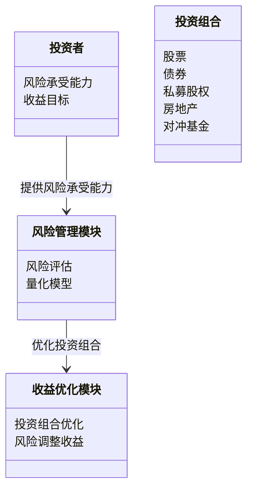

                 


# 另类投资在投资组合中的作用

## 关键词：另类投资、投资组合、私募股权、对冲基金、风险管理、收益增强

## 摘要：
本文探讨了另类投资在现代投资组合中的关键作用，分析了其核心概念、策略及对风险管理和收益增强的贡献。通过理论与实际案例结合，展示了如何将另类资产整合到投资组合中以优化表现。

---

# 第一部分: 另类投资的背景与概念

## 第1章: 另类投资的定义与背景

### 1.1 另类投资的定义与特点
#### 1.1.1 另类投资的定义
另类投资是指除传统股票和债券之外的投资方式，包括私募股权、房地产、对冲基金等。

#### 1.1.2 另类投资的核心特点
- **多样性**：覆盖多种资产类别。
- **非流动性**：部分资产难以快速变现。
- **高门槛**：通常需要较大资金投入。
- **复杂性**：涉及复杂的交易结构和策略。

#### 1.1.3 另类投资与传统投资的区别
| 特性          | 传统投资（股票、债券） | 另类投资（私募股权、房地产） |
|---------------|--------------------------|-----------------------------|
| 流动性         | 高                      | 低                         |
| 投资门槛       | 低                      | 高                         |
| 收益来源       | 股息、资本增值          | 股权增值、租金收入          |
| 风险级别       | 中等                    | 高                         |

### 1.2 另类投资的背景与发展趋势
#### 1.2.1 传统投资的局限性
- **收益受限**：在低利率环境下，债券和股票的回报有限。
- **风险集中**：过于依赖股票和债券可能导致投资组合过于集中，风险较高。

#### 1.2.2 另类投资的兴起
- **分散风险**：通过投资不同类型资产降低整体风险。
- **寻求超额收益**：在低增长环境下，另类资产可能提供更高回报。

#### 1.2.3 另类投资的未来发展趋势
- **多元化配置**：投资者越来越倾向于配置另类资产以分散风险。
- **技术创新**：金融科技的应用使另类投资更高效、透明。

### 1.3 另类投资的分类与应用场景
#### 1.3.1 私募股权与风险投资
- **私募股权**：投资于未上市公司的股权，通过企业增值实现收益。
- **风险投资**：主要投资于初创企业，风险高，但潜在回报巨大。

#### 1.3.2 房地产投资
- **住宅地产**：通过购买房产出租或增值获利。
- **商业地产**：投资于写字楼、商场等，收益来自租金和资本增值。

#### 1.3.3 对冲基金与绝对收益策略
- **对冲基金**：采用多种策略（如多空头寸）以追求绝对收益，无论市场涨跌。
- **绝对收益策略**：通过套利、 arbitrage等手段在市场中寻找无风险收益。

#### 1.3.4 其他另类资产介绍
- **大宗商品**：包括黄金、原油等，用于对冲通胀风险。
- **基础设施投资**：投资于交通、能源等基础设施项目，收益稳定。

### 1.4 另类投资在投资组合中的作用
#### 1.4.1 另类资产的风险分散作用
- **非相关性**：另类资产与传统资产的相关性较低，降低整体投资组合的风险。

#### 1.4.2 另类资产的收益增强作用
- **超额收益潜力**：通过私募股权和对冲基金等，获取超过市场平均水平的收益。

#### 1.4.3 另类资产的流动性管理
- **期限匹配**：不同期限的另类资产帮助投资者更好地管理资金流动性。

### 1.5 本章小结
本章介绍了另类投资的基本概念、特点及其在投资组合中的重要性。通过对比传统投资，突出了另类投资在风险分散和收益增强方面的作用。

---

# 第二部分: 另类投资的核心概念与原理

## 第2章: 另类投资的核心概念

### 2.1 另类投资的主要类型与特征
#### 2.1.1 私募股权
- **杠杆收购**：通过借债收购公司，用企业未来现金流偿还债务，提升股东回报。
- **风险与回报**：高风险，但潜在回报也高。

#### 2.1.2 房地产投资
- **杠杆使用**：通常通过贷款购买房地产，提高杠杆比率以放大收益。
- **周期性影响**：受房地产市场周期性波动影响较大。

#### 2.1.3 对冲基金
- **策略多样性**：包括市场中性、套利、事件驱动等多种策略。
- **收费结构**：通常采用“2+20”收费模式（管理费2%，业绩分成20%）。

#### 2.1.4 其他另类资产
- **基础设施**：收益稳定，但流动性较差。
- **大宗商品**：对冲通胀，但价格波动较大。

### 2.2 另类投资的收益与风险分析
#### 2.2.1 另类资产的收益来源
- **私募股权**：通过公司增值和退出（IPO或并购）实现收益。
- **房地产**：租金收入和资本增值。

#### 2.2.2 另类资产的风险特征
- **流动性风险**：部分另类资产难以快速变现。
- **市场风险**：受宏观经济波动影响较大。
- **信用风险**：私募股权和杠杆收购涉及较高的债务风险。

#### 2.2.3 另类资产与宏观经济周期的关系
- **经济上行**：私募股权和房地产表现较好。
- **经济下行**：对冲基金等策略可能提供相对稳定的回报。

### 2.3 另类投资的估值与定价
#### 2.3.1 私募股权的估值
- **DCF模型**：使用现金流折现法评估企业价值。
- **可比公司分析**：与同类企业进行对比，估算企业价值。

#### 2.3.2 房地产投资的资本化率
- **资本化率公式**：资本化率 = 年租金收入 / 估价值
- 例如：某房地产年租金收入为100万元，资本化率为5%，则估价值为2000万元。

### 2.4 另类投资的杠杆与结构化
#### 2.4.1 杠杆的使用
- **私募股权**：常用杠杆收购，通过债务融资增加股权回报。
- **房地产**：通过按揭贷款降低初始投资门槛。

#### 2.4.2 结构化金融工具
- **可转换债券**：在特定条件下可转换为股票，提供灵活的融资方式。
- **夹层融资**：介于 senior debt 和 equity 之间的融资工具，风险和回报介于两者之间。

#### 2.4.3 杠杆对风险的影响
- **杠杆效应**：放大收益同时也放大损失，增加投资风险。

### 2.5 本章小结
本章深入分析了另类投资的主要类型、收益来源、风险特征以及与宏观经济的关系。通过具体的估值方法和杠杆策略，帮助投资者更好地理解和管理另类投资的风险与收益。

---

# 第三部分: 另类投资的算法原理与系统分析

## 第3章: 另类投资的算法原理

### 3.1 现代投资组合理论（MPT）与另类投资
#### 3.1.1 MPT的核心思想
- **风险调整收益**：在不同风险水平下选择最优收益。
- **有效前沿**：通过组合投资达到最优风险-收益平衡。

#### 3.1.2 风险调整后的收益评估
- **夏普比率**：衡量投资组合超额收益相对于其风险的表现。
  $$ \text{夏普比率} = \frac{R_p - R_f}{\sigma_p} $$
  其中，\( R_p \) 是投资组合的平均收益，\( R_f \) 是无风险利率，\( \sigma_p \) 是投资组合的波动率。

#### 3.1.3 投资组合优化的数学模型
- **均值-方差优化**：
  $$ \min_w \sigma_p^2 $$
  $$ \text{subject to } \sum w_i = 1 $$
  $$ \text{和 } \sum w_i R_i = R_p $$

### 3.2 另类投资的风险对冲策略
#### 3.2.1 信用对冲
- **CDO（债务抵押债券）**：通过分散不同发行人的债券，降低信用风险。

#### 3.2.2 市场中性策略
- **对冲基金策略**：通过做多和做空同一资产或相关资产，抵消市场波动风险。

### 3.3 系统性风险与非系统性风险的管理
#### 3.3.1 系统性风险
- **宏观经济因素**：如经济衰退、通货膨胀等影响整体市场的风险。

#### 3.3.2 非系统性风险
- **特定资产风险**：如某只股票的业绩下滑风险。

### 3.4 本章小结
本章结合现代投资组合理论，分析了另类投资在风险管理和收益优化中的算法原理，强调了对冲策略和投资组合优化的重要性。

---

# 第四部分: 另类投资的系统分析与架构设计

## 第4章: 另类投资的系统分析

### 4.1 问题场景介绍
#### 4.1.1 投资者需求
- **风险厌恶型**：寻求稳定回报。
- **风险偏好型**：追求高收益，愿意承担高风险。

#### 4.1.2 投资目标
- **风险承受能力**：根据投资者的风险承受能力设计投资组合。
- **收益目标**：设定投资组合的预期收益。

### 4.2 系统功能设计
#### 4.2.1 领域模型


### 4.3 系统架构设计


### 4.4 接口设计
#### 4.4.1 输入接口
- **投资者信息**：风险承受能力、投资期限、收益目标。

#### 4.4.2 输出接口
- **投资组合建议**：推荐的资产配置、预期收益和风险水平。
- **风险报告**：定期的风险评估和调整建议。

### 4.5 本章小结
本章从系统架构的角度分析了另类投资的实现方式，强调了风险管理模块和收益优化模块的重要性。

---

# 第五部分: 另类投资的项目实战

## 第5章: 另类投资的项目实战

### 5.1 环境安装与数据准备
#### 5.1.1 环境安装
- **Python**：安装Anaconda或Miniconda。
- **Jupyter Notebook**：用于数据可视化和算法实现。

#### 5.1.2 数据准备
- **历史数据**：获取私募股权和房地产的历史回报数据。
- **市场数据**：包括宏观经济指标、行业趋势等。

### 5.2 核心代码实现
#### 5.2.1 投资组合优化代码
```python
import numpy as np
import pandas as pd
from scipy.optimize import minimize

# 假设我们有私募股权、房地产、对冲基金的回报数据
returns = pd.DataFrame({
    'Private Equity': [0.1, 0.05, 0.15],
    'Real Estate': [0.08, 0.1, 0.05],
    'Hedge Fund': [0.12, 0.08, 0.1]
})

# 定义优化目标函数
def portfolio_optimization(weights, returns):
    return - (returns.dot(weights).mean())

# 定义约束条件
cons = ({'type': 'eq', 'fun': lambda w: np.sum(w) - 1})

# 初始权重
initial_guess = [1/3, 1/3, 1/3]

# 使用scipy.optimize进行优化
result = minimize(portfolio_optimization, initial_guess, args=returns, constraints=cons)

# 输出结果
print("最优权重:", result.x)
print("最优收益:", -result.fun)
```

#### 5.2.2 风险评估代码
```python
import numpy as np

# 假设我们有私募股权、房地产、对冲基金的回报协方差矩阵
cov_matrix = np.array([
    [0.05, 0.02, 0.03],
    [0.02, 0.10, 0.01],
    [0.03, 0.01, 0.08]
])

# 定义夏普比率计算函数
def calculate_sharpe_ratio(weights, cov_matrix, risk_free_rate=0.02):
    portfolio_variance = np.dot(weights.T, np.dot(cov_matrix, weights))
    portfolio_std_deviation = np.sqrt(portfolio_variance)
    portfolio_return = np.dot(weights.T, np.array([0.1, 0.08, 0.12]))
    sharpe_ratio = (portfolio_return - risk_free_rate) / portfolio_std_deviation
    return sharpe_ratio

# 示例权重
weights = [0.4, 0.3, 0.3]
sharpe_ratio = calculate_sharpe_ratio(weights, cov_matrix)
print("夏普比率:", sharpe_ratio)
```

### 5.3 代码解读与实际案例分析
#### 5.3.1 代码解读
- **投资组合优化**：通过优化算法找到最优资产配置，以最大化收益或最小化风险。
- **风险评估**：使用夏普比率衡量投资组合的收益与风险之比。

#### 5.3.2 实际案例分析
- **案例1**：构建一个包含私募股权和房地产的投资组合，目标是分散风险并追求稳定收益。
- **案例2**：结合对冲基金和私募股权，制定一个高风险、高回报的投资策略。

### 5.4 本章小结
本章通过实际项目案例，展示了如何将另类资产整合到投资组合中，并通过代码实现投资组合优化和风险评估。

---

# 第六部分: 另类投资的最佳实践

## 第6章: 另类投资的最佳实践

### 6.1 小结
- **核心概念**：另类投资通过多样化资产类型降低风险，提供超额收益。
- **系统设计**：构建包含另类资产的投资组合需要科学的系统架构和算法支持。
- **实战经验**：通过实际案例分析和代码实现，掌握投资组合优化和风险评估的技巧。

### 6.2 注意事项
- **流动性风险**：部分另类资产流动性差，可能导致资金无法及时变现。
- **市场周期**：不同资产在不同经济周期的表现差异显著，需灵活调整。
- **杠杆使用**：合理使用杠杆，避免过度杠杆导致的风险放大。

### 6.3 拓展阅读
- **书籍推荐**：
  - 《投资学》（书籍名称）：系统介绍投资学的基本理论。
  - 《对冲基金策略》：深入分析对冲基金的多种策略。
- **网络资源**：
  - 文章链接：介绍另类投资的最新动态和策略。

### 6.4 本章小结
本章总结了全文内容，并提供了实际操作中的注意事项和拓展学习的方向，帮助读者更好地理解和应用另类投资策略。

---

# 结语

另类投资在现代投资组合中扮演着越来越重要的角色。通过科学的系统设计和最佳实践，投资者可以有效管理风险，实现收益最大化。希望本文能为读者提供有价值的见解和实用的指导。

---

# 作者

作者：AI天才研究院/AI Genius Institute  
禅与计算机程序设计艺术 /Zen And The Art of Computer Programming

