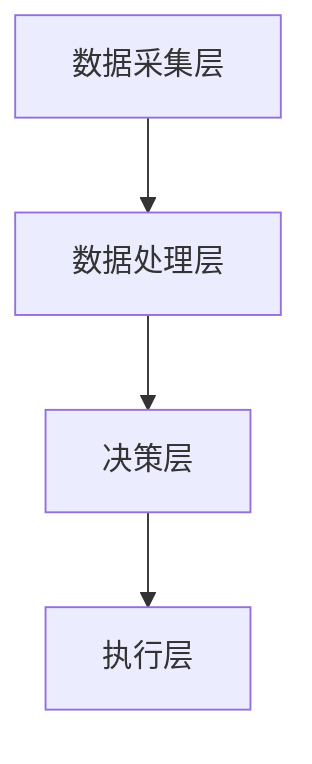
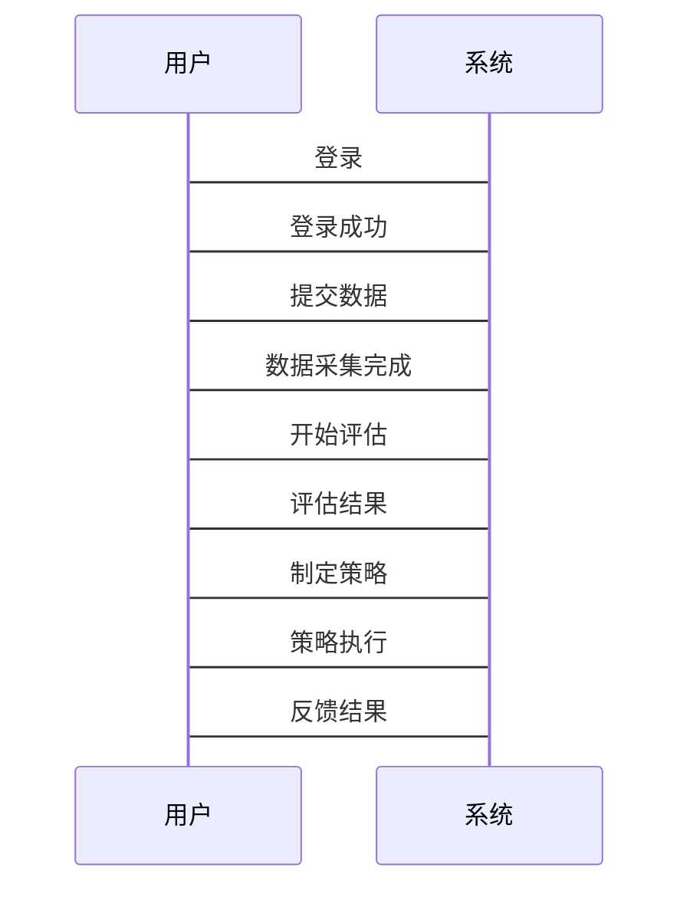

                 


# 多智能体系统在全球供应链风险评估中的应用

> 关键词：多智能体系统、供应链风险管理、全球供应链、风险评估、人工智能、分布式计算

> 摘要：本文探讨了多智能体系统（Multi-Agent Systems, MAS）在全球供应链风险评估中的应用。通过分析MAS的核心概念、算法原理、系统架构设计以及实际项目案例，本文展示了如何利用MAS技术优化供应链风险管理流程，提升企业应对复杂供应链挑战的能力。文章内容涵盖MAS的基本原理、供应链风险管理的挑战与解决方案、基于博弈论和强化学习的MAS算法设计，以及实际项目中的系统架构设计和实现。

---

# 第一部分: 多智能体系统与供应链风险评估背景

# 第1章: 多智能体系统与供应链管理概述

## 1.1 多智能体系统的定义与特点

### 1.1.1 多智能体系统的定义

多智能体系统（MAS, Multi-Agent Systems）是由多个智能体（Agent）组成的分布式系统，这些智能体通过协作和交互完成复杂的任务。智能体是指能够感知环境、做出决策并采取行动的实体。

**关键特点：**

- **自主性**：智能体能够自主决策，无需外部干预。
- **反应性**：能够实时感知环境变化并做出反应。
- **协作性**：多个智能体之间可以协作完成共同目标。
- **分布式性**：智能体分布在不同的位置，通过通信进行协作。

### 1.1.2 多智能体系统的属性与特征

| 特性         | 描述                                                         |
|--------------|--------------------------------------------------------------|
| 分布式       | 智能体分布在网络中，不存在中心化控制                           |
| 协作性       | 智能体之间通过协作完成任务                                   |
| 反应性       | 能够实时感知环境并做出反应                                   |
| 社会性       | 智能体之间存在社会交互，可能涉及博弈和冲突                   |

### 1.1.3 多智能体系统与传统单智能体系统的区别

| 对比维度       | 单智能体系统                          | 多智能体系统                          |
|----------------|-------------------------------------|---------------------------------------|
| 结构           | 单一中心化结构                       | 分布式结构，多个智能体协作             |
| 决策方式       | 单一决策中心                        | 分布式决策，多个智能体共同参与决策     |
| 通信           | 无或单向通信                        | 智能体之间存在双向通信               |

## 1.2 供应链管理的定义与特点

### 1.2.1 供应链管理的基本概念

供应链管理（SCM, Supply Chain Management）是指对供应链中的各个环节进行规划、执行、监控和优化的过程。供应链包括供应商、制造商、分销商、零售商和消费者等多个环节。

**关键流程：**

- **采购**：原材料和零部件的采购。
- **生产**：产品的制造过程。
- **物流**：产品的运输和配送。
- **库存管理**：库存的监控和优化。
- **客户管理**：订单处理和客户服务。

### 1.2.2 供应链管理的核心流程

供应链管理的核心流程可以分为以下几个步骤：

1. **需求预测**：基于历史数据和市场分析，预测未来的市场需求。
2. **供应商选择**：选择合适的供应商，确保原材料的质量和交货时间。
3. **生产计划**：制定生产计划，确保生产效率和产品质量。
4. **库存管理**：监控库存水平，避免库存积压或短缺。
5. **物流优化**：优化物流网络，降低运输成本和时间。

### 1.2.3 供应链管理的挑战与优化方向

供应链管理面临的主要挑战包括：

- **复杂性**：供应链涉及多个环节和参与者，协调难度大。
- **不确定性**：市场需求波动、供应商延迟、自然灾害等因素会影响供应链的稳定性。
- **信息孤岛**：不同环节之间存在信息不畅的问题，导致决策效率低下。

优化方向：

- **数字化转型**：利用信息技术提高供应链的透明度和效率。
- **智能化管理**：引入人工智能和多智能体系统提升供应链的预测和决策能力。
- **风险管理**：建立风险评估和应对机制，降低供应链中断的风险。

## 1.3 多智能体系统在供应链管理中的应用背景

### 1.3.1 供应链风险管理的重要性

供应链风险管理是指识别、评估和应对可能影响供应链的各类风险，包括市场风险、操作风险、信用风险和自然灾害风险等。

**重要性：**

- **减少中断风险**：通过提前识别潜在风险，采取预防措施，降低供应链中断的可能性。
- **提高效率**：通过优化供应链流程，减少成本，提高整体效率。
- **增强灵活性**：在面对突发事件时，能够快速调整供应链策略，保证业务的连续性。

### 1.3.2 多智能体系统在供应链风险管理中的优势

多智能体系统在供应链风险管理中的优势主要体现在以下几个方面：

- **分布式决策**：多个智能体可以独立决策，减少单点故障的风险。
- **协作能力**：智能体之间可以协作，共同应对供应链中的复杂问题。
- **实时响应**：智能体能够实时感知环境变化，快速做出反应。

### 1.3.3 当前研究现状与未来趋势

当前研究现状：

- **分布式计算技术**：多智能体系统在分布式计算领域的应用已经相对成熟。
- **博弈论与优化算法**：基于博弈论的决策模型和强化学习算法在供应链风险管理中得到了广泛应用。

未来趋势：

- **智能化与自动化**：多智能体系统将进一步智能化，实现供应链管理的自动化。
- **大数据与区块链**：结合大数据和区块链技术，提升供应链的透明度和安全性。
- **边缘计算**：在边缘计算的支持下，多智能体系统能够更高效地处理实时数据。

## 1.4 本章小结

本章主要介绍了多智能体系统的基本概念和特点，分析了供应链管理的核心流程和挑战，探讨了多智能体系统在供应链风险管理中的应用背景和优势，并展望了未来的研究方向。通过本章的分析，我们可以看到，多智能体系统在供应链风险管理中具有重要的应用价值，能够有效提升供应链的稳定性和效率。

---

# 第二部分: 多智能体系统的核心概念与原理

# 第2章: 多智能体系统的核心概念

## 2.1 多智能体系统的组成与结构

### 2.1.1 智能体的定义与分类

智能体是指能够感知环境、做出决策并采取行动的实体。根据智能体的智能水平和行为方式，可以将其分为以下几类：

- **反应式智能体**：根据当前环境状态做出反应，不依赖于内部知识库。
- **认知式智能体**：具有复杂的知识表示和推理能力，能够进行长期规划。
- **学习型智能体**：能够通过经验学习，改进自身的决策能力。

### 2.1.2 多智能体系统的层次结构

多智能体系统的层次结构可以分为以下几个层次：

1. **物理层**：包括硬件设备和物理环境。
2. **数据层**：包括数据采集、存储和处理。
3. **计算层**：包括分布式计算和智能体协作。
4. **应用层**：包括具体的业务应用和用户界面。

### 2.1.3 智能体之间的交互关系

智能体之间的交互关系可以通过以下几种方式实现：

- **直接通信**：智能体之间直接交换信息。
- **间接通信**：通过中间媒介进行信息传递。
- **协作与竞争**：智能体之间可以协作完成任务，也可以存在竞争关系。

## 2.2 多智能体系统的核心概念

### 2.2.1 多智能体系统的通信与协作机制

多智能体系统的通信与协作机制是实现智能体协作的关键。智能体之间的通信可以通过以下几种方式实现：

- **消息传递**：智能体通过发送消息进行信息交换。
- **状态共享**：智能体之间共享当前状态，以便更好地协作。

### 2.2.2 多智能体系统的决策模型

多智能体系统的决策模型可以根据智能体的智能水平和决策方式分为以下几类：

- **基于规则的决策模型**：根据预定义的规则进行决策。
- **基于博弈论的决策模型**：通过博弈论分析，选择最优策略。
- **基于强化学习的决策模型**：通过强化学习算法优化决策。

## 2.3 多智能体系统的决策模型

### 2.3.1 基于博弈论的决策模型

博弈论是一种研究决策的数学理论，广泛应用于多智能体系统的决策模型中。以下是基于博弈论的决策模型的实现步骤：

1. **定义博弈环境**：确定博弈的参与者、行动和结果。
2. **确定博弈规则**：包括支付函数、策略空间等。
3. **求解均衡点**：通过求解纳什均衡点，确定最优策略。

### 2.3.2 基于强化学习的决策模型

强化学习是一种通过试错方式优化决策的算法。以下是基于强化学习的决策模型的实现步骤：

1. **定义状态空间**：确定智能体所处的状态。
2. **定义动作空间**：确定智能体可以执行的动作。
3. **定义奖励函数**：定义奖励函数，用于评估智能体的动作。
4. **训练智能体**：通过不断尝试和学习，优化智能体的决策策略。

### 2.3.3 基于规则的决策模型

基于规则的决策模型是通过预定义的规则进行决策的模型。以下是基于规则的决策模型的实现步骤：

1. **定义规则库**：预定义一组规则，用于指导智能体的决策。
2. **智能体感知环境**：智能体感知当前环境状态。
3. **应用规则进行决策**：根据当前环境状态，应用相应的规则进行决策。

## 2.4 本章小结

本章主要介绍了多智能体系统的核心概念，包括智能体的定义与分类、多智能体系统的层次结构、智能体之间的交互关系以及多智能体系统的决策模型。通过本章的分析，我们可以更好地理解多智能体系统的基本原理和实现方式。

---

# 第三部分: 多智能体系统在供应链风险评估中的算法原理

# 第3章: 多智能体系统的核心算法

## 3.1 分布式计算与多智能体协作算法

### 3.1.1 分布式计算的基本原理

分布式计算是指在多个计算节点上进行计算的过程。分布式计算的基本原理是将任务分解成多个子任务，分别在不同的节点上执行，最后将结果汇总。

### 3.1.2 多智能体协作算法的实现流程

多智能体协作算法的实现流程如下：

1. **任务分解**：将任务分解成多个子任务，分配给不同的智能体。
2. **智能体协作**：智能体之间通过通信进行协作，共同完成任务。
3. **结果汇总**：将各个智能体的结果汇总，得到最终结果。

### 3.1.3 算法的复杂度分析

算法的复杂度分析是评估算法性能的重要指标。复杂度分析通常包括时间复杂度和空间复杂度。

- **时间复杂度**：算法运行所需的时间。
- **空间复杂度**：算法运行所需的存储空间。

### 3.2 基于博弈论的风险评估算法

#### 3.2.1 博弈论的基本概念

博弈论是一种研究决策的数学理论，广泛应用于多智能体系统的决策模型中。以下是博弈论的基本概念：

- **参与者**：博弈中的决策者。
- **行动**：参与者可以采取的行动。
- **结果**：行动的结果。
- **支付函数**：参与者在不同结果下的收益或损失。

#### 3.2.2 基于博弈论的风险评估模型

基于博弈论的风险评估模型的实现步骤如下：

1. **定义博弈环境**：确定博弈的参与者、行动和结果。
2. **确定博弈规则**：包括支付函数、策略空间等。
3. **求解均衡点**：通过求解纳什均衡点，确定最优策略。

#### 3.2.3 算法的实现步骤与案例分析

**实现步骤：**

1. **定义博弈环境**：假设供应链中有两个参与者，分别是供应商和制造商。
2. **确定博弈规则**：供应商可以选择高价格或低价格，制造商可以选择大量采购或少量采购。
3. **求解均衡点**：通过分析支付函数，确定纳什均衡点。

**案例分析：**

假设供应商和制造商之间的博弈支付矩阵如下：

|           | 制造商选择大量采购 | 制造商选择少量采购 |
|-----------|---------------------|--------------------|
| 供应商选择高价格 | (2, 3)             | (1, 4)             |
| 供应商选择低价格 | (3, 2)             | (4, 1)             |

通过分析支付矩阵，我们可以看到，纳什均衡点是供应商选择低价格，制造商选择少量采购，此时支付函数为(4,1)。

### 3.3 基于强化学习的供应链优化算法

#### 3.3.1 强化学习的基本原理

强化学习是一种通过试错方式优化决策的算法。强化学习的基本原理包括以下几点：

- **状态空间**：智能体所处的状态。
- **动作空间**：智能体可以执行的动作。
- **奖励函数**：智能体动作的奖励或惩罚。

#### 3.3.2 基于强化学习的供应链优化模型

基于强化学习的供应链优化模型的实现步骤如下：

1. **定义状态空间**：包括供应链中的各个状态，如库存水平、市场需求等。
2. **定义动作空间**：包括智能体可以执行的动作，如调整生产计划、优化物流等。
3. **定义奖励函数**：定义奖励函数，用于评估智能体的动作。
4. **训练智能体**：通过不断尝试和学习，优化智能体的决策策略。

#### 3.3.3 算法的训练过程与效果评估

**训练过程：**

1. **初始化**：初始化智能体的参数和状态。
2. **环境交互**：智能体与环境进行交互，执行动作并观察结果。
3. **学习更新**：根据奖励函数更新智能体的策略。
4. **迭代训练**：重复环境交互和学习更新过程，直到达到训练目标。

**效果评估：**

- **收敛性**：算法是否能够收敛到最优策略。
- **效率**：算法的训练时间和计算资源消耗。
- **稳定性**：算法在不同环境下的稳定性。

## 3.4 本章小结

本章主要介绍了多智能体系统的核心算法，包括分布式计算与多智能体协作算法、基于博弈论的风险评估算法和基于强化学习的供应链优化算法。通过本章的分析，我们可以更好地理解多智能体系统在供应链风险评估中的具体实现方式。

---

# 第四部分: 多智能体系统在供应链风险评估中的系统架构设计

# 第4章: 供应链风险评估系统架构设计

## 4.1 问题场景介绍

供应链风险评估系统是为了帮助企业识别和应对供应链中的潜在风险，确保供应链的稳定性和效率。常见的供应链风险包括供应商延迟、库存积压、物流中断等。

## 4.2 系统功能设计

供应链风险评估系统的功能设计包括以下几个方面：

1. **风险识别**：识别供应链中的潜在风险。
2. **风险评估**：评估风险的影响程度。
3. **风险应对**：制定应对策略，降低风险的影响。

## 4.3 系统架构设计

### 4.3.1 系统架构设计

供应链风险评估系统的架构设计包括以下几个部分：

1. **数据采集层**：负责采集供应链中的各种数据，如库存数据、订单数据等。
2. **数据处理层**：对采集的数据进行处理和分析。
3. **决策层**：基于分析结果，制定决策和应对策略。
4. **执行层**：执行决策和应对策略，优化供应链的运行。

### 4.3.2 系统架构图



## 4.4 系统接口设计

供应链风险评估系统的接口设计包括以下几个方面：

1. **数据接口**：与ERP系统、物流系统等外部系统进行数据交互。
2. **用户接口**：提供用户友好的操作界面，方便用户进行操作。

## 4.5 系统交互设计

### 4.5.1 系统交互流程

供应链风险评估系统的交互流程如下：

1. **用户登录**：用户登录系统。
2. **数据采集**：系统采集供应链中的数据。
3. **风险评估**：系统对采集的数据进行风险评估。
4. **决策制定**：系统基于评估结果制定应对策略。
5. **策略执行**：系统执行制定的应对策略。
6. **结果反馈**：系统向用户反馈执行结果。

### 4.5.2 交互流程图



## 4.6 本章小结

本章主要介绍了供应链风险评估系统的架构设计，包括系统功能设计、系统架构设计、系统接口设计和系统交互设计。通过本章的分析，我们可以更好地理解多智能体系统在供应链风险评估中的具体实现方式。

---

# 第五部分: 多智能体系统在供应链风险评估中的项目实战

# 第5章: 项目实战

## 5.1 环境安装

### 5.1.1 安装Python环境

```bash
python --version
pip install --upgrade pip
```

### 5.1.2 安装依赖库

```bash
pip install numpy matplotlib
```

## 5.2 核心代码实现

### 5.2.1 数据预处理

```python
import numpy as np

def preprocess(data):
    # 数据预处理代码
    return processed_data
```

### 5.2.2 风险评估模型

```python
def risk_assessment_model(data):
    # 风险评估模型代码
    return risk_score
```

### 5.2.3 算法实现

```python
def distributed_algorithm(data):
    # 分布式算法实现代码
    return result
```

## 5.3 代码应用解读与分析

### 5.3.1 代码实现细节

- 数据预处理：对原始数据进行清洗和转换，确保数据的准确性和一致性。
- 风险评估模型：基于多智能体系统的决策模型，评估供应链中的潜在风险。
- 算法实现：实现分布式计算和多智能体协作算法，优化供应链的风险评估过程。

### 5.3.2 代码实现的优化

- 并行计算：利用多线程或分布式计算技术，提高算法的计算效率。
- 模型优化：通过参数调整和优化算法，提高模型的准确性和效率。

## 5.4 案例分析与详细讲解

### 5.4.1 案例背景

假设我们有一个供应链系统，包括供应商、制造商和零售商三个环节。我们需要评估供应链中的潜在风险，并制定应对策略。

### 5.4.2 案例分析

1. **数据采集**：采集供应链中的各种数据，如库存数据、订单数据等。
2. **数据处理**：对采集的数据进行处理和分析，识别潜在风险。
3. **风险评估**：评估风险的影响程度，制定应对策略。
4. **策略执行**：执行制定的应对策略，优化供应链的运行。
5. **结果反馈**：系统向用户反馈执行结果，不断优化供应链的风险评估过程。

## 5.5 项目小结

通过本章的项目实战，我们可以看到，多智能体系统在供应链风险评估中的应用具有重要的实际意义。通过实现分布式计算和多智能体协作算法，可以有效优化供应链的风险评估过程，提升供应链的稳定性和效率。

---

# 第六部分: 总结与展望

## 6.1 总结

本文探讨了多智能体系统在全球供应链风险评估中的应用。通过分析MAS的核心概念、算法原理、系统架构设计以及实际项目案例，本文展示了如何利用MAS技术优化供应链风险管理流程，提升企业应对复杂供应链挑战的能力。文章内容涵盖MAS的基本原理、供应链风险管理的挑战与解决方案、基于博弈论和强化学习的MAS算法设计，以及实际项目中的系统架构设计和实现。

## 6.2 展望

未来的研究方向包括以下几个方面：

1. **智能化与自动化**：进一步提升多智能体系统的智能化水平，实现供应链管理的自动化。
2. **大数据与区块链**：结合大数据和区块链技术，提升供应链的透明度和安全性。
3. **边缘计算**：在边缘计算的支持下，多智能体系统能够更高效地处理实时数据，提升供应链的实时响应能力。

## 6.3 最佳实践 tips

- **数据质量管理**：确保数据的准确性和完整性，是供应链风险管理的基础。
- **模型优化**：通过不断优化模型参数和算法，提高供应链风险管理的准确性和效率。
- **系统维护**：定期维护和更新系统，确保系统的稳定性和安全性。

## 6.4 小结

通过本文的探讨，我们可以看到，多智能体系统在全球供应链风险评估中的应用具有广泛的应用前景。随着人工智能和分布式计算技术的不断发展，多智能体系统将在供应链风险管理中发挥越来越重要的作用。

---

# 作者：AI天才研究院/AI Genius Institute & 禅与计算机程序设计艺术/Zen And The Art of Computer Programming

---

**[End of Article]**

