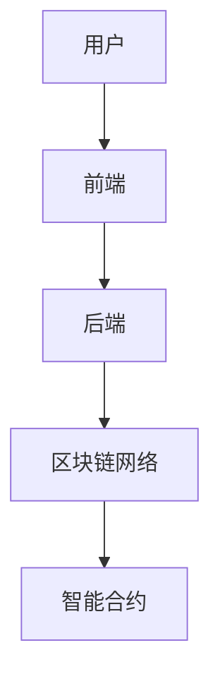

                 


# 如何评估企业的区块链数字资产管理平台

> 关键词：区块链，数字资产管理，平台评估，共识机制，智能合约，系统架构

> 摘要：本文详细探讨了如何评估企业区块链数字资产管理平台，涵盖从核心概念到算法原理、系统架构、项目实战等各个方面。通过分析区块链技术在数字资产管理中的应用，本文提供了评估平台的关键指标和方法，帮助企业在数字化转型中构建高效、安全的数字资产管理平台。

---

## 第一部分：区块链数字资产管理平台背景与核心概念

### 第1章：区块链数字资产管理平台概述

#### 1.1 区块链技术与数字资产管理的结合

##### 1.1.1 区块链技术的基本概念

区块链是一种分布式账本技术，通过去中心化、不可篡改和可追溯的特性，确保数据的安全性和透明性。区块链的核心组件包括：

- **区块**：数据的容器，包含交易记录、时间戳等信息。
- **链式结构**：每个区块都包含前一个区块的哈希值，形成一条链式结构。
- **共识机制**：确保所有节点达成一致的算法，如比特币的PoW（工作量证明）和以太坊的PoS（权益证明）。

##### 1.1.2 数字资产管理的核心目标

数字资产管理的目标是确保数字资产的安全性、可追溯性和高效管理。数字资产包括：

- **数字货币**：如比特币、以太坊等。
- **数字凭证**：如债券、股权证明等。
- **数字收藏品**：如NFT（非同质化代币）。

##### 1.1.3 区块链在数字资产管理中的优势

区块链技术在数字资产管理中的优势体现在以下几个方面：

- **去中心化**：避免单点故障，提高系统的抗攻击能力。
- **不可篡改**：区块链上的数据一旦写入，无法被修改，确保数据的可靠性。
- **可追溯性**：通过区块链的链式结构，可以追溯每一笔交易的来源，确保资产的透明性。

#### 1.2 企业区块链数字资产管理平台的背景

##### 1.2.1 数字资产的兴起与应用

随着数字经济的快速发展，数字资产的应用场景日益广泛，包括金融、物流、医疗等多个领域。数字资产的兴起离不开区块链技术的支持，区块链为数字资产提供了安全、透明的管理平台。

##### 1.2.2 企业数字化转型的必然趋势

企业数字化转型是当前全球经济发展的重要趋势，区块链技术作为数字化转型的核心技术之一，正在被越来越多的企业所采用。数字资产管理作为企业数字化转型的重要组成部分，需要借助区块链技术来实现高效、安全的管理。

##### 1.2.3 区块链技术在企业中的应用现状

目前，区块链技术已经在多个领域得到了广泛应用，包括供应链管理、金融支付、版权保护等。特别是在数字资产管理方面，区块链技术的应用已经取得了显著成效，为企业提供了高效的管理解决方案。

#### 1.3 问题背景与问题描述

##### 1.3.1 数字资产管理中的痛点

在传统的数字资产管理中，存在以下痛点：

- **安全性问题**：传统系统容易受到黑客攻击，数据泄露风险高。
- **效率问题**：传统系统中资产转移和交易效率低下，难以满足大规模交易的需求。
- **透明性问题**：传统系统中的交易记录不透明，容易引发信任问题。

##### 1.3.2 区块链技术如何解决这些问题

区块链技术通过去中心化、不可篡改和可追溯的特性，有效解决了传统数字资产管理中的痛点。具体体现在以下几个方面：

- **提高安全性**：区块链的去中心化特性使得攻击者难以篡改数据，提高了系统的安全性。
- **提高效率**：区块链的智能合约功能可以自动执行交易，提高了交易效率。
- **增强透明性**：区块链的可追溯性使得交易记录透明，增强了系统的信任度。

##### 1.3.3 企业数字资产管理平台的边界与外延

企业数字资产管理平台的边界是指平台的功能范围，主要包括数字资产的发行、转移、存储和管理。外延则是指平台与外部系统的接口，如与企业的财务系统、供应链管理系统等的对接。

#### 1.4 核心概念与问题解决

##### 1.4.1 数字资产管理的核心要素

数字资产管理的核心要素包括：

- **资产标识**：每个数字资产都有唯一的标识，确保资产的唯一性。
- **资产所有权**：通过区块链技术，确保资产的所有权归属明确。
- **资产交易记录**：记录资产的每一次交易，确保交易的可追溯性。

##### 1.4.2 区块链技术在数字资产管理中的具体应用

区块链技术在数字资产管理中的具体应用包括：

- **资产发行**：通过智能合约发行数字资产，确保资产的合法性和唯一性。
- **资产转移**：通过区块链网络进行资产的转移，确保交易的安全性和高效性。
- **资产存储**：将资产存储在区块链上，确保资产的安全性和可追溯性。

##### 1.4.3 数字资产管理平台的架构与功能

数字资产管理平台的架构包括：

- **前端界面**：用户通过前端界面进行资产的操作，如资产发行、转移等。
- **智能合约**：智能合约用于自动执行资产的发行、转移等操作。
- **区块链网络**：区块链网络负责记录和存储资产的交易记录，确保数据的安全性和透明性。

---

### 第2章：区块链数字资产管理的核心概念与联系

#### 2.1 区块链技术的核心原理

##### 2.1.1 区块链的基本结构

区块链的基本结构包括：

- **区块**：数据的容器，包含交易记录、时间戳等信息。
- **链式结构**：每个区块都包含前一个区块的哈希值，形成一条链式结构。
- **共识机制**：确保所有节点达成一致的算法，如比特币的PoW（工作量证明）和以太坊的PoS（权益证明）。

##### 2.1.2 共识机制的原理

共识机制是区块链的核心组成部分，通过共识机制，确保所有节点达成一致。常见的共识机制包括：

- **PoW（工作量证明）**：通过计算哈希值来证明工作量，如比特币采用的共识机制。
- **PoS（权益证明）**：通过持有代币的数量来决定记账权，如以太坊采用的共识机制。

##### 2.1.3 智能合约的执行流程

智能合约是区块链上的自动执行程序，用于自动执行资产的发行、转移等操作。智能合约的执行流程包括：

1. **合约部署**：将智能合约部署到区块链上。
2. **合约调用**：通过区块链网络调用智能合约。
3. **合约执行**：智能合约自动执行预设的逻辑，完成资产的发行、转移等操作。

#### 2.2 数字资产管理的属性特征对比

##### 2.2.1 数字资产的分类与特点

数字资产的分类包括：

- **数字货币**：如比特币、以太坊等，用于支付和转账。
- **数字凭证**：如债券、股权证明等，用于证明资产的所有权。
- **数字收藏品**：如NFT，用于收藏和投资。

##### 2.2.2 不同数字资产的管理需求对比

不同数字资产的管理需求对比如下：

| 数字资产类型 | 管理需求 |
|--------------|----------|
| 数字货币     | 支付、转账、安全性高的交易 |
| 数字凭证     | 资产所有权证明、高效管理 |
| 数字收藏品   | 独一无二、可追溯、高效交易 |

##### 2.2.3 数字资产管理的核心属性分析

数字资产管理的核心属性包括：

- **安全性**：确保资产的安全性，防止资产丢失或被篡改。
- **可追溯性**：记录资产的每一次交易，确保交易的可追溯性。
- **高效性**：通过智能合约实现自动化的资产管理和交易，提高效率。

#### 2.3 ER实体关系图架构

##### 2.3.1 实体关系图的构建

ER实体关系图用于描述数字资产管理平台中的实体及其关系。以下是主要实体及其关系：

- **用户**：平台的用户，可以是个人或企业。
- **资产**：数字资产，包括数字货币、数字凭证、数字收藏品等。
- **交易**：用户之间的资产交易记录。
- **智能合约**：用于自动执行资产的发行、转移等操作。

##### 2.3.2 实体间的关系分析

- **用户与资产的关系**：用户拥有资产，可以通过智能合约进行资产的发行、转移等操作。
- **用户与交易的关系**：用户发起交易，交易记录用户的资产转移情况。
- **智能合约与资产的关系**：智能合约用于管理资产的发行、转移等操作，确保资产的安全性和透明性。

##### 2.3.3 实体关系图的优化

通过优化ER实体关系图，可以提高系统的效率和可扩展性。优化方法包括：

- **合并重复实体**：避免重复定义实体，减少系统复杂性。
- **优化关系设计**：确保关系的合理性和高效性，减少数据冗余。

---

## 第三章：区块链数字资产管理平台的算法原理

### 第3章：区块链数字资产管理平台的算法原理

#### 3.1 共识机制的实现

##### 3.1.1 共识机制的分类与选择

共识机制的分类包括：

- **PoW（工作量证明）**：通过计算哈希值来证明工作量，如比特币采用的共识机制。
- **PoS（权益证明）**：通过持有代币的数量来决定记账权，如以太坊采用的共识机制。
- **DPOS（ delegated proof of stake）**：通过选举代表来进行记账，如 EOS 采用的共识机制。

##### 3.1.2 常见共识算法的实现流程

以PoW为例，共识算法的实现流程包括：

1. **矿工竞争**：多个矿工竞争计算哈希值，找到正确的哈希值。
2. **区块验证**：矿工将区块提交到区块链网络，其他节点验证区块的有效性。
3. **区块添加**：如果区块有效，将其添加到区块链上，矿工获得奖励。

##### 3.1.3 共识机制的数学模型

PoW的数学模型如下：

$$ P = \frac{1}{1 + e^{-x}} $$

其中，x表示矿工的工作量，P表示成功概率。

#### 3.2 智能合约的执行流程

##### 3.2.1 智能合约的编译与部署

智能合约的编译与部署流程包括：

1. **编写智能合约代码**：使用Solidity等编程语言编写智能合约代码。
2. **编译智能合约**：将智能合约代码编译为字节码。
3. **部署智能合约**：将编译后的智能合约部署到区块链上。

##### 3.2.2 智能合约的执行过程

智能合约的执行过程包括：

1. **合约调用**：用户通过区块链网络调用智能合约。
2. **合约执行**：智能合约自动执行预设的逻辑，完成资产的发行、转移等操作。
3. **合约终止**：智能合约执行完毕后终止。

##### 3.2.3 智能合约的安全性分析

智能合约的安全性是数字资产管理平台的核心问题。为了确保智能合约的安全性，需要采取以下措施：

- **代码审计**：对智能合约代码进行审计，发现潜在的安全漏洞。
- **测试环境**：在测试环境中进行智能合约的测试，确保合约的逻辑正确。
- **漏洞修复**：及时修复智能合约中的漏洞，确保合约的安全性。

#### 3.3 数学模型与公式

##### 3.3.1 共识机制的数学模型

PoW的数学模型如下：

$$ P = \frac{1}{1 + e^{-x}} $$

其中，x表示矿工的工作量，P表示成功概率。

##### 3.3.2 智能合约的执行效率公式

智能合约的执行效率公式如下：

$$ T = \sum_{i=1}^{n} t_i $$

其中，T表示智能合约的总执行时间，n表示智能合约的执行步骤数，t_i表示第i步的执行时间。

---

## 第四章：区块链数字资产管理平台的系统分析与架构设计

### 第4章：区块链数字资产管理平台的系统分析与架构设计

#### 4.1 问题场景介绍

##### 4.1.1 数字资产管理的典型场景

数字资产管理的典型场景包括：

- **资产发行**：企业通过智能合约发行数字资产。
- **资产转移**：用户通过区块链网络进行资产的转移。
- **资产存储**：数字资产存储在区块链上，确保资产的安全性和可追溯性。

##### 4.1.2 区块链平台的应用场景

区块链平台的应用场景包括：

- **供应链管理**：通过区块链技术实现供应链的透明化管理。
- **金融支付**：通过区块链技术实现高效、安全的金融支付。
- **版权保护**：通过区块链技术实现数字内容的版权保护。

##### 4.1.3 企业数字资产管理的核心需求

企业数字资产管理的核心需求包括：

- **安全性需求**：确保数字资产的安全性，防止资产丢失或被篡改。
- **高效性需求**：通过智能合约实现自动化的资产管理和交易，提高效率。
- **可扩展性需求**：系统能够支持大规模的资产管理和交易，满足企业发展的需求。

#### 4.2 系统功能设计

##### 4.2.1 领域模型

领域模型用于描述数字资产管理平台中的核心领域及其关系。以下是主要领域及其关系：

- **用户领域**：用户管理，包括用户的注册、登录等操作。
- **资产领域**：资产管理，包括资产的发行、转移等操作。
- **交易领域**：交易管理，包括交易的记录、查询等操作。
- **智能合约领域**：智能合约管理，包括智能合约的部署、执行等操作。

##### 4.2.2 系统架构设计

系统架构设计包括：

- **前端架构**：用户通过前端界面进行资产的操作，如资产发行、转移等。
- **后端架构**：后端负责处理用户的请求，与区块链网络进行交互。
- **区块链网络架构**：区块链网络负责记录和存储资产的交易记录，确保数据的安全性和透明性。

##### 4.2.3 系统交互设计

系统交互设计包括：

- **用户发起请求**：用户通过前端界面发起资产的发行、转移等请求。
- **后端处理请求**：后端接收用户的请求，与区块链网络进行交互。
- **区块链网络处理请求**：区块链网络处理用户的请求，完成资产的发行、转移等操作。

#### 4.3 系统架构图

以下是一个简单的系统架构图：



---

## 第五章：区块链数字资产管理平台的项目实战

### 第5章：区块链数字资产管理平台的项目实战

#### 5.1 环境安装

##### 5.1.1 安装区块链平台

安装区块链平台的步骤包括：

1. **下载区块链平台**：从官方网站下载区块链平台的安装包。
2. **安装区块链平台**：按照安装向导完成区块链平台的安装。
3. **配置区块链平台**：配置区块链平台的参数，如网络配置、节点配置等。

##### 5.1.2 安装开发工具

安装开发工具的步骤包括：

1. **下载开发工具**：从官方网站下载开发工具的安装包。
2. **安装开发工具**：按照安装向导完成开发工具的安装。
3. **配置开发工具**：配置开发工具的参数，如连接到区块链网络等。

#### 5.2 系统核心实现源代码

##### 5.2.1 智能合约实现

以下是一个简单的智能合约实现代码：

```solidity
// SPDX-License-Identifier: MIT
pragma solidity ^0.8.0;

contract DigitalAsset {
    mapping(address => uint256) public balances;

    function mint(address to, uint256 amount) public {
        balances[to] += amount;
    }

    function transfer(address from, address to, uint256 amount) public {
        require(balances[from] >= amount, "Insufficient balance");
        balances[from] -= amount;
        balances[to] += amount;
    }
}
```

##### 5.2.2 区块链节点实现

以下是一个简单的区块链节点实现代码：

```python
import hashlib

class Block:
    def __init__(self, index, timestamp, transactions, previous_hash):
        self.index = index
        self.timestamp = timestamp
        self.transactions = transactions
        self.previous_hash = previous_hash
        self.hash = self.compute_hash()

    def compute_hash(self):
        hash_str = f"{self.index}{self.timestamp}{self.transactions}{self.previous_hash}".encode()
        return hashlib.sha256(hash_str).hexdigest()
```

#### 5.3 代码应用解读与分析

##### 5.3.1 智能合约代码解读

智能合约代码解读：

- `balances`：映射变量，记录每个地址的余额。
- `mint`：函数，用于铸造数字资产，增加指定地址的余额。
- `transfer`：函数，用于转移数字资产，减少指定地址的余额，增加目标地址的余额。

##### 5.3.2 区块链节点代码解读

区块链节点代码解读：

- `Block`类：表示区块链中的一个区块，包含索引、时间戳、交易记录和前一个区块的哈希值。
- `compute_hash`方法：计算区块的哈希值，用于验证区块的有效性。

#### 5.4 实际案例分析

##### 5.4.1 案例背景

假设某企业需要发行一种数字货币，用于内部员工的奖励和支付。

##### 5.4.2 案例分析

通过区块链数字资产管理平台，企业可以实现数字货币的发行、转移和存储。具体步骤如下：

1. **智能合约部署**：将智能合约部署到区块链网络上。
2. **数字货币发行**：通过智能合约发行数字货币，分配给指定员工。
3. **数字货币转移**：员工可以通过智能合约转移数字货币，进行支付和转账。
4. **交易记录**：区块链网络记录每次交易的记录，确保交易的可追溯性。

#### 5.5 项目小结

通过项目实战，我们可以看到区块链数字资产管理平台的强大功能和实际应用价值。通过智能合约和区块链网络，企业可以实现高效、安全的数字资产管理，提升企业的竞争力。

---

## 第六章：最佳实践与注意事项

### 6.1 最佳实践

#### 6.1.1 代码审查

在区块链数字资产管理平台的开发过程中，代码审查是非常重要的一步。通过代码审查，可以发现潜在的安全漏洞，确保智能合约的安全性。

#### 6.1.2 安全测试

安全测试是确保区块链数字资产管理平台安全性的关键步骤。通过安全测试，可以发现系统中的漏洞，确保系统的安全性。

#### 6.1.3 性能优化

性能优化是提高区块链数字资产管理平台效率的重要手段。通过优化系统架构和算法，可以提高系统的执行效率，满足大规模交易的需求。

### 6.2 小结

区块链数字资产管理平台的评估是一个复杂而重要的任务。通过本文的分析和实践，我们可以看到区块链技术在数字资产管理中的巨大潜力。企业需要结合自身的实际情况，选择合适的区块链技术，构建高效、安全的数字资产管理平台。

---

## 作者：AI天才研究院/AI Genius Institute & 禅与计算机程序设计艺术/Zen And The Art of Computer Programming

---

本文通过详细分析区块链数字资产管理平台的核心概念、算法原理、系统架构和项目实战，为企业提供了全面的评估方法和实践指南。希望本文能够帮助企业更好地理解和应用区块链技术，提升数字资产管理的效率和安全性。

